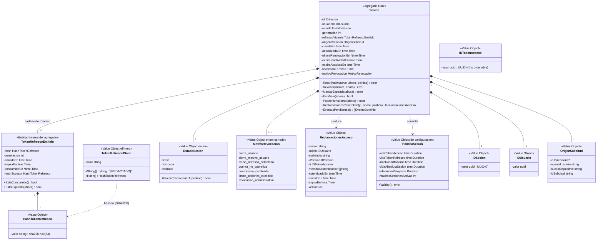
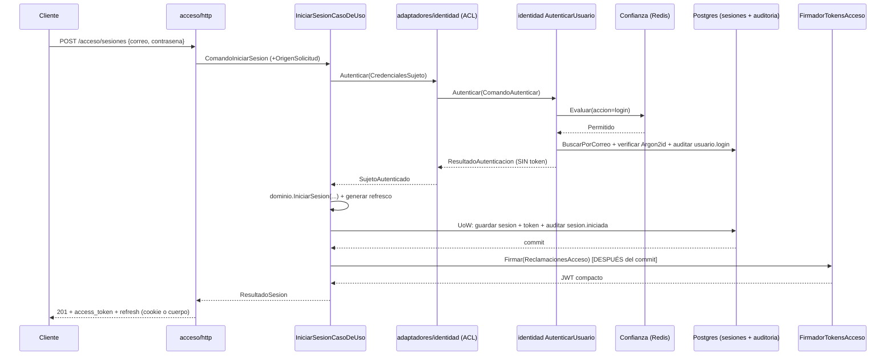

# Diseño — Bounded Context **Acceso**

> Estado: propuesta de diseño **implementada**. Autor original: agente `arquitecto-ddd-hexagonal`.
> Fecha del diseño: 2026-08-31. Fecha de esta actualización de estado: 2026-09-03.
> Alcance: entidades, value objects, agregados, puertos, casos de uso, invariantes, eventos, migraciones y endpoints del contexto **Acceso**.
> Depende de: ADR 0002 (un solo producto), ADR 0004 (nombres de tablas), ADR 0005 (auditoría forense hash-chained), ADR 0006 (Huma v2), ADR 0007 (español en dominio/aplicación/puertos), **ADR 0009 (frontera Identidad/Acceso — no se reabre)**, ADR 0017 (rol de login acotado: toda tabla nueva necesita `GRANT` explícito), ADR 0018 (Confianza + Redis), **ADR 0019 (mecanismo de sesión)**, **ADR 0020 (algoritmo de firma y rotación de llaves)**.
> Consumidores: **todos los contextos** (el middleware de validación de token de Acceso es el que autentica cualquier endpoint no público — hoy con un consumidor real: `identidad/adaptadores/http/middleware_autenticacion.go`), **Auditoría** (recibe los eventos), **Tenencia** (cuando exista, es quien dirá *qué puede hacer* el sujeto que Acceso identificó).
> Estado del código hoy: **implementado** — dominio (`internal/acceso/dominio`), aplicación (`internal/acceso/aplicacion`), puertos (`internal/acceso/puertos`), migraciones (`db/migraciones/000006`-`000008`) e infraestructura completa (`internal/acceso/adaptadores/{http,postgres,jwt,redis,identidad,confianza,auditoria,eventos,cripto}`) ya existen y están montados en `cmd/api/main.go`. Ver `internal/acceso/README.md` para el punto de entrada operativo (cómo levantarlo, los 7 endpoints, configuración). Este documento sigue siendo la referencia normativa de diseño; no se reescribió para narrar la implementación línea por línea — donde el código diverge de algo escrito aquí, el código es la fuente de verdad y el README lo señala.

---

## 0. Responsabilidad del contexto (y lo que explícitamente NO hace)

**Acceso responde una sola pregunta**: *este sujeto ya demostró quién es — ¿qué credencial de sesión le doy, por cuánto tiempo, y sigue siendo válida?*

| Sí es de Acceso | No es de Acceso |
|---|---|
| Orquestar el login completo (`POST /acceso/sesiones`) | Verificar contraseñas, MFA/OTP, estado de la cuenta → **Identidad** |
| Emitir, firmar y validar el token de acceso | Decidir qué puede hacer el sujeto (roles, permisos, organización) → **Tenencia** |
| Emitir, rotar y detectar reuso de tokens de refresco | Rate limiting, captcha, fingerprinting, score de riesgo → **Confianza** |
| Ciclo de vida de la sesión: activa / revocada / expirada | Persistir la bitácora forense y encadenar hashes → **Auditoría** |
| Logout individual, logout global, revocación reactiva | Cambiar la contraseña o suspender la cuenta (Acceso *reacciona* a eso; **Identidad** lo *decide*) |
| Publicar el JWKS con las llaves públicas de verificación | Enviar correos, generar tokens de verificación de correo → **Identidad** |

**Consecuencia de diseño no obvia (ya fijada por ADR 0009, aquí solo se materializa)**: `IniciarSesion` **no** verifica credenciales. Llama por puerto a `identidad.puertos.AutenticadorDeCredenciales.Autenticar` y, con el `ResultadoAutenticacion` en la mano (que no trae token ni sesión), decide si emite credenciales de sesión. Acceso jamás toca `contrasena_hash`, jamás llama al `HasherContrasenas` de Identidad, y jamás lee la tabla `usuarios`.

**Segunda consecuencia no obvia**: Acceso tampoco vuelve a llamar a `EvaluadorConfianza` en el flujo de login. Identidad ya lo hace dentro de `AutenticarUsuario` (INV-ID-12) con `Accion="login"`; una segunda llamada desde Acceso consumiría **dos** incrementos de cuota por intento y desalinearía en silencio los umbrales calibrados en ADR 0018 (5/min por IP se volvería 2,5/min efectivos). Acceso sí evalúa Confianza en **renovación** y en **logout global**, flujos donde Identidad no participa (ver §11.2: hace falta agregar esas acciones a `confianza/dominio/umbral.go`).

---

## 1. Modelo de dominio

### 1.1 Diagrama



### 1.2 Agregados

| Agregado | Raíz | Contenido | Frontera transaccional |
|---|---|---|---|
| **Sesion** | `Sesion` | `IDSesion`, `IDUsuario`, `EstadoSesion`, `generacion`, la cadena de `TokenRefrescoEmitido`, `OrigenSolicitud` de creación, ventanas de expiración, motivo de revocación | Una transacción por sesión. Rotar el refresco = consumir el token anterior + insertar el nuevo + actualizar la sesión, **todo junto o nada**. |

**Por qué `TokenRefrescoEmitido` sí vive dentro del agregado `Sesion`** (a diferencia de `FactorMFA`/`CodigoOTP`, que en Identidad quedaron fuera del agregado `Usuario`): el criterio que usó Identidad fue *"ciclo de vida y frecuencia de escritura distintos → agregados separados"*. Aquí pasa lo contrario: un token de refresco **no existe fuera de una sesión**, nunca se muta sin mutar la sesión, y la operación de negocio "rotar" es indivisible entre ambos. Separarlos obligaría a coordinar dos agregados en una transacción, que es exactamente el olor que la regla busca evitar. La cadena histórica de tokens consumidos se conserva (no se borra) porque **es la evidencia que hace posible la detección de reuso** y el rastro forense de la sesión.

**Por qué no hay un agregado `TokenAcceso`**: el token de acceso no tiene estado propio del lado del servidor. Es una proyección firmada y de vida corta del estado de la sesión (`ReclamacionesAcceso`), no una entidad. Modelarlo como agregado obligaría a persistir cada emisión — exactamente el diseño que ADR 0019 descartó.

**Qué NO es parte del agregado**: las llaves de firma. Son infraestructura criptográfica detrás del puerto `FirmadorTokensAcceso`; el dominio decide *qué* dice el token, nunca *cómo* se codifica ni con qué llave se firma.

### 1.3 Value objects (todos inmutables, validados en el constructor)

| VO | Constructor | Invariantes que garantiza |
|---|---|---|
| `IDSesion` | `NuevoIDSesion()` (vía puerto) / `IDSesionDesde(string)` | UUID válido y no nulo. **UUIDv7** (ordenable: mejora la localidad de índice y permite listar sesiones por antigüedad sin índice extra). No es secreto: viaja como claim `sid`. |
| `IDTokenAcceso` (`jti`) | `NuevoIDTokenAcceso()` (vía puerto) | UUID válido. **UUIDv4, no v7**, deliberadamente: un `jti` ordenable filtra el instante de emisión y permite correlacionar tokens de distintos usuarios en el tiempo. Mismo criterio que la nota del ADR candidato 0012 de Identidad ("UUIDv7 ... **no** para tokens"). |
| `IDUsuario` | `IDUsuarioDesde(string)` | UUID válido y no nulo. **Tipo propio de `acceso/dominio`**, no el de Identidad (ver §1.7). |
| `TokenRefrescoPlano` | `NuevoTokenRefrescoPlano(string)` | Prefijo `mot_rt_` + ≥43 chars base64url (32 bytes de entropía). Implementa `String()`/`GoString()`/`MarshalJSON` devolviendo `[REDACTADO]`, igual que `ContrasenaPlana`. Solo el adaptador HTTP de salida puede leer su valor real, y solo una vez. |
| `HashTokenRefresco` | `NuevoHashTokenRefresco(string)` / `HashearTokenRefresco(plano)` | 64 caracteres hex en minúscula (SHA-256). **SHA-256 y no Argon2id**, por el mismo razonamiento ya establecido en `internal/identidad/aplicacion/tokens_verificacion.go`: es un secreto aleatorio de alta entropía generado por el sistema, no hay ataque de diccionario posible, y pagar Argon2id en cada renovación sería costo puro. La comparación es en tiempo constante (`crypto/subtle`). |
| `EstadoSesion` | `EstadoSesionDesde(string)` | Catálogo cerrado (`activa`, `revocada`, `expirada`); conoce sus transiciones legales. |
| `MotivoRevocacion` | `MotivoRevocacionDesde(string)` | Catálogo **cerrado** (no texto libre, a diferencia de `MotivoCambioEstado` de Identidad): el motivo alimenta la auditoría y las métricas de seguridad, y un string libre haría imposible responder "¿cuántas sesiones se revocaron por reuso de refresco este mes?" sin parsear texto. |
| `OrigenSolicitud` + `DireccionIP` | `NuevoOrigenSolicitud(ip, agente, huella, idSolicitud)` | Misma forma y mismas reglas que el VO homónimo de Identidad (IP parseable o vacía, `agenteUsuario` truncado a 512). **Tipo propio de `acceso/dominio`** (§1.7). |
| `ReclamacionesAcceso` | `NuevasReclamacionesAcceso(...)` | Todos los campos obligatorios presentes; `expiraEn > emitidoEn`; `sujeto` e `idSesion` no vacíos. Es lo que el dominio decide que va en el token; el adaptador lo serializa a JWT. |
| `PoliticaSesion` | `NuevaPoliticaSesion(...)` | `vidaTokenAcceso ∈ [1min, 60min]`, `inactividadMaxima ≤ vidaAbsolutaSesion`, `vidaTokenRefresco ≤ inactividadMaxima`, `maximoSesionesActivas ≥ 1`. Es un VO de dominio (no config suelta) para que las relaciones entre las ventanas sean una invariante verificable, no una convención en un `.env`. |

**Valores por defecto de `PoliticaSesion`** (ajustables sin migración; viven en código/config, no en el esquema — mismo criterio que la vigencia de 24h del token de verificación de correo y que los umbrales de ADR 0018):

| Parámetro | Valor | Justificación |
|---|---|---|
| `vidaTokenAcceso` | **10 minutos** | Es el techo del retraso de revocación (INV-ACC-15). Más corto multiplica el tráfico de renovación (a 10 min son ~6 renovaciones/hora/usuario activo, despreciable); más largo hace que "suspendí la cuenta" tarde demasiado en surtir efecto en un servicio cuya razón de ser es la seguridad. |
| `toleranciaReloj` | **60 segundos** | Desfase aceptado al validar `exp`/`nbf`. Sin esto, un desfase NTP de 2 s entre instancias produce 401 intermitentes irreproducibles. |
| `vidaTokenRefresco` | **30 días** | Coincide con `inactividadMaxima`: cada token de refresco emitido vale exactamente lo que le queda de ventana de inactividad a la sesión. |
| `inactividadMaxima` | **30 días** | Ventana deslizante: se reinicia en cada renovación exitosa. Un usuario que no vuelve en 30 días tiene que volver a autenticarse. |
| `vidaAbsolutaSesion` | **90 días** | **No se extiende nunca** (INV-ACC-16). Fuerza una reautenticación real trimestral aunque el usuario entre a diario: acota el valor de un refresco robado y da un punto natural para reevaluar MFA. |
| `maximoSesionesActivas` | **10** | Evita que la tabla `sesiones` crezca sin techo por usuario y limita el daño de un atacante que abre sesiones en bucle. Superarlo revoca la más antigua (INV-ACC-22), no rechaza el login: rechazarlo permitiría a un atacante *bloquear* el login legítimo de la víctima llenándole el cupo. |

### 1.4 Servicios de dominio (puros, sin estado, sin E/S)

- **`MaquinaEstadosSesion`** — implementada como método de `EstadoSesion`, no como servicio suelto (mismo patrón que `EstadoUsuario`):

```
activa   --revocar-----> revocada    (terminal)
activa   --expirar-----> expirada    (terminal)
revocada --*-----------> ✗
expirada --*-----------> ✗
```

  Ambos estados finales son terminales: **una sesión nunca resucita**. "Volver a entrar" siempre significa una sesión nueva con un `IDSesion` nuevo. Esto hace que `sid` sea un identificador estable de un episodio de acceso, apto como clave forense y como clave de la lista de revocación.

  *Fase 2 (MFA)*: se agregará el estado `pendiente_segundo_factor` como origen adicional (`pendiente_segundo_factor --confirmar_otp--> activa`, `--expirar--> expirada`). **No se incluye en el MVP** a propósito: no hay código que pueda alcanzarlo (Identidad todavía no tiene `VerificarOTP`) y dejar un estado inalcanzable en el `CHECK` de la tabla es exactamente el "diseñar a medias" que ADR 0002 descartó. Agregarlo después cuesta un `ALTER ... DROP CONSTRAINT / ADD CONSTRAINT`.

- **`EvaluadorVentanas`** — función pura `PuedeRenovarse(sesion, ahora) error` que aplica, en este orden: estado ≠ activa → `ErrSesionRevocada`; `ahora > expiraAbsolutoEn` → `ErrSesionExpirada`; `ahora > expiraInactividadEn` → `ErrSesionExpirada`. El orden importa para el motivo que termina en la auditoría.

- **`PoliticaRotacion`** — dado `(sesion, ahora, politica)` calcula la nueva `expiraInactividadEn` = `min(ahora + inactividadMaxima, expiraAbsolutoEn)`. El `min` es la garantía dura de INV-ACC-16: ninguna renovación puede empujar la sesión más allá de su vida absoluta.

### 1.5 Errores de dominio (tipos propios, no `errors.New` ad hoc)

| Error | Cuándo | Nota |
|---|---|---|
| `ErrCredencialesRechazadas` | Identidad rechazó la autenticación | Traducción **en el ACL** de `identidad/dominio.ErrCredencialesInvalidas`; `acceso/aplicacion` nunca ve el tipo de Identidad (INV-ACC-19). Igual de genérico que el original. |
| `ErrCuentaNoOperativa` | Identidad devolvió correo no verificado / suspendida / bloqueada | Lleva `Motivo` de un catálogo cerrado (`correo_no_verificado`, `cuenta_suspendida`, `cuenta_bloqueada`). El ACL traduce los tres errores tipados de Identidad a este. |
| `ErrSegundoFactorRequerido` | `ResultadoAutenticacion.RequiereSegundoFactor == true` | **No se emite sesión.** Lleva `MotivoStepUp` para que el cliente sepa si pedir OTP o resolver un captcha. |
| `ErrRefrescoInvalido` | Token de refresco desconocido, malformado, expirado o ya consumido | **Deliberadamente único para los cuatro casos** (INV-ACC-21): distinguirlos le diría a un atacante si el token que probó existió alguna vez. |
| `ErrSesionExpirada` | Ventana de inactividad o vida absoluta agotada | Se devuelve solo cuando el token presentado **sí** era el vigente de esa sesión; si no lo era, gana `ErrRefrescoInvalido`. |
| `ErrSesionRevocada` | Sesión en estado `revocada` | Idem: solo con el refresco vigente en la mano. Lleva `Motivo` (catálogo cerrado) para que el cliente pueda mostrar "tu contraseña cambió, ingresá de nuevo". |
| `ErrReusoRefrescoDetectado` | Se presentó un token ya consumido | **Error interno del caso de uso**, nunca llega al cliente: el adaptador HTTP lo mapea al mismo 401 de `ErrRefrescoInvalido`. Existe como tipo propio porque dispara una acción de auditoría distinta y la revocación de toda la sesión. |
| `ErrSesionNoEncontrada` | Consulta/cierre por `IDSesion` inexistente | Solo en flujos autenticados. |
| `ErrSesionAjena` | El sujeto del token intenta cerrar una sesión de otro usuario | Se mapea a **404**, no a 403: un 403 confirmaría que ese `IDSesion` existe. |
| `ErrTokenAccesoInvalido` | Firma inválida, `kid` desconocido, `alg` inesperado, `typ` incorrecto, `iss`/`aud` que no coinciden, estructura corrupta | Lleva `Motivo` (catálogo cerrado) para métricas y auditoría; el cliente recibe solo `invalid_token`. |
| `ErrTokenAccesoExpirado` | `exp` vencido (con tolerancia aplicada) | Separado del anterior a propósito: es el 401 esperable y de altísima frecuencia, **no se audita** (INV-ACC-17). |
| `ErrSesionRevocadaEnLista` | El `sid` del token está en la lista de revocación | Se distingue del expirado porque sí es señal (alguien sigue usando un token de una sesión matada). |
| `ErrTransicionEstadoSesionInvalida` | Máquina de estados | Incluye origen y destino. |
| `ErrAccesoDenegadoPorConfianza` | Confianza bloqueó la renovación o el logout global | Mismo nombre y misma forma que en Identidad (`Motivo`, `ReintentarEn`), pero **tipo propio de `acceso/dominio`**: el adaptador HTTP lo mapea a 429 con `Retry-After`. |
| `ErrConcurrenciaSesion` | Conflicto al rotar dos veces la misma sesión en paralelo | Reintentable. Lo produce el adaptador Postgres al traducir la violación del índice único parcial de refresco vigente (§6). |
| `ErrPoliticaSesionInvalida` | Constructor de `PoliticaSesion` | Falla al arrancar el proceso, no en caliente. |

### 1.6 Eventos de dominio

Mismo contrato `EventoDominio` que Identidad (`NombreEvento()`, `OcurridoEn()`, `IDAgregado()`), **redeclarado en `acceso/dominio`** (§1.7). El agregado los acumula y el caso de uso los drena tras persistir.

| Evento | `accion` de auditoría (catálogo cerrado, ADR 0005) | Resultado | Notas |
|---|---|---|---|
| `SesionIniciada` | `sesion.iniciada` | `exito` | `IDAgregado` = `IDSesion`; `detalles`: `{usuario_id, expira_absoluto_en}` |
| `SesionRenovada` | `sesion.renovada` | `exito` | `detalles`: `{generacion}` |
| `RenovacionRechazada` | `sesion.renovada` | `fallo` | `IDAgregado` puede ir vacío (refresco desconocido); `detalles`: `{motivo}` |
| `ReusoRefrescoDetectado` | `sesion.reuso_refresco_detectado` | `denegado` | `detalles`: `{generacion_presentada, generacion_vigente}` — nunca el hash ni el token |
| `SesionCerrada` | `sesion.cerrada` | `exito` | Cierre iniciado por el propio usuario; `detalles`: `{alcance: "individual"\|"todas", cantidad}` |
| `SesionRevocada` | `sesion.revocada` | `exito` | Revocación **no** iniciada por el usuario; `detalles`: `{motivo}` del catálogo cerrado |
| `TokenAccesoRechazado` | `token_acceso.rechazado` | `denegado` | **Solo** para rechazos con valor de señal: firma inválida, `kid` desconocido, `alg`/`typ` inesperado, `sid` en lista de revocación. **Nunca** para token expirado (INV-ACC-17) |

Ningún evento transporta el token de refresco en claro, su hash, el JWT compacto, ni la llave de firma. Se verifica con el mismo test de dominio que usa Identidad: serializar cada evento y buscar esos campos.

### 1.7 Por qué `acceso/dominio` **duplica** `OrigenSolicitud`, `IDUsuario` y `EventoDominio` en vez de reutilizarlos

Es la decisión de frontera más fácil de hacer mal, así que queda explícita:

- `acceso/dominio` **no puede importar** `identidad/dominio` (INV-ACC-18, análogo a INV-ID-18). Si lo hiciera, un cambio en el VO `Correo` de Identidad podría romper la compilación de Acceso, y la frontera entre contextos dejaría de existir en la práctica aunque siguiera dibujada en el diagrama.
- Tampoco se promueven a `internal/plataforma`: la sección 5.2 del diseño de Identidad es explícita — `plataforma` es kernel **técnico**, "no contiene tipos de negocio: si dos contextos necesitan compartir una entidad, eso es señal de que la frontera está mal trazada o de que falta un puerto". `OrigenSolicitud` está en el límite (es contexto forense, casi técnico), pero `IDUsuario` claramente no lo está.
- Se acepta entonces **duplicación deliberada de tres tipos triviales** (~120 líneas entre los tres, sin lógica de negocio compartida). El costo es real y se paga a conciencia; la alternativa —un shared kernel de dominio— es un acoplamiento que no se puede deshacer después.
- La traducción vive en el ACL: `acceso/adaptadores/identidad/` convierte `acceso/dominio.OrigenSolicitud` → `identidad/dominio.OrigenSolicitud` al llamar al puerto de entrada de Identidad. **Ese es el único paquete de Acceso que importa algo de Identidad.**

Ver *ADR candidato 0027*.

---

## 2. Puertos

Convención idéntica a Identidad: `puertos/entrada.go` (driving, los implementan los casos de uso; también alberga los `ComandoX`/`ResultadoX`/`VistaX` para no crear un import circular con `aplicacion`) y `puertos/salida.go` (driven, los implementan los adaptadores). Todas las firmas reciben `ctx context.Context` primero.

### 2.1 Puertos de entrada (driving) — implementados por `aplicacion`

```go
// puertos/entrada.go

type IniciadorDeSesion interface {
    Iniciar(ctx context.Context, cmd ComandoIniciarSesion) (ResultadoSesion, error)
}

type RenovadorDeSesion interface {
    Renovar(ctx context.Context, cmd ComandoRenovarSesion) (ResultadoSesion, error)
}

type CerradorDeSesiones interface {
    Cerrar(ctx context.Context, cmd ComandoCerrarSesion) error
    CerrarTodas(ctx context.Context, cmd ComandoCerrarTodasLasSesiones) (ResultadoCierreMasivo, error)
}

// ValidadorDeAccesos es el puerto que consume el middleware HTTP de CUALQUIER
// contexto para autenticar una petición. Es el contrato más caliente del
// sistema: se invoca una vez por request autenticada.
type ValidadorDeAccesos interface {
    Validar(ctx context.Context, cmd ComandoValidarAcceso) (Acceso, error)
}

type ConsultorDeSesiones interface {
    ListarDeUsuario(ctx context.Context, q ConsultaSesionesDeUsuario) ([]VistaSesion, error)
}

// RevocadorDeSesiones es el puerto que Acceso EXPONE a otros contextos
// (hoy: nadie; mañana: Identidad al suspender una cuenta o cambiar la
// contraseña — ADR candidato 0022). Se declara desde ahora para que el día
// que Identidad lo necesite no se invente un acceso directo a la tabla
// sesiones.
type RevocadorDeSesiones interface {
    RevocarPorUsuario(ctx context.Context, cmd ComandoRevocarSesionesDeUsuario) (ResultadoCierreMasivo, error)
}

// PublicadorDeLlaves alimenta el endpoint JWKS.
type PublicadorDeLlaves interface {
    ConjuntoDeLlaves(ctx context.Context) (VistaJWKS, error)
}
```

Comandos y resultados (primitivos, nunca DTOs HTTP — ADR candidato 0016 de Identidad aplica igual aquí):

```go
type ComandoIniciarSesion struct {
    Correo       string
    Contrasena   string                  // se envuelve y se olvida; Acceso solo la reenvía a Identidad
    Origen       dominio.OrigenSolicitud
    TokenCaptcha string                  // se reenvía a Identidad, que es quien evalúa Confianza
}

type ComandoRenovarSesion struct {
    TokenRefresco string
    Origen        dominio.OrigenSolicitud
}

type ComandoCerrarSesion struct {
    IDSesion  string // vacío = "la sesión del token con el que vengo"
    IDUsuario string // SIEMPRE del token validado, nunca del cuerpo (INV-ACC-23)
    Origen    dominio.OrigenSolicitud
}

type ComandoCerrarTodasLasSesiones struct {
    IDUsuario          string
    IDSesionAPreservar string // opcional: "cerrar las demás, no la mía"
    Origen             dominio.OrigenSolicitud
}

type ComandoRevocarSesionesDeUsuario struct {
    IDUsuario string
    Motivo    string // MotivoRevocacion del catálogo cerrado
    Origen    dominio.OrigenSolicitud
}

type ComandoValidarAcceso struct {
    TokenCompacto string
    // ExigirSesionViva fuerza una verificación contra el repositorio de
    // sesiones además de la firma. false en el camino normal (0 consultas a
    // Postgres); true para operaciones de alto valor (cambio de contraseña,
    // cierre masivo, futuras operaciones administrativas), donde una ventana
    // de revocación de 10 minutos no es aceptable. Ver ADR 0019.
    ExigirSesionViva bool
    Origen           dominio.OrigenSolicitud
}

type ResultadoSesion struct {
    TokenAcceso        string    // JWT compacto
    ExpiraEnSegundos   int       // vida del token de acceso
    TipoToken          string    // "Bearer"
    TokenRefresco      string    // valor en claro; el caller lo entrega UNA vez y lo olvida
    RefrescoExpiraEn   time.Time
    IDSesion           string
    IDUsuario          string
    SesionExpiraEn     time.Time // vida absoluta, para que el cliente sepa cuándo tendrá que reautenticarse
}

// Acceso es el sujeto autenticado que el middleware inyecta en el contexto.
// Es deliberadamente pobre: no lleva correo, ni roles, ni organización.
type Acceso struct {
    IDUsuario            string
    IDSesion             string
    MetodosAutenticacion []string  // amr: ["pwd"], luego ["pwd","otp"]
    AutenticadoEn        time.Time // auth_time: para políticas de reautenticación
    TokenExpiraEn        time.Time
}

type ConsultaSesionesDeUsuario struct {
    IDUsuario       string
    IDSesionActual  string // para marcar cuál es "esta"
    Origen          dominio.OrigenSolicitud
}

// VistaSesion es un modelo de LECTURA: nunca expone hashes de refresco ni la
// cadena de rotación. Mismo criterio estructural que VistaUsuario en Identidad.
type VistaSesion struct {
    ID                 string
    EsSesionActual     bool
    Estado             string
    CreadaEn           time.Time
    UltimaRenovacionEn *time.Time
    ExpiraAbsolutoEn   time.Time
    IPOrigen           string // la de creación; útil para "cerrar la sesión de Madrid"
    AgenteUsuario      string
}

type ResultadoCierreMasivo struct{ SesionesRevocadas int }

type VistaJWKS struct{ Llaves []VistaLlavePublica }

type VistaLlavePublica struct {
    KID       string
    TipoLlave string // "OKP" | "RSA"
    Curva     string // "Ed25519" si OKP
    Uso       string // "sig"
    Algoritmo string // "EdDSA" | "RS256"
    X         string // material público, base64url (OKP)
    N, E      string // material público (RSA)
}
```

### 2.2 Puertos de salida (driven) — implementados por `adaptadores`

```go
// puertos/salida.go

// --- Persistencia -----------------------------------------------------------

type RepositorioSesiones interface {
    // Guardar persiste el agregado completo: la sesión y las mutaciones
    // pendientes de su cadena de tokens (el token recién emitido y el
    // consumido en la misma rotación). Debe ser idempotente respecto a los
    // tokens ya persistidos y sin cambios.
    Guardar(ctx context.Context, s *dominio.Sesion) error

    BuscarPorID(ctx context.Context, id dominio.IDSesion) (*dominio.Sesion, error)

    // BuscarPorHashRefresco resuelve el token presentado SIN cargar la cadena
    // completa. Devuelve la sesión y en qué situación está ese hash concreto,
    // que es lo único que el caso de uso necesita para decidir entre rotar,
    // rechazar o declarar reuso.
    BuscarPorHashRefresco(ctx context.Context, h dominio.HashTokenRefresco) (*dominio.Sesion, SituacionRefresco, error)

    ListarActivasDeUsuario(ctx context.Context, u dominio.IDUsuario) ([]*dominio.Sesion, error)
    ContarActivasDeUsuario(ctx context.Context, u dominio.IDUsuario) (int, error)

    // RevocarActivasDeUsuario es una operación de conjunto: revocar 200
    // sesiones cargando 200 agregados sería absurdo. Devuelve los IDs
    // revocados para que el caso de uso los propague a la lista de revocación
    // y emita un evento de auditoría por sesión.
    RevocarActivasDeUsuario(ctx context.Context, u dominio.IDUsuario, excepto dominio.IDSesion,
        motivo dominio.MotivoRevocacion, ahora time.Time) ([]dominio.IDSesion, error)
}

type SituacionRefresco int
const (
    RefrescoDesconocido SituacionRefresco = iota // el hash no existe
    RefrescoVigente                              // existe y no está consumido
    RefrescoConsumido                            // existe y ya fue rotado  → REUSO
)

// --- Criptografía de sesión --------------------------------------------------

// FirmadorTokensAcceso traduce entre las ReclamacionesAcceso del dominio y el
// formato de transporte firmado (JWT). El dominio decide QUÉ dice el token;
// este puerto decide CÓMO se codifica y con qué llave.
type FirmadorTokensAcceso interface {
    Firmar(ctx context.Context, r dominio.ReclamacionesAcceso) (string, error)
    // Verificar valida firma, alg, typ, kid, iss, aud y ventanas temporales, y
    // devuelve las reclamaciones ya tipadas. Un token que no supere CUALQUIERA
    // de esas comprobaciones produce error: no hay verificación parcial.
    Verificar(ctx context.Context, tokenCompacto string) (dominio.ReclamacionesAcceso, error)
    LlavesPublicas(ctx context.Context) ([]LlavePublica, error)
}

type GeneradorTokensRefresco interface {
    // Generar devuelve un token opaco con ≥32 bytes de entropía de
    // crypto/rand, prefijado con "mot_rt_". Nunca se persiste en claro.
    Generar() (dominio.TokenRefrescoPlano, error)
}

// ListaRevocacion es el ACELERADOR de la revocación, no su frontera de
// seguridad (INV-ACC-15). Respaldado por Redis (ADR 0018 ya lo trajo al
// stack). Si Redis no está disponible, Disponible() devuelve false y la
// revocación sigue siendo correcta pero tarda hasta vidaTokenAcceso.
type ListaRevocacion interface {
    RevocarSesion(ctx context.Context, idSesion dominio.IDSesion, hasta time.Time) error
    SesionRevocada(ctx context.Context, idSesion dominio.IDSesion) (bool, error)
    Disponible() bool
}

// --- Infraestructura neutra --------------------------------------------------

type Reloj interface{ Ahora() time.Time }

type GeneradorIDs interface {
    NuevoIDSesion() (dominio.IDSesion, error)     // UUIDv7
    NuevoIDTokenAcceso() (dominio.IDTokenAcceso, error) // UUIDv4
}

type UnidadDeTrabajo interface {
    Ejecutar(ctx context.Context, fn func(ctx context.Context) error) error
}

// --- Cruce de bounded contexts (anticorrupción) ------------------------------

// AutenticadorIdentidad es el ACL sobre identidad/puertos.AutenticadorDeCredenciales.
// Tipos propios de Acceso a ambos lados: acceso/aplicacion nunca ve un tipo de
// Identidad (INV-ACC-19).
type AutenticadorIdentidad interface {
    Autenticar(ctx context.Context, c CredencialesSujeto) (SujetoAutenticado, error)
}

// ConsultorEstadoSujeto es el ACL sobre identidad/puertos.ConsultorDeUsuarios.
// Se invoca en CADA renovación: es el mecanismo por el que Acceso se entera de
// que Identidad suspendió o bloqueó una cuenta sin necesidad de un broker de
// eventos (ADR candidato 0022).
type ConsultorEstadoSujeto interface {
    EstadoDe(ctx context.Context, idUsuario string) (EstadoSujeto, error)
}

type EvaluadorConfianza interface {
    Evaluar(ctx context.Context, s SolicitudEvaluacion) (DecisionConfianza, error)
    RegistrarResultado(ctx context.Context, r ResultadoIntento) error
}

type RegistroAuditoria interface {
    Registrar(ctx context.Context, e dominio.EventoDominio, origen dominio.OrigenSolicitud) error
}

type PublicadorEventos interface {
    Publicar(ctx context.Context, eventos ...dominio.EventoDominio) error
}
```

Tipos de apoyo de los puertos de cruce (viven en `puertos/`, no en `dominio/`):

```go
type CredencialesSujeto struct {
    Correo       string
    Contrasena   string
    TokenCaptcha string
    Origen       dominio.OrigenSolicitud
}

// SujetoAutenticado es la proyección de identidad/puertos.ResultadoAutenticacion
// que Acceso necesita. No incluye PuntajeConfianza como dato de negocio: solo
// se usa para decidir step-up, y eso ya viene resuelto en RequiereSegundoFactor.
type SujetoAutenticado struct {
    IDUsuario             string
    Estado                string
    RequiereSegundoFactor bool
    MotivoStepUp          string
}

type EstadoSujeto struct {
    Existe bool
    Estado string // "activo" | "suspendido" | "bloqueado" | "pendiente_verificacion" | "anonimizado"
    // CredencialActualizadaEn habilita la revocación por cambio de contraseña
    // sin broker (§11.1). HOY NO EXISTE con la semántica correcta en Identidad:
    // queda declarado y en cero hasta que se implemente esa parte.
    CredencialActualizadaEn time.Time
}

type SolicitudEvaluacion struct {
    Accion       string // "renovacion_sesion" | "cierre_masivo_sesiones"
    ClaveCuenta  string // "sesion:<id>" o "usuario:<id>": Acceso no conoce el correo
    Origen       dominio.OrigenSolicitud
    TokenCaptcha string
}

type DecisionConfianza struct {
    Permitido      bool
    RequiereStepUp bool
    Puntaje        float64
    Motivo         string
    ReintentarEn   time.Duration
}

type ResultadoIntento struct {
    Accion      string
    ClaveCuenta string
    Origen      dominio.OrigenSolicitud
    Exitoso     bool
    IDUsuario   string
}

type LlavePublica struct {
    KID, TipoLlave, Curva, Algoritmo string
    Material                          []byte
}
```

### 2.3 Puertos aplazados (fase 2, ya nombrados para que nadie invente otro nombre)

`EmisorTokenStepUp` (token de vida corta que representa "credenciales OK, falta el segundo factor" — depende de que Identidad implemente `VerificarOTP`), `RepositorioLlavesFirma` (rotación de llaves con estado en base de datos, en vez de por despliegue — *ADR candidato 0020*), `IntrospectorTokens` (RFC 7662, para verificadores que no puedan validar JWT localmente), `SuscriptorEventosIdentidad` (cuando exista un broker real; hoy `PublicadorEventos` es log-only), `RepositorioDispositivosConfiables` ("recordar este dispositivo" para saltarse MFA).

### 2.4 Puertos que Acceso **expone** a otros contextos

| Contexto consumidor | Puerto consumido | Para qué |
|---|---|---|
| Todos (vía middleware HTTP) | `ValidadorDeAccesos` | Autenticar cualquier petición no pública. Es la razón por la que hoy `GET /identidad/usuarios/{id}` está público "como placeholder" (`identidad/adaptadores/http/rutas.go`): este puerto es lo que cierra ese hueco. |
| Identidad (futuro) | `RevocadorDeSesiones` | Matar las sesiones al suspender/bloquear una cuenta o al cambiar la contraseña. Ver *ADR candidato 0022*. |
| Tenencia (futuro) | `ConsultorDeSesiones` | Panel de "dispositivos conectados" de una organización. |

Ningún contexto consulta las tablas `sesiones` ni `tokens_refresco` directamente. La FK `sesiones.usuario_id → usuarios(id)` existe por integridad referencial, pero Acceso **no lee ninguna columna** de `usuarios` (misma regla que Tenencia respecto de Identidad, §2.4 del diseño de Identidad).

---

## 3. Casos de uso (MVP)

Los comandos transportan primitivos y el caso de uso construye los VOs en sus primeras líneas, igual que en Identidad.

### 3.1 `IniciarSesion` — la orquestación del login (ADR 0009)

`IniciarSesionCasoDeUso` implementa `IniciadorDeSesion`. Flujo (el orden es normativo):

1. **No** se evalúa Confianza aquí: lo hace Identidad dentro de `AutenticarUsuario` (§0, segunda consecuencia).
2. `AutenticadorIdentidad.Autenticar(CredencialesSujeto{...})`. El ACL traduce el resultado y **también los errores**:
   - `ErrCredencialesInvalidas` → `ErrCredencialesRechazadas`
   - `ErrCorreoNoVerificado` / `ErrCuentaSuspendida` / `ErrCuentaBloqueada` → `ErrCuentaNoOperativa{Motivo}`
   - `ErrAccesoDenegadoPorConfianza{Motivo, ReintentarEn}` → homónimo de Acceso, preservando `ReintentarEn`
   Ninguno de estos casos audita nada en Acceso: **Identidad ya los auditó** (`usuario.login` con `fallo`/`denegado`). Duplicar la fila inflaría la cadena de hashes sin agregar información.
3. Si `RequiereSegundoFactor`: devolver `ErrSegundoFactorRequerido{MotivoStepUp}` **sin emitir sesión** (INV-ACC-03). Tampoco se audita: Identidad ya emitió `usuario.step_up_requerido`.
4. Construir el agregado: `dominio.IniciarSesion(idSesion, idUsuario, origen, ahora, politica)` → nace `activa`, con `expiraInactividadEn = ahora + inactividadMaxima`, `expiraAbsolutoEn = ahora + vidaAbsolutaSesion`, `generacion = 0`, y acumula `SesionIniciada`.
5. `GeneradorTokensRefresco.Generar()` → `TokenRefrescoPlano`; `sesion.EmitirPrimerRefresco(plano.Hash(), ahora, politica)`.
6. `UnidadDeTrabajo.Ejecutar`: `RepositorioSesiones.Guardar` + `RegistroAuditoria.Registrar(SesionIniciada)` (ADR 0005: misma transacción).
7. **Después del commit** (orden crítico, INV-ACC-24): `FirmadorTokensAcceso.Firmar(sesion.ReclamacionesParaToken(jti, ahora, politica))`. Firmar antes del commit produciría, si la transacción falla, un JWT perfectamente válido durante 10 minutos apuntando a un `sid` que no existe — y como la validación no consulta la base de datos en el camino feliz, nadie lo detectaría. Al revés el riesgo es benigno: la sesión existe, el cliente recibió un error y reintenta.
8. Fuera de la transacción, best-effort: `PublicadorEventos.Publicar`; y aplicar el límite de sesiones concurrentes — si `ContarActivasDeUsuario > maximoSesionesActivas`, revocar la más antigua con motivo `limite_sesiones_excedido` y auditarla como `sesion.revocada` (INV-ACC-22).

Errores posibles: `ErrCredencialesRechazadas`, `ErrCuentaNoOperativa`, `ErrSegundoFactorRequerido`, `ErrAccesoDenegadoPorConfianza`.



### 3.2 `RenovarSesion` — rotación con detección de reuso

`RenovarSesionCasoDeUso` implementa `RenovadorDeSesion`. Flujo:

1. `EvaluadorConfianza.Evaluar(Accion="renovacion_sesion", ClaveCuenta="ip")`. Aquí **sí** evalúa Acceso: Identidad no participa en este flujo y un endpoint de renovación sin límite es un oráculo de fuerza bruta sobre tokens de refresco. Si `!Permitido` → `ErrAccesoDenegadoPorConfianza` (no se audita en la cadena; mismo criterio que el guardián de perímetro de reenvío de ADR 0018).
2. Construir `TokenRefrescoPlano` (rechazo estructural sin tocar la base si el prefijo o la longitud no cuadran) y hashear.
3. `RepositorioSesiones.BuscarPorHashRefresco`:
   - `RefrescoDesconocido` → auditar `RenovacionRechazada{motivo: "refresco_desconocido"}` y devolver `ErrRefrescoInvalido`.
   - `RefrescoConsumido` → **reuso**: `sesion.Revocar(reuso_refresco_detectado, ahora)`, persistir en `UnidadDeTrabajo` junto con `ReusoRefrescoDetectado`, propagar a `ListaRevocacion.RevocarSesion(sid, hasta=exp del último access token posible)`, y devolver `ErrRefrescoInvalido` (el cliente **no** distingue este caso, INV-ACC-21). Este es el corazón de la detección de robo: si el atacante usa el token robado, la víctima queda fuera en su próxima renovación (y viceversa), pero en ambos casos el atacante pierde el acceso y queda registro forense.
   - `RefrescoVigente` → sigue.
4. `sesion.PuedeRenovarse(ahora)` → `ErrSesionRevocada` / `ErrSesionExpirada`; auditar `RenovacionRechazada` con el motivo real y, si estaba vencida, `sesion.MarcarExpirada(ahora)`.
5. **Revalidar el sujeto contra Identidad**: `ConsultorEstadoSujeto.EstadoDe(usuarioID)`. Si `Estado != "activo"` → `sesion.Revocar(cuenta_no_operativa)`, auditar `SesionRevocada`, propagar a la lista y devolver `ErrSesionRevocada{Motivo}`. **Este paso es el mecanismo real por el que Acceso se entera de una suspensión** (§11.1). Se invoca con `IDSolicitante` vacío (llamada interna del sistema) precisamente para que Identidad **no** emita `usuario.consultado` en cada renovación: eso inundaría la cadena de auditoría, que está serializada por un advisory lock (ADR 0005).
6. Rotar: generar un refresco nuevo, `sesion.Rotar(hashNuevo, ahora, politica)` → marca el anterior como consumido con `hashSucesor`, incrementa `generacion`, recalcula `expiraInactividadEn = min(ahora + inactividadMaxima, expiraAbsolutoEn)`, acumula `SesionRenovada`.
7. `UnidadDeTrabajo`: guardar + auditar `sesion.renovada / exito`.
8. Después del commit: firmar el nuevo token de acceso (INV-ACC-24). El token de acceso anterior **no** se revoca: le quedan ≤10 minutos y su existencia no implica compromiso.

Errores posibles: `ErrRefrescoInvalido`, `ErrSesionExpirada`, `ErrSesionRevocada`, `ErrAccesoDenegadoPorConfianza`.

### 3.3 `ValidarAcceso` — el camino caliente

`ValidarAccesoCasoDeUso` implementa `ValidadorDeAccesos`. Es el único caso de uso que se ejecuta en cada petición, así que su presupuesto es **cero consultas a Postgres** en el camino feliz.

1. `FirmadorTokensAcceso.Verificar(tokenCompacto)`: estructura, `typ == "at+jwt"`, `kid` presente y conocido, `alg` **exactamente** el que corresponde a ese `kid` (nunca el que declara el token — es la defensa contra *algorithm confusion* y contra `alg: none`), firma, `iss`, `aud`, `nbf`/`exp` con `toleranciaReloj`.
2. Si falla por expiración → `ErrTokenAccesoExpirado`, **sin auditar** (INV-ACC-17). Si falla por cualquier otro motivo → `ErrTokenAccesoInvalido{Motivo}` y **sí** se audita `token_acceso.rechazado / denegado`: una firma inválida o un `kid` inventado no es un usuario despistado, es alguien probando.
3. `ListaRevocacion.SesionRevocada(sid)` si `Disponible()`. Si está revocada → auditar `token_acceso.rechazado{motivo: "sesion_revocada"}` y devolver `ErrSesionRevocadaEnLista`. Si Redis no está disponible, se omite el paso y se registra en logs (no en la cadena): la revocación sigue siendo correcta, solo tarda hasta 10 minutos (INV-ACC-15).
4. Si `cmd.ExigirSesionViva`: `RepositorioSesiones.BuscarPorID(sid)` y comprobar `EstaViva(ahora)`. Esta rama existe para operaciones de alto valor donde 10 minutos de ventana no son aceptables; el costo (una consulta indexada por PK) se paga solo donde importa.
5. Devolver `Acceso{IDUsuario, IDSesion, MetodosAutenticacion, AutenticadoEn, TokenExpiraEn}`.

### 3.4 `CerrarSesion` y `CerrarTodasLasSesiones`

- **`Cerrar`** (logout individual): resuelve el `IDSesion` (el del token si el comando lo trae vacío), verifica que pertenezca a `cmd.IDUsuario` (si no, `ErrSesionAjena` → 404), `sesion.Revocar(cierre_usuario, ahora)`, `UnidadDeTrabajo`: guardar + auditar `sesion.cerrada / exito`, y después propagar a `ListaRevocacion`. **Idempotente**: cerrar una sesión ya revocada devuelve el mismo 204 y **no** audita una segunda vez (no hubo transición de estado, no hubo hecho nuevo que registrar).
- **`CerrarTodas`** (logout de todos los dispositivos): evalúa Confianza (`Accion="cierre_masivo_sesiones"` — es una operación destructiva que un atacante con un token robado podría usar para molestar), llama a `RepositorioSesiones.RevocarActivasDeUsuario(usuario, excepto=IDSesionAPreservar, motivo=cierre_masivo_usuario)`, audita **una fila `sesion.cerrada` por sesión revocada** (no una sola agregada: la bitácora forense necesita poder responder "¿cuándo murió esta sesión concreta?"), y propaga cada `sid` a la lista de revocación. Todo en una `UnidadDeTrabajo`.

### 3.5 `ListarSesiones`

Devuelve `[]VistaSesion` del propio usuario (modelo de lectura, sin hashes). No se audita: es el equivalente a consultar el perfil propio, que Identidad tampoco audita (sería ruido que degrada la señal). Habilita la pantalla de "dispositivos conectados" y, con ella, que el usuario mismo sea un detector de intrusiones.

### 3.6 `RevocarSesionesDeUsuario` (puerto expuesto, sin consumidor todavía)

Mismo mecanismo que `CerrarTodas`, pero con `Motivo` del catálogo cerrado y auditado como `sesion.revocada` (no `sesion.cerrada`): la distinción entre "el usuario se fue" y "al usuario lo echaron" es exactamente el tipo de dato que un auditor va a pedir. Hoy nadie lo llama; existe para que el día que Identidad implemente `SuspenderUsuario` no aparezca un `UPDATE sesiones` suelto en un caso de uso de otro contexto.

### 3.7 Backlog (fuera del MVP, mismo contexto)

`CompletarSegundoFactor` (transición `pendiente_segundo_factor → activa`, depende de `otp-mfa`), `IntrospeccionarToken` (RFC 7662), `RotarLlaveFirma` (con estado en base de datos), `PurgarSesionesVencidas` (job de retención con rol propio, §6), `RecordarDispositivo`, `ReautenticarParaOperacionSensible` (reusa `AutenticarUsuario` de Identidad sin emitir sesión nueva — el caso de uso que ADR 0009 menciona como motivo para haber separado los contextos).

---

## 4. Invariantes de negocio

Numeradas para poder referenciarlas desde los tests (`TestINV_ACC_06_...`).

**Del agregado `Sesion`:**
- **INV-ACC-01** — Una `Sesion` existe siempre con un `IDUsuario` no vacío y con el `OrigenSolicitud` de su creación. No hay sesiones anónimas ni sin procedencia forense.
- **INV-ACC-02** — Una sesión solo se crea a partir de un `SujetoAutenticado` exitoso de Identidad. Acceso nunca verifica una contraseña, nunca lee `contrasena_hash`, nunca instancia un hasher.
- **INV-ACC-03** — Si Identidad indicó `RequiereSegundoFactor`, no se emite sesión ni token de acceso alguno. (Fase 2: se emitirá una sesión en `pendiente_segundo_factor`, que no produce tokens de acceso hasta confirmarse.)
- **INV-ACC-04** — Una sesión activa tiene **exactamente un** token de refresco vigente. Lo garantiza un índice único parcial en la base de datos (§6), no una comprobación en la aplicación.
- **INV-ACC-05** — Cada uso de un token de refresco lo consume. No existe la reutilización legítima: rotación obligatoria en el 100% de las renovaciones.
- **INV-ACC-06** — Presentar un refresco ya consumido revoca **toda** la sesión de inmediato y emite `sesion.reuso_refresco_detectado / denegado`. El cliente recibe el mismo error que ante un token desconocido.
- **INV-ACC-07** — `revocada` y `expirada` son terminales. Una sesión nunca vuelve a `activa`; volver a entrar crea un `IDSesion` nuevo.
- **INV-ACC-08** — Toda revocación lleva un `MotivoRevocacion` del catálogo cerrado. No hay revocaciones sin motivo ni con motivo en texto libre.
- **INV-ACC-09** — Toda mutación del agregado ocurre por un método de negocio de `Sesion`. Sin campos exportados, sin setters; los getters devuelven copias de valores.
- **INV-ACC-10** — `actualizadaEn` se fija en cada mutación con la hora del puerto `Reloj`; el dominio nunca llama a `time.Now()`.

**De los tokens:**
- **INV-ACC-11** — El token de refresco en claro nunca se persiste, ni se registra en logs, ni viaja en un evento de dominio, ni aparece en un mensaje de error. Solo su hash SHA-256 llega a la base de datos. `TokenRefrescoPlano` redacta su propio `String()`.
- **INV-ACC-12** — El token de acceso **no lleva claims de autorización** (roles, permisos, `org_id`, `tenant_id`) ni PII (correo, IP, huella de dispositivo). Solo identidad del sujeto, identidad de la sesión y metadatos temporales. Ver *ADR candidato 0025*.
- **INV-ACC-13** — La firma es **asimétrica**. La llave privada no sale nunca del proceso de Acceso; los verificadores obtienen solo la pública por JWKS. Ningún secreto compartido puede convertir a un verificador en emisor.
- **INV-ACC-14** — Todo token lleva `kid`, y la verificación usa el algoritmo asociado a ese `kid` en el conjunto de llaves, **nunca** el `alg` declarado en la cabecera del token. Un token sin `kid`, con `kid` desconocido, con `alg: none` o con `typ != "at+jwt"` se rechaza sin evaluar la firma.
- **INV-ACC-15** — La revocación es efectiva en **como máximo `vidaTokenAcceso`** (10 min) siempre, y de inmediato cuando `ListaRevocacion.Disponible()`. La lista es un acelerador, no la frontera de seguridad: una caída de Redis degrada la latencia de revocación al peor caso conocido y documentado, nunca la anula ni bloquea el servicio. Ver *ADR candidato 0023*.
- **INV-ACC-16** — La vida absoluta de la sesión no se extiende jamás por renovación. Solo la ventana de inactividad se desliza, y siempre acotada por `min(..., expiraAbsolutoEn)`.
- **INV-ACC-24** — El token de acceso se firma **después** de confirmar la transacción que persiste la sesión, nunca antes. Un token firmado sobre una transacción que después falla sería una credencial válida durante 10 minutos apuntando a una sesión inexistente.

**De auditoría (derivadas del ADR 0005):**
- **INV-ACC-17** — Emisión, renovación (éxito y fallo), reuso, cierre y revocación se auditan **siempre**, y en la misma `UnidadDeTrabajo` que la escritura de negocio. La **validación** de tokens **no** se audita, con una excepción: los rechazos por firma inválida, `kid`/`alg`/`typ` inesperado o sesión revocada, que sí son señal de ataque. Motivo de la asimetría: la cadena de hashes está serializada por un advisory lock (ADR 0005) y auditar cada 401 por token expirado convertiría el mecanismo forense en el cuello de botella de todo el sistema, ahogando además la señal real en ruido. Ver *ADR candidato 0026*.
- **INV-ACC-18** — `acceso/dominio` no importa nada fuera de la stdlib de Go (`time`, `strings`, `errors`, `crypto/sha256`, `crypto/subtle`, `encoding/hex`), y **en particular no importa `identidad/dominio`** ni ninguna biblioteca de JWT. Se verifica en `test/arquitectura/`.
- **INV-ACC-19** — `acceso/aplicacion` no importa ningún paquete de Identidad. El único paquete de Acceso autorizado a importar `identidad/puertos` es `acceso/adaptadores/identidad/` (el ACL). Verificable con un test de imports.
- **INV-ACC-20** — Acceso nunca lee columnas de tablas de otros contextos. La FK a `usuarios(id)` es integridad referencial, no una autorización para hacer `JOIN`.
- **INV-ACC-21** — Refresco desconocido, expirado, consumido o estructuralmente inválido producen la **misma** respuesta observable (401, mismo cuerpo, tiempo comparable). Solo la auditoría interna los distingue.
- **INV-ACC-22** — Un usuario no supera `maximoSesionesActivas` sesiones activas. Al excederlo se revoca la más antigua (auditada con motivo `limite_sesiones_excedido`); **nunca** se rechaza el login nuevo, porque eso permitiría a un atacante bloquear el acceso legítimo de la víctima llenándole el cupo.
- **INV-ACC-23** — Ninguna operación confía en un `usuario_id` o `sesion_id` enviado por el cliente en el cuerpo o la query: siempre provienen del token ya validado o del resultado de Identidad.

---

## 5. Estructura de carpetas del contexto

Misma forma que Identidad (§5 de su diseño), con dos adaptadores propios de este contexto:

```
internal/acceso/
├── dominio/
│   ├── sesion.go                  # agregado raíz + TokenRefrescoEmitido
│   ├── estado_sesion.go           # VO enum + máquina de estados
│   ├── motivo_revocacion.go       # VO enum cerrado
│   ├── tokens.go                  # TokenRefrescoPlano, HashTokenRefresco
│   ├── reclamaciones.go           # ReclamacionesAcceso (claims como dato de dominio)
│   ├── politica_sesion.go         # VO de configuración + PoliticaRotacion
│   ├── identificadores.go         # IDSesion (v7), IDTokenAcceso (v4), IDUsuario
│   ├── origen_solicitud.go        # VO propio (§1.7)
│   ├── eventos.go                 # EventoDominio + los 7 eventos
│   ├── errores.go                 # errores tipados
│   └── *_test.go                  # invariantes, sin mocks
├── aplicacion/
│   ├── iniciar_sesion.go
│   ├── renovar_sesion.go
│   ├── validar_acceso.go
│   ├── cerrar_sesion.go
│   ├── listar_sesiones.go
│   ├── revocar_sesiones_usuario.go
│   └── *_test.go                  # con mocks de puertos
├── puertos/
│   ├── entrada.go
│   ├── salida.go
│   └── mocks/
└── adaptadores/
    ├── http/
    │   ├── handlers.go
    │   ├── dtos.go
    │   ├── rutas.go
    │   ├── middleware_autenticacion.go  # consume ValidadorDeAccesos; lo usan TODOS los contextos
    │   ├── cookies.go                   # emisión/lectura de la cookie de refresco
    │   └── errores_http.go
    ├── postgres/
    │   ├── repositorio_sesiones.go
    │   ├── mapeo.go
    │   └── sqlc/
    ├── jwt/
    │   ├── firmador.go                  # implementa FirmadorTokensAcceso
    │   ├── llavero.go                   # carga de llaves, kid (RFC 7638), conjunto de verificación
    │   └── generador_refresco.go        # crypto/rand + prefijo mot_rt_
    ├── redis/
    │   └── lista_revocacion.go          # sobre plataforma/cache
    ├── identidad/                       # ACL: único paquete que importa identidad/puertos
    │   ├── autenticador.go
    │   └── consultor_estado.go
    ├── confianza/                       # ACL sobre confianza/aplicacion
    │   └── evaluador_confianza.go
    ├── auditoria/                       # ACL: implementa puertos.RegistroAuditoria
    │   ├── registro_auditoria.go
    │   └── mapeo_eventos.go
    └── eventos/
        └── publicador.go
```

---

## 6. Migraciones necesarias

Dos migraciones nuevas, siguiendo el patrón ya establecido (numeración correlativa; la última existente es `000005`).

### `000006_crear_sesiones.{up,down}.sql`

```sql
CREATE TABLE sesiones (
    id                     UUID PRIMARY KEY,           -- UUIDv7 generado por la app
    usuario_id             UUID NOT NULL REFERENCES usuarios(id),
    estado                 TEXT NOT NULL,
    generacion             INTEGER NOT NULL DEFAULT 0,
    creada_en              TIMESTAMPTZ NOT NULL,
    actualizada_en         TIMESTAMPTZ NOT NULL,
    ultima_renovacion_en   TIMESTAMPTZ,
    expira_inactividad_en  TIMESTAMPTZ NOT NULL,
    expira_absoluto_en     TIMESTAMPTZ NOT NULL,
    revocada_en            TIMESTAMPTZ,
    motivo_revocacion      TEXT,
    ip_origen              INET,
    agente_usuario         TEXT,
    huella_dispositivo     TEXT,

    CONSTRAINT sesiones_estado_valido CHECK (estado IN ('activa','revocada','expirada')),
    CONSTRAINT sesiones_revocacion_coherente CHECK ((estado = 'revocada') = (revocada_en IS NOT NULL)),
    CONSTRAINT sesiones_revocacion_motivada CHECK (estado <> 'revocada' OR motivo_revocacion IS NOT NULL),
    CONSTRAINT sesiones_motivo_valido CHECK (motivo_revocacion IS NULL OR motivo_revocacion IN (
        'cierre_usuario','cierre_masivo_usuario','reuso_refresco_detectado',
        'cuenta_no_operativa','contrasena_cambiada','limite_sesiones_excedido',
        'revocacion_administrativa')),
    CONSTRAINT sesiones_ventanas_coherentes CHECK (expira_inactividad_en <= expira_absoluto_en),
    CONSTRAINT sesiones_generacion_no_negativa CHECK (generacion >= 0)
);

CREATE INDEX sesiones_usuario_activas_idx ON sesiones (usuario_id, creada_en DESC) WHERE estado = 'activa';
CREATE INDEX sesiones_expiracion_idx      ON sesiones (expira_absoluto_en)         WHERE estado = 'activa';

CREATE TABLE tokens_refresco (
    hash_token   TEXT PRIMARY KEY,
    sesion_id    UUID NOT NULL REFERENCES sesiones(id),
    generacion   INTEGER NOT NULL,
    emitido_en   TIMESTAMPTZ NOT NULL,
    expira_en    TIMESTAMPTZ NOT NULL,
    consumido_en TIMESTAMPTZ,
    hash_sucesor TEXT REFERENCES tokens_refresco(hash_token),

    CONSTRAINT tokens_refresco_hash_formato CHECK (hash_token ~ '^[0-9a-f]{64}$'),
    CONSTRAINT tokens_refresco_sucesor_coherente CHECK (hash_sucesor IS NULL OR consumido_en IS NOT NULL)
);

-- INV-ACC-04 como garantía ESTRUCTURAL, no como comprobación en la aplicación:
-- a lo sumo un token vigente (no consumido) por sesión. Bajo dos renovaciones
-- concurrentes con el mismo refresco, una de las dos transacciones falla con
-- violación de unicidad y el adaptador la traduce a ErrConcurrenciaSesion.
CREATE UNIQUE INDEX tokens_refresco_vigente_por_sesion_idx
    ON tokens_refresco (sesion_id) WHERE consumido_en IS NULL;

CREATE INDEX tokens_refresco_sesion_idx ON tokens_refresco (sesion_id, generacion DESC);

-- ADR 0017: una tabla nueva NO alcanza con crearla — rol_aplicacion necesita
-- GRANT explícito o el proceso api (que corre como rol_login_identidad, sin
-- privilegios heredados sobre tablas nuevas) no puede tocarla.
REVOKE ALL ON sesiones        FROM PUBLIC;
REVOKE ALL ON tokens_refresco FROM PUBLIC;
GRANT SELECT, INSERT, UPDATE ON sesiones        TO rol_aplicacion;
GRANT SELECT, INSERT, UPDATE ON tokens_refresco TO rol_aplicacion;
-- Sin DELETE, a propósito y por el mismo criterio que `usuarios` (y a
-- diferencia de tokens_verificacion_correo, que sí lo necesita): una sesión no
-- se borra, transiciona de estado, y su cadena de tokens consumidos es la
-- evidencia que hace posible la detección de reuso. La purga por retención es
-- un job de mantenimiento con su propio rol, no una operación de la API.
REVOKE DELETE, TRUNCATE ON sesiones        FROM rol_aplicacion;
REVOKE DELETE, TRUNCATE ON tokens_refresco FROM rol_aplicacion;
```

Notas:
- **Sin RLS**: no hay `organizacion_id` que aislar hasta que exista Tenencia (mismo criterio que la nota final de `000002_crear_auditoria.up.sql`).
- **`id` sin `DEFAULT gen_random_uuid()`**, a diferencia de `usuarios`: los `IDSesion` son UUIDv7 generados por el puerto `GeneradorIDs`, y un default de v4 en la base enmascararía un bug de la aplicación produciendo silenciosamente IDs del tipo equivocado.
- La FK autorreferencial `hash_sucesor` documenta la cadena de rotación y permite reconstruir el linaje completo de una sesión comprometida en una sola consulta recursiva.
- Rechazo explícito de una alternativa: *no* se usa `ON DELETE CASCADE` desde `usuarios`, porque los usuarios no se borran (se anonimizan) y una cascada silenciosa destruiría evidencia.

### `000007_acciones_auditoria_acceso.{up,down}.sql`

Agrega al catálogo cerrado (`auditoria_acciones`) las 6 acciones nuevas. Formato exigido por `auditoria_acciones_formato` (`^[a-z_]+\.[a-z_]+$`) — las seis cumplen.

```sql
INSERT INTO auditoria_acciones (accion, contexto, recurso, descripcion) VALUES
    ('sesion.iniciada',                 'acceso', 'sesion',       'Emision de una sesion nueva tras autenticacion exitosa en Identidad.'),
    ('sesion.renovada',                 'acceso', 'sesion',       'Rotacion del token de refresco: exito, o fallo por refresco invalido/expirado/sesion no renovable.'),
    ('sesion.reuso_refresco_detectado', 'acceso', 'sesion',       'Se presento un token de refresco ya consumido: robo probable; revoca la sesion completa.'),
    ('sesion.cerrada',                  'acceso', 'sesion',       'Cierre de sesion iniciado por el propio usuario (individual o de todos los dispositivos).'),
    ('sesion.revocada',                 'acceso', 'sesion',       'Revocacion NO iniciada por el usuario: cuenta no operativa, cambio de contrasena, limite de sesiones o decision administrativa.'),
    ('token_acceso.rechazado',          'acceso', 'token_acceso', 'Rechazo de un token de acceso con valor de senal: firma invalida, kid/alg/typ inesperado o sesion revocada. NO cubre el token simplemente expirado.');
```

Y la actualización correspondiente en `docs/catalogos/acciones-auditoria.md` (sección "Otros contextos" → sección "Contexto Acceso"), siguiendo el procedimiento de "Agregar una acción nueva" documentado allí.

### Migración condicional (§11.1, solo si se implementa la revocación por cambio de contraseña)

`000008_credencial_actualizada_en.{up,down}.sql`: `ALTER TABLE usuarios ADD COLUMN credencial_actualizada_en TIMESTAMPTZ`. **No es parte del MVP de Acceso** — ver §11.1 para el hallazgo que la motiva.

---

## 7. Endpoints HTTP

Registrados con Huma v2 (ADR 0006), prefijo `/acceso`, nombres de recurso en español y plural (coherente con `/identidad/usuarios`, `/identidad/autenticaciones`).

| Método | Ruta | Auth | Éxito | Errores |
|---|---|---|---|---|
| `POST` | `/acceso/sesiones` | pública | **201** + `ResultadoSesion` | 401 credenciales / step-up, 403 cuenta no operativa, 429 Confianza (`Retry-After`) |
| `POST` | `/acceso/sesiones/renovaciones` | refresco (cookie o cuerpo) | **200** + `ResultadoSesion` | 401 refresco inválido/expirado/revocado (indistinguibles), 429 |
| `DELETE` | `/acceso/sesiones/actual` | Bearer | **204** | 401 |
| `DELETE` | `/acceso/sesiones/{id}` | Bearer | **204** | 401, 404 (inexistente **o ajena**) |
| `DELETE` | `/acceso/sesiones` | Bearer | **204** | 401, 429 |
| `GET` | `/acceso/sesiones` | Bearer | **200** + `[]VistaSesion` | 401 |
| `GET` | `/.well-known/jwks.json` | pública | **200** + JWKS | — |

- **`/.well-known/jwks.json` va en la raíz, no bajo `/acceso`**: RFC 8615 fija ese prefijo y las bibliotecas cliente de JWKS lo asumen. Es el único endpoint de este contexto que no lleva prefijo, y conviene dejarlo escrito para que nadie lo "corrija" después.
- Respuesta cacheable (`Cache-Control: public, max-age=300`) para que los verificadores no consulten en cada validación, pero corta para que una llave nueva se propague rápido.
- **Mapeo de errores** (`errores_http.go`, RFC 9457 igual que Identidad): `ErrCredencialesRechazadas`/`ErrRefrescoInvalido`/`ErrSesionExpirada`/`ErrSesionRevocada`/`ErrTokenAcceso*` → **401** con `WWW-Authenticate: Bearer error="invalid_token"`; `ErrSegundoFactorRequerido` → **401** con un `type` de problema distinguible (`step-up-requerido`) y `MotivoStepUp` en el cuerpo; `ErrCuentaNoOperativa` → **403**; `ErrSesionAjena`/`ErrSesionNoEncontrada` → **404**; `ErrAccesoDenegadoPorConfianza` → **429** con `Retry-After` (vía `huma.ErrorWithHeaders`, igual que hizo ADR 0018); `ErrConcurrenciaSesion` → **409**.
- **Metadata OpenAPI obligatoria** en cada operación (`x-auth-nivel`, `x-rate-limit`), siguiendo la regla ya aplicada en `identidad/adaptadores/http/rutas.go`: "no hay endpoints desnudos".
- **Transporte del token de refresco**: cookie `HttpOnly; Secure; SameSite=Strict; Path=/acceso/sesiones/renovaciones` por defecto para clientes navegador, con modo "cuerpo JSON" opt-in para clientes no-navegador. Es una decisión con aristas (CSRF, clientes móviles, SPAs en otro dominio) → *ADR candidato 0021*.
- El **token de acceso nunca viaja en cookie**: siempre en el cuerpo de la respuesta y de vuelta en `Authorization: Bearer`. Con eso, ninguna petición de API es vulnerable a CSRF por construcción.

**Formato del token de acceso (JWT, `typ: at+jwt` — perfil RFC 9068):**

| Claim | Valor | Por qué |
|---|---|---|
| `iss` | URL del servicio (config `ACCESO_EMISOR`) | RFC 7519; permite a un verificador rechazar tokens de otro emisor |
| `sub` | `IDUsuario` | el sujeto |
| `aud` | audiencia fija del servicio | **ADR 0002**: un solo producto ⇒ `aud` fijo, no variable por producto |
| `exp`, `iat`, `nbf` | según `PoliticaSesion` | `nbf = iat`; validación con `toleranciaReloj` de 60 s |
| `jti` | `IDTokenAcceso` (UUIDv4) | correlación forense y replay detection; no ordenable |
| `sid` | `IDSesion` (UUIDv7) | **clave de revocación** y de correlación con la tabla `sesiones` |
| `amr` | `["pwd"]` (fase 2: `["pwd","otp"]`) | RFC 8176; permite que un endpoint sensible exija que la sesión se haya creado con MFA |
| `auth_time` | instante de la autenticación original de la sesión | políticas de reautenticación ("no han pasado más de 5 min desde que puso su contraseña") |
| `ver` | `1` | versión del formato de claims; permite evolucionar sin romper verificadores viejos |

**Claims que deliberadamente NO existen**: `email`, `roles`, `permisos`, `org_id`, `tenant_id`, `huella_dispositivo`, `ip`. Los dos primeros son PII en un objeto que el cliente puede leer (un JWT no está cifrado); los tres siguientes son autorización, que pertenece a Tenencia y **no existe todavía** — meter un `tenant_id` vacío "por si acaso" es exactamente el "diseñar a medias" que ADR 0002 descartó al eliminar la capa de producto, y crearía un claim que nadie sabría si es obligatorio. Los dos últimos filtrarían al cliente la señal de fingerprinting que Confianza usa. Ver *ADR candidato 0025*.

---

## 8. Gancho de auditoría

Contrato que Acceso reutiliza del mecanismo ya construido por `auditoria-forense` (**no se inventa ninguno nuevo**):

- Misma tabla `auditoria`, mismo trigger `auditoria_asignar_cadena`, mismo catálogo cerrado `auditoria_acciones` con FK.
- Mismo patrón de ACL en el consumidor: `acceso/adaptadores/auditoria/` implementa `acceso/puertos.RegistroAuditoria` con el mismo `INSERT` directo y el mismo `bd.TxDesdeContexto(ctx)` que usa hoy `identidad/adaptadores/auditoria/registro_auditoria.go`. `version_hash`, `secuencia`, `hash_anterior` y `hash_actual` **no se envían**: los asigna la base de datos.
- `recurso_id` = `IDSesion` (o vacío cuando el refresco fue desconocido y no hay sesión que nombrar). `usuario_id` = el sujeto de la sesión. `organizacion_id` sigue NULL hasta que exista Tenencia.
- `detalles` **nunca** lleva el token de refresco, su hash, el JWT ni el `jti` completo. Nota práctica: el `CHECK auditoria_detalles_sin_secretos` ya rechaza las claves de primer nivel `token`, `access_token`, `refresh_token` y `jwt` — es decir, la base de datos ya bloquea el error más probable de este contexto. No es excusa para no aplicar la regla en el ACL.
- Eventos no críticos (métricas de renovación, "nuevo dispositivo detectado") van por `PublicadorEventos`, fuera de la transacción. Igual que en Identidad, la separación entre *auditar* (síncrono, transaccional, aborta el negocio si falla) y *notificar* (asíncrono, best-effort) no se colapsa en un solo puerto.

---

## 9. Decisiones no obvias → ADRs

**Números ya usados en el repo**: 0001–0009, 0017, 0018. **Reservados como candidatos de Identidad**: 0010–0016 (no reutilizar). **Este documento toma 0019–0028.**

| # | Decisión | Estado | Resumen |
|---|---|---|---|
| **0019** | Mecanismo de sesión: JWT de acceso de vida corta + token de refresco opaco rotatorio, con la sesión autoritativa en Postgres | **Escrito y aceptado** (`docs/adr/0019-mecanismo-sesion-jwt-refresco-rotatorio.md`) | Todo lo demás de este contexto cuelga de esta decisión, y ADR 0009 ya había comprometido la dirección ("Acceso es responsable de: emisión/firma JWT (RS256/EdDSA, JWKS con rotación de kid), refresh tokens"): no es una decisión abierta, es fijar sus parámetros. |
| **0020** | Algoritmo de firma (**EdDSA/Ed25519** primario, RS256 soportado por el verificador) y gestión/rotación de llaves | **Escrito y aceptado** (`docs/adr/0020-algoritmo-firma-jwt-rotacion-llaves.md`) | HMAC queda descartado sin discusión por INV-ACC-13. Biblioteca: `github.com/lestrrat-go/jwx/v2` (JWKS + thumbprints RFC 7638 de fábrica). `kid` = thumbprint RFC 7638 de la llave pública. Fase 1: llaves en configuración (env), rotación por despliegue manteniendo la llave anterior en el conjunto de verificación durante ≥ `vidaTokenAcceso`. Rotación con estado en base de datos queda como backlog (`RepositorioLlavesFirma`, §2.3). |
| **0021** | Transporte del token de refresco: cookie `HttpOnly`+`Secure`+`SameSite=Strict` con `Path` acotado, o cuerpo JSON | **Escrito y aceptado** (`docs/adr/0021-token-refresco-siempre-en-cuerpo-json.md`) | Se implementó sin la bifurcación por tipo de cliente que este párrafo proponía: el token de refresco viaja siempre en el cuerpo JSON, igual que el de acceso. Sin cookie, no hay defensa CSRF que decidir para el endpoint de renovación — el token de acceso ya viajaba solo en `Authorization: Bearer`, así que ninguna petición de la API depende de credenciales ambientales. |
| **0022** | Cómo se entera Acceso de que Identidad suspendió/bloqueó a alguien o le cambió la contraseña | Candidato | **MVP: revalidación síncrona en cada renovación** (§3.2 paso 5) — correcta sin broker, coste de una consulta cada 10 min por usuario, y garantía acotada por `vidaTokenAcceso`. Alternativas evaluadas: (a) suscripción a eventos de dominio — inviable hoy, `PublicadorEventos` es log-only y no hay broker en el stack; (b) puerto inverso `RevocadorDeSesiones` invocado por Identidad en la misma transacción — la garantía más fuerte (atomicidad), pero introduce una dependencia bidireccional entre contextos, así que se declara el puerto y se difiere el consumo; (c) "época de credencial" para el cambio de contraseña — requiere un dato que hoy Identidad no tiene con la semántica correcta (§11.1). |
| **0023** | Lista de revocación en Redis como **acelerador**, no como frontera de seguridad (fail-open explícito) | Candidato | ADR 0018 ya estableció asimetrías deliberadas (rate limit fail-open, captcha fail-closed) y hay que decidir de qué lado cae esto. Argumento por fail-open: la frontera real es `vidaTokenAcceso`; hacerlo fail-closed convertiría una caída de Redis —un componente **opcional**, el servicio arranca sin `REDIS_URL`— en una caída total del sistema. El precio (hasta 10 min de retraso en la revocación durante un incidente de Redis) es exactamente el mismo que tendría un JWT puro, nunca peor. |
| **0024** | Vidas útiles (10 min / 30 días de inactividad / 90 días absolutos) y límite de 10 sesiones concurrentes | Candidato | Números no calibrados contra tráfico real (no existe, ADR 0002), igual que los umbrales de ADR 0018: punto de partida razonable, ajustable sin migración porque viven en código/config y no en el esquema. Lo que sí es estructural es la **relación** entre las tres ventanas, codificada como invariante en `PoliticaSesion`. |
| **0025** | El token de acceso no lleva claims de autorización ni PII | **Escrito y aceptado** (`docs/adr/0025-jwt-sin-claims-de-autorizacion-ni-pii.md`) | Tenencia ya existe (ADR 0029-0031) y confirmó la decisión adyacente que este párrafo dejaba abierta: los roles se consultan por puerto en cada request (ADR 0030), nunca se cachean en el token. `firmador.go` solo construye `iss`/`sub`/`aud`/`jti`/`iat`/`nbf`/`exp` más `sid`/`amr`/`auth_time`/`ver` — ningún claim de autorización ni PII. |
| **0026** | Alcance de la auditoría de Acceso: no auditar validaciones de token salvo rechazos con valor de señal | **Escrito y aceptado** (`docs/adr/0026-asimetria-auditoria-validacion-tokens.md`) | Implementado tal cual se propuso: `ValidarAccesoCasoDeUso.Validar` no audita `ErrTokenAccesoExpirado`, pero sí firma inválida/`kid`/`typ` inesperado y sesión revocada en lista. |
| **0027** | Duplicación deliberada de `OrigenSolicitud`, `IDUsuario` y `EventoDominio` en `acceso/dominio` en vez de un shared kernel | **Escrito y aceptado** (`docs/adr/0027-duplicacion-deliberada-vos-frontera-acceso-identidad.md`) | Confirmado en código: `acceso/dominio/identificadores.go` y `origen_solicitud.go` definen `IDUsuario`/`DireccionIP`/`OrigenSolicitud` propios, sin importar `identidad/dominio` (INV-ACC-18); la traducción vive solo en el ACL `acceso/adaptadores/identidad/`. |
| **0028** | Biblioteca JWT (`golang-jwt/jwt/v5` vs `lestrrat-go/jwx/v2` vs `go-jose`) | Candidato | Decisión de infraestructura, para el agente `go-infraestructura`. `jwx` trae JWKS, rotación y caché de llaves listos (más superficie, más dependencias); `golang-jwt` es mínimo y obliga a escribir el manejo de JWKS a mano. El puerto `FirmadorTokensAcceso` hace que la elección sea reversible sin tocar dominio ni aplicación. Hoy `go.mod` no tiene ninguna. |

---

## 10. Secuencia sugerida de implementación

1. **ADRs 0020 y 0021** (algoritmo/llaves y transporte del refresco) — bloquean decisiones de firma de puertos y de DTOs. El resto de candidatos puede resolverse durante la implementación.
2. `acceso/dominio` completo con tests (agente `go-dominio`): agregado `Sesion`, VOs, máquina de estados, `PoliticaSesion`, eventos, errores. Sin dependencias externas (INV-ACC-18), sin ninguna biblioteca de JWT.
3. `acceso/puertos` (entrada + salida) y mocks.
4. Migraciones `000006` y `000007` (agentes `base-datos` + `auditoria-forense`), más la actualización de `docs/catalogos/acciones-auditoria.md`. Verificar empíricamente los `GRANT` en `test/integracion/privilegios_test.go`, que ya existe para ADR 0017.
5. `acceso/aplicacion`: `IniciarSesion` y `ValidarAcceso` primero (desbloquean el middleware de autenticación, que es lo que hoy le falta a `GET /identidad/usuarios/{id}`), después `RenovarSesion`, `CerrarSesion`/`CerrarTodas`, `ListarSesiones`.
6. Adaptadores (agente `go-infraestructura`): Postgres, `jwt/`, `redis/`, ACL de Identidad, ACL de Confianza, ACL de auditoría, HTTP con Huma.
7. Cambios en otros contextos (§11): entrada `renovacion_sesion` en la política de umbrales de Confianza; montar el middleware de Acceso sobre `GET /identidad/usuarios/{id}`.
8. Tests de integración (agente `tests-qa`) contra Postgres y Redis reales: rotación concurrente (el índice único parcial debe producir exactamente un ganador), detección de reuso, expiración por inactividad vs absoluta, revocación efectiva con y sin Redis disponible, y verificación de que la cadena de auditoría sigue íntegra tras un ciclo completo de login/refresh/logout (`assertCadenaAuditoriaIntegra`).

---

## 11. Cambios requeridos en otros contextos

Se listan aparte porque **este diseño no puede implementarse sin ellos** y afectan código ya cerrado.

### 11.1 Identidad — hallazgo: hoy no hay forma correcta de detectar un cambio de contraseña

`Credencial.ActualizadaEn()` existe en el dominio, pero el adaptador Postgres lo hidrata desde la columna `usuarios.actualizado_en`:

```go
// internal/identidad/adaptadores/postgres/mapeo.go:47
credencial, err := dominio.NuevaCredencial(hash, fila.ActualizadoEn.Time)
```

Y `actualizado_en` cambia en **cada** mutación del agregado, incluido `Usuario.RegistrarAcceso(ahora)` en cada login exitoso. Es decir: **no existe hoy un instante persistido que signifique "cuándo cambió la contraseña"**. Si Acceso usara ese dato como "época de credencial" para revocar sesiones, revocaría todas las sesiones del usuario en cada login.

Impacto real: **ninguno en el MVP**, porque `CambiarContrasena` y `RestablecerContrasena` son backlog de Identidad (§3.5 de su diseño) y todavía no existen. Cuando se implementen, hará falta: (a) la columna `credencial_actualizada_en` (migración `000008`), (b) ajustar `mapeo.go`, (c) agregar `CredencialActualizadaEn` a `identidad/puertos.VistaUsuario` (cambio aditivo, no rompe nada), y (d) que Acceso revoque en la renovación toda sesión con `creada_en < credencial_actualizada_en`. Queda documentado aquí para que quien implemente `CambiarContrasena` no lo descubra tarde.

Cambio menor adicional, este sí necesario ya: `identidad/aplicacion.ObtenerUsuario` debe seguir **sin auditar** cuando `IDSolicitante` viene vacío (comportamiento actual, se depende de él en §3.2 paso 5). Es una dependencia implícita que conviene fijar con un test.

### 11.2 Confianza — faltan dos acciones en la política de umbrales

`renovacion_sesion` y `cierre_masivo_sesiones` no existen en `confianza/dominio/umbral.go`. Hoy caerían en el default fail-safe de ADR 0018 (3/min por IP), que para renovación es **demasiado estricto**: una oficina tras NAT con 20 usuarios activos supera 3 renovaciones/min de forma perfectamente legítima. Propuesta de umbrales: `renovacion_sesion` → 30/min por IP, 10/min por sesión; `cierre_masivo_sesiones` → 5/min por IP, 3/15min por usuario.

Además, `confianza/puertos.Solicitud.CorreoNormalizado` no encaja semánticamente con lo que Acceso tiene para ofrecer (una sesión o un usuario, nunca un correo). Propuesta: renombrar a `ClaveCuenta` (cambio de campo en un contexto pequeño y reciente, con un solo consumidor) o aceptar que el ACL de Acceso ponga ahí `sesion:<id>`. Se prefiere el rename por honestidad del contrato; es trabajo del agente que mantenga Confianza.

### 11.3 Plataforma — configuración nueva

`internal/plataforma/configuracion.Config` necesita: `ACCESO_EMISOR`, `ACCESO_AUDIENCIA`, `ACCESO_LLAVE_FIRMA` (privada, PEM o seed base64), `ACCESO_LLAVES_VERIFICACION` (conjunto, para la rotación por despliegue), y opcionalmente los overrides de `PoliticaSesion`. Mismo criterio que ADR 0018 para el arranque: **sin llave de firma configurada en `APP_ENV=production` el proceso no debe arrancar** (fail-closed duro: a diferencia del captcha, aquí no hay un "modo degradado" sensato — un servicio de auth que no puede firmar tokens no tiene nada que hacer sirviendo tráfico). En desarrollo, generar una llave efímera en memoria con un `WARN` explícito de que todos los tokens mueren al reiniciar el proceso.
