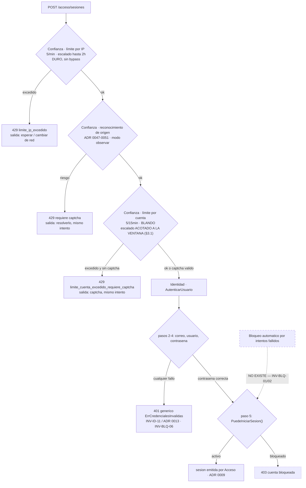

# Diseño — Bloqueo de cuenta tras intentos fallidos repetidos: **decisión de no implementarlo**, y el hueco que sí se cierra

> Estado: **diseño, sin implementar**. Autor: agente `arquitecto-ddd-hexagonal`.
> Fecha del diseño: 2026-09-12.
> Alcance: cierra el **candidato 0011**, abierto desde el diseño original de Identidad (`docs/design/identidad-bounded-context.md` §7) y anotado como *"candidato abierto, sin cerrar"* en `docs/adr/README.md`. A diferencia de los otros seis candidatos de aquel rango (0010, 0012–0016), que ya estaban implementados de facto y solo necesitaban su ADR retroactivo, **éste describe funcionalidad que genuinamente no existe**: `Usuario.Bloquear()` está en el dominio desde el primer hito y **ningún caso de uso lo invoca** (verificado: las únicas menciones fuera de `dominio/` están en tests y en un helper de test).
> Depende de: **ADR 0002 (un solo producto/proceso — no se reabre)**, ADR 0005 (auditoría hash-chained), ADR 0007 (español en dominio/aplicación/puertos), **ADR 0008 (Argon2id, 64 MiB/t=3 — el costo por verificación es parte del cálculo de §2.3)**, **ADR 0009 (Identidad autentica, Acceso emite tokens — no se reabre)**, **ADR 0013 (enumeración de usuarios: login siempre genérico — no se reabre, y §5 explica por qué este diseño no lo roza)**, **ADR 0014 (contraseñas NIST + HIBP — es la mitad de la defensa real contra el ataque que un lockout pretendería frenar)**, **ADR 0018 (rate limiting/captcha de Confianza sobre Redis — no se reabre; §2 lo lee con cuidado y §3.1 corrige **un parámetro** suyo cuyo efecto asimétrico aquel ADR no analizó)**, ADR 0037/0051 (MFA y el precedente de "una escalada sin salida alcanzable es un bloqueo"), **ADR 0045 (este producto no tiene rol de administrador de plataforma — el hallazgo que aquí resulta decisivo)**, ADR 0047 (criterio de frontera "¿hecho de perímetro o hecho de la cuenta?"), y las suyas propias, **ADR 0011, 0052 y 0053** (§9).
> Consumidores: ninguno nuevo. Ningún contexto gana un caso de uso, un puerto, un endpoint, una tabla ni una acción de auditoría.
>
> **Nombre del archivo**: `bloqueo-cuenta.md`, para que coincida con el vocabulario del candidato 0011 (*"bloqueo de cuenta"*) y con el estado que ya existe en el dominio (`EstadoBloqueado`). Mismo criterio que `colas-virtuales.md` y `fingerprinting-comportamiento.md`: el archivo se llama como el encargo, el código se llama como el lenguaje ubicuo.
>
> ---
>
> **Conclusión, arriba de todo porque es el documento entero**: tras leer el código real, **no se implementa el bloqueo automático de cuenta por intentos fallidos**. No es una postergación ni una deuda: es una decisión de no-hacer, argumentada en §2, porque en este sistema —hoy, con este código— un lockout automático **convierte un ataque de confidencialidad de baja probabilidad en un ataque de disponibilidad garantizado y gratuito** contra cualquier cuenta cuyo correo se conozca, y **no existe ninguna salida que el titular pueda usar por sí mismo** (no hay rol de administrador, ADR 0045; no hay envío real de correo, `NotificadorCorreoLog`). Es exactamente la misma clase de hallazgo que llevó a ADR 0051 a prohibir el step-up por riesgo, un escalón más arriba.
>
> Lo que **sí** produce este diseño es la mitad segura, y es pequeña a propósito: (1) corregir un parámetro de ADR 0018 que hoy ya permite un bloqueo de facto de **hasta dos horas** contra una cuenta ajena, disparable por un tercero sin credenciales (§3.1 — esto no es teoría, está en producción desde ADR 0018); (2) elevar a norma escrita la **regla de la salida alcanzable** (§3.2) y hacerla verificable; (3) fijar por invariante que `EstadoBloqueado` es territorio de una decisión humana y que ningún camino de login puede alcanzarlo (§3.3). Total: **cero tablas, cero endpoints, cero puertos, cero casos de uso nuevos, un campo aditivo en un value object y una condición en un script Lua.**

---

## 0. Punto de partida — lo que YA existe y no se reabre

### 0.1 La intuición del candidato 0011, textual, y qué parte de ella sobrevive

> *"Bloqueo de cuenta: el estado persistente `bloqueado` es de Identidad; el throttling efímero es de Confianza. Sin esta línea, ambos contextos terminan implementando lockout y se contradicen. Regla: Confianza decide 'ahora no' (Redis, minutos); Identidad decide 'esta cuenta está fuera de servicio' (Postgres, hasta acción explícita)."*
> — `docs/design/identidad-bounded-context.md` §7, fila 0011

Esa ficha contiene **dos afirmaciones distintas** que conviene separar antes de evaluarlas, porque una es correcta y la otra no:

| Afirmación | Veredicto | Dónde se resuelve |
|---|---|---|
| **(a) La frontera**: el estado persistente es de Identidad, el throttling efímero es de Confianza; sin la línea escrita, los dos contextos implementan lockout y se contradicen | **Correcta, y se confirma como norma** (INV-BLQ-03). Es el aporte duradero del candidato 0011 y la razón por la que merece un ADR aunque la respuesta sea "no" | §2.4, §6 |
| **(b) El disparador implícito**: que *"intentos fallidos repetidos"* sea la causa que lleva una cuenta a `bloqueado` | **Incorrecta**, y es lo que este documento descarta. El disparador está al otro lado de la frontera que la propia ficha traza: "N intentos fallidos desde ahí afuera" es un **hecho de perímetro**, no un hecho de la cuenta, y un hecho de perímetro no puede producir estado persistente (§2.4) | §2 completo |

Es el mismo tipo de recorte que `fingerprinting-comportamiento.md` §0.3 le hizo a su ficha: la intención se conserva donde es realizable y se abandona donde el código real demuestra que era fantasía. La diferencia es de tamaño: allá sobrevivió un MVP chico; acá sobrevive la frontera y **no sobrevive la funcionalidad**.

### 0.2 Lo que el código cerrado YA hace, y que la ficha 0011 no podía saber (es de 2026-08, ADR 0018 es posterior)

Esto es lo más importante del documento, porque **la mayor parte de lo que el candidato 0011 pedía ya está implementado, con otro nombre y en otro contexto**:

1. **Ya existe un contador de intentos por cuenta.** `confianza:rl:cuenta:login:<correoNormalizado>`, con umbral `5 / 15 min` (`internal/confianza/dominio/umbral.go`, `AccionLogin`). Se evalúa **antes de tocar Postgres** (INV-ID-12) y **se evalúa exista o no la cuenta** — la clave es el string del correo recibido, no un `usuario_id` resuelto, exactamente por anti-enumeración (ADR 0013).
2. **Ya existe el escalado que el encargo original llamaba "cooldown exponencial para cuentas con intentos fallidos repetidos"** — y ADR 0018 lo dice con esas palabras: cada solicitud posterior al límite **duplica** el TTL del bloqueo (`ventana × 2^exceso`), con tope `backoffMaximoPorDefecto = 2h`. Para `login`/cuenta eso significa `15 min → 30 → 60 → 120`. **Una cuenta puede quedar contenida dos horas.**
3. **Ya existe el reseteo en éxito**: `RegistrarResultado` con `Exitoso=true` hace `limitador.Reiniciar` sobre la clave de cuenta, así que el contador mide en la práctica *"intentos desde el último éxito, dentro de la ventana"* — que es, funcionalmente, un contador de fallos consecutivos.
4. **Ya existe la salida**: el límite por cuenta es un **bloqueo blando**. Si el intento trae un captcha válido con puntaje aceptable, `EvaluarTrustSignalCasoDeUso` lo deja pasar pese al cooldown, *"una persona real reintentando su propia cuenta no debe quedar atascada 15 minutos"* (comentario literal del caso de uso). El límite por IP, en cambio, es duro y sin bypass — y esa asimetría es deliberada y correcta.
5. **Ya existe la evidencia forense**: cada intento fallido inserta una fila `usuario.login` / `resultado = fallo` en `auditoria`, con `motivo` del catálogo cerrado (`contrasena_incorrecta`, `usuario_no_encontrado`, `correo_invalido`, `cuenta_bloqueada`, …), `usuario_id` cuando se resolvió, `ip_origen`, `huella_dispositivo` e `id_solicitud`, encadenada con SHA-256 (ADR 0005). No hace falta inventar dónde se registraría un lockout: el rastro de la fuerza bruta ya está completo.
6. **Ya existe el estado y su máquina, sin nadie que la use**: `EstadoBloqueado`, `Usuario.Bloquear(motivo, ahora)` (`pendiente_verificacion|activo → bloqueado`), `Usuario.Reactivar(ahora)` (`suspendido|bloqueado → activo`), `MotivoCambioEstado` obligatorio y acotado a 280 caracteres, y el evento `EstadoUsuarioCambiado` mapeado a la acción de auditoría `usuario.estado_cambiado`. **Todo el andamiaje está construido; falta —a propósito— quién tira de la palanca.**
7. **Ya existe el desenlace HTTP**: `mapearErrorDominio` traduce `ErrCuentaBloqueada` a `403 "cuenta bloqueada"`. Y —el detalle que responde la pregunta 5 del encargo sin tocar nada— ese error **solo puede producirse después de verificar la contraseña**: `autenticar_usuario.go` invoca `usuario.PuedeIniciarSesion()` en el paso 5, y los pasos 2–4 devuelven siempre el mismo `ErrCredencialesInvalidas` genérico.

### 0.3 Lo que NO existe, y que resulta decisivo

| Pieza | Estado real | Consecuencia para este diseño |
|---|---|---|
| **Rol de administrador / operador de plataforma** | **No existe.** ADR 0045 ya lo dejó escrito para las salas de alcance `sistema` y `fingerprinting-comportamiento.md` §3.5 lo repitió para `OlvidarPerfilDeOrigen`: *"este producto no tiene rol de administrador de plataforma y este documento no lo inventa"*. Los roles de Tenencia (ADR 0029) son **por organización**, y una cuenta bloqueada es global (ADR 0009: la credencial no pertenece a ninguna organización) | *"Hasta acción explícita"* —la fórmula del candidato 0011— **no tiene sujeto**. No hay nadie a quien escribirle |
| **Envío real de correo** | **No existe.** `NotificadorCorreoLog` es el único adaptador de `NotificadorCorreo`, y su propio WARN de arranque dice *"NO hay integración real de envío de correo… NO USAR EN PRODUCCIÓN"*. El token de verificación **solo aparece en el log del servidor** | Cualquier mitigación que dependa de avisar al titular o de mandarle un enlace de desbloqueo **no es entregable hoy**: el enlace llegaría al log, no a la persona |
| **Caso de uso administrativo de bloqueo/reactivación** | No existe. `Bloquear`/`Reactivar` no se invocan desde `identidad/aplicacion` | Bloquear hoy exige `UPDATE` manual en Postgres, lo cual además está prohibido para `rol_aplicacion` sobre `usuarios` y solo es posible con el rol dueño (ADR 0017) |
| **Endpoint de desbloqueo** | No existe, ni de autoservicio ni administrativo | — |

Tres ausencias, la misma forma: **el mecanismo de entrada al bloqueo sería trivial de construir y el mecanismo de salida no existe en ninguna de sus tres variantes**.

---

## 1. El riesgo que ordena todo lo demás: denegación de servicio dirigida a un tercero

Esta sección tiene el mismo peso que §4 de `colas-virtuales.md` o §4 de `fingerprinting-comportamiento.md`, y va **antes** del diseño en vez de después, porque es lo que decide que no haya diseño.

### 1.1 El ataque, con los números reales de este repositorio

Supongamos implementado el bloqueo automático con la forma más común de la literatura: *N* fallos en una ventana *W* → `Usuario.Bloquear(motivo, ahora)`.

1. El atacante conoce el correo de la víctima. **Eso es todo lo que necesita.** No una contraseña, no una sesión, no una cuenta propia, no una organización en común, ni siquiera saber si la cuenta existe.
2. Envía *N* intentos de login con ese correo y una contraseña cualquiera. Cada uno cuesta una petición HTTP.
3. La cuenta pasa a `bloqueado` en Postgres.
4. La víctima, que sí sabe su contraseña, la escribe bien, pasa el paso 4 de `autenticar_usuario.go`… y choca contra el paso 5: `403 cuenta bloqueada`.
5. **Fin.** No hay `POST /identidad/usuarios/{id}/reactivaciones`. No hay administrador. No hay correo. La cuenta queda fuera de servicio de forma indefinida, y la única reparación posible es que alguien con el rol dueño de Postgres ejecute un `UPDATE` a mano.

El límite por IP (5/min, duro) obliga al atacante a repartir los intentos: con *N* = 10 y una ventana de una hora, necesita 2 IPs; con *N* = 50, diez IPs; con *N* = 100, veinte. **Eso no es una barrera**: un pool de proxies residenciales cuesta unidades de dólar por gigabyte y 100 peticiones HTTP son kilobytes. El costo de montar el ataque es del orden de **céntimos por cuenta**, y es paralelizable sobre listas de correos enteras.

### 1.2 La asimetría que lo hace inaceptable: no hay umbral con un punto de operación defendible

El argumento fuerte no es "el DoS es posible" (casi siempre lo es), sino que **no existe un valor de *N* que sirva**:

| *N* (fallos para bloquear) | ¿Protege contra fuerza bruta? | ¿Resiste el DoS dirigido? |
|---|---|---|
| 5–10 | Aporta poco: el cooldown por cuenta de ADR 0018 ya deniega desde el intento 6, y con el escalado ya lleva horas denegando | **No.** 10 peticiones desde 2 IPs |
| 50–100 | Aporta casi nada: a esa altura la cuenta lleva **horas** en cooldown escalado; los intentos 11 a 100 ya venían siendo rechazados antes de llegar a Argon2id | **No.** 100 peticiones desde 20 IPs, céntimos |
| 1 000+ | Nunca se dispara en la práctica, porque el cooldown por cuenta hace que llegar a 1 000 intentos *contados* lleve semanas | Sí, pero porque es equivalente a no implementarlo |

**El umbral lo bastante alto para ser seguro contra el DoS es tan alto que nunca se activa; el umbral lo bastante bajo para proteger algo es trivialmente disparable por un tercero.** No hay punto intermedio, y la razón es estructural: el mismo evento (un intento fallido) es simultáneamente la señal del defensor y el arma del atacante, y el atacante lo produce a voluntad y a coste cero.

### 1.3 Y encima, el beneficio defensivo es casi nulo — la cuenta con la aritmética

Vale la pena hacer el cálculo en vez de suponerlo, porque es lo que convierte una intuición en una decisión.

**Presupuesto de adivinanzas que el sistema concede hoy, ya, sin lockout**: 5 intentos por cada ventana de 15 minutos por cuenta ⇒ **como máximo 480 intentos por día y por cuenta**, y eso **sin** contar el escalado exponencial (que en la práctica lo reduce a ~60/día si el atacante insiste) ni el límite duro por IP.

Contra ese presupuesto:

- **Contraseñas de ADR 0014** (mínimo 12 caracteres, sin reglas de composición, **filtradas contra HIBP**): incluso una passphrase mediocre de tres palabras de una lista de 10 000 tiene 10¹² candidatos. A 480 intentos/día son ~5 700 millones de años. El lockout no cambia nada aquí.
- **El caso que sí importa — ataque dirigido con una lista personalizada** (mascota + año de nacimiento y variantes, digamos 10 000 candidatos): 10 000 / 480 ≈ **21 días de martilleo continuo**, ruidoso, con una fila `usuario.login`/`fallo` en la bitácora encadenada por cada intento, y con una escalada a captcha cada vez que se supera la ventana. El lockout acorta ese ataque… a cambio de regalar el ataque de disponibilidad, que es **inmediato, garantizado y gratuito**.
- **Credential stuffing** —la amenaza realmente dominante hoy—: el atacante prueba **una** contraseña, la correcta, filtrada de otra brecha. Acierta en el intento nº 1. **Un lockout en el intento nº 5 ofrece exactamente cero protección contra el ataque más común.** Lo que defiende ahí es la verificación HIBP (ADR 0014), el reconocimiento de origen (ADR 0047–0051) y MFA (ADR 0037).
- **Argon2id con 64 MiB y t=3** (ADR 0008) hace que cada verificación sea cara para el servidor, sí, pero el escudo de eso es el límite por IP y la evaluación de Confianza **antes** de tocar Postgres (INV-ID-12), no el estado de la cuenta.

**Resumen del intercambio**: el lockout automático cambia *"un atacante dirigido podría, en 21 días de actividad completamente auditada, tener una chance contra una contraseña débil"* por *"cualquiera que conozca un correo deja a esa persona sin cuenta, hoy, para siempre, por céntimos"*. Es un mal negocio con cualquier ponderación razonable de confidencialidad frente a disponibilidad.

### 1.4 La pregunta decisiva, que es la misma que cerró ADR 0051

`fingerprinting-comportamiento.md` §3.2 encontró que producir `RequiereStepUp` para un usuario sin MFA lo dejaba *"bloqueado sin salida"*, y de ahí salió INV-RIES-02 / ADR 0051. La pregunta que aquel hallazgo generalizó es:

> **¿Existe una salida que el titular legítimo pueda recorrer por sí mismo, en el mismo intento o poco después, sin depender de nadie más?**

- Límite por cuenta de ADR 0018 → **sí**: resolver un captcha, en el mismo intento. Por eso es aceptable.
- Límite por IP de ADR 0018 → **sí**: esperar un minuto, o cambiar de red. Molesto, acotado, recuperable.
- Sala de espera (ADR 0041–0046) → **sí**: esperar el turno. Nadie es rechazado, se difiere.
- Captcha por riesgo de origen (ADR 0051) → **sí**: resolverlo. Por eso la escalada se limitó a captcha.
- **Bloqueo persistente automático → NO.** Ni hoy ni con ninguna de las tres variantes de salida evaluadas en §2.2.

La respuesta a esa pregunta es el criterio, y es la única razón por la que este documento existe: **este sistema ya tiene la regla, solo no la tenía escrita.** §3.2 la escribe.

---

## 2. La decisión

### 2.1 Decisión principal

> **No se implementa el bloqueo automático de cuenta por intentos fallidos de login.** `Usuario.Bloquear` sigue sin invocarse desde ningún caso de uso, y pasa a estar **prohibido por invariante** invocarlo desde cualquier camino que un sujeto no autenticado pueda disparar (INV-BLQ-01, INV-BLQ-02).
>
> La contención por intentos fallidos repetidos **ya existe, ya está en producción y es de Confianza**: rate limiting de dos niveles con cooldown escalado y bypass por captcha (ADR 0018). Este documento no agrega un segundo mecanismo encima; **corrige uno de sus parámetros** (§3.1) y escribe las reglas que impiden que alguien construya el segundo más adelante sin releer esto.

Es la respuesta que el propio encargo contemplaba como legítima, y es la honesta: *"si tras el análisis concluís que el riesgo supera el beneficio dado que Confianza ya frena la velocidad de intentos, decidí explícitamente NO implementarlo"*. Con el matiz de §3.1: Confianza no solo "ya frena la velocidad", es que **su freno actual es más agresivo de lo que nadie decidió conscientemente**, y ahí sí hay trabajo pendiente — en la dirección contraria a la del encargo.

### 2.2 Las mitigaciones candidatas, evaluadas una por una

El encargo pedía explícitamente no asumir cuál es la correcta. Ninguna lo es; se argumenta por qué.

| Mitigación candidata | ¿Funciona? | Análisis |
|---|---|---|
| **Umbral alto + ventana larga** para encarecer el DoS | **No** | §1.2. No hay punto de operación: el umbral que resiste el DoS nunca se dispara. Además, el escalado de ADR 0018 ya cubre lo que un umbral alto pretendería cubrir, y lo hace de forma reversible |
| **Apoyarse en que el límite por IP frena la velocidad**, obligando al atacante a muchas IPs | **No** | Frena la *velocidad*, no el *total*. El bloqueo es un umbral acumulativo: al atacante no le importa tardar 20 minutos desde una IP, ni le cuesta nada usar veinte. Es una defensa de tasa aplicada a un problema de acumulación |
| **Notificar por correo a la cuenta afectada al bloquearse** | **No, doblemente** | (a) **No es entregable**: `NotificadorCorreoLog` es log-only, el aviso llegaría al log del servidor (§0.3). (b) Aunque existiera, **notificar no es mitigar**: le cuenta a la víctima que está fuera, no la deja entrar. Convierte un DoS silencioso en un DoS anunciado. Sigue siendo valioso como *funcionalidad* — ver el puerto aplazado de §4.3 — pero no como mitigación de esto |
| **Auto-desbloqueo por enlace de correo** (reusando el patrón de `tokens_verificacion_correo`) | **No hoy; y cuando exista, es redundante** | El patrón técnico es impecable y está construido: tabla con `hash_token` SHA-256, `UNIQUE(usuario_id)` que hace del `Guardar` un upsert, vigencia en constante de aplicación, `INV-ID-21` sobre el token plano. Pero (a) **el correo no se envía**, así que hoy el enlace de desbloqueo es un enlace al log; y (b) el día que el correo exista, "bloqueo que se levanta con un clic del titular" es **un captcha caro**: exactamente la misma función que el bypass de captcha ya cumple en el mismo intento, con una tabla, una migración, un endpoint, un token y una latencia de entrega de correo de por medio. Ver §2.3 |
| **Auto-desbloqueo por tiempo** (bloqueo persistente que caduca solo) | **No: es un limitador de tasa peor** | Un estado que se levanta solo a los *T* minutos es, funcionalmente, el cooldown de Confianza, implementado en Postgres (la tabla más leída del sistema), sin TTL nativo, exigiendo un job de purga o una comprobación de caducidad en cada login, y **sin la salida por captcha**. Si la respuesta correcta es "se levanta solo", entonces la respuesta correcta es "ya está implementado, en Redis, y se llama rate limiting". Ésta es la refutación más limpia de todo el documento |
| **Bloqueo persistente hasta acción explícita** (la letra del candidato 0011) | **No: no hay sujeto para esa acción** | §0.3. ADR 0045 ya fijó que este producto no tiene rol de administrador de plataforma. Un bloqueo cuya reversión exige un rol inexistente es un bloqueo irreversible |
| **No implementarlo** | **Sí** | §2.1 |

### 2.3 El argumento que las agrupa a todas

Las seis mitigaciones caen en dos grupos, y cada grupo se refuta de una sola frase:

- **Las que dejan una salida automática** (auto-desbloqueo por tiempo, por captcha, por enlace) → **son el mecanismo de Confianza con más piezas**. Todo lo que hacen ya lo hace `confianza:rl:cuenta:login:<correo>` con un `INCR`, un `PEXPIRE` y cero migraciones.
- **Las que no dejan salida automática** (umbral alto, hasta acción administrativa) → **son el DoS de §1**, con distinta decoración.

No queda ninguna tercera categoría. Un lockout persistente útil tendría que ser *simultáneamente* difícil de disparar por un tercero y fácil de revertir por el titular, y esas dos propiedades, en un sistema donde el único identificador que se necesita para disparar es un correo público, son contradictorias.

### 2.4 La frontera, que sí se conserva (y el criterio de ADR 0047 aplicado)

ADR 0047 fijó el criterio para repartir responsabilidades entre Confianza y los demás contextos: *"¿esto es un hecho de perímetro o un hecho de la cuenta?"*. Aplicado aquí:

| Hecho | ¿De perímetro o de la cuenta? | Dueño | Naturaleza de la respuesta |
|---|---|---|---|
| "Llegaron N intentos fallidos con este correo" | **De perímetro.** Lo produce quien envía las peticiones, que puede ser cualquiera. La cuenta no hizo nada; ni siquiera hace falta que exista | **Confianza** | Efímera, se disuelve sola: *"ahora no"* |
| "El titular pidió cerrar su cuenta" / "un operador la sancionó" / "hubo evidencia de compromiso confirmado" | **De la cuenta.** Lo produce el titular, un operador autorizado, o una comprobación sobre el estado real de la cuenta | **Identidad** | Persistente: *"esta cuenta está fuera de servicio"* |

La regla que sale de ahí, y que es el aporte permanente del candidato 0011 (INV-BLQ-03):

> **Un hecho de perímetro nunca produce estado persistente en un agregado de otro contexto.** Confianza no escribe en `usuarios`, ni directamente ni por puerto. Si algún día un mecanismo de perímetro tuviera que provocar un cambio de estado de cuenta, no lo haría por su cuenta: emitiría evidencia, y un caso de uso de Identidad —con un sujeto humano autorizado detrás— decidiría.

Es la misma línea que la ficha 0011 quería trazar. Lo que este documento agrega es que **la línea, bien trazada, deja el bloqueo por intentos fallidos del lado de Confianza**, y Confianza, por construcción, no bloquea: contiene.

---

## 3. Lo que sí se hace: tres piezas chicas

### 3.1 Pieza 1 — El cooldown exponencial no puede escalar en una clave que el atacante controla

**Este es el hallazgo de código más importante del documento, y es un problema que existe hoy, no una hipótesis.**

`scriptPermitir` (`internal/confianza/adaptadores/redis/limitador_tasa.go`) aplica el mismo escalado exponencial y el mismo tope de 2 horas a **las dos** claves que `EvaluarTrustSignalCasoDeUso` evalúa. Pero las dos claves no son iguales:

| Clave | ¿Quién "posee" la clave? | ¿Quién provoca el escalado? | ¿Quién paga el cooldown? |
|---|---|---|---|
| `confianza:rl:ip:login:<ip>` | el atacante (es su red) | el atacante | **el atacante**. El escalado es un castigo bien dirigido: insistir cuesta más caro |
| `confianza:rl:cuenta:login:<correo>` | **la víctima** (es su identidad) | **el atacante** | **la víctima**. El escalado es un castigo dirigido a quien no hizo nada |

El comentario de `backoffMaximoPorDefecto` dice, con toda razón: *"sin tope, un atacante persistente terminaría con un TTL de días, lo que en la práctica sería indistinguible de un baneo permanente no reversible sin intervención manual — dos horas es agresivo pero recuperable"*. El análisis es correcto **para la clave de IP** y se extendió a la de cuenta sin volver a hacerlo. Consecuencia real, medible hoy:

> Un tercero que conozca un correo puede, con **9 peticiones HTTP** (5 para agotar la ventana + 4 excesos que duplican `15 → 30 → 60 → 120`), dejar esa cuenta en cooldown de **dos horas**. La única salida es resolver un captcha… y **en un despliegue de producción sin `TURNSTILE_SECRET_KEY` el captcha es fail-closed** (ADR 0018), así que esa salida no existe y el cooldown de dos horas es un bloqueo duro. **El DoS dirigido a un tercero que este documento fue escrito para evitar ya está implementado, sin que nadie lo decidiera.**
>
> Nota adicional, de exactitud documental: la sección "Consecuencias" de ADR 0018 describe ese escenario como *"un bloqueo duro de 15 minutos"*. Con el escalado exponencial del mismo ADR, son **hasta 2 horas**. Es una subestimación de 8×, no un error de diseño, pero hay que corregirla en el texto.

**Decisión (INV-BLQ-05): el escalado exponencial se aplica solo al nivel `ip`. El nivel `cuenta` nunca extiende su bloqueo más allá de su ventana nominal.**

Forma concreta, pensada para que sea **estructural y no una comprobación que alguien pueda olvidar**:

```go
// internal/confianza/dominio/umbral.go — cambio aditivo

type Umbral struct {
    Limite  int
    Ventana time.Duration

    // BackoffMaximo acota cuánto puede crecer el cooldown exponencial de
    // esta clave (INV-BLQ-05). Cero = el tope por defecto del adaptador
    // (2h, backoffMaximoPorDefecto), que es lo correcto para el nivel IP.
    // Para el nivel cuenta, PoliticaLimites.Para() lo normaliza SIEMPRE a
    // Ventana: el escalado castiga a quien posee la clave, y la clave de
    // cuenta la posee la víctima, no el atacante.
    BackoffMaximo time.Duration
}
```

y la normalización dentro de `PoliticaLimites.Para(accion)`, que es el **único** punto por el que pasa toda lectura de la política, incluida la rama fail-safe de una acción no registrada:

```go
func (p PoliticaLimites) Para(accion Accion) LimitesPorAccion {
    limites, ok := p[accion]
    if !ok {
        limites = LimitesPorAccion{ /* fail-safe 3/min, 3/15min */ }
    }
    // INV-BLQ-05, estructural: es imposible obtener de esta política un
    // umbral de cuenta con escalado, incluso para una acción que alguien
    // olvide registrar en la tabla.
    limites.Cuenta.BackoffMaximo = limites.Cuenta.Ventana
    return limites
}
```

En el adaptador, dos líneas: `scriptPermitir` recibe `ARGV[3]` desde `umbral.BackoffMaximo` cuando es `> 0` y desde `l.backoffMaximo` cuando es cero. `ConBackoffMaximo` sigue existiendo para tests. **No hay cambio de firma de `puertos.LimitadorTasa`, no hay migración, no hay ADR 0018 reabierto**: se corrige un parámetro cuyo efecto asimétrico aquel ADR no llegó a analizar.

**Qué se pierde, dicho sin adornos** (esto es un intercambio real, no una mejora gratis): un atacante de credential stuffing distribuido recupera un presupuesto de **480 intentos/día/cuenta** en vez de decaer a ~60. Se acepta, por §1.3: contra contraseñas de 12 caracteres filtradas por HIBP (ADR 0014), 480 intentos diarios no son un presupuesto de fuerza bruta significativo, y el límite duro por IP —donde el escalado **sí** se conserva— sigue castigando al origen que insiste. **Se prefiere un atacante con 480 intentos diarios inútiles a una víctima con dos horas de cuenta inaccesible.**

**Riesgo residual que queda vivo y hay que escribir**: con este cambio el DoS dirigido baja de 2 h a **15 min por ráfaga**, no a cero. Un atacante que sostenga 5 intentos cada 15 minutos mantiene a la víctima en cooldown indefinidamente — pero (a) la víctima conserva la salida por captcha en todo momento, (b) el atacante tiene que martillear continuamente en vez de pagar 9 peticiones una vez por 2 horas de silencio, y (c) ese martilleo produce una fila auditada por intento. La contención pasa de "barata y silenciosa" a "sostenida y ruidosa", que es exactamente la dirección correcta.

### 3.2 Pieza 2 — La regla de la salida alcanzable, escrita y exigible

La regla de §1.4 deja de ser folclore y pasa a norma (INV-BLQ-04):

> **Todo mecanismo que pueda denegarle el acceso a una cuenta concreta tiene que ofrecerle a su titular legítimo una salida que él pueda recorrer por sí mismo, sin depender de un tercero, de un rol inexistente ni de un canal no implementado. Un mecanismo cuya salida no está disponible en el despliegue actual no es un mecanismo de contención: es un bloqueo.**

Corolarios operativos, en orden de coste:

1. **La tabla de asimetrías de ADR 0018 gana una columna.** Hoy se documenta, por mecanismo, qué pasa ante fallo del motor y si es conmutable (ADR 0018, 0044, 0051). Falta la columna que este documento descubrió: *"¿cuál es la salida del usuario legítimo, y está disponible?"*.

   | Mecanismo | Ante fallo del motor | Conmutable | **Salida del titular** |
   |---|---|---|---|
   | Rate limiting por IP | open | no | esperar ≤ 1 min, o cambiar de red |
   | Rate limiting por cuenta | open | no | **captcha, en el mismo intento** — depende de `TURNSTILE_SECRET_KEY` |
   | Captcha | **closed** | no | resolverlo |
   | Sala de espera | open | sí, por sala | esperar el turno (nadie es rechazado) |
   | Reconocimiento de origen | open | no | captcha, en el mismo intento |
   | **Bloqueo persistente** | — | — | **ninguna → por eso no se implementa** |

2. **`TURNSTILE_SECRET_KEY` pasa a ser requisito duro de arranque en producción.** Hoy, `APP_ENV=production` sin esa llave arranca con un `slog.Error` y el captcha fail-closed — es decir, arranca con **la única salida del cooldown de cuenta cerrada**, que es precisamente la violación de INV-BLQ-04. La propuesta es alinearlo con el precedente de ADR 0017 para `DATABASE_URL_APLICACION`: **fallar al arrancar**, no seguir con un ERROR que nadie lee. Contrapartida explícita, porque es un cambio de comportamiento operativo: un despliegue de producción existente sin la llave dejaría de arrancar tras la actualización. Es el único punto de este documento que necesita la conformidad operativa del usuario antes de implementarse, y por eso va aparte en §10 (paso 4, marcado).

3. **Todo diseño futuro que agregue un mecanismo de denegación por cuenta tiene que rellenar esa columna antes de implementarse.** Es una casilla de checklist, no un párrafo de buenas intenciones.

### 3.3 Pieza 3 — `EstadoBloqueado` queda reservado a la decisión humana, por invariante y con test

El estado, la máquina y el motivo obligatorio **se conservan tal cual**. No se agrega un `MotivoBloqueo` tipado que distinga "automático" de "administrativo" (§4.2 explica por qué), no se toca `PuedeIniciarSesion`, no se toca `PuedeTransicionarA`. Lo que se agrega es custodia:

- **INV-BLQ-01/02** prohíben alcanzar `EstadoBloqueado` desde cualquier camino disparable por un sujeto no autenticado, y en particular desde el camino de login.
- **Un test de custodia** en `internal/identidad/aplicacion` que recorra el paquete (AST o, más simple, el conjunto de símbolos referenciados) y falle si `Usuario.Bloquear` aparece invocado desde un caso de uso. Es el mismo espíritu que los tests de los tres ACL que `fingerprinting-comportamiento.md` §8 exige para custodiar INV-RIES-09: *"este es el paso más fácil de hacer mal por buena voluntad"*. Alguien, en algún momento, va a querer "cerrar el hueco del lockout" en una tarde; el test lo obliga a leer este documento primero.
- **Cuando exista un caso de uso de bloqueo** (administrativo, humano, autorizado), se llamará `BloquearCuentaCasoDeUso`, exigirá `IDSujeto` no vacío y `MotivoCambioEstado` no vacío, auditará `usuario.estado_cambiado` con el evento `EstadoUsuarioCambiado` que ya existe, y **no necesitará ni una migración ni una acción de auditoría nueva**. Se nombra ahora para que nadie lo invente con otro nombre (mismo criterio que los puertos aplazados de §2.3 de los dos diseños anteriores).

---

## 4. Modelo de dominio, puertos y casos de uso

### 4.1 Diagrama: dónde vive cada decisión, y qué transición queda deliberadamente inalcanzable



```
EstadoUsuario — alcanzabilidad real de `bloqueado` (la máquina NO cambia):

  pendiente_verificacion --bloquear--> bloqueado    ← sin invocante en producción
  activo                 --bloquear--> bloqueado    ← sin invocante en producción
  bloqueado              --reactivar-> activo       ← sin invocante en producción

  INV-BLQ-01: ninguna de las tres puede quedar detrás de un camino
  disparable por un sujeto no autenticado. Hoy no hay ningún camino:
  el andamiaje existe, la palanca no, y eso es el estado correcto.
```

### 4.2 Value objects: ninguno nuevo, y la tentación que se descarta

La pregunta del encargo era si hace falta *"un motivo de bloqueo automático vs. uno administrativo, si hoy `Bloquear(motivo)` no distingue el origen"*. **No hace falta, y agregarlo sería contraproducente:**

- **No hay bloqueo automático**, así que no hay dos orígenes que distinguir. Un catálogo cerrado `OrigenBloqueo{automatico, administrativo}` con un solo valor alcanzable es un enum que miente sobre lo que el sistema puede hacer, y —peor— es una invitación escrita a implementar el otro valor.
- **`MotivoCambioEstado` (texto libre, obligatorio, ≤ 280 caracteres) es exactamente lo correcto para un motivo humano.** Un catálogo cerrado es la forma correcta cuando el emisor es una máquina y el consumidor es una consulta agregada (`DesenlaceDeAdmision`, `SenalRiesgo`, `MotivoDenegacion`); es la forma incorrecta cuando el emisor es una persona que tiene que rendir cuentas de una sanción. Aquí el emisor es —y por INV-BLQ-01 será siempre— una persona.
- Si algún día hubiera un bloqueo originado en evidencia (INV-BLQ-07), el lugar natural para el discriminador es `detalles` del evento `EstadoUsuarioCambiado`, no un VO nuevo en el agregado.

**`Usuario` no cambia. `EstadoUsuario` no cambia. `errores.go` no cambia.** El único cambio de dominio en todo el diseño es el campo `BackoffMaximo` de `confianza/dominio.Umbral` (§3.1) — en otro contexto, y de política de perímetro, no de cuenta.

### 4.3 Puertos: ninguno nuevo. Dos aplazados, nombrados para que nadie los reinvente

Ni `RepositorioIntentosFallidos`, ni `ContadorDeFallos`, ni `PoliticaBloqueo`, ni `DesbloqueadorDeCuentas`. **Cero.**

Aplazados, con nombre fijado:

- **`NotificadorSeguridadCuenta`** (Identidad) — `AvisarIntentosFallidos(ctx, Correo, resumen)` / `AvisarAccesoDesdeOrigenNuevo(ctx, Correo, resumen)`. Es lo que `fingerprinting-comportamiento.md` §2.3 ya había nombrado como `NotificadorDeOrigenNuevo` y que conviene unificar bajo un solo puerto de "avisos de seguridad al titular". **Probablemente sea lo más valioso de toda esta línea de trabajo** —le da a la persona la información para actuar, en vez de actuar por ella— y su única precondición es un `NotificadorCorreo` real. No es una mitigación del DoS (§2.2), es una funcionalidad por derecho propio.
- **`BloquearCuentaCasoDeUso` / `ReactivarCuentaCasoDeUso`** (Identidad, puertos de entrada) — §3.3. Precondición: que exista un sujeto autorizado (rol de operador de plataforma, el mismo hueco de ADR 0045). Mientras no exista, la operación es un subcomando de operaciones con el rol dueño, misma deuda consciente y mismo criterio que las salas de alcance `sistema` y que `OlvidarPerfilDeOrigen`.

### 4.4 Casos de uso: ninguno nuevo

`AutenticarUsuario` **no cambia ni una línea**. El paso 5 sigue siendo el único lugar donde el estado de la cuenta influye en el desenlace, y sigue ejecutándose únicamente después de verificar la contraseña.

---

## 5. Qué ve el usuario (respuesta a la pregunta 5, sin reabrir ADR 0013)

La pregunta del encargo era si un usuario bloqueado tendría que recibir para siempre el mismo error genérico que uno con la contraseña mal. **El código ya resolvió esto mejor de lo que la pregunta supone, y la respuesta es "no hace falta elegir":**

| Momento del flujo | Qué se devuelve | Por qué no rompe ADR 0013 |
|---|---|---|
| Pasos 2–4 (correo malformado, correo inexistente, contraseña incorrecta) | `401` + `ErrCredencialesInvalidas`, siempre idéntico, con tiempo equivalente (`ConsumirTiempoEquivalente`) | Es INV-ID-11 literal. Un atacante que **no** conoce la contraseña no puede distinguir nada: ni si la cuenta existe, ni su estado |
| Paso 5 (contraseña **ya verificada**) | `403 "cuenta bloqueada"` / `403 "cuenta suspendida"` / `403 "correo no verificado"` — el error de dominio real | **No hay oráculo**: para obtener esta respuesta hay que presentar la contraseña correcta. Quien la tiene, o es el titular (y merece saber por qué no entra) o ya ganó el juego (y el mensaje no le agrega nada). El comentario del paso 5 lo dice textualmente: *"un atacante que no la conoce no debe distinguir una cuenta suspendida de una inexistente"* |
| Denegación de Confianza (límite de IP/cuenta, captcha) | `429` + `Retry-After`, con `Motivo` en el cuerpo | Se produce **antes** de resolver nada, y la clave del límite de cuenta es el correo **recibido**, exista o no. Un correo inexistente martilleado produce el mismo `429` que uno real: el `429` no es un oráculo de existencia (INV-BLQ-06) |

**Conclusión: este diseño no cambia ni una respuesta HTTP, y por lo tanto no roza ADR 0013.** La arquitectura de dos capas —genérico antes de la contraseña, específico después— ya es la respuesta correcta, y merece quedar escrita como invariante (INV-BLQ-06) porque es sutil y es el tipo de cosa que alguien "simplifica" en una refactorización.

---

## 6. Auditoría (respuesta a la pregunta 6)

**No se agrega ninguna acción de auditoría, ningún evento de dominio y ninguna migración.** Justificación por partes:

| Hecho | ¿Se audita hoy? | Dónde |
|---|---|---|
| Cada intento de login fallido | **Sí, uno por uno** | `usuario.login` / `resultado = fallo`, con `motivo` del catálogo cerrado, `usuario_id` si se resolvió, `ip_origen`, `huella_dispositivo`, `id_solicitud`, encadenado SHA-256 (ADR 0005) |
| Cada denegación de perímetro (límite excedido, captcha insuficiente, riesgo de origen) | **Sí** | `usuario.login` / `resultado = denegado`, con el `Motivo` de Confianza — tal como ADR 0018 fijó y ADR 0051 reiteró: *"los motivos de denegación fluyen como `Motivo` dentro de las acciones ya existentes"* |
| Un cambio de estado de cuenta (suspender / bloquear / reactivar) | **Sí, ya está mapeado** | `usuario.estado_cambiado`, evento `EstadoUsuarioCambiado`, con `motivo` obligatorio. Listo desde la migración `000002`, esperando a un invocante |
| El bloqueo automático | — | **No existe. Nada que auditar** |

Es decir: **la evidencia forense que un lockout produciría ya existe completa**, y con mejor grano (por intento, no por umbral alcanzado). Agregar una acción `usuario.bloqueo_automatico` sería registrar el resumen de un hecho cuyo detalle ya está registrado.

Sobre "¿el bloqueo automático se distinguiría del manual en la fila de auditoría?": la pregunta se disuelve con §4.2. Si algún día existiera un bloqueo originado en evidencia, viajaría como un campo de `detalles` dentro de `usuario.estado_cambiado` (el `CHECK auditoria_detalles_sin_secretos` no se ve afectado: serían códigos y enteros), nunca como una acción nueva — mismo criterio que `usuario.login`, que absorbe tres desenlaces distinguidos por `resultado`, y que `membresia.invitacion_resuelta`, que absorbe cuatro.

**Lo único que se recomienda tocar de la documentación de auditoría es nada.** `docs/catalogos/acciones-auditoria.md` queda igual.

---

## 7. Invariantes de negocio

Numeradas para referenciarlas desde los tests (`TestINV_BLQ_02_...`), igual que `TestINV_ID_*`, `TestINV_ACC_*`, `TestINV_TEN_*`, `TestINV_MFA_*`, `TestINV_COLA_*` y `TestINV_RIES_*`. Nótese que varias son **prohibiciones**: eso es coherente con un diseño cuyo entregable principal es una decisión de no-hacer, y es lo que impide que la decisión se erosione en seis meses.

| # | Invariante |
|---|---|
| **INV-BLQ-01** | **Ningún sujeto no autenticado puede provocar una transición de estado persistente en la cuenta de otro.** Es la invariante madre del documento. Corolario directo: `EstadoBloqueado` no es alcanzable desde el camino de autenticación, ni desde ningún camino cuyo disparador sea una petición anónima. Quien puede disparar sin credenciales solo puede provocar efectos **efímeros y auto-reversibles**. |
| **INV-BLQ-02** | **No existe bloqueo automático de cuenta por intentos fallidos.** `Usuario.Bloquear` no se invoca desde ningún caso de uso de `identidad/aplicacion`. Custodiado por un test que falla si aparece una invocación (§3.3), no por convención. |
| **INV-BLQ-03** | **Frontera Identidad/Confianza (el aporte que sobrevive del candidato 0011).** Confianza responde *"ahora no"*: efímero, Redis, TTL de minutos, se disuelve solo. Identidad responde *"esta cuenta está fuera de servicio"*: persistente, Postgres, hasta una decisión humana. **Un hecho de perímetro nunca produce estado persistente en un agregado de otro contexto**: Confianza no escribe en `usuarios`, ni directamente ni por puerto. Ningún contexto implementa un segundo lockout. |
| **INV-BLQ-04** | **Regla de la salida alcanzable.** Todo mecanismo que pueda denegarle el acceso a una cuenta concreta debe ofrecerle a su titular una salida recorrible **por él solo**, sin depender de un tercero, de un rol que no existe ni de un canal no implementado. Un mecanismo cuya salida no está disponible **en el despliegue actual** no es contención: es un bloqueo, y no puede desplegarse. Generaliza INV-RIES-01/INV-RIES-02 (ADR 0051) a todo el sistema. |
| **INV-BLQ-05** | **El cooldown exponencial solo escala en claves cuyo poseedor es quien lo provoca.** El nivel `ip` escala hasta `backoffMaximoPorDefecto` (2 h); el nivel `cuenta` **nunca** excede su ventana nominal. Garantizado estructuralmente por `PoliticaLimites.Para()`, que normaliza `Cuenta.BackoffMaximo = Cuenta.Ventana` incluso en su rama fail-safe — no por una comprobación en el punto de llamada, que alguien podría olvidar al agregar una acción nueva. |
| **INV-BLQ-06** | **El desenlace de un intento de login no revela el estado de la cuenta antes de verificar la contraseña.** Pasos 2–4: `ErrCredencialesInvalidas` genérico, con tiempo equivalente. Paso 5 (contraseña ya verificada): error de dominio real. La denegación de perímetro (`429`) tampoco es oráculo: la clave del límite de cuenta es el correo **recibido**, exista o no. Reafirma INV-ID-11/ADR 0013 en el vocabulario de este documento; **este diseño no la modifica ni necesita modificarla**. |
| **INV-BLQ-07** | **Si algún día existiera un bloqueo automático, su disparador no podrá ser un hecho que el atacante controle por completo.** "N intentos fallidos" lo es (§1.1). Evidencia de compromiso —p. ej. autenticación exitosa desde múltiples orígenes desconocidos en una ventana imposible, sobre el perfil de ADR 0047— no lo es, porque exige que el atacante ya posea la credencial. La distinción no es de grado: es entre *"alguien tocó la puerta"* y *"alguien entró"*. |
| **INV-BLQ-08** | **El bloqueo manual, cuando exista, exigirá `IDSujeto` no vacío y `MotivoCambioEstado` no vacío**, y se auditará como `usuario.estado_cambiado` con el evento `EstadoUsuarioCambiado` **ya existente**: sin acción de auditoría nueva, sin migración, sin catálogo nuevo. El motivo es texto libre a propósito (§4.2): lo escribe una persona que rinde cuentas, no una máquina que agrega métricas. |
| **INV-BLQ-09** | **Este diseño no agrega tabla, columna, índice, acción de auditoría, endpoint, puerto, caso de uso ni evento de dominio.** El único cambio de dominio es un campo aditivo en `confianza/dominio.Umbral`. Es una propiedad verificable del diagrama de la implementación, no una aspiración: si un PR que dice implementar este documento agrega una migración, no está implementando este documento. |
| **INV-BLQ-10** | **La evidencia forense de fuerza bruta no se duplica.** Cada intento fallido ya produce su fila `usuario.login`/`fallo`; cada denegación de perímetro, su `usuario.login`/`denegado` con `Motivo`. No se agrega un registro de resumen del mismo hecho (quinta aplicación del razonamiento de volumen de INV-TEN-25 / INV-COLA-11 / INV-RIES-13). |

**Riesgos residuales documentados, no cubiertos por ninguna invariante a propósito:**

1. **El DoS dirigido no desaparece: se acota a 15 minutos por ráfaga y se vuelve sostenido y ruidoso** (§3.1). Aceptado, y es el mejor punto alcanzable sin romper INV-BLQ-04.
2. **Sin `TURNSTILE_SECRET_KEY` en producción, el único mecanismo de contención por cuenta se queda sin salida** (INV-BLQ-04 violada por configuración). La mitigación propuesta —fallar al arrancar— es el único punto del documento que cambia comportamiento operativo y por eso queda marcado en §10.
3. **Un atacante dirigido conserva ~480 intentos diarios por cuenta.** Aceptado por §1.3, y explícitamente condicionado a que ADR 0014 (mínimo 12 caracteres + HIBP) siga vigente: **si algún día se relajara la política de contraseñas, este intercambio habría que rehacerlo**. Queda escrito para que esa dependencia entre dos ADRs no se descubra por sorpresa.
4. **Este documento no defiende contra credential stuffing con la contraseña correcta.** Nunca pretendió: esa es MFA (ADR 0037), HIBP (ADR 0014) y reconocimiento de origen (ADR 0047–0051). Se dice acá porque un lector que busque "protección de cuentas" no debe salir creyendo que este documento se la dio.

---

## 8. Estructura de carpetas, persistencia y migraciones

### 8.1 Estructura: qué archivos se tocan (todos existentes)

```
internal/confianza/
├── dominio/
│   ├── umbral.go                   # + campo Umbral.BackoffMaximo; Para() normaliza el nivel cuenta (§3.1)
│   └── umbral_test.go              # TestINV_BLQ_05: NINGUNA acción, ni la fail-safe, produce un
│                                   #   umbral de cuenta con escalado
└── adaptadores/redis/
    ├── limitador_tasa.go           # scriptPermitir recibe ARGV[3] desde umbral.BackoffMaximo si > 0
    └── limitador_tasa_test.go      # integración con Redis real: 9 intentos sobre la clave de cuenta
                                    #   NO superan el TTL de la ventana; sobre la clave de IP SÍ escalan

internal/identidad/
└── aplicacion/
    └── invariantes_bloqueo_test.go # NUEVO, único archivo nuevo del diseño.
                                    #   TestINV_BLQ_02: ningún caso de uso invoca Usuario.Bloquear

docs/adr/
├── 0011-sin-bloqueo-automatico-de-cuenta.md            # NUEVO (número reservado, §9)
├── 0052-cooldown-exponencial-solo-en-clave-propia.md   # NUEVO
├── 0053-regla-de-la-salida-alcanzable.md               # NUEVO
├── 0018-rate-limiting-captcha-confianza-redis.md       # corregir "15 minutos" → "hasta 2 horas"
│                                                       #   en Consecuencias, y anotar la corrección de 0052
└── README.md                                           # 0011 deja de ser "candidato abierto"; + 0052, 0053

docs/design/identidad-bounded-context.md                # §7, fila 0011: marcar cerrada, apuntar acá
internal/confianza/README.md                            # columna "salida del titular" en la tabla de mecanismos
```

**Carpetas que NO aparecen, y eso es el punto**: no hay `db/migraciones/000020_*` (la siguiente libre queda libre), no hay `adaptadores/http/` tocado, no hay `puertos/` tocado, no hay `identidad/dominio/` tocado.

### 8.2 Postgres: ninguna tabla, ninguna columna, ninguna migración

La pregunta 2 del encargo era dónde viviría el contador. La respuesta corta es *"en ningún lado nuevo"*; la larga, por si alguien reabre el tema, es que **ninguna de las dos opciones era buena**:

- **Un contador en Postgres** (`usuarios.intentos_fallidos` + `usuarios.ultimo_intento_fallido_en`, o una tabla aparte) sería una escritura **en cada intento de login fallido**, sobre la tabla más leída del sistema, disparable por cualquier anónimo que conozca un correo. Es exactamente lo que ADR 0018 descartó en su Decisión 2 al elegir Redis: *"contadores efímeros de muy alta frecuencia de escritura… Postgres no es el motor adecuado para ese patrón"*. Y agrega un problema que ADR 0018 no tenía: `rol_aplicacion` tendría que poder escribir en `usuarios` durante un camino **no autenticado**, cuando hoy ese camino solo lee.
- **Reusar el contador de Redis que ya existe** para decidir un cambio de estado persistente es peor: significaría que **un dato efímero, reconstruible y perdible** (`FLUSHALL`, reinicio, expiración) sería la causa de un hecho **irreversible** en la fuente de verdad. Es la dirección de acoplamiento exactamente prohibida por INV-BLQ-03 y el inverso de INV-RIES-08 (*"el perfil es un índice derivado, no una fuente de verdad"*).
- **Un contador nuevo e independiente** sería el escenario que la ficha 0011 quería evitar textualmente: *"ambos contextos terminan implementando lockout y se contradicen"* — dos contadores de fallos, en dos motores, con dos políticas, que se corrigen en direcciones opuestas (uno se resetea en éxito, el otro no; uno caduca, el otro no).

Tres opciones, tres formas distintas de estar mal. Es otra señal de que la funcionalidad no estaba pidiendo ser construida.

---

## 9. Decisiones no obvias → ADRs

**Números ya usados en el repo**: 0001–0010, 0012–0020, 0029–0031, 0037–0051. **Reservado y todavía libre**: **0011**, apartado desde `identidad-bounded-context.md` §7 para exactamente esta decisión, y listado en `docs/adr/README.md` como *"candidato abierto, sin cerrar"* — con archivo inexistente (`docs/adr/0011-*.md` no está en disco). **Siguiente libre tras 0051: 0052.**

**Este documento toma 0011 (el número que le corresponde por reserva) más 0052–0053.** Tomar el 0011 no es cosmético: cierra la única entrada del índice de ADRs que hoy dice "sin cerrar", y hace que quien lo consulte encuentre la respuesta en el número donde la fue a buscar.

| # | Decisión | Resumen de la justificación |
|---|---|---|
| **0011** | **No hay bloqueo automático de cuenta por intentos fallidos** — decisión de **no-hacer**, que cierra el candidato reservado desde el diseño de Identidad; y la frontera Identidad/Confianza que sí se conserva | Es la decisión principal y la más fácil de revertir por accidente, así que necesita el ADR más explícito. Debe registrar: (a) que la contención por intentos fallidos **ya existe y es de Confianza** (ADR 0018: 5/15 min por cuenta, reseteo en éxito, escalado, bypass por captcha) y que un lockout persistente sería un **segundo** mecanismo contradictorio; (b) el análisis de DoS dirigido a un tercero con los números reales — 9 peticiones, céntimos, 20 IPs — y la demostración de que **no existe un umbral con punto de operación defendible** (el alto nunca dispara, el bajo es trivial); (c) la aritmética del beneficio: 480 intentos/día contra contraseñas de 12 caracteres filtradas por HIBP (ADR 0014) es un presupuesto de fuerza bruta irrelevante, y contra credential stuffing el lockout no aporta **nada** porque el atacante acierta en el intento nº 1; (d) que las seis mitigaciones evaluadas colapsan en dos grupos, ambos refutables de una frase (§2.3); (e) que **las tres salidas posibles no existen en este despliegue** — sin rol de administrador (ADR 0045), sin envío real de correo (`NotificadorCorreoLog`), y con auto-desbloqueo por tiempo siendo un limitador de tasa peor; (f) la frontera que **sí** se conserva, con el criterio de ADR 0047: "N intentos fallidos" es un **hecho de perímetro** y un hecho de perímetro no produce estado persistente; y (g) las **precondiciones para reabrir** (§10), para que la decisión sea revisable y no dogmática. |
| **0052** | **El cooldown exponencial del limitador de tasa se acota por nivel**: escala hasta 2 h en la clave de IP, **nunca más allá de la ventana nominal** en la clave de cuenta | No reabre ADR 0018: corrige un parámetro cuyo **efecto asimétrico** aquel ADR no analizó. El escalado es un castigo bien dirigido cuando quien posee la clave es quien lo provoca (IP) y un castigo a la víctima cuando no lo es (cuenta): hoy, 9 peticiones HTTP de un tercero dejan una cuenta ajena contenida **2 horas**, y sin `TURNSTILE_SECRET_KEY` en producción esa contención no tiene salida — es decir, **el DoS dirigido que este trabajo iba a evitar ya está implementado por accidente**. El ADR debe (a) fijar `Umbral.BackoffMaximo` con normalización estructural en `PoliticaLimites.Para()`, incluida su rama fail-safe, para que sea imposible obtener un umbral de cuenta con escalado; (b) escribir el intercambio aceptado (el atacante distribuido recupera 480 intentos/día, irrelevante bajo ADR 0014, y el escalado se conserva donde sí castiga a quien insiste); (c) dejar constancia del riesgo residual (15 min por ráfaga, sostenible pero ruidoso y auditado); y (d) **corregir el texto de ADR 0018**, cuya sección de Consecuencias describe como *"bloqueo duro de 15 minutos"* lo que el escalado del mismo ADR convierte en hasta 2 horas. |
| **0053** | **Regla de la salida alcanzable** como norma transversal, y `EstadoBloqueado` reservado a la decisión humana | Es la generalización de un criterio que el sistema ya venía aplicando sin escribirlo, y que ADR 0051 descubrió en un caso particular (*"un usuario sin MFA que reciba `RequiereStepUp` queda bloqueado sin salida"*). El ADR debe (a) enunciar la regla: todo mecanismo que deniegue el acceso a una cuenta concreta debe ofrecer una salida que el titular recorra **solo**, disponible **en el despliegue actual**; (b) agregar la columna *"salida del titular"* a la tabla de asimetrías que ADR 0018 empezó y que 0044 y 0051 continuaron; (c) resolver el caso que la regla deja al descubierto — un despliegue de producción sin `TURNSTILE_SECRET_KEY` arranca hoy con la única salida del cooldown de cuenta cerrada, y debería **fallar al arrancar**, mismo precedente que ADR 0017 con `DATABASE_URL_APLICACION`, **anotando la contrapartida** (un despliegue existente sin la llave deja de arrancar tras la actualización); y (d) fijar que `EstadoBloqueado` es territorio de una decisión humana con sujeto y motivo, custodiado por test (INV-BLQ-02), y que cuando exista el caso de uso reutilizará `usuario.estado_cambiado` sin migración ni acción de auditoría nueva. |

**Un ADR que deliberadamente NO se escribe**: ninguno sobre "motivo de bloqueo automático vs. administrativo". No hay dos orígenes que distinguir (§4.2), y un catálogo cerrado con un solo valor alcanzable sería documentación de una funcionalidad inexistente.

---

## 10. Precondiciones para reabrir esta decisión

Se listan para que "no" signifique *"no con estas condiciones"* y no *"no para siempre"* — mismo espíritu con el que ADR 0051 documentó su hueco como **precondición** y no como bug, y con el que ADR 0002 dejó el multi-producto "pausado, no descartado". Un bloqueo automático volvería a ser discutible cuando **las cinco** se cumplan:

1. **Existe un canal real de correo** (`NotificadorCorreo` de verdad, no `NotificadorCorreoLog`). Sin esto, ninguna salida basada en el titular es entregable, y además no se le puede ni avisar.
2. **Existe un flujo de autoservicio de recuperación**, con el patrón de `tokens_verificacion_correo` ya construido (hash SHA-256, `UNIQUE(usuario_id)` como upsert, vigencia en constante de aplicación, INV-ID-21 sobre el token plano). Nótese que si se cumplen 1 y 2, la propia utilidad del lockout baja: con recuperación por correo funcionando, la respuesta correcta a "esta cuenta está siendo atacada" tiende a ser *avisar*, no *cerrar*.
3. **Existe un rol de operador de plataforma** (el mismo hueco que ADR 0045 dejó abierto para las salas de alcance `sistema` y `fingerprinting-comportamiento.md` para `OlvidarPerfilDeOrigen`), con su propio ADR de autorización.
4. **El disparador deja de ser "intentos fallidos"** y pasa a ser evidencia de compromiso (INV-BLQ-07): por ejemplo, autenticaciones **exitosas** desde múltiples orígenes desconocidos en una ventana imposible, sobre el perfil que ADR 0047 ya construye. Ese disparador exige que el atacante **ya tenga la credencial**, así que no es falsificable por un tercero — que es la única propiedad que faltaba.
5. **Hay datos de calibración**: una ventana de observación con tráfico real que muestre cuántos bloqueos se producirían y sobre qué cuentas. Es el mismo argumento de INV-RIES-14 y de ADR 0043 sobre el ritmo por defecto. Con el modo `observar` del reconocimiento de origen ya desplegado, el instrumento para producir esos datos **ya existe**.

Hoy no se cumple ninguna de las cinco. Ese, y no una opinión sobre la seguridad de los lockouts, es el motivo de la decisión.

---

## 11. Secuencia sugerida de implementación

Ordenada para que cada paso sea verificable solo, y para que el único paso con consecuencia operativa quede aislado y marcado.

1. **ADR 0011** — la decisión de no-hacer, primero y sola. Es lo único que este documento produce que tiene valor aunque nada más se implemente, y es lo que impide que alguien empiece a construir el lockout la semana que viene. Actualizar en el mismo movimiento `docs/adr/README.md` (la entrada 0011 deja de decir *"candidato abierto, sin cerrar"*) y la fila 0011 de `docs/design/identidad-bounded-context.md` §7 (cerrada, apuntando acá).
2. **`internal/identidad/aplicacion/invariantes_bloqueo_test.go`** — el test de custodia de INV-BLQ-02. Se escribe **antes** que cualquier otra cosa porque hoy pasa en verde sin tocar código: fija el estado actual como el estado correcto, que es precisamente lo que hay que defender. Único archivo nuevo del diseño.
3. **ADR 0052 + `confianza/dominio/umbral.go` + `adaptadores/redis/limitador_tasa.go`** — la corrección del escalado (§3.1). Verificación indispensable, contra Redis real: 9 intentos consecutivos sobre `confianza:rl:cuenta:login:<correo>` **no** llevan el TTL más allá de la ventana nominal, y los mismos 9 sobre `confianza:rl:ip:login:<ip>` **sí** escalan. El test de dominio que acompaña (`TestINV_BLQ_05`) debe recorrer **todas** las acciones del catálogo **más una inexistente** (la rama fail-safe de `Para()`), porque el valor de esta invariante está justamente en que no se pueda olvidar al agregar una acción nueva.
4. **ADR 0053 + la columna nueva en la tabla de asimetrías** (`internal/confianza/README.md`) — la regla de la salida alcanzable, documental y barata.
   - **⚠ Paso 4b, separado y marcado: fallar al arrancar en producción sin `TURNSTILE_SECRET_KEY`.** Es el único cambio de todo el documento con consecuencia operativa (un despliegue existente sin la llave deja de arrancar tras la actualización). **Requiere conformidad explícita del usuario del proyecto antes de implementarse**, y si esa conformidad no llega, el resto de §3.2 sigue siendo válido y entregable sin él — con el riesgo residual nº 2 de §7 documentado en vez de cerrado.
5. **Corrección del texto de ADR 0018** (*"bloqueo duro de 15 minutos"* → *"hasta 2 horas por el cooldown exponencial; acotado a la ventana nominal desde ADR 0052"*). Es una corrección de exactitud en un documento aceptado: se anota como nota de revisión con fecha, no se reescribe la decisión.
6. **Nada más.** Si un PR que dice implementar este documento agrega una migración, una tabla, un endpoint, un puerto o un caso de uso, no está implementando este documento (INV-BLQ-09).
