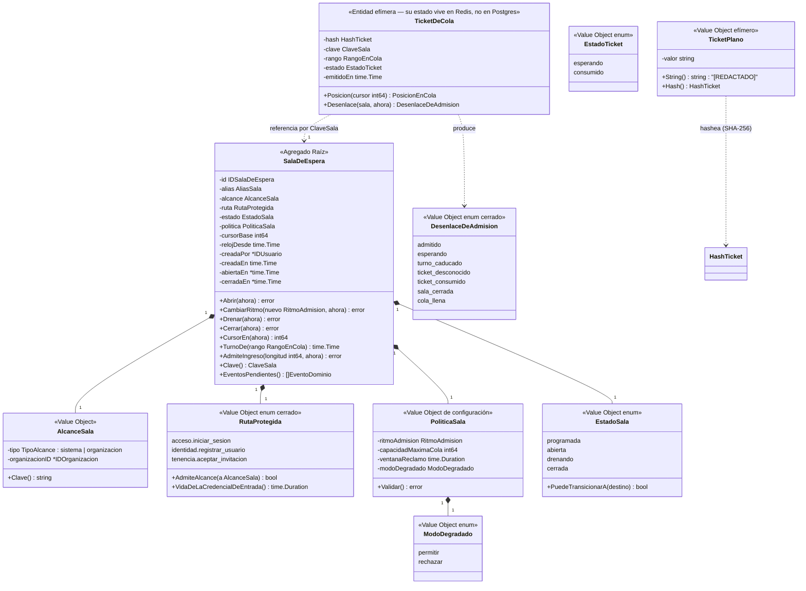

# Diseño — Colas de acceso virtual (sala de espera): extensión del bounded context **Confianza**

> Estado: **diseño, sin implementar**. Autor: agente `arquitecto-ddd-hexagonal`.
> Fecha: 2026-09-06.
> Alcance: extiende **Confianza** con el mecanismo de sala de espera virtual (protección de capacidad **agregada** ante picos de tráfico legítimo). No es un bounded context nuevo — ver §0.1, la primera decisión que este documento tiene que justificar.
> Depende de: **ADR 0002 (un solo producto — no se reabre)**, ADR 0004 (nombres de tablas), ADR 0005 (auditoría hash-chained), ADR 0006 (Huma v2), ADR 0007 (español en dominio/aplicación/puertos), **ADR 0009 (frontera Identidad/Acceso — no se reabre)**, ADR 0017 (toda tabla nueva necesita `GRANT` explícito), **ADR 0018 (Confianza + Redis — no se reabre; este diseño construye encima)**, ADR 0029/0030 (roles y autorización de Tenencia), ADR 0038 (token de step-up: precedente de token con propósito propio).
> Consumidores: **Acceso** (`POST /acceso/sesiones`), **Identidad** (`POST /identidad/usuarios`), **Tenencia** (`POST /tenencia/invitaciones/aceptaciones`) — los tres, únicamente a través de un middleware HTTP, sin ningún cambio en su dominio ni en su aplicación.
>
> **Nombre del archivo**: `colas-virtuales.md` y no `confianza-bounded-context.md`. Es deliberado y sigue el precedente de `otp-mfa.md`: este documento describe una **extensión de feature** sobre un contexto que ya existe y ya tiene código en producción, no la apertura de un contexto. El vocabulario "colas virtuales" es además el que `internal/plataforma/cache/doc.go` viene usando desde el inicio del proyecto; renombrarlo ahora obligaría a corregir un comentario que ya era correcto. Dentro del código y del lenguaje ubicuo, en cambio, el agregado se llama **`SalaDeEspera`** (§1.2): "cola" describe la estructura de datos, "sala de espera" describe el concepto de negocio, y el dominio nombra conceptos, no estructuras.

---

## 0. Punto de partida — lo que YA existe y no se reabre

### 0.1 Encuadre: extensión de Confianza, no un contexto nuevo

**Decisión: la sala de espera vive en `internal/confianza/`.** Cuatro razones, en orden de peso:

1. **La carta del contexto ya la incluye.** La definición de Confianza en el proyecto es literalmente *"rate limiting, fingerprinting, análisis de comportamiento, captcha, **colas virtuales** (todo lo que decide '¿confío en este request?')"*. No hay que decidir dónde poner esto: hay que decidir si esa asignación previa sigue teniendo sentido. Tiene.
2. **La infraestructura ya estaba reservada para esto, por escrito.** `internal/plataforma/cache/doc.go` dice, desde antes de que existiera una línea de Confianza: *"cliente Redis compartido […] usado por rate limiting, colas virtuales y cachés de lectura"*. ADR 0018 citó ese mismo comentario como argumento para elegir Redis; sería incoherente usarlo como precedente para el limitador y descartarlo para la pieza que el propio comentario nombra explícitamente.
3. **Es la misma clase de decisión, tomada en el mismo punto del flujo.** El limitador de tasa y la sala de espera responden en el mismo instante (antes de que el caso de uso real toque Postgres), con la misma forma de respuesta (*permitido / no permitido ahora / reintentá en N*), sobre el mismo motor de estado efímero, y montadas en el mismo borde HTTP. Lo que cambia es la **pregunta**: rate limiting pregunta *"¿este cliente está abusando?"*; la sala pregunta *"¿hay capacidad agregada para atender esto ahora?"*. Son dos respuestas al mismo *"¿dejo pasar este request?"*.
4. **Un contexto nuevo duplicaría cinco piezas para albergar un agregado.** Tendría que redeclarar `IDUsuario`, `IDOrganizacion`, `OrigenSolicitud` y `EventoDominio` (§1.7 del diseño de Tenencia, cuarta repetición de la misma discusión), su propio adaptador Redis sobre el mismo cliente, su propio ACL hacia Auditoría y su propio ACL hacia Tenencia — todo para un agregado y tres casos de uso de camino caliente.

**El argumento honesto en contra, y por qué no gana**: hoy `confianza/dominio` es *política sin estado* (`Umbral`, `PoliticaLimites`, `Decision`, `EvaluarPuntajeCaptcha`) y `confianza/adaptadores/postgres/doc.go` sigue siendo un `doc.go` vacío que dice *"Pendiente de implementación"*. Esta extensión introduce en Confianza su **primer agregado con ciclo de vida y su primera tabla en Postgres**, lo cual es un salto cualitativo real: deja de ser "un evaluador puro" y pasa a ser "un contexto con estado". Ese es el mejor argumento para un contexto propio y hay que reconocerlo, no esquivarlo. No gana porque el salto es **de tamaño de contexto, no de responsabilidad**: la tabla `salas_espera` no modela un concepto nuevo del negocio, modela la *configuración operativa* del propio mecanismo de perímetro — exactamente igual que `PoliticaLimites` modela la configuración del limitador, con la única diferencia de que ésta tiene que poder cambiarse en caliente durante un evento y sobrevivir a un reinicio (§6.1). Un contexto cuya razón de ser es "es que tiene una tabla" no es un bounded context, es un paquete. Ver *ADR candidato 0041*.

### 0.2 Qué NO es esto: la frontera con rate limiting (ADR 0018), escrita para que nadie la borre

| | Rate limiting (ADR 0018, ya implementado) | Sala de espera (este documento) |
|---|---|---|
| Protege a | un recurso concreto contra **un cliente** (IP, cuenta) | al **sistema entero** contra la demanda agregada |
| Se activa por | comportamiento **anómalo** de un origen | volumen **legítimo** que supera la capacidad configurada |
| Desenlace para el usuario | rechazo (`429`), con culpa implícita | espera con turno, posición y ETA — **nadie es rechazado**, se difiere |
| Corre | siempre, en todos los endpoints con hook | solo cuando una sala está abierta (**opt-in**, §4) |
| Estado | contadores por clave, TTL de minutos | cola FIFO con orden total, TTL de horas |
| Si el mecanismo falla | fail-open (ADR 0018) | fail-open por defecto, conmutable por sala (§8) |

**Consecuencia normativa (INV-COLA-02)**: la sala **nunca sustituye** al limitador. Una petición admitida por la sala atraviesa exactamente los mismos controles que atravesaría si la sala no existiera — incluida la evaluación de Confianza que Identidad ya hace dentro de `AutenticarUsuario`. La sala solo puede **retrasar** una petición; jamás relajar un control. Es el análogo directo de INV-MFA-03 (un token de step-up no vale como token de acceso) llevado a este mecanismo, y en §1.4 se explica por qué aquí la defensa resulta *estructural* y no necesita un `typ` distintivo.

### 0.3 Lo que el código cerrado YA hace y este diseño reutiliza sin tocar

- `internal/plataforma/cache.NuevoClienteRedis(url)` — el cliente compartido. La sala no abre una conexión propia.
- `internal/confianza/adaptadores/redis/limitador_tasa.go` — **el precedente técnico exacto**: estado efímero en Redis manipulado por un script Lua (`EVAL`) para que "leer, decidir y escribir" sea una sola operación atómica bajo concurrencia, con la política (`Umbral`) viviendo en el dominio y la aritmética replicada dentro del script. Este diseño copia ese patrón, incluida su tensión (§1.5).
- `internal/confianza/puertos/entrada.go` — `Solicitud.TenantID`, ya poblado por el middleware de autorización de Tenencia (§11.3 de su diseño). Es el mecanismo existente para saber "a qué organización pertenece esta petición"; este diseño lo usa donde aplica y explica en §1.1 por qué en el caso más importante (el login) **no aplica ni puede aplicar**.
- `internal/tenencia/dominio/politica_organizacion.go` — el precedente de "límites por organización, ajustables sin migración, con defaults en código y un VO que los valida". `PoliticaSala` (§1.3) lo sigue al pie de la letra para sus *rangos admisibles*, y §6.1 explica la única diferencia: el *valor vigente durante un evento* no puede vivir solo en código.
- `internal/tenencia/adaptadores/http/middleware_autorizacion.go` — el patrón de middleware Huma por operación, encadenado después del de autenticación. §7.3 sitúa la sala en esa misma cadena.
- `internal/acceso/adaptadores/jwt/emisor_token_step_up.go` — el precedente de "un token con propósito propio que jamás puede confundirse con otro" (ADR 0038). §1.4 decide **no** seguir este precedente y explica por qué el otro (token opaco) es el correcto aquí.

---

## 1. Modelo de dominio

### 1.1 La decisión que ordena todo lo demás: ¿por qué "por organización" no alcanza para un login?

La ficha del agente `colas-virtuales` fija como regla dura *"la cola es por tenant + endpoint, nunca global"*. Esa regla es correcta para el caso que tenía en mente (una organización grande abre inscripciones y no debe poner en fila a las demás) e **incorrecta como regla universal**, por una razón que ADR 0002 vuelve inevitable:

> Bajo ADR 0002 hay **un solo producto, un solo proceso, un solo pool de Postgres y una sola CPU**. Un pico de logins de la organización A degrada a la organización B *aunque la cola de A esté perfectamente aislada*, porque lo que se agota no es un recurso de A: es el pool de conexiones compartido y, sobre todo, la CPU que consume Argon2id con los parámetros fijos de ADR 0008 (64 MiB y t=3 **por cada verificación de contraseña**). Una cola por organización sobre `POST /acceso/sesiones` protege la contabilidad, no la capacidad.

Y hay una segunda razón, todavía más dura, específica del contexto de autenticación:

> **En `POST /acceso/sesiones` no existe una organización que resolver.** La credencial es global (ADR 0009: Identidad autentica al *usuario*, no al miembro de una organización); la membresía se conoce recién después, y por consulta explícita a Tenencia (ADR 0030). Cualquier intento de encolar "por organización" en el login obligaría a que el **cliente declare** a qué organización pertenece antes de autenticarse. Un discriminador declarado por el cliente, en el mecanismo cuyo propósito es contener una avalancha, es un mecanismo que la avalancha omite: basta con no mandar el campo, o mandar uno distinto en cada request.

**Decisión: `AlcanceSala` es un value object con dos formas**, y cada ruta protegida admite solo la que puede resolverse de forma no falsificable:

| Alcance | Cuándo | Cómo se resuelve la clave | Qué protege realmente |
|---|---|---|---|
| `sistema` | rutas **pre-autenticación** (`acceso.iniciar_sesion`, `identidad.registrar_usuario`, `tenencia.aceptar_invitacion`) | no se resuelve nada: la clave es la ruta | la capacidad agregada del proceso: CPU de Argon2id, pool de Postgres, cadena de auditoría |
| `organizacion` | rutas **org-scoped**, con `{idOrganizacion}` en la ruta y **ya autorizado** por el middleware de Tenencia | el `{idOrganizacion}` de la ruta, el mismo que ya puebla `Solicitud.TenantID` (§11.3 de Tenencia) | el trabajo de negocio posterior a la autorización, para esa organización |

Con esto, la intención de la ficha se conserva donde es realizable (una organización con un pico propio en una ruta suya no arrastra a las demás) y se abandona donde era fantasía (fingir un tenant en el login). **No se inventa ningún concepto paralelo de tenant**: el alcance por organización usa `IDOrganizacion` de Tenencia, tal cual, como clave opaca — exactamente el mismo trato que Confianza ya le da hoy en `Solicitud.TenantID` sin poseer la tabla `organizaciones`. Ver *ADR candidato 0045*.

**Corolario incómodo, explícito**: para el alcance `organizacion`, la sala se evalúa **después** de autenticación y autorización (§7.3, INV-COLA-09), porque antes no hay `{idOrganizacion}` autorizado. Eso significa que ya se pagó un JWT verificado y una consulta indexada a Postgres antes de encolar. Es una protección parcial por construcción, y quien necesite proteger *todo* el camino tiene que usar una sala de alcance `sistema`. Decirlo acá evita que alguien descubra el agujero en producción.

### 1.2 Diagrama



### 1.3 Agregados y value objects

| Agregado | Raíz | Frontera transaccional |
|---|---|---|
| **SalaDeEspera** | `SalaDeEspera` | Una transacción Postgres por sala. Es un agregado **de configuración operativa**: se muta pocas veces (abrir, cambiar el ritmo, drenar, cerrar) y se lee muchísimo, pero nunca desde Postgres en el camino caliente (INV-COLA-08). |
| **TicketDeCola** | `TicketDeCola` | **No tiene transacción Postgres: no se persiste en Postgres nunca.** Su estado vive en Redis y su atomicidad la da un script Lua. Es una entidad de dominio con lógica pura y proyección efímera, igual que los contadores de rate limiting — con la diferencia de que aquí sí hay reglas de negocio (turno, caducidad, un solo uso) que merecen tipos y tests propios en `dominio`. |

**Por qué `TicketDeCola` no es parte del agregado `SalaDeEspera`**: la misma pregunta que Tenencia resolvió para `Membresia` y Acceso para `TokenRefrescoEmitido`, con una respuesta más fácil que ambas. Una sala tiene, por diseño, cientos de miles de tickets simultáneos; cargar la sala para emitir un ticket sería cargar la avalancha entera en memoria en el peor momento posible. Gana el precedente de Identidad/Tenencia: **entidad propia, referenciada por `ClaveSala`**.

| VO | Constructor | Invariantes que garantiza |
|---|---|---|
| `IDSalaDeEspera` | `NuevoIDSalaDeEspera()` (vía puerto) / `IDSalaDeEsperaDesde(string)` | UUIDv7, mismo criterio que el resto del sistema. |
| `AliasSala` | `NuevoAliasSala(crudo)` | Mismas reglas que `AliasOrganizacion` de Tenencia (`TrimSpace`, NFC, minúsculas, `[a-z0-9-]`, 3–48, sin `-` en los bordes ni `--`). **Es público y aparece en la URL de ingreso**: es lo que un frontend hardcodea para un evento conocido (`inscripciones-2026`). No es un secreto y no autoriza nada. |
| `AlcanceSala` | `AlcanceSistema()` / `AlcanceOrganizacion(IDOrganizacion)` | Un alcance `organizacion` exige un `IDOrganizacion` no nulo; uno `sistema` exige que sea nulo. `Clave()` produce `"sistema"` u `"org:<uuid>"`. |
| `RutaProtegida` | `RutaProtegidaDesde(string)` | **Catálogo cerrado** (§1.6). Una ruta que no está en el catálogo no puede protegerse: no hay "protegé cualquier path", porque cada ruta necesita una decisión explícita sobre dónde va en la cadena de middlewares y sobre INV-COLA-10. |
| `EstadoSala` | `EstadoSalaDesde(string)` | Catálogo cerrado con máquina de estados (§1.6). `cerrada` es terminal. |
| `RitmoAdmision` | `NuevoRitmoAdmision(porSegundo int)` | `1 ≤ ritmo ≤ 10000`. Entero, no fraccionario: un ritmo menor a 1/s se expresa cerrando y reabriendo la sala, no con aritmética de punto flotante dentro de un script Lua. El techo de 10000 no es una capacidad real, es un fusible contra un `PATCH` con un cero de más que vaciaría la cola de golpe. |
| `PoliticaSala` | `NuevaPoliticaSala(...)` | `ritmoAdmision` válido; `capacidadMaximaCola ∈ [100, 5_000_000]`; `ventanaReclamo ∈ [30s, 15min]`; `modoDegradado` del catálogo. Mismo patrón exacto que `PoliticaOrganizacion` y `PoliticaSesion`: VO validado, defaults en código, ajustable sin migración. |
| `ModoDegradado` | `ModoDegradadoDesde(string)` | `permitir` (fail-open) \| `rechazar` (fail-closed). Ver §8. |
| `ClaveSala` | `sala.Clave()` | `"<alcance>:<ruta>"`, p. ej. `sistema:acceso.iniciar_sesion` u `org:0193...:tenencia.aceptar_invitacion`. Es el prefijo de todas las claves de Redis de esa sala y el discriminador de unicidad de INV-COLA-01. Se construye **solo** desde el agregado, nunca concatenando strings en un adaptador. |
| `TicketPlano` | `NuevoTicketPlano(string)` (vía puerto `GeneradorTickets`) | Prefijo `mot_cola_` + ≥43 chars base64url (32 bytes de entropía), exactamente el mismo criterio que `mot_rt_` de Acceso y `mot_inv_` de Tenencia. `String()`/`GoString()`/`MarshalJSON` devuelven `[REDACTADO]`. |
| `HashTicket` | `HashearTicket(plano)` | SHA-256 hex minúscula. Tercera aplicación del mismo razonamiento ya escrito en Identidad, Acceso y Tenencia: secreto aleatorio de alta entropía generado por el sistema, sin ataque de diccionario que encarecer → SHA-256, no Argon2id. Comparación en tiempo constante donde aplique. |
| `RangoEnCola` | `NuevoRango(int64)` | `≥ 1`. Ordinal monótono de ingreso, asignado por `INCR` (INV-COLA-14). **Es el orden FIFO**: no hay timestamps involucrados en decidir quién va primero. |
| `PosicionEnCola` | derivado | `max(0, rango - cursor)`. Cuántos turnos faltan. Es lo único que ve el usuario. |
| `DesenlaceDeAdmision` | catálogo cerrado | Los siete valores del diagrama. Es el vocabulario con el que el middleware y el endpoint de estado hablan; un string libre haría imposible responder "¿cuántos turnos se caducaron en el evento del lunes?" sin parsear texto (mismo argumento que `MotivoDenegacion` de Tenencia y `MotivoRevocacion` de Acceso). |

**Valores por defecto de `PoliticaSala`** (en código, ajustables sin migración; una sala concreta puede sobrescribirlos dentro de los rangos válidos):

| Parámetro | Default | Justificación |
|---|---|---|
| `ritmoAdmision` | **50 / s** | El mismo número que la ficha usa como ejemplo, y un punto de partida defendible: con Argon2id a 64 MiB y t=3 (ADR 0008), 50 logins/s es un orden de magnitud razonable para un proceso mediano. **No está calibrado contra tráfico real** (ADR 0002: el producto no lo tiene), exactamente igual que los umbrales de ADR 0018 — y por eso es lo primero que un operador debe medir y ajustar en caliente (`PATCH`, §7.2). |
| `capacidadMaximaCola` | **500 000** | Techo anti-abuso sobre la memoria de Redis, no una decisión de producto. Cada ticket es un hash pequeño con TTL; medio millón es holgado y a la vez impide que un flood convierta la sala en un vector de OOM contra el mismo Redis del que depende el rate limiting (INV-COLA-04 no sirve de nada si el motor se queda sin memoria). Superado el techo, se responde `cola_llena` (§7.1). |
| `ventanaReclamo` | **2 min** | El valor de la ficha, y el correcto: suficiente para que un navegador en segundo plano note su turno en el siguiente sondeo, corto para que un turno no reclamado no quede reservado eternamente. |
| `modoDegradado` | **`permitir`** | Fail-open (§8). |

### 1.4 El ticket: token opaco, no JWT — y por qué eso además cierra la defensa de INV-COLA-03

La ficha propone *"un `queue_token` (JWT corto, firmado, con `position` y `issued_at`)"*. **Se descarta.** El repositorio tiene los dos patrones ya construidos y hay que elegir con criterio, no por costumbre:

| | JWT de propósito propio (precedente: token de step-up, ADR 0038) | Token opaco de alta entropía (precedentes: `mot_rt_` de Acceso, `mot_inv_` de Tenencia) |
|---|---|---|
| El estado que representa | cabe entero dentro del token y **no cambia** durante su vida (usuario + motivo, 5 min) | vive en el servidor y **cambia** mientras el token existe |
| Verificación | sin estado, una firma | una lectura de estado |

La posición en una cola es el ejemplo de manual de un dato que **cambia por definición mientras el token existe**: un JWT que la lleve adentro está desactualizado en el instante mismo de firmarlo, y el cliente que lo sondee necesitaría igual una consulta al servidor. Firmar la posición no ahorra la lectura, solo agrega criptografía. Y hay tres razones más, cada una suficiente:

1. **Costo en el peor momento.** Emitir un JWT es una firma Ed25519 por entrante. Un pico de 5 000 ingresos en 10 s son 5 000 firmas *dentro del mecanismo cuyo propósito es no gastar CPU en un pico*. El token opaco son 32 bytes de `crypto/rand` y un SHA-256.
2. **El orden FIFO exige estado de todos modos.** Ya hay que llevar un contador y un cursor en Redis (§1.5): no existe la variante "sin estado" que justificaría el JWT.
3. **La defensa contra confusión de propósito sale gratis y estructural.** ADR 0038 tuvo que inventar un `typ` distinto (`step-up+jwt` vs `at+jwt`) porque los dos tokens comparten formato y **la misma llave de firma**: sin ese chequeo explícito, un validador podría aceptar uno por otro (INV-MFA-03). Un ticket opaco con prefijo `mot_cola_`, validado por un componente que no conoce ni la llave de Acceso ni el formato JWT, **no puede ser confundido con un token de acceso ni siquiera por un validador con un bug**: no comparte llave, ni formato, ni namespace, ni validador. La invariante equivalente (INV-COLA-03) se cumple por construcción en vez de por comprobación. Introducir un tercer JWT firmado con la llave de Acceso, para un mecanismo de perímetro que no autoriza nada, sería agrandar la superficie de *type confusion* a cambio de nada.

**Decisión: token opaco `mot_cola_<43+ chars base64url>`, del que Redis guarda solo el SHA-256** (INV-COLA-07). Ver *ADR candidato 0042*.

### 1.5 Mecanismo de admisión: cursor derivado del reloj, no un worker que libera N por segundo

La ficha propone *"un worker libera N usuarios/segundo hacia el endpoint real"* y una *"cola FIFO en Redis (Sorted Set con timestamp de entrada como score)"*. **Se descartan las dos piezas**, y la alternativa es más simple y con mejores propiedades:

**Orden**: `INCR confianza:cola:<clave>:secuencia` asigna un `RangoEnCola` monótono en el ingreso. Eso *es* el orden FIFO — sin ZSET, sin timestamps, sin comparaciones. `INCR` es O(1) y su atomicidad es la garantía estructural de que dos entrantes nunca comparten rango (INV-COLA-14).

**Admisión**: no hay worker. El cursor de admisión es una **función pura del reloj**:

```
cursor(t) = cursorBase + floor((t - relojDesde) × ritmoAdmision)

admitido(ticket) ⟺ ticket.rango ≤ cursor(ahora)
turnoDe(rango)   = relojDesde + (rango - cursorBase) / ritmoAdmision
```

`cursorBase` y `relojDesde` viven en el agregado (y en su proyección de Redis) y solo se reescriben cuando cambia el ritmo: `CambiarRitmo(nuevo, ahora)` fija `cursorBase = cursor(ahora)` y `relojDesde = ahora`, de modo que el cursor es continuo en el cambio (nadie salta de golpe, nadie retrocede).

Por qué esto es mejor que un worker con ZSET, punto por punto:

- **No hay proceso extra ni elección de líder.** Con varias réplicas de la API, un worker de admisión necesita o bien un líder (y entonces un mecanismo de elección y un modo degradado cuando el líder muere durante el pico) o bien coordinación entre réplicas. El cursor derivado lo calcula cualquier réplica, siempre igual, sin coordinarse con nadie: el único reloj compartido es el de Redis dentro del script Lua (`TIME`), y esa es la única fuente de "ahora" en el camino caliente.
- **El turno es determinista y no depende del comportamiento de los demás.** Con un worker que "libera a los N primeros vivos", abandonar la cola adelanta a los de atrás: la ETA *baja*, lo cual suena bien pero implica que la ETA también puede *subir* (reintentos, reingresos, cambios de ritmo mal aplicados). Con el cursor, `turnoDe(rango)` es una hora fija: **la espera estimada nunca empeora** (INV-COLA-05). Para una sala de espera, una ETA monótona es la propiedad de UX más importante que existe — un contador que retrocede destruye la confianza que la cola intenta comprar.
- **La aritmética es O(1) y cabe en un script Lua de diez líneas.** El ZSET es O(log N) por operación y exige purga (los abandonados quedan adentro), y la purga es otro job.
- **El error se comete siempre del lado seguro.** Los turnos de quienes abandonaron o no reclamaron **no se devuelven al cupo**: el sistema protegido recibe *menos* de `ritmo` admisiones por segundo, nunca más (INV-COLA-04). Es exactamente la dirección de fallo que se quiere en un mecanismo de protección de capacidad. El precio es utilización subóptima cuando hay mucho abandono; se acepta y se documenta.
- **`capacidadMaximaCola` se mide como `secuencia - cursor(ahora)`**, que sobrecuenta a los abandonados. Se acepta por la misma razón: el techo existe para proteger la memoria de Redis y sobrecontar solo hace el fusible más conservador.

**La tensión que este diseño hereda de ADR 0018, dicha en voz alta**: la aritmética de arriba vive **dos veces** — como funciones puras del dominio (`SalaDeEspera.CursorEn`, `TurnoDe`, `TicketDeCola.Desenlace`), usadas por los tests y por los caminos no atómicos, y replicada dentro de los scripts Lua para que la decisión sea atómica. Es la misma duplicación que ya existe entre `dominio.Umbral` y `scriptPermitir`. Mitigación, igual que la que Tenencia aplicó a `CorreoDestinatario` vs. `Correo`: un test de consistencia sobre un corpus compartido de casos que ejecute el script Lua contra un Redis real y compare, caso por caso, con la función de dominio. Sin ese test, las dos copias se desincronizan en silencio. Ver *ADR candidato 0043*.

### 1.6 Máquinas de estado y el catálogo de rutas protegibles

```
EstadoSala:
  programada --abrir----> abierta
  abierta    --drenar---> drenando      (no admite ingresos nuevos; los tickets vivos siguen avanzando)
  abierta    --cerrar---> cerrada       (terminal)
  drenando   --cerrar---> cerrada       (terminal)
  drenando   --abrir----> abierta       (reapertura durante el drenaje, p. ej. un segundo lote)
  cerrada    --*--------> ✗
```

`drenando` es el estado que hace operable el cierre de un evento: se corta la entrada y se deja que la cola existente termine de pasar, en vez de tirar a la calle a cien mil personas que ya esperaron.

`EstadoTicket`: `esperando → consumido` (terminal). No hay estado `admitido` persistido, y eso es deliberado: la admisión es una **propiedad derivada** de `rango ≤ cursor(ahora)`, no un hecho que alguien tenga que escribir. La caducidad también: `turno_caducado ⟺ ahora > turnoDe(rango) + ventanaReclamo`. Consecuencia importante: **el reloj del turno no arranca cuando el cliente lo consulta**, así que un cliente que nunca sondea no puede guardarse un ticket para reclamarlo tres horas después. Con un `admitido_en` escrito en el primer sondeo, ese ataque de "ticket dormido" existiría.

**Catálogo cerrado `RutaProtegida`** (INV-COLA-10 explica el criterio de admisión al catálogo):

| Valor | Endpoint | Alcances admitidos | Por qué está |
|---|---|---|---|
| `acceso.iniciar_sesion` | `POST /acceso/sesiones` | `sistema` | El caso canónico: Argon2id + Postgres + auditoría por intento. |
| `identidad.registrar_usuario` | `POST /identidad/usuarios` | `sistema` | Apertura masiva de inscripciones: el escenario literal del encargo. |
| `tenencia.aceptar_invitacion` | `POST /tenencia/invitaciones/aceptaciones` | `sistema` | Onboarding masivo de una organización grande; escribe dos agregados y una fila de auditoría por petición. |

**Excluidos a propósito, con el motivo escrito para que nadie los agregue sin releer esto:**

- `POST /acceso/sesiones/renovaciones` — **encolar una renovación es cerrarle la sesión a un usuario que ya estaba adentro.** Es el camino feliz de cada sesión viva cada 10 minutos (ADR 0019); una sala sobre esta ruta convierte un pico de logins en una expulsión masiva de los usuarios ya autenticados, que es el resultado opuesto al buscado.
- `POST /acceso/sesiones/segundo-factor` — el token de step-up vive **5 minutos sin refresco** (INV-MFA-04). Una espera de más de 5 minutos garantiza que el usuario llegue a su turno con la credencial vencida y tenga que empezar el login de cero, ahora sí desde el final de la otra cola. Es el caso que motiva INV-COLA-10.
- `GET /.well-known/jwks.json` — infraestructura de verificación de terceros; encolarla rompe la validación de tokens de todo el mundo.

### 1.7 Eventos de dominio

| Evento | Acción de auditoría | Resultado | Notas |
|---|---|---|---|
| `SalaDeEsperaAbierta` | `sala_espera.abierta` | `exito` | `detalles`: `{alias, alcance, ruta, ritmo, capacidad_maxima, modo_degradado}` |
| `RitmoDeAdmisionCambiado` | `sala_espera.ritmo_cambiado` | `exito` | `detalles`: `{ritmo_anterior, ritmo_nuevo, cursor_al_cambiar, longitud_cola}` — es el dato que un post-mortem del evento va a pedir primero |
| `SalaDeEsperaCerrada` | `sala_espera.cerrada` | `exito` | cubre `drenando` y `cerrada`, distinguidos por `detalles.destino`; `detalles`: `{ingresos_totales, admitidos_totales}` |

**Lo que NO se audita, y por qué**: ni los ingresos, ni las consultas de turno, ni los reclamos. Es exactamente el razonamiento de INV-TEN-25 / *ADR candidato 0035*, aplicado al camino más caliente que haya tenido el sistema: la cadena de hashes de ADR 0005 está serializada por un advisory lock, y auditar medio millón de ingresos pondría el mecanismo de protección de capacidad detrás del cuello de botella global — el mecanismo se volvería la caída que intenta evitar. Los ingresos y admisiones son **métricas**, no evidencia forense: van por `slog` y por contadores agregados (`ingresos_totales`/`admitidos_totales`, que sí llegan a la auditoría, una vez, al cerrar la sala).

Ningún evento transporta un `TicketPlano` ni su hash — verificable con el mismo test de reflexión que ya usan Identidad, Acceso y Tenencia.

### 1.8 Errores de dominio

| Error | Cuándo | HTTP |
|---|---|---|
| `ErrAliasSalaInvalido` / `ErrAliasSalaYaRegistrado` | constructor / índice único | 422 / 409 |
| `ErrSalaNoEncontrada` | consulta por alias o ID | 404 |
| `ErrSalaYaAbiertaParaLaRuta` | ya hay una sala no cerrada para ese (alcance, ruta) — INV-COLA-01 | 409 |
| `ErrTransicionEstadoSalaInvalida` | máquina de estados; incluye origen y destino | 409 |
| `ErrPoliticaSalaInvalida` | constructor de `PoliticaSala` | 422 (por HTTP) / falla al arrancar (por config) |
| `ErrRutaNoProtegible` | ruta fuera del catálogo cerrado, o alcance no admitido por esa ruta | 422 |
| `ErrColaLlena` | `capacidadMaximaCola` alcanzada | 503 + `Retry-After` |
| `ErrTurnoNoAlcanzado` | reclamo antes del turno | 503 + `Retry-After` (con posición en el cuerpo) |
| `ErrTurnoCaducado` | reclamo fuera de `ventanaReclamo` | 503 (con instrucción de reingresar) |
| `ErrTicketDesconocido` | hash sin estado en Redis (nunca existió, o expiró) | 503 (con instrucción de reingresar) |
| `ErrTicketConsumido` | segundo reclamo del mismo ticket (INV-COLA-06) | 503 (con instrucción de reingresar) |
| `ErrEstadoDeColaNoDisponible` | Redis caído | según `modoDegradado` (§8) |

**Nota deliberada sobre por qué acá NO se colapsan los errores** (a diferencia de INV-ACC-21, INV-TEN-24 e INV-MFA-08): esos tres casos colapsan respuestas porque distinguirlas construiría un **oráculo** sobre un secreto (¿existe esta cuenta? ¿es válido este token de invitación?). Un ticket de cola no protege nada: reingresar es gratis, público y sin credenciales, y para ver la diferencia entre `ticket_desconocido` y `ticket_consumido` hay que poseer el ticket. No hay oráculo que cerrar, y distinguirlos es la diferencia entre un frontend que sabe qué mostrarle al usuario y uno que no. Se documenta como excepción razonada, no como olvido.

---

## 2. Puertos

Convención idéntica al resto del repositorio: `puertos/entrada.go` (driving, los implementan los casos de uso; también alberga `ComandoX`/`ConsultaX`/`ResultadoX`/`VistaX`) y `puertos/salida.go` (driven, los implementan los adaptadores). `ctx context.Context` siempre primero. Los archivos ya existen en `internal/confianza/puertos/`; esto es aditivo.

### 2.1 Puertos de entrada (nuevos, en `confianza/puertos/entrada.go`)

```go
// PorteroDeSala es el puerto de camino caliente: lo consume el middleware
// HTTP y NADA más. Sus tres operaciones tocan Redis y CPU local,
// jamás Postgres (INV-COLA-08).
type PorteroDeSala interface {
    // SalaVigentePara responde, desde la instantánea en memoria del
    // reconciliador (§3.7), si la ruta+alcance de esta petición está
    // protegida ahora mismo. Es la primera pregunta del middleware y no
    // hace E/S: tiene que poder responderse incluso con Redis caído, que
    // es precisamente cuando hay que saber el modoDegradado (§8).
    SalaVigentePara(ctx context.Context, q ConsultaSalaVigente) (VistaSalaVigente, bool)

    // Ingresar emite un ticket y devuelve el turno asignado.
    Ingresar(ctx context.Context, cmd ComandoIngresarASala) (ResultadoTurno, error)

    // ConsultarTurno es de solo lectura: no muta nada salvo refrescar el
    // TTL del ticket (§6.2).
    ConsultarTurno(ctx context.Context, q ConsultaTurno) (ResultadoTurno, error)

    // Reclamar consume el turno. Es la única operación que puede dejar
    // pasar la petición real, y es de un solo uso (INV-COLA-06).
    Reclamar(ctx context.Context, cmd ComandoReclamarTurno) (ResultadoTurno, error)
}

// GestorDeSalasDeEspera es el puerto de administración (frío): muta el
// agregado en Postgres y reproyecta a Redis en la misma unidad de trabajo
// lógica (§3.1).
type GestorDeSalasDeEspera interface {
    Abrir(ctx context.Context, cmd ComandoAbrirSala) (VistaSala, error)
    CambiarRitmo(ctx context.Context, cmd ComandoCambiarRitmoAdmision) (VistaSala, error)
    CambiarEstado(ctx context.Context, cmd ComandoCambiarEstadoSala) (VistaSala, error)
}

// ConsultorDeSalas alimenta el endpoint público agregado (§7.1): datos de
// la sala, nunca de un ticket concreto ni de la organización dueña.
type ConsultorDeSalas interface {
    ObtenerPorAlias(ctx context.Context, q ConsultaSalaPorAlias) (VistaSalaPublica, error)
}

// --- comandos, consultas y resultados (primitivos, nunca DTOs HTTP) ---

type ConsultaSalaVigente struct {
    Ruta           string // valor del catálogo cerrado dominio.RutaProtegida
    IDOrganizacion string // "" para alcance sistema
}

type VistaSalaVigente struct {
    Alias         string
    Clave         string
    Estado        string // "abierta" | "drenando"
    ModoDegradado string // "permitir" | "rechazar"
}

type ComandoIngresarASala struct {
    Alias  string
    Origen dominio.OrigenSolicitud
}

type ConsultaTurno struct {
    Alias       string
    TicketPlano string
}

type ComandoReclamarTurno struct {
    Clave       string // resuelta por el middleware desde VistaSalaVigente
    TicketPlano string
}

// ResultadoTurno es lo que ve el cliente. TicketPlano viene poblado SOLO
// en la respuesta de Ingresar (única vez que el ticket sale del proceso),
// igual que el secreto TOTP en ResultadoHabilitarMFA.
type ResultadoTurno struct {
    TicketPlano       string
    Desenlace         string // catálogo cerrado dominio.DesenlaceDeAdmision
    Posicion          int64
    LongitudCola      int64
    EsperaEstimada    time.Duration
    TurnoEstimadoEn   time.Time
    ReconsultarEn     time.Duration // intervalo de sondeo dictado por el servidor (§7.1)
}

type ComandoAbrirSala struct {
    Alias               string
    Ruta                string
    IDOrganizacion      string // "" ⇒ alcance sistema
    RitmoAdmision       int
    CapacidadMaximaCola int64
    VentanaReclamo      time.Duration
    ModoDegradado       string
    IDSujeto            string // "" para el alcance sistema, operado fuera de la API (§7.2)
    Origen              dominio.OrigenSolicitud
}

type ComandoCambiarRitmoAdmision struct {
    IDSala        string
    RitmoAdmision int
    IDSujeto      string
    Origen        dominio.OrigenSolicitud
}

type ComandoCambiarEstadoSala struct {
    IDSala   string
    Destino  string // "abierta" | "drenando" | "cerrada"
    IDSujeto string
    Origen   dominio.OrigenSolicitud
}

type VistaSalaPublica struct {
    Alias               string
    Estado              string
    LongitudAproximada  int64
    EsperaEstimada      time.Duration
    ReconsultarEn       time.Duration
}
```

### 2.2 Puertos de salida (nuevos, en `confianza/puertos/salida.go`)

```go
// RepositorioSalasDeEspera persiste el agregado. Fuera del camino caliente.
type RepositorioSalasDeEspera interface {
    Guardar(ctx context.Context, s *dominio.SalaDeEspera) error
    BuscarPorID(ctx context.Context, id dominio.IDSalaDeEspera) (*dominio.SalaDeEspera, error)
    BuscarPorAlias(ctx context.Context, alias dominio.AliasSala) (*dominio.SalaDeEspera, error)
    // ListarVigentes: lo consume el reconciliador (§3.7) cada N segundos.
    // Devuelve las salas en estado abierta|drenando.
    ListarVigentes(ctx context.Context) ([]*dominio.SalaDeEspera, error)
}

// EstadoDeCola es el puerto sobre el estado efímero. La implementación real
// (adaptadores/redis/estado_cola.go) usa tres scripts Lua para que "leer la
// configuración, calcular el cursor, decidir y escribir" sea atómico —
// mismo criterio y mismo motivo que scriptPermitir del limitador de tasa
// (ADR 0018). Cualquier adaptador que satisfaga este contrato (incluido uno
// en memoria para tests) es intercambiable sin tocar aplicacion.
type EstadoDeCola interface {
    // Proyectar escribe/actualiza la configuración de la sala en Redis de
    // forma idempotente. Inicializa el reloj de admisión SOLO si no existía
    // (HSETNX): si Redis perdió el estado, el reloj arranca de cero en vez
    // de admitir de golpe a toda una cola vacía (§6.2, INV-COLA-13).
    Proyectar(ctx context.Context, p ProyeccionSala) error
    Retirar(ctx context.Context, clave string) error

    Ingresar(ctx context.Context, clave string, hash string) (EstadoTicket, error)
    Consultar(ctx context.Context, clave string, hash string) (EstadoTicket, error)
    Reclamar(ctx context.Context, clave string, hash string) (EstadoTicket, error)

    // Instantanea alimenta el endpoint público agregado y las métricas.
    Instantanea(ctx context.Context, clave string) (InstantaneaCola, error)
}

type ProyeccionSala struct {
    Clave               string
    Alias               string
    Estado              string
    RitmoAdmision       int
    CapacidadMaximaCola int64
    VentanaReclamo      time.Duration
    CursorBase          int64
    RelojDesde          time.Time
    Version             int64 // monótona: una proyección vieja nunca pisa a una nueva
}

type EstadoTicket struct {
    Desenlace       string
    Rango           int64
    Cursor          int64
    LongitudCola    int64
    TurnoEstimadoEn time.Time
}

type InstantaneaCola struct {
    LongitudAproximada int64
    Cursor             int64
    Ingresos           int64
}

// GeneradorTickets: el dominio nunca genera bytes aleatorios por sí mismo
// (mismo criterio que GeneradorSecretoTOTP y el generador de tokens de
// invitación).
type GeneradorTickets interface {
    GenerarTicket() (dominio.TicketPlano, error)
}
```

**Puertos que Confianza gana por primera vez con esta extensión** (hoy no tiene ninguno, porque nunca tuvo estado ni eventos): `GeneradorIDs` (UUIDv7), `Reloj` (el dominio no llama a `time.Now()`), `RegistroAuditoria` (ACL hacia la bitácora, mismo contrato que los tres contextos existentes) y `VerificadorDeAutorizacion` **consumido desde un ACL propio** `confianza/adaptadores/tenencia/` — único paquete de Confianza autorizado a importar `tenencia/puertos`, misma regla de frontera que INV-TEN-28.

### 2.3 Puertos aplazados (ya nombrados para que nadie los reinvente con otro nombre)

- `PrioridadDeCola` / `PoliticaDeEquidad`: colas con prioridad (usuarios premium, reintentos de quien caducó su turno). Hoy la cola es estrictamente FIFO; ver el riesgo residual de ticket-farming en §4 (INV-COLA-04) y *ADR candidato 0043*.
- `EmisorSalaProgramada`: abrir/cerrar una sala por horario (`programada → abierta` automática a las 09:00). El estado `programada` ya existe en la máquina de estados para que agregarlo sea aditivo; hoy la transición la dispara siempre un operador.
- `NotificadorDeTurno`: avisar por push/websocket en vez de sondeo. El sondeo dictado por el servidor (`ReconsultarEn`) es el MVP.

---

## 3. Casos de uso

### 3.1 `AbrirSalaDeEspera`

1. Construir los VOs (`AliasSala`, `RutaProtegida`, `AlcanceSala`, `PoliticaSala`) — cualquier fallo es `422` antes de tocar nada.
2. Verificar que la ruta admite ese alcance (`RutaProtegida.AdmiteAlcance`) → `ErrRutaNoProtegible`.
3. Si el alcance es `organizacion`: la autorización ya la resolvió el middleware (§7.2); el caso de uso **no** vuelve a preguntar (mismo criterio que Tenencia: quien autoriza es el middleware, el caso de uso confía en el `IDSujeto` que recibe, INV-TEN-12).
4. `RepositorioSalasDeEspera.Guardar` — la unicidad de (alcance, ruta) entre salas no cerradas la garantiza el **índice único parcial** de §6.1, no una consulta previa (INV-COLA-01, mismo criterio que INV-ID-02/INV-TEN-02/INV-ACC-04).
5. `Abrir(ahora)` fija `estado=abierta`, `cursorBase=0`, `relojDesde=ahora`, `abiertaEn=ahora`.
6. `EstadoDeCola.Proyectar(...)` en Redis. **Si la proyección falla, la apertura falla** (la sala queda `programada`): una sala "abierta" en Postgres pero invisible en Redis es una sala que no protege nada y que el operador cree que sí. Fail-closed en la administración, que es el camino frío.
7. Auditar `SalaDeEsperaAbierta`.

### 3.2 `CambiarRitmoDeAdmision`

El caso de uso que se usa **durante** el pico, con el sistema real bajo carga y alguien mirando un dashboard. `sala.CambiarRitmo(nuevo, ahora)` recalcula `cursorBase = cursor(ahora)` y `relojDesde = ahora` (continuidad, §1.5), persiste y reproyecta con `Version` incrementada. Audita `RitmoDeAdmisionCambiado` con el cursor y la longitud de la cola en el momento del cambio — sin ese dato, un post-mortem no puede reconstruir qué se admitió cuándo.

### 3.3 `CambiarEstadoSala` (`drenar` / `cerrar` / `reabrir`)

Transición por la máquina de estados; al pasar a `cerrada`, `EstadoDeCola.Retirar(clave)` borra la proyección y libera las claves de Redis. Los tickets vivos caducan solos por TTL. Audita `SalaDeEsperaCerrada` con los totales.

### 3.4 `IngresarASala`

Camino caliente, **público, sin autenticación** (§7.1):

1. `SalaVigentePara` desde la instantánea en memoria; si no hay sala vigente para ese alias → `404`.
2. Evaluar Confianza con la acción nueva `ingreso_a_sala` (§12): es el único freno contra el farming de tickets, y es barato (dos claves de Redis).
3. `GeneradorTickets.GenerarTicket()` → `TicketPlano`; `HashearTicket` → `HashTicket`.
4. `EstadoDeCola.Ingresar(clave, hash)` — un solo script Lua: verifica estado de la sala, calcula el cursor, verifica la capacidad, `INCR` de la secuencia, `HSET` del ticket, `PEXPIRE` calculado para que el ticket sobreviva hasta su turno más la ventana de reclamo (§6.2).
5. Devolver `ResultadoTurno` con el `TicketPlano` **en claro** — única vez que sale del proceso, igual que el secreto TOTP o el token de invitación.

Sin eventos de dominio y sin auditoría (§1.7).

### 3.5 `ConsultarTurno`

Solo lectura + refresco de TTL. Devuelve posición, ETA y `ReconsultarEn`. Nunca toca Postgres. Nunca revela nada de la organización dueña ni de la ruta protegida (INV-COLA-15).

### 3.6 `ReclamarTurno`

Lo invoca **el middleware**, no un endpoint. Un solo script Lua atómico que resuelve el desenlace y, si es `admitido`, marca el ticket `consumido` en la misma operación (INV-COLA-06: dos peticiones concurrentes con el mismo ticket, exactamente una pasa — misma garantía y mismo patrón que la rotación de token de refresco de Acceso). Si el desenlace no es `admitido`, el middleware corta la petición con `503` (§7.4) y el caso de uso real **nunca se ejecuta**.

### 3.7 `ReconciliarSalas` — el servicio de aplicación que sostiene INV-COLA-08 y §8

Un bucle con `time.Ticker` (por defecto **cada 15 s**, arrancado en `cmd/api/main.go` como goroutine con `context` de cierre ordenado) que:

1. `RepositorioSalasDeEspera.ListarVigentes()` — una consulta a Postgres cada 15 s por réplica, no una por petición.
2. Actualiza la **instantánea en memoria** (`map[ClaveSala]VistaSalaVigente`, protegida por `atomic.Pointer` para que la lectura del middleware sea sin candado). Esta instantánea es la que responde `SalaVigentePara`, y es la razón por la que el middleware puede aplicar el `modoDegradado` correcto **aunque Redis esté caído** (§8): saber *si hay sala* y *qué hacer si falla* no puede depender del componente que falla.
3. `EstadoDeCola.Proyectar(...)` para cada sala vigente (idempotente; `HSETNX` sobre el reloj de admisión). Esto es lo que hace que un Redis reiniciado o vaciado se recupere solo en ≤15 s, con el reloj de admisión reiniciado en vez de con un cursor gigante contra una secuencia vacía (INV-COLA-13).

Es un servicio de aplicación, no un adaptador: coordina dos puertos y no conoce ni `pgx` ni `go-redis`.

---

## 4. Invariantes de negocio

Numeradas para referenciarlas desde los tests (`TestINV_COLA_04_...`), igual que `TestINV_ID_*`, `TestINV_ACC_*`, `TestINV_TEN_*` y `TestINV_MFA_*`.

| # | Invariante |
|---|---|
| **INV-COLA-01** | A lo sumo **una** sala no cerrada por par (`alcance`, `ruta`). Garantía **estructural**: índice único parcial en Postgres (§6.1), no una consulta previa. Dos salas simultáneas sobre la misma ruta harían indeterminado qué ritmo rige. |
| **INV-COLA-02** | **Un ticket no autoriza nada.** La petición admitida atraviesa exactamente los mismos controles (autenticación, evaluación de Confianza/rate limiting, autorización de Tenencia, reglas del caso de uso) que atravesaría sin sala. Una sala solo puede **retrasar** una petición; jamás relajar, saltear ni sustituir un control existente. |
| **INV-COLA-03** | Un ticket de cola nunca puede ser aceptado donde se espera un token de acceso, de refresco, de step-up o de invitación, ni viceversa. Aquí la defensa es **estructural, no un chequeo de `typ`**: el ticket es opaco, con prefijo propio, sin firma, y lo valida un componente que no conoce la llave de Acceso ni el formato JWT (§1.4, contrastar con INV-MFA-03). |
| **INV-COLA-04** | El sistema protegido **nunca** recibe más de `ritmoAdmision` admisiones por segundo. Los turnos no reclamados **no se devuelven al cupo**: el error se comete siempre por debajo de la capacidad, nunca por encima. |
| **INV-COLA-05** | El turno de un ticket es función determinista de su `rango` y de la configuración vigente: no depende de cuántos abandonen ni de si el cliente sondea. Consecuencia observable y verificable en test: **la espera estimada de un ticket nunca empeora** entre dos consultas, salvo por una reducción explícita y auditada del ritmo (§3.2). |
| **INV-COLA-06** | Un ticket se reclama **exactamente una vez**; `consumido` es terminal. Dos reclamos concurrentes del mismo ticket: exactamente uno pasa (atomicidad del script Lua, mismo criterio que la rotación de refresco de Acceso). |
| **INV-COLA-07** | El ticket en claro nunca se persiste (en Redis vive su SHA-256), nunca se registra en logs, nunca viaja en un evento de dominio ni en una fila de auditoría. Sale del proceso exactamente una vez: en la respuesta de `IngresarASala`. |
| **INV-COLA-08** | Ni el ingreso, ni la consulta de turno, ni el reclamo tocan **Postgres**. El camino caliente de la sala es exclusivamente Redis + CPU local. Un mecanismo de protección de capacidad que consulta la base de datos que intenta proteger es un amplificador, no una protección. |
| **INV-COLA-09** | Orden en la cadena de middlewares: en rutas de alcance `sistema`, la sala se evalúa **antes** que cualquier trabajo caro (es el primer middleware de la operación, después del de `OrigenSolicitud`); en rutas de alcance `organizacion`, **después** de autenticación y autorización, porque su clave sale del `{idOrganizacion}` ya autorizado. Nunca al revés. |
| **INV-COLA-10** | Una sala no se monta sobre una ruta cuya credencial de entrada expira antes de la espera máxima esperable (`RutaProtegida.VidaDeLaCredencialDeEntrada`). Excluye por construcción `sesiones/segundo-factor` (token de step-up de 5 min) y `sesiones/renovaciones` (encolarla expulsa a usuarios ya autenticados). El catálogo cerrado es el mecanismo que hace cumplir esto. |
| **INV-COLA-11** | Toda mutación del ciclo de vida de una sala se audita (abrir, cambiar ritmo, drenar, cerrar), en la misma unidad de trabajo que la escritura. Ingresos, consultas y reclamos **no** se auditan (§1.7, mismo razonamiento que INV-TEN-25). |
| **INV-COLA-12** | Postgres es la fuente de verdad de la **configuración**; Redis, del **estado efímero**. Una divergencia se resuelve siempre reproyectando desde Postgres, nunca leyendo la configuración desde Redis hacia Postgres. |
| **INV-COLA-13** | Si Redis perdió el estado de una sala, la reproyección **reinicia el reloj de admisión** (`cursorBase=0`, `relojDesde=ahora`) en vez de conservar un cursor grande contra una secuencia vacía. Sin esto, un reinicio de Redis durante un pico admitiría instantáneamente a todos los que reingresen — convirtiendo la sala en el disparador de la avalancha que existe para contener. |
| **INV-COLA-14** | El `rango` es monótono y se asigna exactamente una vez por ingreso. Garantía estructural (`INCR` de Redis), no de la aplicación. |
| **INV-COLA-15** | Ningún endpoint de la sala revela la organización dueña, la ruta protegida ni la existencia de otras salas. El endpoint público agregado publica longitud aproximada, estado y ETA; nunca identidades ni claves. |

**Riesgo residual documentado (no cubierto por ninguna invariante, a propósito)**: un atacante puede pedir muchos tickets y usar el de mejor posición (*ticket farming*). Eso compra **prioridad, no capacidad**: el sistema protegido sigue recibiendo como máximo `ritmoAdmision` por segundo (INV-COLA-04), así que el ataque degrada la equidad de la fila, no la disponibilidad del servicio. Los frenos son el rate limiting de `ingreso_a_sala` (§12) y, si algún día hace falta más, `PoliticaDeEquidad` (§2.3). Deduplicar por IP se evaluó y **se descarta**: bajo CGNAT o una oficina con NAT, una oficina entera compartiría un solo ticket, que es un daño real y garantizado a cambio de mitigar un daño hipotético y acotado.

---

## 5. Estructura de carpetas (incremental sobre `internal/confianza/`)

```
internal/confianza/
├── dominio/
│   ├── accion.go                      # (existente) + AccionIngresoASala
│   ├── umbral.go                      # (existente) + umbrales de ingreso_a_sala
│   ├── sala_espera.go                 # nuevo: agregado raíz + cursor/turno (funciones puras)
│   ├── ticket_cola.go                 # nuevo: TicketDeCola, TicketPlano, HashTicket, EstadoTicket
│   ├── alcance_sala.go                # nuevo: AlcanceSala + RutaProtegida (catálogo cerrado)
│   ├── politica_sala.go               # nuevo: PoliticaSala + ModoDegradado + defaults
│   ├── estados_sala.go                # nuevo: EstadoSala + máquina + DesenlaceDeAdmision
│   ├── identificadores.go             # nuevo: IDSalaDeEspera, IDOrganizacion, IDUsuario (§1.7 de Tenencia)
│   ├── origen_solicitud.go            # nuevo: VO propio (cuarta duplicación deliberada)
│   ├── eventos.go                     # nuevo: EventoDominio + los 3 eventos
│   ├── errores.go                     # nuevo: errores tipados de §1.8
│   └── *_test.go                      # INV-COLA-*, sin mocks
├── aplicacion/
│   ├── evaluar_trust_signal.go        # (existente, sin cambios)
│   ├── abrir_sala.go                  # nuevo
│   ├── cambiar_ritmo_admision.go      # nuevo
│   ├── cambiar_estado_sala.go         # nuevo
│   ├── portero_sala.go                # nuevo: Ingresar / ConsultarTurno / Reclamar / SalaVigentePara
│   ├── reconciliar_salas.go           # nuevo: §3.7 (instantánea en memoria + reproyección)
│   └── *_test.go
├── puertos/
│   ├── entrada.go                     # (existente) + §2.1
│   ├── salida.go                      # (existente) + §2.2
│   └── mocks/mocks.go                 # (existente) + mocks nuevos
└── adaptadores/
    ├── redis/
    │   ├── limitador_tasa.go          # (existente, sin cambios)
    │   └── estado_cola.go             # nuevo: los 3 scripts Lua + Proyectar/Retirar/Instantanea
    ├── postgres/
    │   ├── repositorio_salas_espera.go # nuevo (reemplaza el doc.go vacío)
    │   ├── mapeo.go                    # nuevo
    │   └── sqlc/
    ├── http/
    │   ├── handlers.go                 # nuevo (reemplaza el doc.go vacío)
    │   ├── dtos.go                     # nuevo
    │   ├── rutas.go                    # nuevo
    │   ├── middleware_sala_espera.go   # nuevo: el guardián montado en OTROS contextos
    │   └── errores_http.go             # nuevo
    ├── cripto/
    │   └── generador_tickets.go        # nuevo: crypto/rand + prefijo mot_cola_ + SHA-256
    ├── tenencia/                       # nuevo ACL: único paquete que importa tenencia/puertos
    │   └── verificador_autorizacion.go
    └── auditoria/                      # nuevo ACL: implementa puertos.RegistroAuditoria
        ├── registro_auditoria.go
        └── mapeo.go
```

---

## 6. Persistencia

### 6.1 Migración `000017_crear_salas_espera.{up,down}.sql` (siguiente número libre tras `000016`)

**Por qué hace falta una tabla y no alcanza con `PoliticaSala` en código** (la pregunta que el encargo plantea explícitamente): `PoliticaOrganizacion` de Tenencia vive en código porque sus valores son *techos de política del producto* — cambian cada varios meses y con un despliegue. La configuración de una sala de espera es lo contrario: **su cambio es el evento operativo mismo**. "Abrimos inscripciones el lunes 9:00 con 50/s y a las 9:20 lo subimos a 120/s porque el sistema aguanta" es una secuencia que no puede exigir tres despliegues, y su rastro tiene que sobrevivir a un reinicio y ser auditable (¿quién bajó el ritmo a 5/s durante el evento?). Redis solo tampoco alcanza: es el motor que puede perderse (INV-COLA-13) y no tiene bitácora. De ahí el reparto de INV-COLA-12: **configuración en Postgres, estado efímero en Redis, y ningún acceso a Postgres en el camino caliente** (§3.7).

Lo que sí sigue el patrón `PoliticaOrganizacion` son los **rangos admisibles y los defaults** (`ritmo ∈ [1,10000]`, `ventanaReclamo ∈ [30s,15min]`, etc.): viven en el VO `PoliticaSala` en código, y la tabla solo guarda el valor elegido dentro de esos rangos. Ajustar un default no necesita migración; agregar un parámetro nuevo sí.

```sql
-- Contexto Confianza — agregado SalaDeEspera (§6.1 de docs/design/colas-virtuales.md).
--
-- Notas de diseño (no reinventar sin volver a leer el documento):
--   * `id` SIN `DEFAULT gen_random_uuid()`: UUIDv7 generado por el puerto
--     GeneradorIDs, mismo criterio que 000009/000013/000015.
--   * Esta tabla NO se lee en el camino caliente (INV-COLA-08). La leen solo
--     los endpoints de administración y el reconciliador (§3.7), una vez cada
--     15 s por réplica.
--   * `cursor_base`/`reloj_desde` son el reloj de admisión (§1.5). Se
--     reescriben en cada cambio de ritmo para que el cursor sea continuo.
--   * Sin RLS: `alcance_organizacion_id` es una clave opaca para Confianza,
--     que NO es un contexto multi-tenant sobre esta tabla — la autorización
--     de los endpoints org-scoped la resuelve Tenencia por puerto (§7.2),
--     y las políticas de 000014 aplican a las tablas de Tenencia, no a ésta.
--     Ver ADR candidato 0045.
--   * Sin DELETE en los privilegios: una sala cerrada es evidencia de un
--     evento operativo ("¿con qué ritmo se abrió el lunes?"), se conserva con
--     estado terminal — mismo criterio que invitaciones y sesiones.

CREATE TABLE salas_espera (
    id                      UUID        PRIMARY KEY,  -- UUIDv7 generado por la app
    alias                   TEXT        NOT NULL,     -- normalizado por el VO AliasSala
    alcance_tipo            TEXT        NOT NULL,
    alcance_organizacion_id UUID        REFERENCES organizaciones(id),
    ruta_protegida          TEXT        NOT NULL,
    estado                  TEXT        NOT NULL,
    ritmo_admision          INTEGER     NOT NULL,
    capacidad_maxima_cola   BIGINT      NOT NULL,
    ventana_reclamo_ms      INTEGER     NOT NULL,
    modo_degradado          TEXT        NOT NULL,
    cursor_base             BIGINT      NOT NULL DEFAULT 0,
    reloj_desde             TIMESTAMPTZ NOT NULL,
    version_config          BIGINT      NOT NULL DEFAULT 1,
    creada_por              UUID        REFERENCES usuarios(id),  -- NULL para alcance sistema (§7.2)
    creada_en               TIMESTAMPTZ NOT NULL,
    actualizada_en          TIMESTAMPTZ NOT NULL,
    abierta_en              TIMESTAMPTZ,
    cerrada_en              TIMESTAMPTZ,

    CONSTRAINT salas_espera_alcance_valido CHECK (alcance_tipo IN ('sistema','organizacion')),
    -- El alcance y su organización son coherentes o la fila no existe.
    CONSTRAINT salas_espera_alcance_coherente CHECK (
        (alcance_tipo = 'sistema'      AND alcance_organizacion_id IS NULL) OR
        (alcance_tipo = 'organizacion' AND alcance_organizacion_id IS NOT NULL)
    ),
    CONSTRAINT salas_espera_ruta_valida CHECK (
        ruta_protegida IN ('acceso.iniciar_sesion','identidad.registrar_usuario','tenencia.aceptar_invitacion')
    ),
    CONSTRAINT salas_espera_estado_valido CHECK (estado IN ('programada','abierta','drenando','cerrada')),
    CONSTRAINT salas_espera_modo_degradado_valido CHECK (modo_degradado IN ('permitir','rechazar')),
    CONSTRAINT salas_espera_ritmo_rango      CHECK (ritmo_admision BETWEEN 1 AND 10000),
    CONSTRAINT salas_espera_capacidad_rango  CHECK (capacidad_maxima_cola BETWEEN 100 AND 5000000),
    CONSTRAINT salas_espera_ventana_rango    CHECK (ventana_reclamo_ms BETWEEN 30000 AND 900000),
    CONSTRAINT salas_espera_cierre_coherente CHECK ((estado = 'cerrada') = (cerrada_en IS NOT NULL))
);

COMMENT ON TABLE salas_espera IS 'Configuracion operativa de las colas de acceso virtual (contexto Confianza). El estado efimero de la cola vive en Redis; esta tabla es la fuente de verdad duradera y auditable (INV-COLA-12).';

-- Alias público y único: es lo que aparece en la URL de ingreso.
CREATE UNIQUE INDEX salas_espera_alias_idx ON salas_espera (alias);

-- INV-COLA-01: a lo sumo una sala NO CERRADA por (alcance, ruta). Parcial, no
-- total: reabrir una sala para el mismo evento el mes que viene crea una fila
-- nueva y la anterior (cerrada) queda como evidencia.
CREATE UNIQUE INDEX salas_espera_vigente_idx
    ON salas_espera (alcance_tipo, COALESCE(alcance_organizacion_id, '00000000-0000-0000-0000-000000000000'::uuid), ruta_protegida)
    WHERE estado <> 'cerrada';

-- Consulta del reconciliador (§3.7), una cada 15 s por réplica.
CREATE INDEX salas_espera_vigentes_idx ON salas_espera (estado) WHERE estado IN ('abierta','drenando');

-- -----------------------------------------------------------------------------
-- Privilegios (ADR 0017: una tabla nueva no alcanza con crearla).
-- -----------------------------------------------------------------------------
REVOKE ALL ON salas_espera FROM PUBLIC;
GRANT SELECT, INSERT, UPDATE ON salas_espera TO rol_aplicacion;
REVOKE DELETE, TRUNCATE ON salas_espera FROM rol_aplicacion;
```

**`000018_acciones_auditoria_confianza.{up,down}.sql`** — tres acciones nuevas en el catálogo cerrado, migración separada por el mismo criterio ya fijado por `000007`/`000012`/`000016`. Son las **primeras filas de auditoría del contexto Confianza**:

```sql
INSERT INTO auditoria_acciones (accion, contexto, recurso, descripcion) VALUES
    ('sala_espera.abierta',        'confianza', 'sala_espera', 'Se abrio una cola de acceso virtual sobre una ruta protegida, con su ritmo de admision y capacidad iniciales.'),
    ('sala_espera.ritmo_cambiado', 'confianza', 'sala_espera', 'Se cambio el ritmo de admision de una sala abierta durante el evento; incluye el cursor y la longitud de cola al momento del cambio.'),
    ('sala_espera.cerrada',        'confianza', 'sala_espera', 'La sala paso a drenando o cerrada; incluye los totales de ingresos y admitidos del evento.');
```

`organizacion_id` se puebla para las salas de alcance `organizacion` y queda NULL para las de alcance `sistema` (la columna es nullable desde `000002`). `usuario_id` = el operador; NULL cuando la sala de alcance `sistema` se opera fuera de la API (§7.2), caso que la columna ya contempla (*"NULL cuando el actor no se resolvió"*).

### 6.2 Esquema de Redis

Prefijo `confianza:cola:` (el limitador usa `confianza:rl:`; no colisionan). `<clave>` = `sistema:<ruta>` u `org:<uuid>:<ruta>`.

| Clave | Tipo | Contenido | TTL |
|---|---|---|---|
| `confianza:cola:<clave>:cfg` | HASH | `sala_id`, `alias`, `estado`, `ritmo`, `capacidad`, `ventana_reclamo_ms`, `cursor_base`, `reloj_desde_ms`, `version` | sin TTL; la escribe el reconciliador (§3.7) y la borra `Retirar` |
| `confianza:cola:<clave>:seq` | STRING (contador) | último `rango` asignado (`INCR`) | sin TTL mientras la sala viva |
| `confianza:cola:<clave>:t:<sha256>` | HASH | `rango`, `estado` (`esperando`\|`consumido`), `emitido_ms` | `PEXPIRE` = `turnoDe(rango) + ventanaReclamo - ahora + 60s`, recalculado en cada consulta |

**Tres decisiones de esquema que no son obvias:**

1. **No hay ZSET** (§1.5). El orden es el contador; la posición es aritmética.
2. **No hay clave de cursor.** El cursor es derivado (`cursor_base + (ahora - reloj_desde) × ritmo`), así que no hay un valor que dos réplicas puedan pisarse ni que quede desactualizado.
3. **El TTL del ticket es exactamente su ventana de utilidad**, calculado en el ingreso y refrescado en cada consulta. Eso hace que la cola se limpie sola: no hay job de purga, y la memoria ocupada es proporcional a la gente que todavía tiene algo que esperar.

**Script `ingresar`** (`KEYS = {cfg, seq, ticket}`; `ARGV = {ahora_ms, margen_ms}`):

```lua
local cfg = redis.call('HGETALL', KEYS[1])
if #cfg == 0 then return {'sala_cerrada'} end
local c = {}; for i = 1, #cfg, 2 do c[cfg[i]] = cfg[i+1] end
if c['estado'] ~= 'abierta' then return {'sala_cerrada'} end

local ahora  = tonumber(ARGV[1])
local ritmo  = tonumber(c['ritmo'])
local cursor = tonumber(c['cursor_base']) + math.floor((ahora - tonumber(c['reloj_desde_ms'])) * ritmo / 1000)
local ultimo = tonumber(redis.call('GET', KEYS[2]) or '0')
if (ultimo - cursor) >= tonumber(c['capacidad']) then
  return {'cola_llena', 0, cursor, ultimo}
end

local rango = redis.call('INCR', KEYS[2])
local turno = tonumber(c['reloj_desde_ms']) + math.ceil((rango - tonumber(c['cursor_base'])) * 1000 / ritmo)
redis.call('HSET', KEYS[3], 'rango', rango, 'estado', 'esperando', 'emitido_ms', ahora)
redis.call('PEXPIRE', KEYS[3], (turno + tonumber(c['ventana_reclamo_ms']) - ahora) + tonumber(ARGV[2]))
return {'esperando', rango, cursor, rango, turno}
```

**Script `reclamar`** (`KEYS = {cfg, ticket}`; `ARGV = {ahora_ms}`) — resuelve el desenlace y consume, todo atómico:

```lua
local cfg = redis.call('HGETALL', KEYS[1])
if #cfg == 0 then return {'sala_cerrada'} end
local c = {}; for i = 1, #cfg, 2 do c[cfg[i]] = cfg[i+1] end

local t = redis.call('HMGET', KEYS[2], 'rango', 'estado')
if not t[1] then return {'ticket_desconocido'} end
if t[2] == 'consumido' then return {'ticket_consumido'} end

local ahora  = tonumber(ARGV[1])
local ritmo  = tonumber(c['ritmo'])
local base   = tonumber(c['cursor_base'])
local desde  = tonumber(c['reloj_desde_ms'])
local rango  = tonumber(t[1])
local cursor = base + math.floor((ahora - desde) * ritmo / 1000)
local turno  = desde + math.ceil((rango - base) * 1000 / ritmo)

if rango > cursor then return {'esperando', rango, cursor, turno} end
if ahora > (turno + tonumber(c['ventana_reclamo_ms'])) then
  redis.call('DEL', KEYS[2])
  return {'turno_caducado', rango, cursor, turno}
end

redis.call('HSET', KEYS[2], 'estado', 'consumido')
redis.call('PEXPIRE', KEYS[2], tonumber(c['ventana_reclamo_ms']))
return {'admitido', rango, cursor, turno}
```

`consultar` es el mismo cálculo sin la escritura final (solo refresca el `PEXPIRE`). El script de proyección usa `HSET` para todos los campos salvo `cursor_base`/`reloj_desde_ms`, que van con `HSETNX` cuando la versión no cambió — así una reproyección rutinaria no reinicia el reloj, pero una tras pérdida de estado sí lo hace desde cero (INV-COLA-13).

---

## 7. Endpoints HTTP y middleware

Registrados con Huma v2 (ADR 0006), prefijo `/confianza`, nombres en español y plural, coherente con `/identidad/usuarios`, `/acceso/sesiones` y `/tenencia/organizaciones`. Es la primera instancia de `huma.API` del contexto Confianza (necesita su propio namespace de metadatos `/confianza/openapi`, `/confianza/docs`, `/confianza/schemas`, por el motivo que `acceso/adaptadores/http/rutas.go` documenta en su comentario).

### 7.1 Endpoints públicos (sin autenticación — son anteriores a cualquier sesión, por definición)

| Método | Ruta | Auth | Éxito | Errores |
|---|---|---|---|---|
| `POST` | `/confianza/salas-espera/{aliasSala}/tickets` | ninguna | **201** + `RespuestaTurno` (con el ticket) | 404 sala inexistente/cerrada, 429 Confianza (`ingreso_a_sala`), 503 `cola_llena` |
| `GET` | `/confianza/salas-espera/{aliasSala}/turno` | cabecera `X-Ticket-Cola` | **200** + `RespuestaTurno` (sin el ticket) | 404 sala inexistente, 422 cabecera ausente/malformada, 200 con `desenlace` para ticket desconocido/consumido/caducado |
| `GET` | `/confianza/salas-espera/{aliasSala}` | ninguna | **200** + `RespuestaSalaPublica` | 404 |

```jsonc
// 201 ← POST /confianza/salas-espera/inscripciones-2026/tickets
{
  "ticket": "mot_cola_9zK1s...",          // única vez que sale del proceso
  "desenlace": "esperando",
  "posicion": 12843,
  "longitud_cola": 41902,
  "espera_estimada_segundos": 257,
  "turno_estimado_en": "2026-09-07T12:04:17Z",
  "reconsultar_en_ms": 15000
}

// 200 ← GET /confianza/salas-espera/inscripciones-2026/turno   (X-Ticket-Cola: mot_cola_9zK1s...)
{
  "desenlace": "admitido",                 // esperando | admitido | turno_caducado | ticket_desconocido | ticket_consumido | sala_cerrada
  "posicion": 0,
  "longitud_cola": 38110,
  "espera_estimada_segundos": 0,
  "turno_estimado_en": "2026-09-07T12:04:17Z",
  "reclamar_antes_de": "2026-09-07T12:06:17Z",
  "reconsultar_en_ms": 2000
}

// 200 ← GET /confianza/salas-espera/inscripciones-2026        (Cache-Control: public, max-age=5)
{ "alias": "inscripciones-2026", "estado": "abierta", "longitud_aproximada": 38110,
  "espera_estimada_segundos": 762, "reconsultar_en_ms": 15000 }
```

**El ticket viaja en una cabecera, no en la ruta**, por la misma razón por la que el token de refresco de Acceso viaja en el cuerpo y no en la query: un secreto en el path termina en los logs de acceso, en el `Referer` y en los dashboards de métricas por endpoint. `GET` con cabecera mantiene la semántica de lectura sin poner el secreto en la URL.

**"Ligero y cacheable" (requisito de la ficha), resuelto honestamente**: el estado *por ticket* **no es cacheable** — es privado y cambia por segundo; se le pone `Cache-Control: no-store` y se controla la carga con `reconsultar_en_ms`, un intervalo **dictado por el servidor** y proporcional a la posición (p. ej. 15 s si faltan miles de turnos, 2 s si el turno es inminente). Un frontend que respete ese campo genera carga proporcional a la gente *cerca* de entrar, no a la gente en la cola. Lo que sí es cacheable de verdad es el endpoint **agregado** (`max-age=5`, apto para CDN): es el que permite mostrar "38 000 personas esperando" sin una sola consulta por usuario. Prometer que el estado por ticket es cacheable habría sido mentir.

### 7.2 Endpoints de administración

| Método | Ruta | Auth | Permiso | Éxito | Errores |
|---|---|---|---|---|---|
| `POST` | `/confianza/organizaciones/{idOrganizacion}/salas-espera` | Bearer | `organizacion.editar` (Tenencia) | **201** + `VistaSala` | 401, 403, 404, 409 `ErrSalaYaAbiertaParaLaRuta`/alias, 422 |
| `PATCH` | `/confianza/organizaciones/{idOrganizacion}/salas-espera/{idSala}` | Bearer | `organizacion.editar` | **200** + `VistaSala` | 401, 403, 404, 409 transición inválida, 422 |
| `GET` | `/confianza/organizaciones/{idOrganizacion}/salas-espera` | Bearer | `organizacion.ver` | **200** + `[]VistaSala` | 401, 403, 404 |

Tres cosas a fijar:

- **La organización va explícita en la ruta**, aunque la ruta sea de Confianza: es INV-TEN-13 aplicada a un consumidor externo, y permite reutilizar tal cual el patrón de middleware de autorización de Tenencia. La autorización se delega por puerto (`confianza/adaptadores/tenencia/`), nunca leyendo `membresias` (INV-TEN-29 vista desde el otro lado).
- **Se reutiliza `organizacion.editar` en vez de agregar un noveno permiso** al catálogo cerrado de ADR 0029. Precedente exacto y explícito: el alta directa de miembros terminó reutilizando `miembro.invitar` porque *"separarlas habría exigido un noveno permiso para una distinción que el producto no pide todavía"* (nota de discrepancia de §7 del diseño de Tenencia). Una sala de espera es configuración del perímetro de la organización; quien puede editar la organización puede abrirla. Ver *ADR candidato 0046*.
- **Las salas de alcance `sistema` no tienen endpoints HTTP.** Este producto **no tiene rol de administrador de plataforma** (el catálogo de roles de ADR 0029 es intra-organización y no existe nada por encima), y este diseño no es el lugar para inventar uno: un superusuario global en un servicio de autenticación es una decisión de seguridad que merece su propio ADR y su propio hito. Mientras tanto, una sala de alcance `sistema` se abre por **operaciones** — un subcomando de CLI que usa los mismos casos de uso (`AbrirSalaDeEspera` con `IDSujeto` vacío) sobre la misma tabla, y el reconciliador la levanta en ≤15 s. Es una asimetría deliberada y documentada. Ver *ADR candidato 0045*.

### 7.3 El middleware `SalaDeEspera` y su lugar exacto en la cadena

```go
// Se monta por operación, igual que MiddlewareAutenticacion de Acceso y
// middlewareAutorizacionTenencia. Recibe la RutaProtegida que protege —
// nunca la deduce del path, para que la relación ruta↔catálogo sea
// explícita y grepeable.
func MiddlewareSalaDeEspera(api huma.API, portero puertos.PorteroDeSala, ruta dominio.RutaProtegida) func(huma.Context, func(huma.Context))
```

Cadenas resultantes (INV-COLA-09):

```
POST /acceso/sesiones                      (alcance sistema)
  middlewareOrigenSolicitud  →  MiddlewareSalaDeEspera  →  handler
                                 ▲ primero: antes de Argon2id, de Postgres y
                                   de la evaluación de Confianza del caso de uso

POST /identidad/usuarios                   (alcance sistema)
  middlewareOrigenSolicitud  →  MiddlewareSalaDeEspera  →  handler

POST /tenencia/invitaciones/aceptaciones   (alcance sistema)
  middlewareOrigenSolicitud  →  MiddlewareSalaDeEspera  →  middlewareAutenticacionTenencia → handler
                                 ▲ antes de autenticar: la clave es la ruta,
                                   no necesita sujeto

(hipotética ruta org-scoped, alcance organizacion)
  origen → autenticación → autorizaciónTenencia → MiddlewareSalaDeEspera → handler
                                                   ▲ después: la clave sale del
                                                     {idOrganizacion} ya autorizado
```

Lógica del middleware, en orden:

1. `SalaVigentePara(ruta, idOrganizacion)` desde la instantánea en memoria — **sin E/S**. Si no hay sala vigente, `next(ctx)` y se acabó: **el costo de esta feature cuando ninguna sala está abierta es una lectura de un puntero atómico** (importante: el middleware está montado permanentemente en el login).
2. Leer la cabecera `X-Ticket-Cola`. Si falta → `503` con el cuerpo que indica dónde ingresar (§7.4).
3. `Reclamar(clave, ticket)`. `admitido` → `next(ctx)`. Cualquier otro desenlace → `503` con ese desenlace.
4. Error de infraestructura (Redis caído) → `modoDegradado` (§8).

### 7.4 Respuesta de bloqueo: `503`, no `429`

Cuerpo RFC 9457 (mismo estilo que Identidad/Acceso/Tenencia), con `Retry-After` en segundos:

```jsonc
// 503  ← POST /acceso/sesiones   sin ticket o antes del turno
// Retry-After: 257
{
  "type": "https://moterus.dev/errores/sala-de-espera",
  "title": "El servicio está en sala de espera",
  "status": 503,
  "detail": "Hay una cola de acceso activa para esta operación. Obtené un turno y volvé a intentar cuando sea el tuyo.",
  "desenlace": "esperando",                 // o: ticket_requerido | turno_caducado | ticket_desconocido | ticket_consumido | cola_llena
  "alias_sala": "inscripciones-2026",
  "posicion": 12843,
  "espera_estimada_segundos": 257,
  "ingreso": "/confianza/salas-espera/inscripciones-2026/tickets",
  "estado_turno": "/confianza/salas-espera/inscripciones-2026/turno"
}
```

**Por qué `503` y no `429`**, con el mismo rigor con el que ADR 0018 eligió `429` para el limitador: `429 Too Many Requests` significa *"vos mandaste demasiadas"* — imputa el problema al cliente y, en este sistema, ya está tomado por el rate limiting de Confianza, con su propio `Retry-After` y sus propios dashboards. Una sala de espera no imputa nada al cliente: el servidor está temporalmente sobrecargado y difiere la petición, que es la definición literal de `503 Service Unavailable` en RFC 9110. Mantenerlos distintos importa operativamente: "cuántos 429" mide abuso, "cuántos 503 de sala" mide demanda legítima diferida, y colapsarlos en un solo código haría imposible leer un evento en un dashboard. El `desenlace` del cuerpo discrimina los seis casos.

---

## 8. Caída de Redis: fail-open por defecto, fail-closed conmutable por sala

ADR 0018 ya fijó el criterio de este repositorio y su asimetría deliberada: **rate limiting es fail-open** (*"una caída de Redis no puede tumbar login/registro por completo"*), **captcha es fail-closed** (*"un atacante no debe poder anular la verificación provocando fallos contra el proveedor"*). La sala de espera necesita la misma claridad, y el análisis no da el mismo resultado que ninguno de los dos:

**Análisis.** Si Redis cae mientras una sala está abierta, no hay tickets válidos, no hay cursor y no hay cola: **el 100 % del tráfico de la ruta protegida no puede presentar un ticket válido**. Fail-closed significa, literalmente, `503` para todos los logins del sistema hasta que Redis vuelva. Es decir: convertir una caída de un componente de caché en una **caída total de la autenticación**, causada por el mecanismo que se instaló para *mejorar* la disponibilidad. Y hay una asimetría de probabilidades que decide el caso: la caída de Redis es un evento **cierto y observado**; el pico simultáneo contra el que la sala protege es **hipotético en ese mismo instante**. Elegir fail-closed es aceptar un daño seguro para evitar uno posible.

Contra eso juega un argumento real, que hay que escribir para no fingir que la decisión es trivial: si la sala está abierta es *porque el pico está ocurriendo ahora*. En pleno evento, "dejar pasar a todos" es exactamente la avalancha que la sala contiene, y puede tumbar el sistema real (Postgres, no solo Redis). Y hay un agravante: con Redis caído, el rate limiting de ADR 0018 **también** está fail-open, así que el perímetro entero desaparece a la vez.

**Decisión (ADR candidato 0044):**

1. **Por defecto, fail-open** (`modoDegradado = permitir`): el middleware deja pasar, con `slog.Error` (no `Warn`: es más grave que un contador de rate limit perdido) y un contador de métrica dedicado. Misma dirección que el limitador de tasa, por coherencia y por el argumento de arriba.
2. **Fail-closed conmutable por sala** (`modoDegradado = rechazar`): un operador que abre una sala para un evento crítico —donde tumbar el backend cuesta más que rechazar tráfico— lo declara **al abrirla o en caliente con un `PATCH`**, sin desplegar. En ese modo, una caída de Redis produce `503` con `desenlace: "sala_no_disponible"` y `Retry-After` corto (30 s).
3. **El modo se decide sin Redis.** Es la razón arquitectónica de la instantánea en memoria del reconciliador (§3.7): `modoDegradado` se lee de un `map` en memoria refrescado desde Postgres. Un modo degradado que hay que leer del componente caído es papel mojado — y este es el detalle que ADR 0018 no tuvo que resolver porque su fail-open no era configurable.
4. **La ausencia de proyección en Redis no es "sala cerrada".** Si la instantánea dice que hay sala vigente y Redis no responde o no tiene la configuración, eso es **falla**, y se trata con `modoDegradado` — nunca como "no hay sala, dejá pasar". Confundir los dos casos convertiría un `FLUSHALL` accidental en un bypass silencioso de todas las salas.

Consecuencia operativa que va en cualquier checklist de "listo para el evento", en el mismo espíritu que la nota de ADR 0018 sobre `TURNSTILE_SECRET_KEY`: **decidir el `modoDegradado` es parte de abrir la sala, no un detalle de configuración por omisión.**

---

## 9. Auditoría

Se reutiliza el mecanismo de ADR 0005 sin inventar nada: misma tabla `auditoria`, mismo trigger de cadena, mismo catálogo cerrado con FK, mismo patrón de ACL (`confianza/adaptadores/auditoria/` implementa `confianza/puertos.RegistroAuditoria` con `bd.TxDesdeContexto(ctx)`).

- Las **tres acciones** de §6.1 se auditan siempre, en la misma transacción que la escritura de la sala (INV-COLA-11).
- **Nada del camino caliente se audita** (§1.7): es la tercera excepción documentada al "audítalo todo", después de INV-ACC-17/*ADR 0026* (validaciones de token) e INV-TEN-25/*ADR 0035* (autorizaciones concedidas), y la más justificada de las tres por volumen.
- `detalles` nunca lleva un ticket ni su hash; el `CHECK auditoria_detalles_sin_secretos` ya rechaza la clave `token`, pero el ACL no debe depender de eso.
- Confianza pasa a tener bitácora propia por primera vez. Actualizar `docs/catalogos/acciones-auditoria.md` con una sección "Confianza".

---

## 10. Decisiones no obvias → ADRs

**Números ya usados en el repo**: 0001–0009, 0017–0020, 0029–0040. **Reservados como candidatos de Identidad**: 0010–0016 (no reutilizar). **Reservados como candidatos de Acceso**: 0021–0028 (no reutilizar). **Siguiente libre: 0041. Este documento toma 0041–0046.**

| # | Decisión | Resumen de la justificación |
|---|---|---|
| **0041** | Las colas de acceso virtual son una **extensión del bounded context Confianza**, no un contexto nuevo — y con ellas Confianza gana su primer agregado con ciclo de vida, su primera tabla en Postgres y su primera bitácora de auditoría | La carta del contexto ya las incluía y `plataforma/cache/doc.go` ya reservaba el motor. Un contexto nuevo duplicaría `IDUsuario`/`IDOrganizacion`/`OrigenSolicitud`/`EventoDominio`, el adaptador Redis y dos ACL para albergar un agregado. Debe dejar escrito el contraargumento (Confianza deja de ser "política pura") y por qué el salto es de tamaño y no de responsabilidad: `salas_espera` es la configuración operativa del propio perímetro, no un concepto de negocio nuevo. |
| **0042** | El ticket de cola es un **token opaco** (`mot_cola_`, 32 bytes, SHA-256 en Redis), **no un JWT** con la posición adentro | La posición cambia mientras el token vive: firmarla la deja obsoleta al instante y no ahorra la lectura de estado que el orden FIFO exige igual. Además evita una firma Ed25519 por entrante en pleno pico, y hace que INV-COLA-03 (no confundir un ticket con un token de acceso) se cumpla **estructuralmente** — sin llave compartida ni formato compartido, no hace falta el chequeo de `typ` que ADR 0038 tuvo que inventar. Debe registrar que se descarta explícitamente la propuesta de la ficha del agente. |
| **0043** | Admisión por **cursor derivado del reloj** (`cursor(t) = base + (t − desde)·ritmo`) sobre un **ordinal monótono** (`INCR`), en vez de un ZSET con un worker que libera N/s | Sin proceso extra ni elección de líder entre réplicas; O(1) por operación; turno determinista y **ETA que nunca empeora** (INV-COLA-05), que es la propiedad de UX decisiva de una sala de espera. Consecuencias que hay que aceptar por escrito: los turnos no reclamados no vuelven al cupo (se admite por debajo de la capacidad, nunca por encima) y la aritmética vive duplicada entre el dominio y el script Lua, con un test de consistencia obligatorio como mitigación (misma clase de deuda que ya aceptó ADR 0018). |
| **0044** | Ante caída de Redis: **fail-open por defecto, fail-closed conmutable por sala** (`modoDegradado`), con el modo leído de una instantánea en memoria respaldada por Postgres | Tercera entrada de la tabla de asimetrías que ADR 0018 empezó (rate limiting open, captcha closed). Fail-closed puro convertiría una caída de caché en una caída total de autenticación causada por el mecanismo que existe para preservar disponibilidad; fail-open puro deja al operador sin defensa en el evento crítico. El detalle que decide la implementación: el modo **no puede** leerse de Redis. |
| **0045** | `AlcanceSala` tiene dos formas (`sistema` y `organizacion`), y las salas de alcance `sistema` **se operan fuera de la API pública** | Corrige, con ADR 0002 en la mano, la regla "siempre por tenant" de la ficha: en `POST /acceso/sesiones` no hay organización resoluble (la credencial es global, ADR 0009) y la capacidad agotada es compartida por todos los tenants de todos modos. La segunda mitad es igual de importante: no existe rol de administrador de plataforma en este producto y **este ADR no lo crea**; la asimetría (HTTP para lo org-scoped, CLI/operaciones para lo sistémico) se documenta como deuda consciente en vez de inventar un superusuario global en un servicio de autenticación. |
| **0046** | La administración de salas org-scoped **reutiliza el permiso `organizacion.editar`** de Tenencia en lugar de agregar un noveno permiso al catálogo cerrado de ADR 0029 | Decisión menor, resoluble durante la implementación, pero conviene dejar el rastro: hay precedente literal (el alta directa de miembros reutilizó `miembro.invitar`) y el criterio es el mismo — no se agrega un permiso al catálogo cerrado por una distinción que el producto todavía no pide. Si aparece un caso donde "configurar el perímetro" y "editar la organización" deban separarse, el catálogo crece de forma aditiva. |

---

## 11. Secuencia sugerida de implementación

1. **ADRs 0041, 0042, 0043 y 0044** — bloquean el encuadre, la firma de los puertos, el esquema de Redis y el comportamiento del middleware. 0045 y 0046 pueden cerrarse durante la implementación.
2. `confianza/dominio`: `SalaDeEspera` con `CursorEn`/`TurnoDe`/`AdmiteIngreso`, `TicketDeCola.Desenlace`, VOs, máquinas de estado, `PoliticaSala`, eventos y errores. **Todo puro y testeable sin Redis**: el cursor y el turno se prueban pasando `ahora` como parámetro, igual que INV-TEN-06 se prueba pasando el conteo de propietarios.
3. `confianza/puertos` (aditivo sobre los archivos existentes) y mocks.
4. Migraciones `000017` y `000018`, más `docs/catalogos/acciones-auditoria.md`. Verificar los `GRANT` en `test/integracion/privilegios_test.go`.
5. `confianza/aplicacion`: `PorteroDeSala` primero (es el que valida el modelo entero), después el trío de administración y el reconciliador.
6. `confianza/adaptadores/redis/estado_cola.go`: los tres scripts Lua + `Proyectar`/`Retirar`/`Instantanea`, con el **test de consistencia dominio↔Lua** contra un Redis real (§1.5) — no es opcional.
7. Resto de adaptadores: repositorio Postgres, generador de tickets, ACL de Tenencia, ACL de auditoría.
8. HTTP: los tres endpoints públicos, los tres de administración y `MiddlewareSalaDeEspera`.
9. Cambios en código cerrado (§12): acción y umbral de `ingreso_a_sala`, montaje del middleware en las tres rutas del catálogo, cableado en `cmd/api/main.go` (incluido el arranque del reconciliador y el caso "sin `REDIS_URL`": portero no-op, mismo criterio que `EvaluadorConfianzaNoOp`).
10. Tests de integración contra Redis y Postgres reales: FIFO estricto bajo concurrencia (N goroutines ingresando, los rangos son una permutación exacta de 1..N sin repetidos, INV-COLA-14); dos reclamos concurrentes del mismo ticket → exactamente uno admitido (INV-COLA-06); ETA monótona a lo largo de 20 consultas (INV-COLA-05); `FLUSHALL` a mitad de un evento → el reconciliador reproyecta y **el reloj arranca de cero** (INV-COLA-13); Redis caído con `modoDegradado` en cada uno de sus dos valores (§8); y que un ticket presentado como Bearer en cualquier endpoint protegido sea rechazado (INV-COLA-03).
11. **Prueba de carga con `k6`** (lo pide la ficha del agente y es la única forma de validar la premisa entera): 5 000 usuarios ingresando en 10 s contra una sala de `ritmo=50/s`, verificando (a) que el endpoint real nunca supera 50 req/s admitidas, (b) que la cola drena en ~100 s sin errores 5xx del sistema protegido, y (c) que el p99 del endpoint de ingreso se mantiene en milisegundos mientras eso ocurre.

---

## 12. Cambios requeridos en código ya cerrado

Todos aditivos; ninguno toca el dominio ni la aplicación de otro contexto.

- **`internal/confianza/dominio/accion.go`**: `AccionIngresoASala Accion = "ingreso_a_sala"`, con el mismo comentario de procedencia que las acciones de Acceso/Tenencia/MFA.
- **`internal/confianza/dominio/umbral.go`**: umbral para `ingreso_a_sala` — **20/min por IP**, sin límite por cuenta (no hay cuenta: es pre-autenticación). Más laxo que `login` a propósito: el ingreso es barato y no hay secreto que adivinar; el objetivo es solo acotar el farming de tickets (§4), no frenar a una oficina tras NAT. Sin esta entrada caería en el default *fail-safe* de 3/min, que rompería salas legítimas.
- **`internal/acceso/adaptadores/http/rutas.go`**: la operación `acceso-iniciar-sesion` gana `Middlewares: huma.Middlewares{confianzahttp.MiddlewareSalaDeEspera(...)}` y la metadata `x-sala-espera: "ruta protegible acceso.iniciar_sesion (docs/design/colas-virtuales.md §1.6)"`. Nada más: el handler y el caso de uso no cambian.
- **`internal/identidad/adaptadores/http/rutas.go`**: idem para `POST /identidad/usuarios`.
- **`internal/tenencia/adaptadores/http/rutas.go`**: idem para `POST /tenencia/invitaciones/aceptaciones`, montado **antes** del middleware de autenticación de Tenencia.
- **`cmd/api/main.go`**: construir el portero, el repositorio y el reconciliador (goroutine con `Ticker` y cierre ordenado); si `REDIS_URL` no está configurada, montar un portero no-op que siempre deja pasar y loguea `WARN` al arrancar — mismo criterio "modo degradado posible pero nunca silencioso" que `EvaluadorConfianzaNoOp` y `NotificadorCorreoLog`.
- **`internal/confianza/adaptadores/postgres/doc.go` y `.../http/doc.go`**: dejan de decir "Pendiente de implementación".
- **`internal/plataforma/cache/doc.go`**: el comentario que anticipaba "colas virtuales" pasa de intención a hecho.
- **Sin cambios** en Identidad, Acceso ni Tenencia más allá del registro de rutas: ningún caso de uso, ningún puerto y ningún agregado de esos tres contextos se toca. Es la propiedad que hace que esta extensión sea reversible: quitar el middleware de las tres rutas la desactiva por completo.
