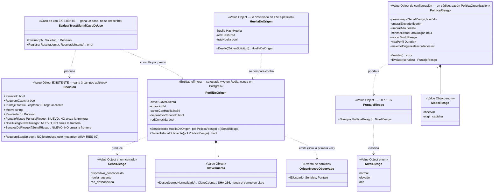

# Diseño — Reconocimiento de origen y señales de riesgo (device fingerprinting + comportamiento): tercera extensión del bounded context **Confianza**

> Estado: **diseño, sin implementar**. Autor: agente `arquitecto-ddd-hexagonal`.
> Fecha: 2026-09-07.
> Alcance: extiende **Confianza** con la capacidad de responder *"¿este intento viene de un origen que esta cuenta ya usó antes?"* y convertir esa respuesta en fricción graduada. **No es un bounded context nuevo** — ver §0.1, la primera decisión que este documento tiene que justificar, con el mismo criterio que ADR 0041.
> Depende de: **ADR 0002 (un solo producto/proceso — no se reabre)**, ADR 0004 (nombres de tablas), **ADR 0005 (auditoría hash-chained — este diseño se apoya en que `auditoria.huella_dispositivo` ya existe)**, ADR 0007 (español en dominio/aplicación/puertos), **ADR 0009 (Identidad autentica, no bloquea por razones ajenas a la credencial — no se reabre)**, ADR 0017 (privilegios explícitos), **ADR 0018 (Confianza + Redis, rate limiting/captcha — no se reabre; este diseño construye encima y reutiliza su `Decision`)**, ADR 0037/0038/0039 (MFA y token de step-up — determinan lo que este diseño **no** puede hacer, §3.2), **ADR 0041 (criterio "extender antes que crear")**, ADR 0044 (precedente de modo degradado), y las suyas propias, **ADR 0047–0051** (§9).
> Consumidores: **Identidad** (`POST /identidad/autenticaciones`, vía el ACL `identidad/adaptadores/confianza` que ya existe). Ningún otro contexto cambia. Ningún endpoint HTTP nuevo.
>
> **Nombre del archivo**: `fingerprinting-comportamiento.md`, para que coincida con la ficha del agente homónimo y con el vocabulario del encargo original. Dentro del código, en cambio, el concepto **no** se llama "fingerprinting" ni "comportamiento": se llama **reconocimiento de origen** (`PerfilDeOrigen`, `HuellaDeOrigen`, `SenalRiesgo`), por dos motivos. Primero, ADR 0007 (español en dominio/aplicación/puertos). Segundo y más importante: "análisis de comportamiento" describe una ambición que el MVP de este documento **no cumple** y no debería fingir que cumple (§0.3). Mismo precedente que `colas-virtuales.md`, cuyo agregado se llama `SalaDeEspera` y no `Cola`.
>
> **Advertencia de alcance, arriba de todo porque es la conclusión principal**: al investigar el código real, el alcance defendible de este MVP resultó ser **mucho más chico** que el de la ficha del agente y también más chico que el de `colas-virtuales.md`. No hay agregado nuevo, no hay tabla nueva, no hay endpoint nuevo, no hay worker, no hay cola de mensajería, no hay caso de uso nuevo en el camino de autenticación y no hay dependencia de terceros. Hay **un puerto de salida, tres value objects, una función pura, un `HMGET` y tres campos aditivos en structs que ya existen**. Eso es deliberado y está argumentado en §0.3, §2 y §5: el hueco real que el código dejó abierto es pequeño y muy preciso, y llenarlo bien vale más que construir el sistema de scoring continuo que el producto todavía no puede alimentar con datos.

---

## 0. Punto de partida — lo que YA existe y no se reabre

### 0.1 Encuadre: ¿tercera extensión de Confianza, contexto nuevo, o esto en realidad es de Identidad/Acceso?

**Decisión: vive en `internal/confianza/`.** La pregunta hay que hacerla en serio porque, a diferencia de las colas virtuales, acá hay dos candidatos alternativos que no son "un contexto nuevo" sino **dos contextos que ya existen y que ya tocan este dato**.

**A favor de Confianza (el argumento que gana):**

1. **La carta del contexto lo nombra literalmente, y con estas dos palabras exactas.** La definición de Confianza en el proyecto es *"rate limiting, **fingerprinting**, **análisis de comportamiento**, captcha, colas virtuales (todo lo que decide '¿confío en este request?')"*. ADR 0041 usó ese mismo argumento para las colas y lo aceptó. Reabrirlo acá sería incoherente.
2. **El puerto de entrada ya existe y ya se llama así.** `confianza/puertos.EvaluadorDeRiesgo` está montado, consumido por Identidad, Acceso y Tenencia, y hoy **no evalúa ningún riesgo**: es un limitador de tasa con un nombre grande. Esta extensión es lo que finalmente hace que el nombre del puerto sea cierto. **No agrega ni un solo puerto de entrada** — dato que conviene comparar con las colas virtuales, que agregaron tres (`PorteroDeSala`, `GestorDeSalasDeEspera`, `ConsultorDeSalas`).
3. **Los campos de salida ya existen, ya están cableados de punta a punta, y nadie los produce.** `confianza/dominio.Decision.RequiereStepUp` y `.RequiereCaptcha` se traducen en los tres ACL (`identidad/adaptadores/confianza/evaluador_confianza_real.go` línea 50, `acceso/adaptadores/confianza/evaluador_confianza.go` línea 63), llegan a `identidad/puertos.DecisionConfianza`, y `identidad/aplicacion/autenticar_usuario.go` calcula con ellos `requiereSegundoFactor := usuario.tieneMFA || decision.RequiereStepUp`, con `MotivoStepUp = "confianza_baja"` y su test dedicado (`TestAutenticarUsuarioCasoDeUso_SegundoFactor_PorConfianzaBaja`). **Ese camino está construido, probado, y hoy es inalcanzable**: `EvaluarTrustSignalCasoDeUso` nunca escribe `RequiereStepUp: true`. Este diseño es el que lo alcanza — con una salvedad grande y necesaria que se resuelve en §3.2.
4. **El VO de entrada ya está en `confianza/dominio`.** `OrigenSolicitud.HuellaDispositivo()` existe en `internal/confianza/dominio/origen_solicitud.go`, poblado por `middleware_origen.go` desde la cabecera `X-Device-Fingerprint`. No hay que inventar el transporte: hay que dejar de tirar el dato.

**El argumento en contra que hay que responder, porque es real: ¿no es esto de Acceso?**

`sesiones.huella_dispositivo` **ya existe como columna en Postgres** (migración `000006`), poblada en cada login exitoso, y el diseño de Acceso ya tiene `ListarSesiones` con la pantalla de *"dispositivos conectados"* y un caso de uso aplazado llamado literalmente **`RecordarDispositivo`** (§3 de `acceso-bounded-context.md`). Alguien podría concluir, con razones, que "los dispositivos de un usuario" son un concepto de Acceso.

**No gana, y la frontera se traza así:**

| | "Dispositivos conectados" (Acceso, ya diseñado) | "Origen conocido" (este documento, Confianza) |
|---|---|---|
| Qué es | una **sesión viva** que el usuario puede ver y cerrar | un **hecho de perímetro**: "esta cuenta ya autenticó con éxito desde acá antes" |
| Quién lo lee | el propio usuario, en su pantalla de seguridad | nadie: es interno, nunca sale del proceso (INV-RIES-09) |
| Cuándo existe | solo si el login **tuvo éxito y emitió sesión** | también hace falta saberlo **antes** de emitir nada, en el instante de evaluar |
| Ciclo de vida | muere al cerrar la sesión o al expirar (ADR 0019) | sobrevive a la sesión: la gracia es que dure meses |
| Dónde vive | `sesiones`, Postgres, fuente de verdad de Acceso | índice derivado en Redis + evidencia en `auditoria` (§5) |

Y el argumento decisivo: **la evaluación ocurre antes de que exista sesión y antes de resolver el usuario** (INV-ID-12: Confianza se evalúa antes de tocar Postgres). Un mecanismo que necesita responder *antes* de autenticar no puede tener su fuente de verdad en una tabla que solo se escribe *después* de autenticar. Consultar `sesiones` desde Confianza además rompería la frontera hexagonal en la dirección más cara (Confianza leyendo la tabla de otro contexto, justo lo que la regla dura del rol prohíbe).

**¿Y de Identidad?** No: ADR 0009 es explícito en que Identidad autentica al usuario y no toma decisiones de perímetro. Un `usuario.dispositivosConocidos` dentro del agregado `Usuario` metería una preocupación de perímetro dentro del agregado de credenciales, y obligaría a cargar el agregado para evaluar — exactamente el trabajo caro que la evaluación previa existe para evitar.

**¿Y un contexto nuevo ("Riesgo")?** Aquí el contraargumento de ADR 0041 es todavía más fuerte que para las colas: aquello al menos traía un agregado con ciclo de vida, una tabla y una bitácora propia. Esto **no trae ninguna de las tres**. Un contexto nuevo tendría que redeclarar `OrigenSolicitud`, `Decision`, `Accion` y `Umbral`, montar su propio adaptador sobre el mismo Redis y su propio ACL hacia los mismos tres consumidores… para alojar una función pura y un `HMGET`. Ver *ADR candidato 0047*.

### 0.2 La frontera con lo que Confianza ya hace, escrita para que nadie la borre

| | Rate limiting (ADR 0018) | Sala de espera (ADR 0041) | **Reconocimiento de origen (este documento)** |
|---|---|---|---|
| Pregunta | ¿este cliente está abusando? | ¿hay capacidad agregada ahora? | **¿este intento se parece a los intentos que esta cuenta ya hizo?** |
| Qué mira | volumen por clave | longitud de una cola | **la historia de orígenes exitosos de una cuenta** |
| Desenlace | rechazo `429` | espera con turno, `503` | **fricción: un captcha que el usuario puede resolver en el mismo intento** |
| Corre | siempre | solo con sala abierta (opt-in) | **solo en `login`, y por defecto solo observa (§3.3)** |
| Estado | contadores, TTL de minutos | cola FIFO, TTL de horas | **conjunto acotado de hashes, TTL de meses** |
| Si el motor falla | fail-open (ADR 0018) | fail-open, conmutable (ADR 0044) | **fail-open, NO conmutable (INV-RIES-03)** |
| Puertos de entrada que agrega | 1 | 3 | **0** |
| Tablas que agrega | 0 | 1 | **0** |

**Consecuencia normativa (INV-RIES-01)**: el reconocimiento de origen **nunca sustituye ni relaja** un control existente. Solo puede *agregar* una exigencia (un captcha) sobre un intento que los demás controles ya iban a permitir. Es el análogo de INV-COLA-02 llevado a este mecanismo, con la dirección invertida: la sala solo puede retrasar, esto solo puede exigir.

### 0.3 La ficha del agente `fingerprinting-comportamiento` está desactualizada: qué se descarta y por qué

`.claude/agents/06-fingerprinting-comportamiento.md` es intención aproximada, no especificación. Se descarta punto por punto, con el mismo tratamiento que `colas-virtuales.md` dio a su ficha:

| Lo que dice la ficha | Veredicto | Motivo |
|---|---|---|
| *"dentro del contexto **Trust**"*, *"se comparte con el contexto **Audit**"*, `BehaviorAnalyzer`, `RecordEvent`, `CurrentRiskScore`, identificadores en inglés | **Se traduce** | Los contextos se llaman **Confianza** y **Auditoría**. ADR 0007: dominio/aplicación/puertos en español. El vocabulario real de este diseño está en §1. |
| *"`user_id` + **`tenant_id`** como dispositivo conocido"* | **Se elimina el `tenant_id`** | ADR 0002 y ADR 0009: la credencial es global y en el login **no hay organización resoluble** — es exactamente la misma corrección que ADR 0045 tuvo que hacerle a la ficha de colas. El "tenant" real son las organizaciones de Tenencia, y no participan de esto. |
| *"librería tipo **FingerprintJS** generando un `visitor_id`"* | **Se descarta para el MVP** | El sistema **ya recibe** una huella por `X-Device-Fingerprint` (`middleware_origen.go` de los cuatro contextos) y ya la persiste en `auditoria.huella_dispositivo` y en `sesiones.huella_dispositivo`. Hoy nadie la usa: el hueco no es *conseguir* una huella, es *aprovechar la que ya llega*. Adoptar una librería cliente (con su versión Pro de pago, su superficie de privacidad y su acoplamiento del backend a un formato de terceros) para resolver un problema cuyo insumo ya está en el `context.Context` sería construir la parte cara antes que la barata. **Qué implica aceptar esto, dicho sin adornos**: la huella es un dato del cliente y por lo tanto **falsificable** — el diseño lo asume como premisa (INV-RIES-06), no lo esconde, y por eso la huella *nunca autoriza* y por eso existe la señal `huella_ausente` (§1.4). |
| *"TLS fingerprint (JA3/JA4) si el proxy lo expone"* | **Backlog, sin puerto** | Hoy no hay proxy/gateway que lo exponga en este despliegue. Cuando lo haya, entra como una `SenalRiesgo` más sin tocar nada del modelo. |
| *"worker separado que consume de una cola (**Redis Streams o NATS**)"* | **Se descarta, y ni siquiera se reemplaza por una goroutine** | Dos razones. La infraestructural: ADR 0002 fija un solo producto y un solo proceso con Postgres+Redis; introducir un broker de mensajería nuevo para esto es el mismo error que ADR 0018 evitó al no meter los contadores en Postgres, pero al revés. La de fondo, y más importante: **el análisis que este MVP puede hacer de verdad son lecturas O(1), no correlación** — no hay nada pesado que diferir (§2.1). Ni siquiera hace falta el `time.Ticker` que el reconciliador de colas sí necesita, porque no hay estado que reconciliar entre Postgres y Redis: no hay tabla. El día que exista geovelocidad (§2.3), la goroutine con `Ticker` es el patrón a copiar — el broker sigue sin serlo. Ver *ADR candidato 0050*. |
| *"score que se re-evalúa continuamente, no solo en login"* | **Se recorta a `login`** | "Continuamente" exige un disparador continuo, y el único que existiría es el que se acaba de descartar. Además, las acciones sensibles post-login (invitar en masa, cambiar roles) **ya tienen su freno**: `invitar_miembro` 20/hora, `crear_organizacion` 5/hora, etc. en `PoliticaLimitesPorDefecto`. Duplicar eso con un score paralelo sería agregar un segundo mecanismo para un problema ya resuelto por ADR 0018. |
| *"velocidad de tecleo / interacción del formulario"* | **Descartado** | Exige instrumentación del frontend, es el dato más invasivo de toda la lista y el de peor relación señal/ruido. La propia ficha pedía evaluar costo/beneficio antes de implementarlo; evaluado: no. |
| *"cifrado en reposo"* de los datos de fingerprinting | **Se resuelve mejor: no guardar el dato** | El MVP no persiste ninguna huella nueva en claro. En Redis van solo hashes SHA-256 truncados; el histórico legible es `auditoria`, cuyo régimen ya lo fija ADR 0005 y este documento no lo reabre (§6). |
| *"Habeas Data / Ley 1581 de Colombia si aplica"* | **Fuera de alcance, y no se inventa** | Se revisó `docs/adr/` entero: **ninguno de los ADR aceptados (0001–0046, 26 documentos) fija jurisdicción, marco de cumplimiento ni política de retención de datos personales**. Afirmar que aplica la Ley 1581 sería inventar una decisión de producto que nadie tomó. Queda como nota explícita en §6.3, redactada como "esto es lo que habría que decidir", no como "esto es lo que decidimos". |

### 0.4 Lo que el código cerrado YA hace y este diseño reutiliza sin tocar

- **`confianza/dominio.OrigenSolicitud.HuellaDispositivo()`** y **`.IP()`** (con `DireccionIP` ya validada y con `EsPrivada()`): el insumo completo, ya en el lenguaje del contexto.
- **`identidad|acceso|tenencia/puertos.ResultadoIntento`**: los tres **ya transportan `Origen` (con la huella) y el `UsuarioID`/`IDUsuario` resuelto**. El único que los descarta es `confianza/puertos.ResultadoIntento`, que hoy solo lleva `{Accion, IPOrigen, CorreoNormalizado, Exitoso}`. El eslabón que falta son **dos campos aditivos y dos líneas en cada ACL** (§8).
- **`EvaluarTrustSignalCasoDeUso.RegistrarResultado`**: se invoca con `Exitoso=true` **después** de la transacción de login (`autenticar_usuario.go` línea 204) y con `Exitoso=false` en el camino de fallo (línea 238), en ambos casos **best-effort** (el error solo se loguea). Es, literalmente, el gancho asíncrono-de-facto que la ficha pedía construir con una cola: el punto exacto del flujo donde ya se sabe si el intento fue legítimo y donde un fallo no tumba nada.
- **`internal/plataforma/cache.NuevoClienteRedis`**: el mismo cliente compartido. No se abre conexión nueva.
- **`confianza/adaptadores/redis/limitador_tasa.go`**: el precedente de "script Lua para que leer-decidir-escribir sea atómico", con su tensión de aritmética duplicada. Este diseño lo copia **una sola vez** (§5.2) y en el camino frío, no en el caliente.
- **`confianza/adaptadores/auditoria/`**: el ACL hacia la bitácora, que ya cae al pool cuando no hay transacción en el contexto (`registro_auditoria.go`, `ejecutor(ctx)`) — precisamente el caso de `RegistrarResultado`, que corre fuera de transacción.
- **`tenencia/dominio/politica_organizacion.go`**: el patrón "política ajustable en código, defaults validados por constructor, sin configuración dinámica". `PoliticaRiesgo` (§1.5) lo sigue al pie de la letra, y a diferencia de `PoliticaSala` **no** necesita la excepción de "el valor vigente tiene que sobrevivir a un reinicio": acá no hay evento operativo que ajustar en caliente.

---

## 1. Modelo de dominio

### 1.1 La decisión que ordena todo lo demás: qué se puede detectar HOY, sin dependencias nuevas

La pregunta no es "qué señales existen en la literatura", es "qué señales puede calcular este proceso, con este esquema, sin agregar nada". La respuesta honesta es corta:

| Señal candidata | ¿Detectable hoy? | Veredicto |
|---|---|---|
| La cuenta autentica desde una **huella de dispositivo** que nunca le vi | **Sí**. `X-Device-Fingerprint` ya llega; solo falta recordar cuáles vio | **MVP — `dispositivo_desconocido`** |
| La cuenta **deja de mandar** la huella, habiéndola mandado siempre | **Sí**. Es un booleano derivado del mismo perfil | **MVP — `huella_ausente`**. Es la señal que hace que omitir la cabecera no sea una evasión gratis |
| La cuenta autentica desde un **prefijo de red** que nunca le vi (`/24` IPv4, `/48` IPv6) | **Sí**. `DireccionIP` ya es un VO del contexto; agrupar por prefijo es aritmética de bits, sin librería | **MVP — `red_desconocida`**, con peso bajo (§1.5): la IP móvil cambia todo el tiempo |
| **Geovelocidad imposible** (Bogotá y 10 min después Madrid) | **No sin agregar una dependencia**: exige una base GeoIP (MaxMind GeoLite2: ~70 MB, licencia con atribución y actualización periódica) o una API de pago | **Backlog con puerto nombrado** (`LocalizadorDeIP`, §2.3). Es la señal más valiosa de la lista y por eso merece su propio hito, no un renglón de este |
| **Horario inusual** vs. histórico | **No de forma barata**: exige un histograma por usuario (estado durable nuevo) y tiene pésima relación señal/ruido (turnos rotativos, viajes, insomnio) | **Backlog** |
| **Frecuencia anómala de acciones sensibles** (invitaciones masivas, cambios de rol) | **Ya resuelto** por ADR 0018: `invitar_miembro` 20/hora, `crear_organizacion` 5/hora, `cierre_masivo_sesiones` 3/15min | **Fuera de alcance por duplicación**, no por dificultad |
| **Renovación de sesión desde una huella distinta** a la que creó la sesión | **Sí, y es gratis**: `sesiones.huella_dispositivo` ya está en Postgres y `RenovarSesion` ya carga la sesión | **Backlog, y NO es de Confianza**: es una comparación entre dos campos del propio agregado `Sesion`. Pertenece a **Acceso** y no necesita nada de este diseño. Se anota acá para que a nadie se le ocurra resolverlo desde Confianza leyendo `sesiones` |
| **Un mismo dispositivo dando de alta muchas cuentas** (abuso de registro) | Detectable, pero exige el índice **inverso** (`dispositivo → cuentas`), otro espacio de claves y otra política | **Backlog con puerto nombrado** (§2.3) |
| **TLS/JA4, orden de cabeceras** | No: ningún componente del despliegue actual lo expone | Backlog |

**Conclusión, que es la que define el tamaño del documento**: de nueve señales, **tres** son alcanzables hoy con costo cero de infraestructura, **una** ya está resuelta por otro ADR, **una** pertenece a otro contexto y **cuatro** necesitan algo que el proyecto no tiene. Diseñar el motor de scoring continuo de la ficha para alimentarlo con tres booleanos sería construir un tablero para tres luces. Ver *ADR candidato 0048*.

### 1.2 Diagrama



**Nótese lo que NO hay en el diagrama**: ningún agregado raíz, ninguna máquina de estados, ninguna entidad con identidad durable. `PerfilDeOrigen` es una entidad efímera con lógica pura, exactamente en el sentido en que `TicketDeCola` lo es en las colas virtuales — pero sin siquiera un ciclo de vida que modelar.

### 1.3 Value objects

| VO | Constructor | Invariantes que garantiza |
|---|---|---|
| `ClaveCuenta` | `NuevaClaveCuenta(correoNormalizado)` | SHA-256 hex del correo ya normalizado por Identidad, truncado a 32 hex. **El correo en claro nunca entra a este subsistema** (INV-RIES-07). Nota deliberada: `confianza:rl:cuenta:login:<correo>` **sí** guarda el correo en claro hoy, con TTL de 15 minutos. No se replica ese trato acá porque este dato vive **meses**, no minutos, y esa diferencia de duración es exactamente lo que cambia el cálculo. |
| `HashHuella` | `HashearHuella(cruda string)` | SHA-256 hex truncado a 16 caracteres de la huella recibida, previa normalización (`TrimSpace`). Truncar a 64 bits es deliberado: alcanza de sobra para distinguir ~20 dispositivos por cuenta y acota el tamaño del hash de Redis. Devuelve el cero si la huella venía vacía. |
| `HashRed` | `HashearRed(DireccionIP)` | SHA-256 truncado del **prefijo** de red: `/24` para IPv4, `/48` para IPv6. Nunca la IP completa. Una IP privada o de loopback (`DireccionIP.EsPrivada()`, ya existe) produce el cero: en desarrollo y detrás de un proxy mal configurado, "todos vienen de 10.0.0.x" no es una señal, es ruido. |
| `HuellaDeOrigen` | `HuellaDeOrigenDesde(OrigenSolicitud)` | Agrupa `HashHuella`, `HashRed` y `traeHuella bool`. Es lo único que el dominio ve de la petición. |
| `SenalRiesgo` | catálogo cerrado (`SenalRiesgoDesde`) | Tres valores. Cerrado por el mismo motivo que `MotivoDenegacion` de Tenencia y `DesenlaceDeAdmision` de las colas: sin catálogo cerrado no se puede responder "¿cuántos logins de la semana pasada dispararon `huella_ausente`?" sin parsear texto libre. |
| `PuntajeRiesgo` | `NuevoPuntajeRiesgo(float64)` | `∈ [0.0, 1.0]`. Se satura en 1.0 en vez de fallar: la suma ponderada puede pasarse y un error de dominio en el camino caliente por un redondeo sería absurdo. |
| `NivelRiesgo` | derivado, `puntaje.Nivel(politica)` | `normal` \| `elevado` \| `alto`. **Deriva por dos umbrales, misma forma exacta que `EvaluarPuntajeCaptcha`** (`UmbralPuntajeAceptable=0.5` / `UmbralPuntajeSospechoso=0.3`, `confianza/dominio/captcha.go`) — se copia la forma a propósito, para que el contexto tenga un solo idioma de "puntaje con dos umbrales" y no dos. |
| `PoliticaRiesgo` | `NuevaPoliticaRiesgo(...)` / `PoliticaRiesgoPorDefecto()` | Ver §1.5. Mismo patrón exacto que `PoliticaOrganizacion` y `PoliticaSala`. |
| `ModoRiesgo` | `ModoRiesgoDesde(string)` | `observar` (default) \| `exigir_captcha`. Ver §3.3. |

### 1.4 `PerfilDeOrigen.Senales`: la función pura que es todo el "análisis"

```
Senales(obs, politica):
    si NO TieneHistorialSuficiente(politica):        → []            (INV-RIES-04)
    señales := []
    si obs.traeHuella:
        si NO dispositivoConocido:   señales += dispositivo_desconocido
    si NO obs.traeHuella Y exitosConHuella ≥ politica.MinimoExitosParaJuzgar:
                                     señales += huella_ausente
    si obs.red != cero Y NO redConocida:
                                     señales += red_desconocida
    return señales
```

Tres decisiones dentro de estas seis líneas que no son obvias:

1. **Sin historial, cero señales.** Una cuenta recién registrada no tiene con qué compararse. Penalizar el primer login sería penalizar a todo usuario nuevo del producto — el falso positivo más caro que existe, porque cae sobre el momento de mayor abandono. `minimoExitosParaJuzgar = 3` por defecto.
2. **`huella_ausente` mira `exitosConHuella`, no `exitos`.** Si el frontend nunca mandó la cabecera, la ausencia no significa nada; si la mandó tres veces y ahora no, alguien está usando un cliente distinto del habitual. Esta señal es la que impide que la evasión trivial ("no mandes el header") sea gratis, y es la razón por la que INV-RIES-06 puede decir "la huella es falsificable" sin que el mecanismo se vuelva decorativo.
3. **`dispositivo_desconocido` no se emite si la petición no trae huella.** Sería contarle dos veces la misma ausencia. Las señales tienen que ser independientes o los pesos mienten.

### 1.5 `PoliticaRiesgo`: valores por defecto y por qué

Vive en código, con constructor validado, ajustable sin migración — mismo criterio que `PoliticaOrganizacion` (ADR 0029 lo justificó para roles: *"sin RBAC configurable en el MVP"*) y `PoliticaLimites` (ADR 0018: *"no calibrados contra tráfico real"*). Este documento no reabre esa preferencia; la aplica.

| Parámetro | Default | Justificación |
|---|---|---|
| peso `dispositivo_desconocido` | **0.40** | La señal principal. Por sí sola **no alcanza** para escalar: limpiar cookies o cambiar de navegador es cotidiano y no puede costar un captcha. |
| peso `huella_ausente` | **0.40** | Mismo peso: es la evasión de la anterior, y tiene que costar lo mismo o más de lo que ahorra. |
| peso `red_desconocida` | **0.25** | Bajo a propósito. Una IP móvil cambia de `/24` varias veces por día; sola no debe significar nada. |
| `umbralElevado` | **0.50** | Con estos pesos, **hacen falta dos señales** para llegar a `elevado` (0.40 + 0.25 = 0.65). "Dispositivo nuevo desde una red que ya conozco" (0.40) sigue siendo `normal`: el caso del usuario que estrena laptop en su casa. |
| `umbralAlto` | **0.80** | Solo alcanzable con las dos señales de huella juntas… que son mutuamente excluyentes por construcción (§1.4). **Es decir: `alto` es inalcanzable con las tres señales del MVP, y eso es correcto** — la banda existe para cuando entre `geovelocidad_imposible` (peso previsto 0.6), y dejarla declarada evita que agregar esa señal obligue a renumerar umbrales. Se documenta acá para que nadie la "arregle" bajándola. |
| `minimoExitosParaJuzgar` | **3** | Ver §1.4. |
| `vidaPerfil` | **180 días** | Un perfil que caduca en semanas convierte a todo usuario ocasional en sospechoso permanente. Medio año es más largo que cualquier ciclo de uso razonable y más corto que "para siempre" (§6.2). |
| `maximoOrigenesRecordados` | **20 dispositivos + 20 redes** | Ver INV-RIES-11: es un techo de memoria y de retención, no de seguridad. |
| `modo` | **`observar`** | Ver §3.3 e INV-RIES-14. Desplegar esto no cambia el desenlace de ningún login hasta que alguien lo decida explícitamente. |

**Estos números no están calibrados contra tráfico real** — el producto no lo tiene (ADR 0002), exactamente igual que los umbrales de ADR 0018 y el ritmo por defecto de ADR 0043. La diferencia con aquellos es que acá el modo por defecto es no actuar, así que el costo de que estén mal es cero hasta que haya datos para corregirlos. Esa es, de hecho, la razón principal para que `observar` sea el default: **el modo observación es el instrumento de calibración**, no un placeholder.

### 1.6 Evento de dominio (uno solo)

| Evento | Acción de auditoría | Resultado | Cuándo | `detalles` |
|---|---|---|---|---|
| `OrigenNuevoObservado` | `origen.nuevo` | `exito` | Tras un login **exitoso** en el que la huella de dispositivo no estaba en el perfil, y **solo si la cuenta ya tenía al menos un origen conocido** | `{senales: [...], puntaje: 0.65, nivel: "elevado", modo: "observar", origenes_conocidos: 3}` |

**Por qué exactamente uno, y por qué ese**:

- **No se audita cada evaluación.** Es el camino más caliente del sistema después del de las colas, y ADR 0005 serializa toda la cadena de auditoría bajo un advisory lock. Auditar cada login duplicaría filas por el mismo hecho que `usuario.login` ya registra. Tercera aplicación del razonamiento de INV-TEN-25 / INV-COLA-11.
- **No se audita la denegación por riesgo.** Ya la audita Identidad: ADR 0018 dejó fijado que *"los motivos de denegación fluyen como `Motivo` dentro de las acciones ya existentes (`usuario.login`/`denegado`)"*. Este diseño agrega motivos nuevos a ese campo (§3.3), no acciones nuevas.
- **Sí se audita el origen nuevo**, porque es un hecho **raro** (una vez por par cuenta-dispositivo), tiene `usuario_id` resuelto, ocurre fuera de transacción (best-effort, no puede tumbar el login) y es exactamente la línea que un respondedor de incidentes busca primero: *"¿desde qué dispositivo nuevo entró esta cuenta el martes?"*. La condición "solo si ya había al menos un origen conocido" evita una fila inútil en el primer login de cada usuario.
- Ningún evento transporta la huella cruda ni su hash: solo códigos del catálogo cerrado y enteros (INV-RIES-12).

### 1.7 Errores de dominio

Muy pocos, porque casi nada puede fallar:

| Error | Cuándo | Efecto |
|---|---|---|
| `ErrPoliticaRiesgoInvalida` | constructor de `PoliticaRiesgo` (pesos fuera de `[0,1]`, `umbralElevado ≥ umbralAlto`, `vidaPerfil` fuera de `[7d, 2 años]`, `maximoOrigenesRecordados` fuera de `[1, 100]`) | **Falla al arrancar**, nunca en runtime: la política se construye una vez en `main.go`. Mismo trato que `PoliticaOrganizacionPorDefecto`, que hace `panic` si su propio default es inválido, cubierto por un test de dominio. |
| `ErrSenalRiesgoDesconocida` | `SenalRiesgoDesde` con un valor fuera del catálogo | Solo alcanzable desde un test o una deserialización futura. |

**No hay error para "no se pudo consultar el perfil".** Eso no es un error de dominio: es el caso fail-open de INV-RIES-03, y se resuelve en aplicación devolviendo cero señales.

---

## 2. Puertos

### 2.1 Puertos de entrada: **ninguno nuevo**

`confianza/puertos.EvaluadorDeRiesgo` ya es el puerto correcto y no cambia de firma. Lo que cambia es el contenido de sus dos DTOs, de forma **aditiva** (§8):

```go
// confianza/puertos/entrada.go — AMBOS structs ya existen; los campos son nuevos.

type Solicitud struct {
    Accion            dominio.Accion
    IPOrigen          string
    CorreoNormalizado string
    TokenCaptcha      string
    TenantID          string

    // NUEVO. Valor crudo de la cabecera X-Device-Fingerprint, tal como lo
    // recibió el borde HTTP del contexto llamador. Vacío si el cliente no la
    // envió — y ese vacío es en sí mismo una señal (§1.4), así que NO puede
    // colapsarse con "no aplica".
    HuellaDispositivo string
}

type ResultadoIntento struct {
    Accion            dominio.Accion
    IPOrigen          string
    CorreoNormalizado string
    Exitoso           bool

    // NUEVOS. Los tres ACL ya tienen estos datos y hoy los descartan al
    // traducir (identidad/puertos.ResultadoIntento ya lleva Origen y
    // UsuarioID; acceso y tenencia llevan Origen e IDUsuario).
    HuellaDispositivo string
    IDUsuario         string // "" si no se resolvió (login con correo inexistente)
    IDSolicitud       string // correlación forense; solo se usa al auditar
}
```

**Por qué primitivos y no `dominio.OrigenSolicitud`**: `Solicitud` ya declara en su comentario que *"IP y TenantID viajan como primitivos propios en vez de depender del VO `dominio.OrigenSolicitud` de Identidad"*. Se respeta esa convención sin discutirla. El caso de uso reconstruye el VO con `dominio.NuevoOrigenSolicitud(IPOrigen, "", HuellaDispositivo, IDSolicitud)` cuando necesita auditar — el `AgenteUsuario` va vacío a propósito: la tabla `auditoria` no tiene columna para él y este diseño no lo usa como señal.

### 2.2 Puerto de salida (uno solo, nuevo)

```go
// confianza/puertos/salida.go — extensión aditiva.

// PerfilDeOrigenes es el puerto sobre el índice derivado de orígenes
// conocidos por cuenta. La implementación real (adaptadores/redis/
// perfil_origenes.go) es un HASH por cuenta: una lectura de 4 campos en el
// camino caliente (HMGET) y un script Lua en el camino de escritura, para
// que "agregar el origen, podar el excedente y refrescar el TTL" sea
// atómico — mismo criterio y mismo motivo que scriptPermitir del limitador
// (ADR 0018).
//
// Este puerto NO es una fuente de verdad: es un índice reconstruible
// (INV-RIES-08). Cualquier implementación que satisfaga el contrato
// (incluida una en memoria para tests) es intercambiable sin tocar
// aplicacion. Un adaptador nil es legítimo y significa "la extensión está
// apagada" (§8, mismo criterio que el `confianza` nil de ManejadorIdentidad
// en ADR 0018).
type PerfilDeOrigenes interface {
    // Consultar responde, en UNA operación de Redis, todo lo que
    // PerfilDeOrigen necesita para producir sus señales. Recibe los hashes
    // ya calculados por el dominio: este puerto no sabe qué es una huella
    // ni una IP.
    Consultar(ctx context.Context, q ConsultaPerfilOrigen) (VistaPerfilOrigen, error)

    // Registrar promueve un origen a "conocido". Se invoca EXCLUSIVAMENTE
    // desde RegistrarResultado con Exitoso=true (INV-RIES-05). Es
    // idempotente y poda el perfil al techo de la política.
    Registrar(ctx context.Context, cmd RegistrarOrigenObservado) error

    // Olvidar borra el perfil completo de una cuenta. Ver §6.2: en el MVP el
    // único olvido automático es el TTL; este método existe para el
    // subcomando de operaciones y para el futuro gancho de
    // usuario.anonimizado.
    Olvidar(ctx context.Context, clave string) error
}

type ConsultaPerfilOrigen struct {
    Clave       string // dominio.ClaveCuenta.String()
    HashHuella  string // "" si la petición no trae huella
    HashRed     string // "" si la IP es privada, de loopback o ausente
}

type VistaPerfilOrigen struct {
    Exitos              int64
    ExitosConHuella     int64
    DispositivoConocido bool
    RedConocida         bool
    OrigenesConocidos   int // para los detalles de auditoría (§1.6)
}

type RegistrarOrigenObservado struct {
    Clave                    string
    HashHuella               string
    HashRed                  string
    VidaPerfil               time.Duration
    MaximoOrigenesRecordados int
}
```

**Lo que este puerto deliberadamente NO tiene:**

- **No tiene `Puntuar` ni `CurrentRiskScore`.** El puntaje lo calcula el dominio a partir de la vista, como función pura. Un puerto que devuelve un `float64` ya decidido pondría la regla de negocio en el adaptador — el error que la firma ilustrativa de la ficha (`BehaviorAnalyzer.CurrentRiskScore`) inducía.
- **No tiene `RecordEvent` genérico.** Un "evento de comportamiento" sin forma es un `map[string]any` disfrazado; lo que se registra es exactamente un origen observado en un intento exitoso, con nombre propio.
- **No hay repositorio Postgres, ni unidad de trabajo, ni generador de IDs.** No hay agregado que persistir. Confianza ya ganó esos tres puertos con las colas virtuales y esta extensión no los usa (salvo `RegistroAuditoria` y `Reloj`, que reutiliza tal cual).

### 2.3 Puertos aplazados (nombrados para que nadie los reinvente con otro nombre)

- **`LocalizadorDeIP`** — `Localizar(ctx, ip) (pais, ciudad string, lat, lon float64, err error)`. Habilita `geovelocidad_imposible`, la señal más valiosa que quedó afuera (§1.1). Su hito debe decidir la dependencia (MaxMind GeoLite2 embebida vs. API), la actualización de la base y el manejo de VPN/CGNAT — nada de eso cabe en este documento.
- **`PerfilDeDispositivos`** — el índice **inverso** (`dispositivo → cuentas`), para detectar un dispositivo que da de alta muchas cuentas. Espacio de claves distinto, política distinta, acción `registro` en vez de `login`.
- **`HistogramaHorario`** — la señal de horario inusual, si alguna vez el producto tiene el volumen que la haga significativa.
- **`NotificadorDeOrigenNuevo`** — avisar por correo "entraste desde un dispositivo nuevo". Es probablemente **más valioso para el usuario que el captcha**, y depende de un `NotificadorCorreo` real (hoy `NotificadorCorreoLog`). Se nombra acá porque es el siguiente paso natural, no porque este diseño lo incluya.

---

## 3. Casos de uso

**Esta extensión no agrega ningún caso de uso al camino de autenticación.** Agrega un paso a uno existente y un uso nuevo a otro existente. Eso es una propiedad, no una carencia: significa que quitar la inyección del puerto la desactiva por completo.

### 3.1 `EvaluarTrustSignal` — el paso 2.5 (nuevo) dentro del caso de uso existente

El orden normativo de `EvaluarTrustSignalCasoDeUso.Evaluar` hoy es: (1) captcha si vino, (2) límite por IP, (3) límite por cuenta, (4) gate final de puntaje. **Se inserta un paso 2.5, entre el límite por IP y el límite por cuenta**, y solo para `AccionLogin`:

1. *(sin cambios)* verificar captcha si vino.
2. *(sin cambios)* límite por IP — bloqueo duro.
2. **`if s.Accion == dominio.AccionLogin && c.perfiles != nil && s.CorreoNormalizado != ""`:**
   a. `clave := dominio.NuevaClaveCuenta(s.CorreoNormalizado)`; `obs := dominio.HuellaDeOrigenDesde(...)`.
   b. `vista, err := c.perfiles.Consultar(ctx, ...)` — **una** operación de Redis.
      Si `err != nil`: `slog.Warn`, cero señales, **continuar** (INV-RIES-03). No se propaga.
   c. `senales := perfil.Senales(obs, c.politicaRiesgo)`; `puntaje := c.politicaRiesgo.Evaluar(senales)`; `nivel := puntaje.Nivel(...)`.
   d. Poblar `PuntajeRiesgo`/`NivelRiesgo`/`SenalesDeRiesgo` en la `Decision` que se va a devolver **en cualquier caso** (también cuando se permite: son el insumo de las métricas y del modo observación).
   e. Si `modo == exigir_captcha && nivel >= elevado && !huboToken`: devolver `Decision{Permitido: false, RequiereCaptcha: true, Motivo: "riesgo_de_origen_requiere_captcha", ...}`.
      Si `modo == exigir_captcha && nivel >= elevado && huboToken && puntajeCaptchaAceptable`: **dejar pasar** — el humano ya se acreditó en este mismo intento. Es la misma lógica de bypass que el paso 3 ya aplica al límite por cuenta, reutilizada tal cual.
      Si `modo == observar`: no cambiar el desenlace; `slog.Info` con las señales y contador de métrica.
3. *(sin cambios)* límite por cuenta.
4. *(sin cambios)* gate final de puntaje.

**Por qué el paso va ahí y no antes ni después:**

- **Después del límite por IP**, porque el límite por IP es el filtro más barato y más contundente: un flood no debe llegar a consumir una lectura de Redis extra por intento.
- **Antes del límite por cuenta**, porque los dos pueden terminar exigiendo captcha y hay que decidir con qué motivo se lo exige. Si el origen es riesgoso, ese es el motivo más informativo para el dashboard; el cooldown de cuenta es una consecuencia posterior.
- **Nunca después del paso 4**, porque el gate final ya puede haber denegado y volver a evaluar sería trabajo tirado.

**Costo del paso cuando está apagado** (`perfiles == nil`, que es el estado por defecto sin `REDIS_URL`): una comparación de puntero. **Costo cuando está encendido**: un `HMGET` de cuatro campos, solo en `login`.

### 3.2 El hueco que este diseño DESCUBRE y decide NO abrir: `RequiereStepUp` bloquea a quien no tiene MFA

Éste es el hallazgo más importante de la investigación y merece su propia sección, porque la respuesta ingenua a "¿qué hacemos con el riesgo alto?" es *"exigimos segundo factor, para eso está `Decision.RequiereStepUp`"* — y hoy eso **deja al usuario encerrado afuera**.

La cadena, verificada en el código:

1. `Decision.RequiereStepUp` → los tres ACL lo traducen → `identidad/puertos.DecisionConfianza.RequiereStepUp`.
2. `identidad/aplicacion/autenticar_usuario.go`: `requiereSegundoFactor := usuario.tieneMFA || decision.RequiereStepUp`, con `MotivoStepUp = "confianza_baja"` cuando el usuario **no** tiene MFA propio.
3. `acceso/aplicacion/iniciar_sesion.go`: no emite sesión; devuelve `ErrSegundoFactorRequerido` con un token de step-up de 5 minutos (ADR 0038).
4. El usuario llama `POST /acceso/sesiones/segundo-factor` con un código.
5. `acceso/aplicacion/completar_segundo_factor.go` → `VerificadorOTP.Verificar` → `identidad/aplicacion/verificar_otp.go`:

```go
factores, err := c.factoresMFA.BuscarConfirmadosDeUsuario(ctx, idUsuario)
...
if len(factores) == 0 {
    // INV-MFA-06: esto no debería poder pasar nunca (quien invoca este
    // puerto ya decidió que hacía falta un segundo factor).
    slog.ErrorContext(ctx, "VerificarOTP invocado sin ningún factor MFA confirmado: inconsistencia interna", ...)
    return false, nil
}
```

El comentario dice *"esto no debería poder pasar nunca"* — y es correcto **hoy**, porque nada produce `RequiereStepUp`. En el instante en que este diseño lo produjera para un usuario sin MFA, ese `return false, nil` se convierte en un **bloqueo permanente**: el usuario recibe `ErrCredencialesRechazadas` (genérico por INV-MFA-08, así que ni siquiera sabe por qué), reintenta el login, vuelve a puntuar riesgoso porque su dispositivo sigue siendo nuevo, y entra en un bucle del que no puede salir por sí mismo. Peor: el mecanismo que existe para proteger la cuenta sería el que se la quita.

**Decisión: este mecanismo NO produce `RequiereStepUp` en el MVP** (INV-RIES-02). La única escalada posible es el captcha, que **cualquier usuario puede resolver en el mismo intento, sin nada preinscrito**. Se documenta explícitamente que:

- **Esto no es un descuido, es una precondición.** Habilitar riesgo → step-up exige antes cerrar el hueco, y hay al menos tres formas legítimas de hacerlo (un segundo factor por correo — `EmisorOTP` ya nombrado como backlog en ADR 0037; una comprobación de `tieneMFA` del lado de quien decide; o un modo "verificación de dispositivo por enlace de correo" que no es MFA). Elegir entre esas tres es un hito con su propio ADR, no un renglón de éste.
- **El hueco existe desde antes de este documento** — es una consecuencia latente de haber cableado `RequiereStepUp` en ADR 0018 y haber implementado MFA en ADR 0037 sin que nada los conectara. Este diseño lo documenta y se abstiene de dispararlo; no lo introduce.
- **`Decision.RequiereStepUp` queda intacto.** No se elimina, no se deprecia, no se renombra. Sigue siendo el campo correcto para el día que exista un segundo factor universal.

Ver *ADR candidato 0051*.

### 3.3 ¿Bloquea el login? Modo `observar` por defecto, `exigir_captcha` por decisión explícita

Respuesta directa a la pregunta del encargo: **en el camino caliente, sí toca el login; en el desenlace, por defecto no lo cambia.**

**Cumplimiento de ADR 0009**: Identidad no cambia ni una línea de dominio ni de aplicación. La decisión la toma Confianza y viaja por el puerto que Identidad ya consume desde ADR 0018 — exactamente el mismo camino por el que hoy le llega un `limite_ip_excedido`. Identidad sigue "autenticando y no bloqueando por razones ajenas a la credencial": quien bloquea es el perímetro, como siempre.

**Cumplimiento de ADR 0018 (fail-open salvo justificación)**: fail-open, y a diferencia de la sala de espera (ADR 0044), **no conmutable**. La asimetría del contexto queda así, como cuarta entrada de la tabla que ADR 0018 empezó:

| Mecanismo | Ante fallo del motor | Conmutable | Por qué |
|---|---|---|---|
| Rate limiting | open | no | Una caída de Redis no puede tumbar login/registro (ADR 0018) |
| Captcha | **closed** | no | Un atacante no debe anular la verificación provocando errores (ADR 0018) |
| Sala de espera | open | **sí, por sala** | En un evento crítico, tumbar el backend cuesta más que rechazar tráfico (ADR 0044) |
| **Reconocimiento de origen** | **open** | **no** | La señal es **heurística**: el costo de un falso positivo lo paga un usuario legítimo que no puede entrar, y el beneficio de un verdadero positivo es solo *un captcha más*. Un fallo de caché jamás puede agregar fricción. No se ofrece conmutador porque no existe el escenario donde valga la pena — a diferencia de la sala, acá el mecanismo no protege capacidad, y "sin señal" no equivale a "sin defensa": el rate limiting y el captcha siguen corriendo |

**`observar` como default (INV-RIES-14)**, con dos motivos:

1. **Calibración.** Los pesos y umbrales de §1.5 son un punto de partida sin datos. El modo observación es el instrumento que produce esos datos: cuántos logins legítimos dispararían un captcha, con qué señales, en qué proporción. Encender `exigir_captcha` sin ese número es apostar la tasa de conversión del login a una intuición.
2. **Una dependencia operativa que hay que decir en voz alta.** ADR 0018 dejó fijado que, en producción **sin `TURNSTILE_SECRET_KEY`, el captcha es fail-closed**. Combinado con `exigir_captcha`, eso significa que un despliegue sin la llave de Cloudflare convertiría "dispositivo nuevo + red nueva" en un **bloqueo duro sin salida**. Por eso `exigir_captcha` es una decisión explícita y por eso su checklist incluye verificar la llave — mismo espíritu que la nota de ADR 0044 sobre decidir el `modoDegradado` al abrir una sala.

### 3.4 `RegistrarResultado` — la promoción del origen (paso nuevo en un método existente)

```
RegistrarResultado(ctx, r):
    (sin cambios) si r.Exitoso && r.CorreoNormalizado != "": limitador.Reiniciar(...)

    NUEVO, solo si r.Accion == login && r.Exitoso && perfiles != nil && r.CorreoNormalizado != "":
        clave := NuevaClaveCuenta(r.CorreoNormalizado)
        obs   := HuellaDeOrigenDesde(r.IPOrigen, r.HuellaDispositivo)
        vista, _ := perfiles.Consultar(...)            // para saber si es nuevo, best-effort
        perfiles.Registrar(...)                        // best-effort, error solo a slog
        si vista.OrigenesConocidos > 0 && !vista.DispositivoConocido && obs.TraeHuella():
            auditoria.Registrar(ctx, NuevoOrigenNuevoObservado(r.IDUsuario, senales, puntaje, ahora), origen)
```

Cuatro propiedades que hacen que esto sea seguro sin ninguna infraestructura asíncrona:

1. **Solo en éxito** (INV-RIES-05). Promover en la evaluación previa permitiría a un atacante "calentar" su dispositivo con intentos fallidos y apagar la única señal que lo detecta. Este es el detalle que hace que el mecanismo no sea decorativo.
2. **Ya corre fuera de la transacción de negocio y ya es best-effort**: `autenticar_usuario.go` lo llama después de `UnidadDeTrabajo` y solo loguea el error. No hace falta una cola para que "no bloquee el login" — **ya no lo bloquea**.
3. **Dos operaciones de Redis** (una lectura para saber si es nuevo, una escritura), en el camino de éxito, donde ya se pagó Argon2id (64 MiB, t=3, ADR 0008). El costo relativo es despreciable.
4. **La fila de auditoría es rara**: una por par (cuenta, dispositivo), nunca la primera vez de una cuenta.

### 3.5 `OlvidarPerfilDeOrigen` — el único caso de uso genuinamente nuevo

```go
// confianza/aplicacion/olvidar_perfil_origen.go
type ComandoOlvidarPerfilDeOrigen struct {
    CorreoNormalizado string
}
func (c *OlvidarPerfilDeOrigenCasoDeUso) Olvidar(ctx context.Context, cmd ComandoOlvidarPerfilDeOrigen) error
```

Borra el perfil completo de una cuenta. **Sin endpoint HTTP** (§7). Sus llamadores previstos, en orden de cercanía:

- Un subcomando de operaciones, hoy — mismo criterio que las salas de alcance `sistema` (ADR 0045): este producto no tiene rol de administrador de plataforma y este documento no lo inventa.
- El futuro gancho de `usuario.anonimizado` de Identidad, cuando exista: si un usuario se anonimiza, su perfil de orígenes tiene que irse con él. Se nombra ahora para que ese hito no tenga que descubrirlo.

No se audita: borrar un índice derivado no es un hecho de negocio, y el hecho que sí importa (el usuario se anonimizó) lo audita Identidad.

---

## 4. Invariantes de negocio

Numeradas para referenciarlas desde los tests (`TestINV_RIES_04_...`), igual que `TestINV_ID_*`, `TestINV_ACC_*`, `TestINV_TEN_*`, `TestINV_MFA_*` y `TestINV_COLA_*`.

| # | Invariante |
|---|---|
| **INV-RIES-01** | El reconocimiento de origen **nunca relaja ni sustituye** un control existente, y **nunca produce un rechazo que el usuario no pueda superar en el mismo intento**. Su único desenlace posible es exigir un captcha, que no requiere nada preinscrito. Rate limiting, captcha, sala de espera y las reglas del caso de uso siguen corriendo exactamente igual. |
| **INV-RIES-02** | Este mecanismo **no produce `Decision.RequiereStepUp`**. Hoy, un usuario sin factor MFA confirmado que reciba `RequiereStepUp` queda **bloqueado sin salida** (`VerificarOTP` devuelve `false` con cero factores). Habilitar riesgo → step-up exige antes cerrar ese hueco con su propio ADR (§3.2). |
| **INV-RIES-03** | **Fail-open incondicional y no conmutable.** Cualquier error del puerto `PerfilDeOrigenes` (Redis caído, timeout, respuesta corrupta) produce cero señales, `PuntajeRiesgo = 0` y `NivelRiesgo = normal`, con `slog.Warn` y contador de métrica. Un fallo de caché nunca puede agregar fricción a un login legítimo. |
| **INV-RIES-04** | Una cuenta con menos de `minimoExitosParaJuzgar` logins exitosos registrados produce **cero señales**. El primer login de una cuenta nueva nunca es sospechoso: no hay con qué compararlo. |
| **INV-RIES-05** | Un origen se promueve a "conocido" **exclusivamente tras una autenticación exitosa** (`RegistrarResultado` con `Exitoso=true`), nunca durante la evaluación previa. Sin esto, un atacante calienta su propio dispositivo con intentos fallidos y desactiva la señal que lo detectaría. |
| **INV-RIES-06** | La huella de dispositivo es **dato del cliente y por lo tanto falsificable**. Alimenta un puntaje; **nunca autoriza, nunca identifica y nunca sustituye una credencial**. Corolario obligatorio: existe la señal `huella_ausente` precisamente porque omitir la cabecera es la evasión más barata, y omitirla tiene que costar al menos lo mismo que traer una nueva. |
| **INV-RIES-07** | En Redis **no se escribe ningún dato personal en claro**: la clave es el SHA-256 del correo normalizado, la huella va como SHA-256 truncado y la IP nunca se guarda — solo el SHA-256 de su prefijo de red (`/24`, `/48`). Ninguna estructura de este subsistema permite recuperar un correo, una huella o una IP a partir de su contenido. |
| **INV-RIES-08** | El perfil de orígenes es un **índice derivado, no una fuente de verdad**. Perderlo entero (`FLUSHALL`, expiración, migración de Redis) no destruye información: las cuentas afectadas vuelven a "sin historial suficiente" (INV-RIES-04) y dejan de producir señales hasta reconstruirlo. La evidencia durable es `auditoria` (ADR 0005), que ya guarda `huella_dispositivo` por evento. |
| **INV-RIES-09** | Ni `PuntajeRiesgo`, ni `NivelRiesgo`, ni `SenalesDeRiesgo` **cruzan la frontera de contexto**: los tres ACL (`identidad|acceso|tenencia/adaptadores/confianza`) no los mapean a su `DecisionConfianza`, así que no pueden llegar a una respuesta HTTP. Contrasta deliberadamente con `Decision.Puntaje` (captcha), que **sí** se publica en `ResultadoAutenticacion.PuntajeConfianza`. Publicar el puntaje de riesgo le diría a un atacante exactamente cuánto le falta para disparar el detector, y le permitiría iterar contra el clasificador. |
| **INV-RIES-10** | El camino caliente añade **como máximo una operación de Redis** (`HMGET` de cuatro campos) a la evaluación y **cero** consultas a Postgres. En particular, **nunca se consulta `auditoria`** para decidir: es la tabla serializada bajo advisory lock de ADR 0005, y leerla en el login la convertiría en el cuello de botella global (mismo razonamiento que INV-COLA-08). |
| **INV-RIES-11** | El número de orígenes recordados por cuenta está **acotado** (`maximoOrigenesRecordados`, 20 dispositivos + 20 redes); superado el techo se descarta el de uso más antiguo, atómicamente, dentro del mismo script Lua que escribe. El techo es de **memoria y de retención**, no de seguridad: acota lo que se guarda de una persona e impide que un usuario con veinte navegadores degrade la señal a ruido permanente. |
| **INV-RIES-12** | Ningún evento de dominio ni fila de auditoría transporta la huella cruda, su hash, el correo ni la IP como `detalles`: solo códigos del catálogo cerrado `SenalRiesgo` y enteros. El `CHECK auditoria_detalles_sin_secretos` no se ve comprometido, y el ACL no debe depender de él (mismo criterio que §9 del diseño de colas). La huella cruda sigue viajando **solo** por la columna `auditoria.huella_dispositivo`, cuyo régimen fija ADR 0005 y este documento no reabre. |
| **INV-RIES-13** | Se audita **un solo hecho**: `origen.nuevo`, una vez por par (cuenta, dispositivo), y solo si la cuenta ya tenía al menos un origen conocido. **No** se auditan las evaluaciones, ni las denegaciones por riesgo (esas viajan como `Motivo` dentro de `usuario.login`/`denegado`, tal como ADR 0018 ya fijó), ni las promociones de red. Cuarta aplicación del razonamiento de volumen de INV-TEN-25 / INV-COLA-11. |
| **INV-RIES-14** | El modo por defecto es **`observar`**: desplegar esta extensión **no cambia el desenlace de ningún login**. Pasar a `exigir_captcha` es una decisión explícita, y en producción exige `TURNSTILE_SECRET_KEY` configurada (sin ella el captcha es fail-closed, ADR 0018, y la exigencia se volvería un bloqueo duro). |
| **INV-RIES-15** | La evaluación de riesgo de origen se aplica **solo a `AccionLogin`**. Ninguna otra acción del catálogo la recibe: registro no tiene historial de cuenta por definición, y las acciones sensibles post-login ya tienen su freno propio en `PoliticaLimitesPorDefecto` (ADR 0018). |

**Riesgos residuales documentados, no cubiertos por ninguna invariante a propósito:**

1. **Un atacante que ya tiene la contraseña y un captcha resuelto entra igual.** Esto no es un fallo del diseño: el mecanismo compra *fricción y evidencia*, no autenticación. La defensa contra credencial robada es MFA (ADR 0037), y este diseño no la reemplaza — de hecho, INV-RIES-02 es justamente el reconocimiento de que todavía no puede apoyarse en ella.
2. **CGNAT y oficinas con NAT** comparten prefijo de red: `red_desconocida` no se disparará para un atacante en la misma red que la víctima. Aceptado; por eso su peso es 0.25 y no alcanza sola. Es el mismo razonamiento por el que `colas-virtuales.md` descartó deduplicar tickets por IP.
3. **Un cliente que rota su huella en cada petición** dispara `dispositivo_desconocido` siempre y nunca acumula perfil. Con los pesos por defecto eso es 0.40, por debajo de `umbralElevado`: no escala solo. Es la decisión correcta — un navegador con anti-fingerprinting agresivo (Tor, Firefox con `resistFingerprinting`) es un usuario legítimo, no un atacante.

---

## 5. Estructura de carpetas y persistencia

### 5.1 Estructura (incremental sobre `internal/confianza/`)

```
internal/confianza/
├── dominio/
│   ├── decision.go              # (existente) + PuntajeRiesgo/NivelRiesgo/SenalesDeRiesgo
│   ├── captcha.go               # (existente, sin cambios) — precedente de forma de NivelRiesgo
│   ├── huella_origen.go         # nuevo: ClaveCuenta, HashHuella, HashRed, HuellaDeOrigen
│   ├── senal_riesgo.go          # nuevo: SenalRiesgo (catálogo cerrado), PuntajeRiesgo, NivelRiesgo
│   ├── perfil_origen.go         # nuevo: PerfilDeOrigen + Senales() (la función pura de §1.4)
│   ├── politica_riesgo.go       # nuevo: PoliticaRiesgo + ModoRiesgo + defaults + Evaluar()
│   ├── eventos.go               # (existente) + OrigenNuevoObservado
│   ├── errores.go               # (existente) + ErrPoliticaRiesgoInvalida, ErrSenalRiesgoDesconocida
│   └── *_test.go                # INV-RIES-*, sin mocks: todo es función pura
├── aplicacion/
│   ├── evaluar_trust_signal.go  # (existente) + paso 2.5 (§3.1) y promoción (§3.4)
│   ├── olvidar_perfil_origen.go # nuevo (§3.5)
│   └── *_test.go
├── puertos/
│   ├── entrada.go               # (existente) + 4 campos aditivos (§2.1)
│   ├── salida.go                # (existente) + PerfilDeOrigenes (§2.2)
│   └── mocks/mocks.go           # (existente) + PerfilDeOrigenes falso
└── adaptadores/
    ├── redis/
    │   ├── limitador_tasa.go    # (existente, sin cambios)
    │   ├── estado_cola.go       # (existente, sin cambios)
    │   └── perfil_origenes.go   # nuevo: HMGET + 1 script Lua (§5.2)
    └── auditoria/
        └── mapeo.go             # (existente) + case OrigenNuevoObservado
```

**Carpetas que NO aparecen, y eso es el punto**: no hay `adaptadores/http/` nuevo (§7), no hay `adaptadores/postgres/` nuevo (§5.3), no hay `adaptadores/cripto/` (el hashing es `crypto/sha256` de la biblioteca estándar dentro del dominio, mismo precedente que `HashearTicket` en `dominio/ticket_cola.go`), no hay ACL nuevo hacia ningún contexto.

### 5.2 Esquema de Redis (el único almacenamiento nuevo)

Prefijo `confianza:orig:` — no colisiona con `confianza:rl:` (limitador) ni `confianza:cola:` (salas).

| Clave | Tipo | Campos | TTL |
|---|---|---|---|
| `confianza:orig:<claveCuenta>` | HASH | `d:<hash16>` → ms de último uso (dispositivo)<br>`n:<hash16>` → ms de último uso (red)<br>`#exitos` → contador<br>`#huella` → contador de éxitos que traían huella | `vidaPerfil` (180 d), refrescado en cada `Registrar` |

**Una sola clave por cuenta**, y eso es lo que hace que la lectura del camino caliente sea una sola operación:

```
HMGET confianza:orig:<clave>  d:<hashHuella>  n:<hashRed>  #exitos  #huella
```

Cuatro campos, O(1), una ida y vuelta. `HGETALL` sería más simple de escribir y devolvería hasta ~44 campos por cuenta — se descarta a propósito: el camino caliente no debe traer datos que no va a mirar.

**Script `registrar`** (`KEYS = {perfil}`; `ARGV = {ahora_ms, campo_dispositivo, campo_red, maximo, vida_ms}`):

```lua
local ahora = tonumber(ARGV[1])
redis.call('HINCRBY', KEYS[1], '#exitos', 1)

if ARGV[2] ~= '' then
  redis.call('HSET', KEYS[1], ARGV[2], ahora)
  redis.call('HINCRBY', KEYS[1], '#huella', 1)
end
if ARGV[3] ~= '' then
  redis.call('HSET', KEYS[1], ARGV[3], ahora)
end

-- Poda: por cada familia de campos ('d:' y 'n:'), si se pasó del techo se
-- descarta el de uso más antiguo. INV-RIES-11: el tope es estructural, no
-- una comprobación que la aplicación pueda olvidar.
local maximo = tonumber(ARGV[4])
for _, prefijo in ipairs({'d:', 'n:'}) do
  local campos, viejo, viejoTs, n = redis.call('HGETALL', KEYS[1]), nil, nil, 0
  for i = 1, #campos, 2 do
    if string.sub(campos[i], 1, 2) == prefijo then
      n = n + 1
      local ts = tonumber(campos[i+1])
      if viejoTs == nil or ts < viejoTs then viejo, viejoTs = campos[i], ts end
    end
  end
  if n > maximo and viejo ~= nil then redis.call('HDEL', KEYS[1], viejo) end
end

redis.call('PEXPIRE', KEYS[1], tonumber(ARGV[5]))
return 1
```

**Tres notas sobre este script, para que nadie lo "mejore" sin leerlas:**

1. **La poda descarta uno por invocación, no hasta bajar del techo.** Como cada invocación agrega a lo sumo un campo por familia, un campo de más por invocación es suficiente para que el conjunto nunca crezca. Un bucle `while` sería igual de correcto y estrictamente más caro en el único caso que importa (el estado estacionario, donde no hay nada que podar).
2. **La aritmética del dominio NO está duplicada acá.** Es la diferencia deliberada con el limitador de tasa (ADR 0018) y con los scripts de la sala (ADR 0043): allá el script tenía que *decidir*, así que la regla vivía dos veces y hubo que pagar un test de consistencia dominio↔Lua. Acá el script solo **acumula**; toda la decisión (`Senales`, pesos, umbrales) vive en el dominio y se prueba sin Redis. **Este diseño no hereda esa deuda**, y conviene que quede escrito para que nadie la reintroduzca moviendo el cálculo del puntaje al script "para ahorrar una ida y vuelta".
3. **El `PEXPIRE` va al final y siempre.** El perfil es un índice; que caduque entero es un desenlace correcto (INV-RIES-08), no una pérdida a evitar con TTL infinito.

### 5.3 Postgres: **ninguna tabla nueva**, y por qué eso no es pereza

La pregunta del encargo era si hace falta una tabla de "dispositivos conocidos por usuario". La respuesta, tras mirar el esquema real, es que **el histórico ya existe y ya es mejor que la tabla que se propondría**:

`auditoria` tiene, desde la migración `000002`, las columnas `usuario_id`, `huella_dispositivo`, `ip_origen`, `id_solicitud`, `marca_tiempo` y `ocurrido_en`, y cada login (exitoso, fallido o denegado) inserta una fila `usuario.login` con todas ellas. Eso **es** el historial de dispositivos por usuario — append-only, hash-chained, con separación de privilegios y con un verificador de integridad independiente. Una tabla `dispositivos_conocidos` sería una copia mutable, sin cadena de hashes y con menos información, del dato que ya está en la bitácora forense.

Lo único que falta no es *almacenamiento*, es **un índice de consulta rápida**, y ése no puede vivir en Postgres:

- `auditoria` está serializada por `pg_advisory_xact_lock(20260830, 5)` en cada `INSERT` (ADR 0005). Consultarla en el camino de login la pondría en el peor lugar posible del sistema. Mismo razonamiento exacto que INV-COLA-08, aplicado a la tabla que ese razonamiento no llegó a nombrar.
- El dato que se necesita es "¿pertenece este hash a un conjunto pequeño?", que es una pregunta de caché, no de base de datos relacional. Es el mismo argumento de ADR 0018 (Decisión 2) para elegir Redis sobre Postgres, con un TTL más largo.

Y el reparto que resulta es el **inverso** del de las colas virtuales, lo que conviene dejar dicho para que la comparación no confunda:

| | Colas virtuales (INV-COLA-12) | Reconocimiento de origen (INV-RIES-08) |
|---|---|---|
| Postgres | fuente de verdad de la **configuración** (`salas_espera`) | **no participa**; la evidencia está en `auditoria`, que ya existía |
| Redis | estado **efímero** de la cola | **índice derivado** de larga vida, reconstruible y desechable |
| Si Redis se vacía | el reconciliador reproyecta desde Postgres en ≤15 s | no se reproyecta nada: las cuentas vuelven a "sin historial" y el mecanismo se apaga solo hasta reconstruirse |

**Consecuencia que hay que aceptar por escrito**: tras un `FLUSHALL`, el mecanismo queda ciego para todas las cuentas durante los tres logins siguientes de cada una. Es aceptable **porque el mecanismo es fricción, no defensa**: perderlo un rato no abre ningún agujero, solo deja de agregar un captcha. Si algún día pasa a ser defensa (paso a step-up, §3.2), esa propiedad cambia y hay que revisar esta decisión. Ver *ADR candidato 0050*.

### 5.4 Migración `000019_acciones_auditoria_riesgo.{up,down}.sql` (siguiente número libre tras `000018`)

Una sola fila en el catálogo cerrado. Migración separada por el mismo criterio ya fijado por `000007`/`000012`/`000016`/`000018`.

```sql
-- Contexto Confianza — reconocimiento de origen (§1.6 de
-- docs/design/fingerprinting-comportamiento.md).
--
-- Segunda migración de catálogo de auditoría de Confianza, tras 000018
-- (colas de acceso virtual). Es la ÚNICA acción que este mecanismo audita
-- (INV-RIES-13): las denegaciones por riesgo viajan como `Motivo` dentro de
-- usuario.login/denegado, tal como ADR 0018 ya fijó para los motivos de
-- rate limiting, y las evaluaciones no se auditan (volumen; mismo criterio
-- que INV-TEN-25 e INV-COLA-11).

INSERT INTO auditoria_acciones (accion, contexto, recurso, descripcion) VALUES
    ('origen.nuevo', 'confianza', 'origen',
     'Una cuenta autentico con exito desde una huella de dispositivo que no estaba en su perfil de origenes conocidos. Se registra una sola vez por par (cuenta, dispositivo) y solo si la cuenta ya tenia al menos un origen conocido.');
```

**Sin sección de privilegios, y eso es deliberado, no un olvido de ADR 0017**: esta migración **no crea ninguna tabla**. `rol_aplicacion` ya tiene `SELECT` sobre `auditoria_acciones` e `INSERT` sobre `auditoria` desde `000002`. Un `GRANT` acá sería ruido. **Sin RLS** por el mismo motivo (y porque `auditoria` todavía no tiene política de aislamiento por organización — nota final de `000002`, que este documento no reabre).

`down.sql`: `DELETE FROM auditoria_acciones WHERE accion = 'origen.nuevo';` — que fallará por la FK si ya hay filas en `auditoria` con esa acción, y **eso es correcto**: la bitácora es append-only (ADR 0005) y una migración hacia atrás no puede destruir evidencia. Mismo comportamiento que el `down` de `000018`.

Actualizar también `docs/catalogos/acciones-auditoria.md`, sección "Contexto Confianza".

---

## 6. Privacidad, retención y lo que queda explícitamente sin decidir

### 6.1 Qué se guarda, exactamente

| Dato | Dónde | Forma | Cuánto vive | ¿Es nuevo? |
|---|---|---|---|---|
| Huella de dispositivo (cruda) | `auditoria.huella_dispositivo` | texto en claro | lo que dure la bitácora (sin política de purga hoy) | **No.** Existe desde `000002`, ADR 0005 |
| Huella de dispositivo (cruda) | `sesiones.huella_dispositivo` | texto en claro | vida de la sesión | **No.** Existe desde `000006` |
| Huella de dispositivo | Redis, `d:<hash16>` | SHA-256 truncado a 64 bits | 180 d | **Sí**, y es la forma menos identificable de las tres |
| Correo | Redis, en la clave | SHA-256 hex (32 chars) | 180 d | **Sí** (y a diferencia de `confianza:rl:cuenta:login:<correo>`, que hoy lo guarda en claro por 15 min) |
| IP | Redis, `n:<hash16>` | SHA-256 truncado del **prefijo** `/24` o `/48` | 180 d | **Sí**, y la IP completa nunca se guarda acá |
| Señales, puntaje, nivel | `auditoria.detalles` de `origen.nuevo` | códigos del catálogo cerrado + enteros | bitácora | **Sí**, y no contiene datos personales |
| Señales, puntaje, nivel | en memoria, dentro de `Decision` | valores | la vida del request | **Sí**, y no salen del proceso (INV-RIES-09) |

**El diseño no agrega ni un solo dato personal legible al sistema.** Todo lo nuevo es hash con TTL. Lo legible que existe (`auditoria`, `sesiones`) ya existía y este documento no cambia su tratamiento — cambiarlo sería reabrir ADR 0005 y ADR 0019.

### 6.2 Retención y borrado

- **Automático**: el TTL de 180 días, refrescado en cada login exitoso. Una cuenta inactiva medio año pierde su perfil entero y vuelve a "sin historial suficiente" (INV-RIES-04). Es un olvido por diseño, no un efecto colateral.
- **Manual**: `OlvidarPerfilDeOrigen` (§3.5), sin endpoint, para operaciones y para el futuro gancho de anonimización.
- **Lo que NO se resuelve acá**: la retención de `auditoria` y de `sesiones`. Ambas están fuera del alcance de este documento (`acceso-bounded-context.md` ya nombra `PurgarSesionesVencidas` como job aplazado con rol propio; `auditoria` no tiene política de purga y por ADR 0005 no debería tenerla sin un ADR dedicado). Mencionarlo acá evita que alguien crea que este diseño la resolvió.

### 6.3 Cumplimiento normativo: nota, no decisión

La ficha del agente menciona *"Habeas Data / Ley 1581 en Colombia si aplica"*. **Se revisó `docs/adr/` entero (0001–0046) y ninguno de los ADR aceptados fija jurisdicción, marco regulatorio ni política de tratamiento de datos personales.** Este documento **no inventa esa decisión**.

Lo que sí corresponde dejar anotado, porque una decisión futura de cumplimiento va a preguntarlo primero:

- El único dato personal *nuevo* que este diseño introduce está **seudonimizado por hash con sal implícita nula**. Un hash sin sal de un correo es reversible por diccionario para un atacante con la lista de correos candidatos; para el propósito de acá (que un volcado de Redis no revele la lista de usuarios ni sus dispositivos) es suficiente, y para el propósito de "dato anónimo" en sentido regulatorio **no lo es**. No se lo debe presentar como anonimizado.
- La retención de 180 días es una decisión de *ingeniería* (utilidad de la señal), no de *cumplimiento*. Si algún día hay un marco aplicable, ese número es lo primero que hay que revisar, y está en un solo lugar (`PoliticaRiesgo.vidaPerfil`, en código).
- El derecho de supresión, si alguna vez aplica, necesita el gancho de `usuario.anonimizado` que §3.5 deja nombrado. Hoy no existe ese caso de uso en Identidad.

Un ADR de jurisdicción y retención, si el producto lo necesita, es un hito propio que abarcaría `auditoria`, `sesiones`, `usuarios` y esto — no algo que este documento pueda resolver para su rincón.

---

## 7. Endpoints HTTP: **ninguno**

Esta extensión **no expone ninguna ruta**, y conviene decir por qué en positivo:

- **Es invisible por definición**, igual que el rate limiting de ADR 0018 (que tampoco tiene endpoints) y a diferencia de las salas de espera (que sí los tienen porque el usuario tiene que poder pedir un turno). Un endpoint que reporte el riesgo de una cuenta sería un oráculo para el atacante — la versión HTTP de lo que INV-RIES-09 prohíbe en el cuerpo de la respuesta.
- **No hay pantalla de "mis dispositivos" acá.** Esa pantalla existe y es de **Acceso**: `ListarSesiones` (§3 de `acceso-bounded-context.md`), que devuelve las sesiones vivas del propio usuario con su huella y su IP. Duplicarla en Confianza sería exponer el índice interno de perímetro como si fuera una funcionalidad de producto — exactamente la confusión que §0.1 separó.
- **No hay endpoint de administración.** El único caso de uso operativo (`OlvidarPerfilDeOrigen`) se ejecuta por CLI, mismo criterio y misma deuda consciente que ADR 0045 para las salas de alcance `sistema`: este producto no tiene rol de administrador de plataforma y este documento no lo inventa.

Lo único observable desde afuera es un `429` con el motivo `riesgo_de_origen_requiere_captcha` en el cuerpo RFC 9457 que Identidad ya produce para `ErrAccesoDenegadoPorConfianza`, con su `Retry-After` — sin campos nuevos, sin formato nuevo, sin tipo de problema nuevo.

---

## 8. Cambios requeridos en código ya cerrado

Todos aditivos. Ninguno toca el dominio ni la aplicación de Identidad, Acceso o Tenencia.

| Archivo | Cambio | Riesgo |
|---|---|---|
| `confianza/puertos/entrada.go` | `Solicitud` + `HuellaDispositivo`; `ResultadoIntento` + `HuellaDispositivo`, `IDUsuario`, `IDSolicitud` | Nulo: campos nuevos en structs, no en interfaces |
| `confianza/puertos/salida.go` | + `PerfilDeOrigenes` y sus tres DTOs | Nulo: aditivo |
| `confianza/dominio/decision.go` | + `PuntajeRiesgo`, `NivelRiesgo`, `SenalesDeRiesgo`, con el comentario de INV-RIES-09 al lado | Nulo |
| `identidad/adaptadores/confianza/evaluador_confianza_real.go` | poblar los campos nuevos desde el `Origen`/`UsuarioID` **que ya recibe**; **no** mapear los tres campos de riesgo hacia `DecisionConfianza` (INV-RIES-09), con comentario explicando la omisión | Bajo. Necesita un test que falle si alguien "completa" el mapeo |
| `acceso/adaptadores/confianza/evaluador_confianza.go` | ídem | Bajo |
| `tenencia/adaptadores/confianza/evaluador_confianza.go` | ídem | Bajo |
| `confianza/aplicacion/evaluar_trust_signal.go` | paso 2.5 (§3.1) + promoción en `RegistrarResultado` (§3.4) + dos dependencias nuevas nileables (`perfiles`, `auditoria`) + `politicaRiesgo` | **El más alto del lote**: es código cerrado y verificado. Mitigación: con `perfiles == nil` el comportamiento es **byte por byte** el actual, y eso es lo primero que hay que testear |
| `confianza/adaptadores/auditoria/mapeo.go` | `case dominio.OrigenNuevoObservado` + `recursoOrigen` | Nulo |
| `cmd/api/main.go` | construir `PerfilDeOrigenes` cuando hay `REDIS_URL`; `nil` si no, con `WARN` explícito al arrancar — mismo criterio "modo degradado posible pero nunca silencioso" que `EvaluadorConfianzaNoOp`, `porteronoop` y `NotificadorCorreoLog` | Bajo |
| `db/migraciones/000019_*` | la fila de catálogo de §5.4 | Nulo |
| `docs/catalogos/acciones-auditoria.md` | fila de `origen.nuevo` en la sección Confianza | Nulo |
| `internal/plataforma/cache/doc.go` | el comentario dice *"rate limiting, colas virtuales y cachés de lectura"*; agregar el reconocimiento de origen | Nulo |
| `internal/confianza/README.md` | tercera columna en la tabla de mecanismos; sección de invariantes | Nulo |

**Sin cambios** en el dominio ni la aplicación de Identidad, Acceso y Tenencia: ni un caso de uso, ni un puerto, ni un agregado. Esa es la propiedad que hace la extensión reversible — no inyectar `PerfilDeOrigenes` la apaga por completo, sin tocar una línea de los tres contextos consumidores.

---

## 9. Decisiones no obvias → ADRs

**Números ya usados en el repo**: 0001–0009, 0017–0020, 0029–0046. **Reservados como candidatos de Identidad**: 0010–0016 (no reutilizar). **Reservados como candidatos de Acceso**: 0021–0028 (no reutilizar). **Siguiente libre: 0047. Este documento toma 0047–0051.**

| # | Decisión | Resumen de la justificación |
|---|---|---|
| **0047** | El reconocimiento de origen es la **tercera extensión de Confianza**, no un contexto nuevo — y en particular **no vive en Acceso** pese a que `sesiones.huella_dispositivo` ya existe y `RecordarDispositivo` ya estaba nombrado allí | La carta del contexto nombra "fingerprinting" y "análisis de comportamiento" literalmente; el puerto de entrada (`EvaluadorDeRiesgo`) y los campos de salida (`Decision.RequiereCaptcha/RequiereStepUp`) ya existen y están cableados de punta a punta sin que nadie los produzca. Contra ADR 0041, el caso es **más** fuerte: esta extensión agrega **cero** puertos de entrada, **cero** agregados y **cero** tablas. Debe registrar la frontera con Acceso: "dispositivos conectados" es una funcionalidad de producto sobre sesiones vivas; "origen conocido" es un hecho de perímetro que hay que poder consultar **antes** de autenticar, cuando aún no hay sesión ni usuario resuelto (INV-ID-12). |
| **0048** | El fingerprint del MVP es **pasivo y del lado servidor**: se usa la cabecera `X-Device-Fingerprint` que el cliente ya envía y el prefijo de red de la IP, **sin FingerprintJS ni proveedor de pago**; y se asume explícitamente que el dato es **falsificable** | El insumo ya llega y ya se persiste (`auditoria`, `sesiones`); el hueco no era conseguirlo sino usarlo. Adoptar una librería cliente agregaría costo, superficie de privacidad y acoplamiento a un formato de terceros para un problema cuyo insumo ya está en el `context.Context`. La contrapartida se acepta por escrito: la huella nunca autoriza (INV-RIES-06) y existe la señal `huella_ausente` para que omitir la cabecera no sea una evasión gratis. Debe registrar también las señales evaluadas y descartadas (geovelocidad → backlog con `LocalizadorDeIP`; horario → ruido; frecuencia de acciones sensibles → **ya resuelto por ADR 0018**; renovación desde otra huella → **es de Acceso**; tecleo/JA4 → sin insumo). |
| **0049** | El resultado del análisis es **un input más a la `Decision` que Confianza ya calcula**, no un score paralelo — pero `PuntajeRiesgo`/`NivelRiesgo`/`SenalesDeRiesgo` **no cruzan la frontera de contexto** | Un score paralelo exigiría un puerto paralelo, un ACL paralelo en cada uno de los tres consumidores y un punto de consumo paralelo en cada caso de uso: exactamente la duplicación que ADR 0041 rechazó. La segunda mitad es la que no es obvia: `Decision.Puntaje` (captcha) **sí** llega al cliente vía `ResultadoAutenticacion.PuntajeConfianza`, y reutilizarlo para el riesgo publicaría el clasificador. De ahí campos nuevos y la prohibición explícita de mapearlos en los tres ACL (INV-RIES-09), con un test que lo custodie. |
| **0050** | **Ni tabla nueva ni worker**: la evidencia durable ya está en `auditoria` (ADR 0005 ya guarda `huella_dispositivo` por evento) y lo único que falta es un **índice derivado** en Redis con TTL; el análisis del MVP son lecturas O(1), así que no hay nada que correr en segundo plano | Una tabla `dispositivos_conocidos` sería una copia mutable, sin cadena de hashes y con menos información, de lo que la bitácora ya contiene; y consultar `auditoria` en el login la pondría detrás de su advisory lock global (INV-COLA-08 aplicada a la tabla que ese razonamiento no nombró). Se descartan **Redis Streams y NATS** (infraestructura nueva bajo ADR 0002) y también la **goroutine con `Ticker`** que el reconciliador de colas sí necesita: acá no hay estado que reconciliar y la escritura ya corre fuera de transacción y best-effort en `RegistrarResultado`. Debe dejar escrita la consecuencia: tras un `FLUSHALL` el mecanismo queda ciego tres logins por cuenta, lo cual es aceptable **mientras sea fricción y no defensa** — y deja de serlo si algún día pasa a step-up. |
| **0051** | La escalada del MVP es **captcha, nunca step-up**, y el modo por defecto es **solo observación** | Hallazgo del análisis, y la decisión más importante del documento: hoy un usuario **sin factor MFA confirmado** que reciba `RequiereStepUp` queda **bloqueado sin salida** — `VerificarOTP` devuelve `false` con cero factores (el propio código dice *"esto no debería poder pasar nunca"*), el error es genérico por INV-MFA-08 y el reintento vuelve a puntuar riesgoso. El ADR debe (a) documentar el hueco como **precondición**, no como bug de este diseño (nace de cablear `RequiereStepUp` en ADR 0018 e implementar MFA en ADR 0037 sin conectarlos), (b) dejar `Decision.RequiereStepUp` intacto para cuando exista un segundo factor universal, y (c) justificar `observar` por defecto: los pesos no están calibrados y, en producción sin `TURNSTILE_SECRET_KEY`, `exigir_captcha` se volvería bloqueo duro por el fail-closed de ADR 0018. |

---

## 10. Secuencia sugerida de implementación

Ordenada para que cada paso sea verificable solo y para que el riesgo de tocar código cerrado quede lo más tarde y lo más acotado posible.

1. **ADRs 0047, 0049 y 0051** — bloquean el encuadre, la forma de la `Decision` y (sobre todo) el límite duro de qué puede hacer la escalada. 0048 y 0050 pueden cerrarse durante la implementación.
2. **`confianza/dominio`**: `ClaveCuenta`, `HashHuella`, `HashRed`, `HuellaDeOrigen`, `SenalRiesgo`, `PuntajeRiesgo`, `NivelRiesgo`, `PoliticaRiesgo`, `PerfilDeOrigen.Senales`, `OrigenNuevoObservado`, errores. **Todo puro y testeable sin Redis** — es literalmente aritmética sobre cuatro booleanos y un contador. Acá van los tests `TestINV_RIES_04/05/06/11`.
   - Test específico y no obvio: `PoliticaRiesgoPorDefecto()` **no puede alcanzar `alto`** con las tres señales del MVP (§1.5). Si algún día alcanza, es porque alguien tocó los pesos y el test debe obligarlo a leer la justificación.
3. **`confianza/puertos`** (aditivo) y el mock de `PerfilDeOrigenes`.
4. **Migración `000019`** + `docs/catalogos/acciones-auditoria.md`. Ojo: **no** hay tabla nueva, así que **no** hay `GRANT` que agregar a `test/integracion/privilegios_test.go` — verificar que ese test siga pasando sin cambios es, en sí, la comprobación de que esta migración es del tipo que se cree que es.
5. **`confianza/aplicacion`**: primero **el test de no-regresión** (`perfiles == nil` ⇒ `Evaluar` y `RegistrarResultado` se comportan exactamente como hoy, cubriendo los cuatro pasos existentes), después el paso 2.5 y la promoción. Ese orden no es estético: es la única forma de saber que no se rompió ADR 0018.
6. **`confianza/adaptadores/redis/perfil_origenes.go`**: `HMGET` + el script `registrar`, con test de integración contra Redis real: la poda respeta el techo bajo 100 inserciones concurrentes (INV-RIES-11), el TTL se refresca, y `Olvidar` borra.
7. **`confianza/adaptadores/auditoria/mapeo.go`**: el `case` nuevo, con test de reflexión de que `OrigenNuevoObservado` no transporta huella, correo ni IP (INV-RIES-12) — mismo patrón que el test equivalente de `TicketPlano` en las colas.
8. **Los tres ACL**: poblar los campos nuevos y **no** mapear los de riesgo. Un test por ACL que falle si alguien agrega el mapeo (INV-RIES-09). Este es el paso más fácil de hacer mal por buena voluntad.
9. **`cmd/api/main.go`**: construcción condicional a `REDIS_URL`, `WARN` explícito cuando queda apagado, `PoliticaRiesgoPorDefecto()` con `modo = observar`.
10. **Tests de integración end-to-end** contra Postgres y Redis reales:
    - Login exitoso desde huella A → segundo login desde huella A no produce señales; login desde huella B produce `dispositivo_desconocido` **y** una fila `origen.nuevo` en `auditoria`, encadenada y verificable con `verificar_cadena_auditoria()`.
    - Tres logins fallidos desde huella C **no** promueven C a conocido (INV-RIES-05) — el test que más importa de todos.
    - Redis apagado a mitad del flujo → el login sigue funcionando, con `slog.Warn` y sin señales (INV-RIES-03).
    - `modo = exigir_captcha` + dos señales → `429` con `riesgo_de_origen_requiere_captcha` y `Retry-After`; el mismo intento con un captcha válido pasa.
    - Verificación de que el cuerpo de **ninguna** respuesta HTTP contiene `puntaje_riesgo`, `nivel_riesgo` ni el nombre de una señal (INV-RIES-09).
11. **Una semana en `observar` con tráfico real, antes de siquiera considerar `exigir_captcha`.** Es el paso que le da sentido a todo lo anterior: sin la distribución real de señales por login, los pesos de §1.5 son una hipótesis. Este paso es parte del diseño, no una recomendación operativa suelta.
