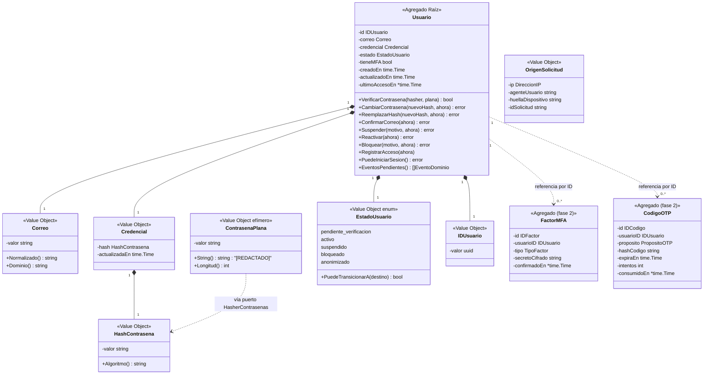

# Diseño — Bounded Context **Identidad**

> Estado: propuesta de diseño (sin código). Autor: agente `arquitecto-ddd-hexagonal`.
> Fecha: 2026-08-30.
> Alcance: entidades, value objects, agregados, puertos, casos de uso e invariantes del contexto **Identidad**, más la estructura de carpetas hexagonal de **todo** el repositorio.
> Depende de: ADR 0001 (Go + hexagonal/DDD), ADR 0002 (un solo producto), ADR 0004 (nombres de tablas), ADR 0005 (auditoría forense).
> Consumidores futuros: **Tenencia** (membresías necesitan `IDUsuario`), **Acceso** (emisión de tokens tras autenticar), **Confianza** (evalúa cada intento), **Auditoría** (recibe los eventos).

---

## 0. Responsabilidad del contexto (y lo que explícitamente NO hace)

**Identidad responde una sola pregunta**: *¿quién es este sujeto y puede demostrarlo?*

| Sí es de Identidad | No es de Identidad |
|---|---|
| Alta de usuario, unicidad de correo | Emitir/validar JWT, sesiones, refresh tokens → **Acceso** |
| Verificación de credenciales (contraseña) | Roles, organizaciones, membresías → **Tenencia** |
| Estado del ciclo de vida de la cuenta (pendiente / activo / suspendido / bloqueado) | Rate limiting, captcha, fingerprinting, score de riesgo → **Confianza** |
| Verificación de correo, MFA/OTP (factores del usuario) | Persistir la bitácora forense → **Auditoría** |
| Cambio y restablecimiento de contraseña | Decidir si hay que pedir step-up (Identidad *ejecuta* el step-up; **Confianza** *decide* que hace falta) |

**Consecuencia de diseño no obvia**: el endpoint `POST /login` **no** es un caso de uso de Identidad. Es una orquestación que vive en **Acceso** (`IniciarSesion`), que llama por puerto a `Identidad.AutenticarUsuario` y, si el resultado es exitoso y no requiere step-up, emite el par de tokens. Identidad nunca devuelve un token. Ver *ADR candidato 0009*.

---

## 1. Modelo de dominio

### 1.1 Diagrama



### 1.2 Agregados

| Agregado | Raíz | Contenido | Frontera transaccional |
|---|---|---|---|
| **Usuario** | `Usuario` | `IDUsuario`, `Correo`, `Credencial`, `EstadoUsuario`, `tieneMFA`, marcas de tiempo | Una transacción por usuario. Nunca se modifican dos usuarios en la misma operación. |
| **FactorMFA** *(fase 2, agente `otp-mfa`)* | `FactorMFA` | tipo (TOTP/email/SMS), secreto cifrado, confirmación, códigos de respaldo | Agregado propio, referenciado por `IDUsuario` (no por puntero). Habilitar/deshabilitar un factor es su propia transacción, salvo el flip de `Usuario.tieneMFA` que se hace por caso de uso coordinador. |
| **CodigoOTP** *(fase 2, agente `otp-mfa`)* | `CodigoOTP` | propósito, hash del código, expiración, intentos, consumo | Agregado propio; ciclo de vida corto e independiente del `Usuario`. |

**Por qué `FactorMFA` y `CodigoOTP` no van dentro del agregado `Usuario`**: tienen un ciclo de vida y una frecuencia de escritura totalmente distintos (un OTP se escribe/consume varias veces por login; el `Usuario` casi nunca cambia). Meterlos dentro obligaría a cargar y bloquear el `Usuario` completo para verificar un código de 6 dígitos. Se referencian por identidad, que es la regla estándar entre agregados.

### 1.3 Value objects (todos inmutables, validados en el constructor)

| VO | Constructor | Invariantes que garantiza |
|---|---|---|
| `IDUsuario` | `NuevoIDUsuario()` (vía puerto) / `IDUsuarioDesde(string)` | UUID válido y no nulo. UUIDv7 para localidad de índice (*ADR candidato 0012*). |
| `Correo` | `NuevoCorreo(crudo string)` | No vacío; `TrimSpace`; normalización Unicode NFC; **minúsculas completas** (dominio y parte local); una sola `@`; longitud ≤ 254; dominio con al menos un punto y sin espacios. Rechaza correos con caracteres de control o CRLF (prevención de header injection aguas abajo). |
| `HashContrasena` | `NuevoHashContrasena(string)` | No vacío; formato PHC (`$argon2id$v=19$...`) reconocible; expone `Algoritmo()` para decidir rehash. **Nunca** se serializa en logs ni respuestas. |
| `ContrasenaPlana` | `NuevaContrasenaPlana(string)` | Solo restricciones estructurales aquí (no vacía, ≤ 4096 bytes para evitar DoS de hashing). La política de fortaleza vive en el servicio de dominio `PoliticaContrasena`. Implementa `String()`/`GoString()`/`MarshalJSON` devolviendo `[REDACTADO]`. |
| `EstadoUsuario` | `EstadoUsuarioDesde(string)` | Solo valores del catálogo cerrado; conoce sus transiciones legales. |
| `OrigenSolicitud` | `NuevoOrigenSolicitud(ip, agente, huella, idSolicitud)` | IP parseable (o vacía si es interna); trunca `agenteUsuario` a 512 chars. Es el contexto forense de *quién pidió esto desde dónde*. |
| `DireccionIP` | `NuevaDireccionIP(string)` | IPv4/IPv6 válida; expone `EsPrivada()`. |
| `MotivoCambioEstado` | `NuevoMotivo(string)` | Texto acotado (≤ 280) y no vacío cuando se suspende/bloquea — la auditoría exige *con qué autoridad y por qué*. |

**Nota de naming**: el VO de contexto de la petición se llama `OrigenSolicitud` y **no** `ContextoSolicitud` deliberadamente, para que ningún parámetro se confunda con `ctx context.Context` de Go.

### 1.4 Servicios de dominio (puros, sin estado, sin E/S)

- **`PoliticaContrasena`** — evalúa `ContrasenaPlana` contra las reglas alineadas a NIST SP 800-63B: mínimo 12 caracteres, máximo 128 (evaluado), **sin** reglas de composición (nada de "una mayúscula y un símbolo"), rechazo si contiene el correo o el dominio del correo, rechazo de secuencias triviales. Devuelve `ErrContrasenaDebil` con la lista de reglas incumplidas.
  - La verificación contra brechas conocidas (HIBP) **no** está aquí: requiere red → es el puerto `VerificadorContrasenasFiltradas`.
- **`MaquinaEstadosUsuario`** — tabla de transiciones legales (implementada como método de `EstadoUsuario`, no como servicio suelto):

```
pendiente_verificacion --confirmar_correo--> activo
pendiente_verificacion --bloquear---------> bloqueado
activo                 --suspender--------> suspendido
activo                 --bloquear---------> bloqueado
suspendido             --reactivar--------> activo
bloqueado              --reactivar--------> activo        (solo por caso de uso administrativo)
cualquiera             --anonimizar-------> anonimizado   (terminal, irreversible)
anonimizado            --*----------------> ✗ (ninguna)
```

### 1.5 Errores de dominio (tipos propios, no `errors.New` ad hoc)

| Error | Cuándo | Nota |
|---|---|---|
| `ErrCorreoInvalido` | constructor de `Correo` | lleva el motivo estructural, nunca el valor completo en el mensaje |
| `ErrCorreoYaRegistrado` | alta con correo existente | lo produce el **adaptador Postgres** al traducir la violación de unicidad |
| `ErrContrasenaDebil` | `PoliticaContrasena` | expone las reglas incumplidas para que el adapter arme un 422 útil |
| `ErrContrasenaFiltrada` | puerto de brechas | separado de `ErrContrasenaDebil`: distinta acción del usuario |
| `ErrCredencialesInvalidas` | autenticación fallida | **deliberadamente genérico**: mismo error si el correo no existe o si la contraseña es incorrecta |
| `ErrUsuarioNoEncontrado` | consultas por ID | solo para flujos autenticados/administrativos, nunca en login |
| `ErrCorreoNoVerificado` | login con cuenta `pendiente_verificacion` | se devuelve **solo después** de verificar la contraseña correctamente |
| `ErrCuentaSuspendida` / `ErrCuentaBloqueada` | login con cuenta no operativa | idem: solo tras contraseña válida |
| `ErrTransicionEstadoInvalida` | máquina de estados | incluye estado origen y destino |
| `ErrAccesoDenegadoPorConfianza` | Confianza bloqueó el intento | el caso de uso lo propaga; el adapter lo mapea a 429/403 con `Retry-After` |
| `ErrConcurrenciaUsuario` | conflicto de versión optimista al guardar | reintentable |

### 1.6 Eventos de dominio

Todo evento implementa `EventoDominio` (`NombreEvento() string`, `OcurridoEn() time.Time`, `IDAgregado() string`). El agregado los acumula y el caso de uso los drena tras persistir.

| Evento | `accion` de auditoría (catálogo cerrado, ADR 0005) | Resultado |
|---|---|---|
| `UsuarioRegistrado` | `usuario.registrado` | `exito` |
| `RegistroRechazado` | `usuario.registro_rechazado` | `fallo` \| `denegado` |
| `AutenticacionExitosa` | `usuario.login` | `exito` |
| `AutenticacionFallida` | `usuario.login` | `fallo` |
| `AutenticacionDenegada` (Confianza bloqueó) | `usuario.login` | `denegado` |
| `SegundoFactorRequerido` | `usuario.step_up_requerido` | `exito` |
| `ContrasenaCambiada` | `usuario.contrasena_cambiada` | `exito` |
| `CredencialRehasheada` | `usuario.credencial_rehasheada` | `exito` |
| `CorreoVerificado` | `usuario.correo_verificado` | `exito` |
| `EstadoUsuarioCambiado` | `usuario.estado_cambiado` | `exito` |
| `UsuarioConsultado` (solo lectura por terceros) | `usuario.consultado` | `exito` |

Ningún evento transporta `ContrasenaPlana`, `HashContrasena`, códigos OTP ni tokens. Esto se verifica con un test de dominio que serializa cada evento y busca esos campos.

---

## 2. Puertos

Convención: `puertos/entrada.go` (driving, los implementan los casos de uso) y `puertos/salida.go` (driven, los implementan los adaptadores). Todas las firmas reciben `ctx context.Context` como primer parámetro.

### 2.1 Puertos de entrada (driving) — implementados por `aplicacion`

```go
// puertos/entrada.go
type RegistradorDeUsuarios interface {
    Registrar(ctx context.Context, cmd ComandoRegistrarUsuario) (ResultadoRegistro, error)
}

type AutenticadorDeCredenciales interface {
    Autenticar(ctx context.Context, cmd ComandoAutenticar) (ResultadoAutenticacion, error)
}

type ConsultorDeUsuarios interface {
    ObtenerPorID(ctx context.Context, q ConsultaUsuarioPorID) (VistaUsuario, error)
}
```

**Por qué existen puertos de entrada** (muchos proyectos Go solo definen los de salida): `AutenticadorDeCredenciales` es exactamente el contrato que el contexto **Acceso** consumirá para su orquestación `IniciarSesion`. Si no existe la interfaz, Acceso terminaría importando el struct concreto de `identidad/aplicacion` y el acoplamiento entre contextos deja de ser inspeccionable.

### 2.2 Puertos de salida (driven) — implementados por `adaptadores`

```go
// puertos/salida.go

// --- Persistencia -----------------------------------------------------------
type RepositorioUsuarios interface {
    Guardar(ctx context.Context, u *dominio.Usuario) error
    BuscarPorID(ctx context.Context, id dominio.IDUsuario) (*dominio.Usuario, error)
    BuscarPorCorreo(ctx context.Context, c dominio.Correo) (*dominio.Usuario, error)
}

// --- Criptografía de credenciales -------------------------------------------
type HasherContrasenas interface {
    Hashear(ctx context.Context, p dominio.ContrasenaPlana) (dominio.HashContrasena, error)
    Verificar(ctx context.Context, h dominio.HashContrasena, p dominio.ContrasenaPlana) (bool, error)
    NecesitaRehash(h dominio.HashContrasena) bool
    // ConsumirTiempoEquivalente ejecuta un hash señuelo con el mismo coste que
    // Verificar. Se invoca cuando el correo no existe, para que el tiempo de
    // respuesta no revele la existencia de la cuenta.
    ConsumirTiempoEquivalente(ctx context.Context)
}

type VerificadorContrasenasFiltradas interface {
    EstaFiltrada(ctx context.Context, p dominio.ContrasenaPlana) (bool, error)
}

// --- Infraestructura neutra --------------------------------------------------
type Reloj interface {
    Ahora() time.Time
}

type GeneradorIDs interface {
    NuevoIDUsuario() (dominio.IDUsuario, error)
}

type UnidadDeTrabajo interface {
    Ejecutar(ctx context.Context, fn func(ctx context.Context) error) error
}

// --- Cruce de bounded contexts (anticorrupción) ------------------------------
type EvaluadorConfianza interface { // implementado sobre el contexto Confianza
    Evaluar(ctx context.Context, s SolicitudEvaluacion) (DecisionConfianza, error)
    RegistrarResultado(ctx context.Context, r ResultadoIntento) error
}

type RegistroAuditoria interface { // implementado sobre el contexto Auditoría
    Registrar(ctx context.Context, e dominio.EventoDominio, origen dominio.OrigenSolicitud) error
}

// --- Integración asíncrona ---------------------------------------------------
type PublicadorEventos interface {
    Publicar(ctx context.Context, eventos ...dominio.EventoDominio) error
}
```

Tipos de apoyo de los puertos de cruce (viven en `puertos/`, no en `dominio/`, porque son el contrato con otro contexto y no lenguaje ubicuo de Identidad):

```go
type SolicitudEvaluacion struct {
    Accion            string // "login" | "registro" | "reset_contrasena"
    CorreoNormalizado string // clave de rate limit por cuenta, incluso si no existe
    Origen            dominio.OrigenSolicitud
    TokenCaptcha      string // opcional; vacío si el cliente no envió
}

type DecisionConfianza struct {
    Permitido        bool
    RequiereStepUp   bool
    RequiereCaptcha  bool
    Puntaje          float64
    Motivo           string
    ReintentarEn     time.Duration
}

type ResultadoIntento struct {
    Accion            string
    CorreoNormalizado string
    Origen            dominio.OrigenSolicitud
    Exitoso           bool
    UsuarioID         string // vacío si no se resolvió el usuario
}
```

### 2.3 Puertos aplazados (fase 2, ya nombrados para que nadie invente otro nombre)

`RepositorioFactoresMFA`, `RepositorioCodigosOTP`, `EmisorOTP` (`ports.OTPSender` del agente `otp-mfa`), `NotificadorCorreo` (bienvenida, aviso de contraseña cambiada), `CifradorSecretos` (secretos TOTP en reposo), `RepositorioTokensVerificacion`.

### 2.4 Puertos que Identidad **expone** a otros contextos

| Contexto consumidor | Puerto consumido | Para qué |
|---|---|---|
| Acceso | `AutenticadorDeCredenciales` | verificar credenciales antes de emitir tokens |
| Acceso / Tenencia | `ConsultorDeUsuarios` | resolver datos mínimos del usuario (estado, correo) |
| Tenencia | `ConsultorDeUsuarios` (o un `VerificadorExistenciaUsuario` estrecho) | validar que el `usuario_id` de una membresía existe y está activo |

Ningún otro contexto consulta la tabla `usuarios` directamente, ni siquiera con un `JOIN`. El adaptador Postgres de Tenencia puede tener FK a `usuarios(id)` por integridad referencial, pero **no lee columnas** de esa tabla.

---

## 3. Casos de uso (MVP)

Los comandos y consultas viven en `identidad/aplicacion` y transportan **primitivos**, no VOs y nunca DTOs HTTP. Regla explícita: *el caso de uso construye los value objects en sus primeras líneas*, para que un input inválido produzca siempre un error de dominio uniforme y el adaptador nunca decida qué es válido.

### 3.1 `RegistrarUsuario`

```go
type ComandoRegistrarUsuario struct {
    Correo       string
    Contrasena   string          // se envuelve en ContrasenaPlana de inmediato
    Origen       dominio.OrigenSolicitud
    TokenCaptcha string
}

type ResultadoRegistro struct {
    IDUsuario                  string
    Estado                     string // "pendiente_verificacion"
    RequiereVerificacionCorreo bool
}
```

Flujo:
1. `EvaluadorConfianza.Evaluar(accion="registro")` → si `!Permitido`: auditar `usuario.registro_rechazado / denegado` y devolver `ErrAccesoDenegadoPorConfianza`.
2. Construir `Correo` y `ContrasenaPlana` (errores de dominio si fallan).
3. `PoliticaContrasena.Evaluar(plana, correo)` → `ErrContrasenaDebil`.
4. `VerificadorContrasenasFiltradas.EstaFiltrada` → `ErrContrasenaFiltrada`. Si el puerto falla (red caída), **se registra y se continúa** (fail-open deliberado: una caída de HIBP no puede bloquear todas las altas).
5. `HasherContrasenas.Hashear`.
6. `dominio.RegistrarUsuario(id, correo, hash, ahora)` → crea el agregado en `pendiente_verificacion` y acumula `UsuarioRegistrado`.
7. Dentro de `UnidadDeTrabajo.Ejecutar`: `RepositorioUsuarios.Guardar` + `RegistroAuditoria.Registrar` (misma transacción, exigido por ADR 0005).
8. Fuera de la transacción: `PublicadorEventos.Publicar(UsuarioRegistrado)` → el envío del correo de verificación lo hace un suscriptor, no este caso de uso.
9. `EvaluadorConfianza.RegistrarResultado`.

Errores posibles: `ErrCorreoInvalido`, `ErrContrasenaDebil`, `ErrContrasenaFiltrada`, `ErrCorreoYaRegistrado`, `ErrAccesoDenegadoPorConfianza`.

### 3.2 `AutenticarUsuario`

```go
type ComandoAutenticar struct {
    Correo       string
    Contrasena   string
    Origen       dominio.OrigenSolicitud
    TokenCaptcha string
}

type ResultadoAutenticacion struct {
    IDUsuario             string
    CorreoNormalizado     string
    Estado                string
    RequiereSegundoFactor bool
    MotivoStepUp          string  // "mfa_habilitado" | "confianza_baja" | ""
    PuntajeConfianza      float64
}
```

**No devuelve tokens ni sesión** — eso es Acceso.

Flujo (el orden es normativo, no cosmético):
1. `EvaluadorConfianza.Evaluar(accion="login")` **antes de tocar la base de datos** — es lo que evita que el credential stuffing consuma conexiones a Postgres. Si `!Permitido`: auditar `usuario.login / denegado` y devolver `ErrAccesoDenegadoPorConfianza`.
2. Construir `Correo`. Si es inválido: devolver `ErrCredencialesInvalidas` (no `ErrCorreoInvalido`) — un correo malformado no debe distinguirse de uno inexistente en este flujo.
3. `RepositorioUsuarios.BuscarPorCorreo`. Si no existe: `HasherContrasenas.ConsumirTiempoEquivalente`, auditar `usuario.login / fallo` (sin `usuario_id`), `RegistrarResultado(exitoso=false)`, devolver `ErrCredencialesInvalidas`.
4. `HasherContrasenas.Verificar`. Si falla: auditar `fallo` **con** `usuario_id`, `RegistrarResultado(exitoso=false)`, devolver `ErrCredencialesInvalidas`.
5. **Solo con la contraseña ya verificada**: `usuario.PuedeIniciarSesion()` → `ErrCorreoNoVerificado` / `ErrCuentaSuspendida` / `ErrCuentaBloqueada`. Auditar con la acción y el motivo reales.
6. Si `HasherContrasenas.NecesitaRehash`: rehashear, `usuario.ReemplazarHash(...)`, emitir `CredencialRehasheada`. Un fallo aquí **no** aborta el login (se audita como fallo del rehash).
7. `usuario.RegistrarAcceso(ahora)`; persistir dentro de `UnidadDeTrabajo` junto con el evento de auditoría de éxito.
8. `RequiereSegundoFactor = usuario.tieneMFA || decision.RequiereStepUp`. Si es true, se emite `SegundoFactorRequerido` y **Acceso no debe emitir tokens de sesión completa**, solo un token de step-up de vida corta.
9. `EvaluadorConfianza.RegistrarResultado(exitoso=true)`.

### 3.3 `ObtenerUsuario`

```go
type ConsultaUsuarioPorID struct {
    IDUsuario     string
    IDSolicitante string  // quién pregunta; vacío = llamada interna del sistema
    Origen        dominio.OrigenSolicitud
}

type VistaUsuario struct {
    ID            string
    Correo        string
    Estado        string
    TieneMFA      bool
    CreadoEn      time.Time
    UltimoAccesoEn *time.Time
}
```

- Devuelve un **modelo de lectura** (`VistaUsuario`), nunca el agregado `Usuario`. Motivo: si el handler HTTP pudiera serializar el agregado, un `json.Marshal` descuidado filtraría `contrasena_hash`. Con `VistaUsuario` el filtrado es estructural, no disciplinario.
- Auditoría condicional: si `IDSolicitante != IDUsuario` y no está vacío, se emite `usuario.consultado`. Consultar el perfil propio no se audita (sería ruido que degrada la señal de la bitácora).
- La autorización (¿puede este solicitante ver a este usuario?) **no** se resuelve aquí: depende de roles, que son de **Tenencia**. Se resuelve en la orquestación/middleware de Acceso; Identidad solo registra quién preguntó.

### 3.4 `VerificarCorreo` / `ReenviarVerificacion` (promovido al MVP el 2026-08-30)

Cierra el gap detectado al cerrar el hito de infraestructura: un usuario registrado quedaba en `pendiente_verificacion` sin ninguna forma real de pasar a `activo`. `Usuario.ConfirmarCorreo(ahora time.Time) error` ya existe en el dominio y no cambia — lo que falta es *quién* llama a ese método y *cómo* se prueba que el solicitante controla el correo.

**Diseño del mecanismo (token de un solo uso, no JWT):**

- El token de verificación **no** es un concepto de Acceso (no es una sesión ni prueba de identidad continuada, ADR 0009 no aplica aquí) — es un secreto efímero de un solo uso que demuestra acceso al buzón. Vive en Identidad.
- **No se modela como campo del agregado `Usuario`** (evita ensuciar el aggregate con un concepto de vida corta y ciclo propio) sino como su propia tabla/repositorio: `tokens_verificacion_correo(hash_token PK, usuario_id FK, expira_en, creado_en)`. Solo se guarda el **hash SHA-256** del token, nunca el valor plano — igual criterio que las contraseñas, aunque el algoritmo es distinto (ver justificación abajo).
- **Por qué SHA-256 y no Argon2id aquí:** Argon2id (ADR 0008) defiende contra fuerza bruta sobre secretos de **baja entropía elegidos por humanos** (contraseñas). Un token de verificación es un secreto aleatorio de **alta entropía generada por el sistema** (32 bytes vía `crypto/rand`) — no hay ataque de diccionario posible, así que el costo computacional de Argon2id no aporta nada aquí y sí penalizaría innecesariamente cada verificación. SHA-256 (stdlib, `crypto/sha256`) es el criterio estándar para este tipo de token (mismo patrón que tokens de reseteo de contraseña en la mayoría de frameworks de auth).
- Token de un solo uso: se borra de la tabla al verificarse (éxito) o se sobreescribe (reenvío invalida el anterior). Vigencia: 24 horas (constante, ajustable sin migración).
- `RegistrarUsuario` (caso de uso ya cerrado, **se modifica**): tras guardar el usuario en estado `pendiente_verificacion`, genera un token (nuevo puerto de salida `GeneradorTokens`), guarda su hash junto con la expiración en la MISMA unidad de trabajo (igual patrón que la auditoría, ADR 0005), y entrega el token **en claro** solo al puerto `PublicadorEventos`/un nuevo puerto de envío — **nunca en la respuesta HTTP** (devolverlo al cliente permitiría auto-verificarse sin haber recibido el correo, rompiendo por completo el propósito del mecanismo).
- Envío real del correo: **fuera de alcance de este hito** — el adaptador de infraestructura es un stub log-only (mismo patrón que `PublicadorEventos`/`EvaluadorConfianza` no-op), con `WARN` explícito de que la integración real de envío de correo es trabajo del agente `automatizacion-n8n`.

**Nuevos puertos de salida:**

```go
// GeneradorTokens genera secretos aleatorios de alta entropía para flujos
// de un solo uso (verificación de correo). No es GeneradorIDs: los IDs son
// UUIDv7 (ordenables, no secretos); estos tokens son opacos y no deben ser
// predecibles ni ordenables.
type GeneradorTokens interface {
    Generar() (string, error) // string opaca, base64url, ≥32 bytes de entropía
}

// RepositorioTokensVerificacion persiste el hash (nunca el token plano) del
// token de verificación de correo activo por usuario.
type RepositorioTokensVerificacion interface {
    Guardar(ctx context.Context, usuarioID IDUsuario, hashToken string, expiraEn time.Time) error
    BuscarPorHash(ctx context.Context, hashToken string) (usuarioID IDUsuario, expiraEn time.Time, encontrado bool, err error)
    Eliminar(ctx context.Context, usuarioID IDUsuario) error
}

// NotificadorCorreo envía el enlace/token de verificación al usuario. Stub
// log-only en este hito — envío real es trabajo de automatizacion-n8n.
type NotificadorCorreo interface {
    EnviarVerificacion(ctx context.Context, correo dominio.Correo, tokenPlano string) error
}
```

**Casos de uso nuevos:**

- `VerificarCorreoCasoDeUso.Verificar(ctx, ComandoVerificarCorreo{TokenPlano string, Origen})`: hashea el token recibido, busca por hash. No encontrado o expirado → error tipado (`ErrTokenVerificacionInvalido` / `ErrTokenVerificacionExpirado`), se audita como `usuario.correo_verificado` con `resultado=fallo` (mismo patrón que `usuario.login` cubre éxito/fallo/denegado con una sola acción de catálogo — no hace falta tocar `auditoria_acciones`). Válido → carga el `Usuario`, llama `ConfirmarCorreo(ahora)`, guarda, elimina el token, audita `resultado=exito`, todo en una unidad de trabajo.
- `ReenviarVerificacionCasoDeUso.Reenviar(ctx, ComandoReenviarVerificacion{Correo string, Origen})`: **respuesta siempre neutra** (mismo criterio que login, INV-ID-11/ADR candidato 0013 — no revela si el correo existe o si ya estaba verificado). Si el usuario existe y sigue en `pendiente_verificacion`, genera un token nuevo (invalida el anterior) y lo envía; en cualquier otro caso (no existe, ya activo, bloqueado) no hace nada observable desde afuera.

**Nuevos errores de dominio:** `ErrTokenVerificacionInvalido{}`, `ErrTokenVerificacionExpirado{}` — tipados igual que el resto de `errores.go`, aunque el concepto "token" no cuelga de ningún VO del agregado `Usuario`.

**Nuevo evento de dominio:** `VerificacionCorreoFallida{IDUsuario, Motivo, OcurridoEn}` (para el caso fallo/expirado). El caso éxito reusa `CorreoVerificado`, que ya existía.

**Endpoints HTTP nuevos:** `POST /identidad/verificaciones-correo` (body: token) → 200 en éxito, 404/410 en token inválido/expirado. `POST /identidad/verificaciones-correo/reenvios` (body: correo) → 202 Accepted siempre, sin excepción (INV-ID-22).

**Migración nueva:** `000004_tokens_verificacion_correo` — crea la tabla, otorga a `rol_aplicacion` `SELECT, INSERT, UPDATE, DELETE` (a diferencia de `usuarios`, aquí SÍ hace falta `DELETE`: los tokens se consumen y expiran).

### 3.5 Backlog restante (fuera del MVP, mismo contexto)

`CambiarContrasena` (exige la contraseña actual), `SolicitarRestablecimiento` (**respuesta siempre neutra**), `RestablecerContrasena`, `SuspenderUsuario`, `ReactivarUsuario`, `AnonimizarUsuario` (derecho al olvido preservando la cadena de auditoría), `HabilitarMFA` / `DeshabilitarMFA` / `VerificarOTP` (agente `otp-mfa`).

---

## 4. Invariantes de negocio

Numeradas para poder referenciarlas desde los tests (`TestINV_ID_03_...`).

**Del agregado `Usuario`:**
- **INV-ID-01** — Un `Usuario` existe siempre con un `Correo` válido y una `Credencial` no vacía. No hay usuario sin contraseña (los flujos social/SSO, cuando lleguen, requieren un ADR: cambian esta invariante).
- **INV-ID-02** — El `Correo` es único en todo el sistema, comparado por su forma **normalizada** (minúsculas, NFC, sin espacios). La unicidad la garantiza un índice único en la base de datos, no una consulta previa en la aplicación.
- **INV-ID-03** — El `Correo` de un usuario es inmutable desde fuera del agregado; cambiarlo exige un caso de uso propio con reverificación (fase 2), nunca un setter.
- **INV-ID-04** — La contraseña en claro nunca se persiste, ni se registra en logs, ni viaja en un evento de dominio, ni aparece en un mensaje de error. `ContrasenaPlana` redacta su propio `String()`.
- **INV-ID-05** — Toda transición de `EstadoUsuario` pasa por la máquina de estados. `anonimizado` es terminal.
- **INV-ID-06** — Solo un usuario en estado `activo` puede autenticarse con éxito. Los demás estados producen un error específico **después** de verificar la contraseña.
- **INV-ID-07** — Un usuario recién registrado nace en `pendiente_verificacion`, nunca en `activo`.
- **INV-ID-08** — `tieneMFA == true` implica al menos un `FactorMFA` confirmado. El flag no se activa hasta que el primer factor se confirma, y se desactiva al eliminar el último.
- **INV-ID-09** — Toda mutación del agregado ocurre por un método de negocio de `Usuario`. No hay campos exportados ni setters. Los `getters` devuelven copias de valores, no punteros internos.
- **INV-ID-10** — `actualizadoEn` se actualiza en cada mutación con la hora provista por el puerto `Reloj`; el dominio nunca llama a `time.Now()`.

**De autenticación:**
- **INV-ID-11** — Correo inexistente y contraseña incorrecta devuelven el **mismo** error (`ErrCredencialesInvalidas`) y consumen un tiempo comparable.
- **INV-ID-12** — Ningún intento de autenticación llega al repositorio sin haber consultado antes a `EvaluadorConfianza`.
- **INV-ID-13** — El rehash oportunista solo ocurre tras una verificación exitosa, y su fallo no invalida la autenticación.
- **INV-ID-14** — Identidad nunca emite ni valida tokens de sesión.

**De auditoría (derivadas del ADR 0005):**
- **INV-ID-15** — Registro y autenticación (éxito, fallo y denegación) emiten **siempre** un evento de auditoría. Un fallo al registrar la auditoría en una acción crítica **aborta la transacción de negocio**: si no se puede probar lo que pasó, no pasa.
- **INV-ID-16** — Todo evento lleva `OrigenSolicitud` completo (IP, huella, `id_solicitud`) para poder correlacionarlo con las trazas.
- **INV-ID-17** — Los valores de `accion` provienen del catálogo cerrado de la sección 1.6; no se construyen concatenando strings en el caso de uso.

**De frontera de contexto:**
- **INV-ID-18** — `identidad/dominio` no importa nada fuera de la stdlib de Go (permitido: `time`, `strings`, `errors`, `net/mail`, `unicode`, `crypto/subtle`), **con una única excepción documentada**: `golang.org/x/text/unicode/norm` en `correo.go`, para normalización NFC completa — mantenida por el equipo de Go, mismo nivel de confianza que la stdlib en la práctica. Cualquier otra dependencia en este paquete requiere el mismo nivel de justificación explícita y aprobación del usuario. Se verifica en CI con `go-arch-lint` o un test de arquitectura que inspeccione los imports, con esta excepción explícita en el allowlist.
- **INV-ID-19** — `identidad/aplicacion` importa `dominio` y `puertos`; jamás `adaptadores`.
- **INV-ID-20** — Ningún contexto lee la tabla `usuarios`; el acceso es siempre por puerto.
- **INV-ID-21** — El token de verificación de correo nunca viaja en claro fuera de `NotificadorCorreo`: no se persiste en claro (solo su hash SHA-256), no se loguea, y jamás se incluye en la respuesta HTTP de `RegistrarUsuario` — devolverlo al cliente anularía el propósito del mecanismo (cualquiera podría auto-verificarse).
- **INV-ID-22** — `ReenviarVerificacion` responde siempre con el mismo resultado observable (202 Accepted, sin cuerpo distintivo) exista o no el correo, y sin importar el estado del usuario — mismo criterio anti-enumeración que login (INV-ID-11).

---

## 5. Estructura de carpetas del repositorio (esqueleto completo)

```
/
├── cmd/
│   ├── api/main.go                     # arranque del servidor Fiber: config, DI, rutas
│   ├── migrador/main.go                # golang-migrate embebido (up/down/version)
│   └── verificador-auditoria/main.go   # job de verificación de la cadena de hashes (ADR 0005)
│
├── internal/
│   ├── identidad/
│   │   ├── dominio/
│   │   │   ├── usuario.go              # agregado raíz
│   │   │   ├── correo.go               # VO
│   │   │   ├── credencial.go           # VO Credencial + HashContrasena + ContrasenaPlana
│   │   │   ├── estado_usuario.go       # VO enum + máquina de estados
│   │   │   ├── identificadores.go      # IDUsuario
│   │   │   ├── origen_solicitud.go     # VO OrigenSolicitud + DireccionIP
│   │   │   ├── politica_contrasena.go  # servicio de dominio puro
│   │   │   ├── eventos.go              # EventoDominio + eventos concretos
│   │   │   ├── errores.go              # errores de dominio tipados
│   │   │   └── *_test.go               # 100% de invariantes, sin mocks
│   │   ├── aplicacion/
│   │   │   ├── registrar_usuario.go
│   │   │   ├── autenticar_usuario.go
│   │   │   ├── obtener_usuario.go
│   │   │   ├── comandos.go             # ComandoX / ConsultaX / ResultadoX / VistaX
│   │   │   └── *_test.go               # con mocks de puertos
│   │   ├── puertos/
│   │   │   ├── entrada.go
│   │   │   ├── salida.go
│   │   │   └── mocks/                  # generados con mockgen (solo para tests)
│   │   └── adaptadores/
│   │       ├── http/                   # handlers Fiber, DTOs, mapeo error→status
│   │       │   ├── handlers.go
│   │       │   ├── dtos.go
│   │       │   ├── rutas.go
│   │       │   └── errores_http.go
│   │       ├── postgres/
│   │       │   ├── repositorio_usuarios.go
│   │       │   ├── mapeo.go            # fila sqlc ↔ agregado
│   │       │   └── sqlc/               # código generado (no editar a mano)
│   │       ├── cripto/
│   │       │   ├── hasher_argon2id.go
│   │       │   └── verificador_hibp.go
│   │       ├── auditoria/              # ACL: implementa puertos.RegistroAuditoria
│   │       │   └── registro_auditoria.go
│   │       ├── confianza/              # ACL: implementa puertos.EvaluadorConfianza
│   │       │   └── evaluador_confianza.go
│   │       └── eventos/
│   │           └── publicador.go
│   │
│   ├── tenencia/          # organizaciones, membresías, roles      (misma estructura)
│   ├── acceso/            # tokens, sesiones, refresh              (misma estructura)
│   ├── confianza/         # rate limit, fingerprint, captcha, colas(misma estructura)
│   ├── auditoria/         # bitácora append-only + hash-chaining   (misma estructura)
│   │
│   └── plataforma/                     # kernel TÉCNICO compartido — cero reglas de negocio
│       ├── configuracion/config.go     # env → struct tipado, validado al arrancar
│       ├── bd/                         # pool pgx, helpers de transacción, UnidadDeTrabajo
│       ├── cache/                      # cliente Redis compartido
│       ├── servidor/                   # setup Fiber, middlewares transversales
│       │   └── middleware/             # id_solicitud, recover, logging, CORS, timeout
│       ├── bitacora/logger.go          # slog estructurado con redacción de campos sensibles
│       ├── telemetria/                 # OpenTelemetry: trazas y métricas
│       ├── ids/                        # generador UUIDv7 (implementa GeneradorIDs de c/contexto)
│       ├── reloj/                      # reloj real + reloj fijo para tests
│       └── errores/                    # envoltorio de errores y códigos de problema (RFC 9457)
│
├── db/
│   ├── migraciones/                    # 000001_crear_usuarios.up.sql / .down.sql
│   ├── consultas/                      # SQL fuente de sqlc, un archivo por contexto
│   │   ├── identidad.sql
│   │   └── auditoria.sql
│   └── semillas/                       # datos de desarrollo (nunca de producción)
│
├── test/
│   ├── integracion/                    # testcontainers: Postgres + Redis reales
│   ├── e2e/                            # flujos completos contra la API levantada
│   ├── arquitectura/                   # tests de imports: dominio limpio, capas respetadas
│   └── carga/                          # k6/vegeta (rate limiting, hot paths)
│
├── docs/
│   ├── adr/                            # decisiones de arquitectura
│   ├── design/                         # este documento y los de los demás contextos
│   ├── api/                            # OpenAPI generado/mantenido
│   └── catalogos/                      # catálogo cerrado de acciones de auditoría
│
├── deployments/
│   ├── docker-compose.yml              # postgres, redis, api, herramientas
│   └── Dockerfile
│
├── .github/workflows/                  # lint, test, migraciones, build
├── sqlc.yaml
├── Makefile
├── go.mod
└── go.sum
```

### Decisiones de estructura que merecen explicación

1. **Español en las capas, inglés donde Go lo exige.** Las carpetas y los identificadores de dominio/aplicación/puertos van en español (`Usuario`, `Correo`, `RepositorioUsuarios`) porque el lenguaje ubicuo del proyecto y las tablas ya están en español (ADR 0001 y 0004): traducir en la frontera dominio↔SQL introduce un diccionario mental innecesario. Se mantienen en inglés las convenciones que Go impone o que son universales (`ctx context.Context`, `error`, `String()`, `MarshalJSON`, nombres de paquetes de terceros). **Resuelto como ADR 0007** — los agentes `go-dominio`, `go-aplicacion`, `base-datos` y `go-infraestructura` ya fueron corregidos.
2. **`internal/plataforma` en lugar de `pkg/`.** Es un kernel técnico (config, logger, pool de BD, reloj, IDs), no un shared kernel de dominio. No contiene tipos de negocio: si dos contextos "necesitan compartir una entidad", eso es señal de que la frontera está mal trazada o de que falta un puerto.
3. **Los adaptadores de cruce de contexto viven en el consumidor.** `identidad/adaptadores/auditoria/` implementa `identidad/puertos.RegistroAuditoria` traduciendo al contrato de `auditoria/aplicacion`. La capa anticorrupción la posee quien depende, no quien es dependido: así Auditoría puede cambiar su API sin que Identidad se entere más allá de ese archivo.
4. **Código generado por sqlc por contexto**, no un paquete `queries` global. Un paquete generado único se convertiría en un punto donde cualquier contexto puede leer las tablas de cualquier otro, rompiendo INV-ID-20 sin que se note en el diff.
5. **`test/arquitectura/`** existe para que las invariantes 18–20 sean ejecutables. Una regla de capas que no falla en CI es una sugerencia.

---

## 6. Gancho de auditoría (sin implementar auditoría aquí)

Contrato que Identidad deja preparado para el agente `auditoria-forense`:

- Cada caso de uso sensible **acumula eventos en el agregado** y los entrega al puerto `RegistroAuditoria` dentro de la misma `UnidadDeTrabajo` que la escritura de negocio (exigido por ADR 0005 para acciones críticas de seguridad).
- El evento de dominio se traduce a la fila de `auditoria` **en el adaptador**, no en el caso de uso: el mapeo `EventoDominio → (accion, recurso, recurso_id, resultado, detalles)` es responsabilidad del ACL `identidad/adaptadores/auditoria/`.
- El `hash_anterior`/`hash_actual` es 100% del contexto Auditoría; Identidad no sabe que existe una cadena.
- `OrigenSolicitud` es el vehículo de los campos forenses (`ip_origen`, `huella_dispositivo`, `id_solicitud`). El middleware de `plataforma/servidor/middleware` genera el `id_solicitud` y el handler HTTP construye el `OrigenSolicitud`; el caso de uso solo lo transporta.
- Acciones de Identidad que se agregan al catálogo cerrado (`docs/catalogos/acciones-auditoria.md`): las 11 de la sección 1.6.
- Eventos **no** críticos (envío de correo de bienvenida, métricas) van por `PublicadorEventos`, fuera de la transacción. La separación entre "auditar" (síncrono, transaccional) y "notificar" (asíncrono, best-effort) es deliberada y no debe colapsarse en un solo puerto.

---

## 7. Decisiones no obvias → candidatas a ADR

Ordenadas por prioridad. Cada una debería convertirse en un ADR corto por el agente `documentacion` antes o durante la implementación.

> **Actualización post-implementación (cierre del hito de infraestructura real, ver sección 8):** de esta tabla, **0008** y **0009** ya estaban resueltos desde el cierre del MVP — ambos se implementaron y se verificaron contra Postgres/HTTP reales sin desviarse de lo aquí propuesto.
>
> **Segunda actualización (documentación retroactiva de ADRs de papeleo):** de los siete candidatos restantes, **seis ya tienen ADR propio**, escrito retroactivamente porque el código ya los implementaba de facto sin haberse disputado durante la implementación: `docs/adr/0010-unidad-de-trabajo-transaccion-en-context.md`, `docs/adr/0012-uuidv7-identificador-usuario.md`, `docs/adr/0013-enumeracion-usuarios-login-generico-registro-explicito.md`, `docs/adr/0014-politica-contrasena-nist-hibp-fail-open.md`, `docs/adr/0015-normalizacion-correo-minusculas.md` y `docs/adr/0016-comandos-aplicacion-primitivos.md`. **Solo el 0011 (bloqueo de cuenta tras intentos fallidos) sigue siendo candidato genuinamente abierto**: `Usuario.Bloquear()` existe en el dominio, pero ningún caso de uso lo invoca en producción todavía — no hay bloqueo automático que Identidad dispare por sí misma tras repetidos fallos de login, más allá del throttling efímero que ya aplica Confianza (ADR 0018).
>
> **Nota sobre el ADR 0017 (fuera de esta tabla, a propósito):** durante la implementación de los adaptadores de infraestructura (`go-infraestructura`) surgió una decisión no obvia que **esta lista original no anticipó**: el proceso `api` se conectaba con el mismo rol dueño de la base usado para migraciones, lo que anulaba en la práctica el `REVOKE UPDATE/DELETE` de ADR 0005 (un superusuario ignora los permisos de tabla). Esa decisión se documentó como **ADR 0017** — no 0010, precisamente para no colisionar con los candidatos 0010–0016 ya reservados aquí. No es un error de numeración: es la prueba de que la sección 7 es una lista de lo anticipado en el diseño, no un techo de lo que puede pasar durante la implementación. Ver `docs/adr/0017-rol-login-runtime-vs-rol-dueno-migraciones.md`.

| # propuesto | Decisión | Resumen de la justificación |
|---|---|---|
| **0007** | Idioma de los identificadores de código: español en dominio/aplicación/puertos, inglés en lo que Go impone | Alinea código con el lenguaje ubicuo y con las tablas (ADR 0004). **Resuelto** — ver `docs/adr/0007-idioma-identificadores-codigo.md`. |
| **0008** | Argon2id como algoritmo de hashing (parámetros: 64 MiB, t=3, p=1, revisables) con bcrypt solo como ruta de migración | Argon2id es la recomendación actual de OWASP/RFC 9106; el puerto `NecesitaRehash` permite subir los parámetros sin migración masiva. Impacta el presupuesto de CPU por login → hay que fijar los números. **Resuelto e implementado** — ver `docs/adr/0008-argon2id-parametros.md` y `internal/identidad/adaptadores/cripto/hasher_argon2id.go`. |
| **0009** | Identidad autentica, Acceso emite tokens; `login` es una orquestación de Acceso | Evita que Identidad conozca JWT/sesiones (INV-ID-14) y permite reusar `AutenticarUsuario` en flujos que no emiten sesión (reautenticación para operaciones sensibles). **Resuelto e implementado** — ver `docs/adr/0009-frontera-identidad-acceso.md`. El endpoint `POST /identidad/autenticaciones` ya existe y devuelve `ResultadoAutenticacion` sin token (verificado con tests de integración HTTP, `test/integracion/http_flujo_test.go`); el contexto Acceso que debe orquestarlo **todavía no existe**. |
| _(0017, fuera de secuencia)_ | Rol de login de runtime (`rol_login_identidad`) distinto del rol dueño de migraciones | No estaba en esta lista de candidatos originales — surgió durante la implementación de infraestructura. Ver nota arriba y `docs/adr/0017-rol-login-runtime-vs-rol-dueno-migraciones.md`. |
| **0010** | `UnidadDeTrabajo` como puerto, con la transacción viajando dentro del `context.Context` | ADR 0005 exige auditoría en la misma transacción que la escritura de negocio. La alternativa (pasar `*pgx.Tx` por la firma) contaminaría los puertos con el driver. Coste: el `ctx` lleva un valor implícito, lo que hay que documentar. |
| **0011** | Bloqueo de cuenta: el estado persistente `bloqueado` es de Identidad; el *throttling* efímero es de Confianza | Sin esta línea, ambos contextos terminan implementando lockout y se contradicen. Regla: Confianza decide "ahora no" (Redis, minutos); Identidad decide "esta cuenta está fuera de servicio" (Postgres, hasta acción explícita). |
| **0012** | UUIDv7 como identificador de usuario | Ordenable en el tiempo → mejor localidad de índice B-tree que UUIDv4 en la tabla más leída del sistema. Contra: filtra el instante de creación; aceptable para un ID de usuario interno, **no** para tokens. |
| **0013** | Enumeración de usuarios: login siempre genérico; registro devuelve conflicto explícito | En login, la protección es absoluta (mismo error + tiempo equivalente). En registro se acepta revelar el conflicto por UX, mitigado con rate limiting de Confianza y correo verificado. Es un trade-off consciente, no un descuido. |
| **0014** | Política de contraseñas alineada a NIST SP 800-63B (longitud, sin reglas de composición, sin expiración forzada) + chequeo HIBP *fail-open* | Rompe con la expectativa habitual de "mayúscula + número + símbolo"; conviene dejar escrito por qué, porque alguien lo va a cuestionar. |
| **0015** | Normalización de correo a minúsculas completas (incluida la parte local) | El RFC 5321 permite parte local sensible a mayúsculas, pero ningún proveedor real lo explota y no normalizar abre la puerta a cuentas duplicadas (`Ana@x.com` vs `ana@x.com`). Se documenta como desviación consciente del RFC. |
| **0016** | Los comandos de la capa de aplicación transportan primitivos, no value objects | Garantiza que la validación de negocio ocurra siempre dentro del hexágono y que todo input inválido produzca un error de dominio uniforme, sin importar el adaptador de entrada (HTTP hoy, gRPC o CLI mañana). |

---

## 8. Secuencia sugerida de implementación

> **Estado al cierre de este hito (2026-08-30):** los pasos 1–8 originales están **completados** de punta a punta — dominio (100% cobertura, 92 tests), aplicación (99.4% cobertura, 57 tests), adaptadores de infraestructura reales y 18 tests de integración contra Postgres real. El detalle de cada paso y lo que el diseño original no anticipó queda marcado abajo. El backlog de la sección 3.4 (verificación de correo, MFA, restablecimiento de contraseña, etc.) sigue **sin implementar** — no era parte del MVP cerrado en este hito.

1. ✅ **Completado.** `go mod init` + esqueleto de carpetas + `Makefile` + `docker-compose` (agente `go-infraestructura`). El esqueleto de carpetas terminó coincidiendo con la sección 5 de este documento.
2. ✅ **Completado.** ADR 0007 (naming) ya estaba resuelto; ADR 0008 (Argon2id) y ADR 0009 (frontera Identidad/Acceso) se resolvieron y están implementados — ver sección 7. **No anticipado en el diseño original:** durante la implementación de infraestructura surgió una tercera decisión de arquitectura, documentada como **ADR 0017** (rol de login de runtime vs. rol dueño de migraciones), fuera de la secuencia numérica 0010–0016 ya reservada — ver nota en la sección 7.
3. ✅ **Completado.** `identidad/dominio` completo con tests (agente `go-dominio`): 100% de cobertura, 92 tests, sin mocks.
4. ✅ **Completado.** `identidad/puertos` (interfaces de entrada y salida) + mocks generados en `puertos/mocks/`.
5. ✅ **Completado, con una migración adicional no anticipada.** `000001_crear_usuarios` + `000002_crear_auditoria` con triggers (agentes `base-datos` + `auditoria-forense`), tal como estaba previsto. **No anticipado en el diseño original:** una tercera migración, `000003_rol_login_aplicacion`, se agregó después de detectar en la implementación que (a) el proceso `api` corría con el rol dueño/superusuario en vez de un rol de login acotado, anulando en la práctica el `REVOKE UPDATE/DELETE` de ADR 0005, y (b) `rol_aplicacion` (creado en 000002) nunca había recibido `GRANT` sobre `usuarios` porque ese rol no existía todavía cuando corrió 000001. Documentado en ADR 0017. Ver `db/migraciones/000003_rol_login_aplicacion.{up,down}.sql`.
6. ✅ **Completado.** `identidad/aplicacion`: los tres casos de uso (`RegistrarUsuario`, `AutenticarUsuario`, `ObtenerUsuario`) con mocks (agente `go-aplicacion`), 99.4% de cobertura, 57 tests. `EvaluadorConfianza` y `RegistroAuditoria` corren en versión real de auditoría (Postgres, hash-chaining) y en versión no-op de confianza (`identidad/adaptadores/confianza`, contexto Confianza todavía no existe) — el no-op emite un `WARN` explícito en el arranque, tal como estaba previsto.
7. ✅ **Completado.** Adaptadores: Postgres (`repositorio_usuarios.go`, `unidad_trabajo.go`, `generador_ids.go`), Argon2id (`cripto/hasher_argon2id.go`), verificador HIBP (`cripto/verificador_hibp.go`), HTTP con Huma v2 (`adaptadores/http`), auditoría y eventos (agente `go-infraestructura`). **Desviación explícita respecto al diseño original, no un olvido:** el diseño (sección 3.4, backlog inmediato) preveía `VerificarCorreo`/`ReenviarVerificacion` como parte cercana del MVP; **ese caso de uso y su endpoint HTTP no se implementaron en este hito** — un usuario recién registrado queda en `pendiente_verificacion` sin ninguna forma de pasar a `activo` salvo una actualización manual directa en base de datos (ver `activarUsuario` en `test/integracion/entorno_test.go`, usada solo en tests). Es un gap conocido del MVP, documentado también en `internal/identidad/README.md`.
8. ✅ **Completado.** Tests de integración contra Postgres real (agente `tests-qa`): 18 tests en `test/integracion/` — repositorio de usuarios, unidad de trabajo, flujo HTTP completo de los 3 endpoints, privilegios del rol de login (ADR 0017) y verificación de la cadena de hash-chaining de auditoría (`assertCadenaAuditoriaIntegra`, función SQL `verificar_cadena_auditoria()`). **No anticipado explícitamente como paso propio en el diseño original** (el diseño solo decía "tests de integración y de arquitectura" en genérico): terminó incluyendo verificación empírica de privilegios de rol de Postgres (`test/integracion/privilegios_test.go`), que solo tuvo sentido una vez que existió el ADR 0017 del paso 2.
