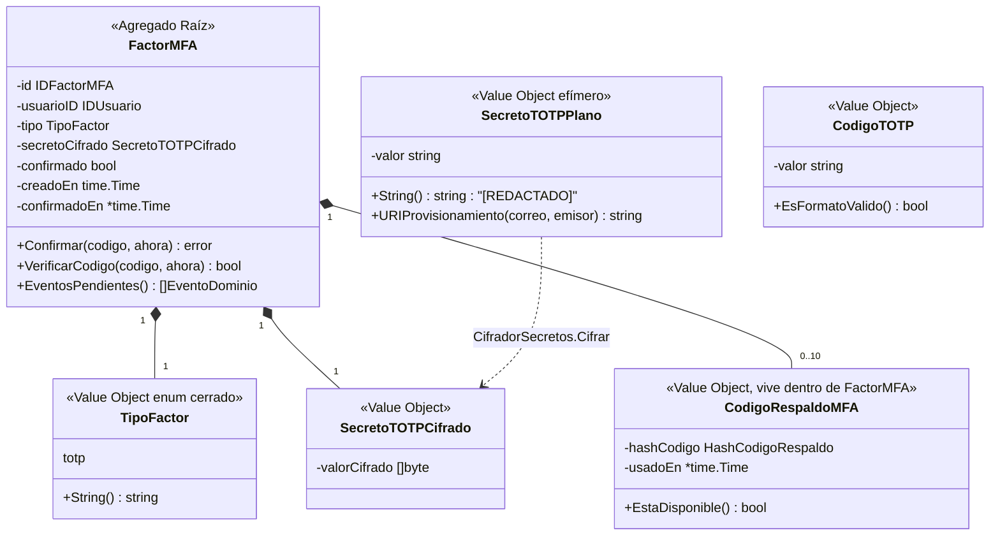

# Diseño — OTP/MFA: segundo factor y el flujo de step-up

> Estado: **propuesta de diseño (sin código Go)**. Autor: Claude Code (agente `orquestador-auth`, redactado directamente por no poder despachar `arquitecto-ddd-hexagonal` en el momento de escribir esto — límite de tasa del modelo subyacente; el contenido sigue el mismo proceso y las mismas fuentes que ese agente habría usado).
> Fecha: 2026-09-04.
> Alcance: extiende **Identidad** (factor MFA, verificación OTP) y **Acceso** (token de step-up, endpoint de segundo factor). No es un bounded context nuevo — ver §0.1, la primera decisión que este documento tiene que justificar.
> Depende de: ADR 0008 (Argon2id — no aplica al secreto TOTP, que se cifra, no se hashea), ADR 0009 (frontera Identidad/Acceso, no se reabre), ADR 0018 (Confianza + Redis), ADR 0019/0020 (sesión y firma de Acceso).
> Consumidores: **Acceso** (el flujo de login completo pasa por aquí en cuanto un usuario activa MFA), **Confianza** (nueva acción `verificar_otp`, oráculo de fuerza bruta clásico).
> Estado del código hoy: el terreno ya está preparado en código cerrado (ver §0.2) pero no existe ningún caso de uso, endpoint, tabla ni tipo de dominio para MFA/OTP todavía.

---

## 0. Punto de partida — lo que YA existe y no se reabre

### 0.1 Encuadre: extensión de dos contextos, no un tercero

`FactorMFA` y `CodigoOTP` ya aparecen en el diagrama de clases de `docs/design/identidad-bounded-context.md` (§1.2, líneas ~104-142) como agregados propios de **Identidad**, referenciados por `IDUsuario` — no como un bounded context aparte. Se respeta esa decisión: no hay una "Confianza-MFA" ni un contexto nuevo. La razón de fondo es la misma que ya cerró ADR 0009: MFA es una propiedad de la identidad del sujeto (¿qué factores puede presentar para probar quién es?), no de su sesión ni de su organización. Lo único que cruza a **Acceso** es la pieza que, por ADR 0009, nunca puede vivir en Identidad: la emisión de un token (el de step-up).

### 0.2 Lo que el código cerrado YA hace — este diseño construye sobre esto, no lo reemplaza

**En Identidad** (`internal/identidad/`, ya committeado):
- `dominio.Usuario.tieneMFA bool` existe y tiene getter `TieneMFA()`. Hoy siempre queda en `false`: no hay ningún caso de uso que lo active.
- `dominio.eventos.go` ya define y emite `SegundoFactorRequerido` (acción de auditoría `usuario.step_up_requerido`, catálogo ya sembrado).
- `aplicacion/autenticar_usuario.go` (~línea 180-219) ya calcula:
  ```go
  requiereSegundoFactor := usuario.tieneMFA || decision.RequiereStepUp
  ```
  y lo devuelve en `ResultadoAutenticacion.RequiereSegundoFactor` junto con `MotivoStepUp` (`"mfa_habilitado"` si el propio usuario activó MFA, `"confianza_baja"` si Confianza lo exige aunque no tenga MFA propio). **Identidad ya decide cuándo hace falta un segundo factor** — este diseño no toca esa decisión.
- INV-ID-08 ya está numerado en el diseño de Identidad: *"`tieneMFA == true` implica al menos un `FactorMFA` confirmado; el flag no se activa hasta que el primer factor se confirma, se desactiva al eliminar el último"*.

**En Acceso** (`internal/acceso/`, ya committeado):
- `aplicacion/iniciar_sesion.go` (~línea 78-100): si `sujeto.RequiereSegundoFactor`, el login se detiene con `&dominio.ErrSegundoFactorRequerido{MotivoStepUp: sujeto.MotivoStepUp}` — **INV-ACC-03: no se emite ninguna sesión completa**. Hoy esto es un callejón sin salida: no existe ningún endpoint para continuar.
- `dominio/reclamaciones.go` ya tiene el claim `amr` (RFC 8176) en el JWT, hoy fijo en `["pwd"]` (constante `metodosAutenticacionFase1`, `sesion.go` ~línea 440). Este diseño es la "fase 2" que ese nombre ya anticipaba.
- `docs/design/acceso-bounded-context.md` §2.3 (puertos aplazados) ya nombra `EmisorTokenStepUp`: *"token de vida corta que representa 'credenciales OK, falta el segundo factor' — depende de que Identidad implemente VerificarOTP"*. Este documento materializa exactamente ese puerto.

**Consecuencia de diseño no obvia**: como el "hueco" ya está perfectamente delimitado por el código existente, este diseño es más un *cierre* que una *apertura* — hay menos grados de libertad que en Tenencia. Donde el código ya fijó algo (el cálculo de `RequiereSegundoFactor`, la forma del error, el nombre del claim `amr`), este documento no lo reinterpreta.

---

## 1. Modelo de dominio

### 1.1 Alcance del MVP: solo TOTP — email/SMS quedan en backlog

El boceto original preveía tres tipos de factor (TOTP/email/SMS). Este diseño **limita el MVP a TOTP (RFC 6238)** y deja email/SMS como candidato explícito (*ADR candidato 0037*, §9). Razón: TOTP es **stateless en el servidor** — el secreto compartido y el reloj bastan para verificar un código, no hace falta enviar ni persistir nada en el camino caliente. Email/SMS exigen un proveedor transaccional real; hoy `NotificadorCorreoLog`/`NotificadorInvitaciones` son stubs *log-only* (mismo motivo por el que Tenencia difirió el envío real de invitaciones al agente `automatizacion-n8n`). Forzar SMS al MVP significaría construir un `EmisorOTP` que no puede probarse de verdad.

**Consecuencia directa**: el agregado `CodigoOTP` del boceto original (pensado para códigos *enviados* con expiración corta) **no hace falta para TOTP** — un código TOTP no se genera ni se persiste en el servidor, se computa en el momento de verificar a partir del secreto + el reloj. `CodigoOTP` queda declarado en §2.3 como puerto/agregado aplazado, para el día en que email/SMS se implementen, no como parte de este MVP.

### 1.2 Diagrama



### 1.3 Por qué `FactorMFA` es agregado propio, no parte de `Usuario`

Mismo criterio ya usado dos veces en este repositorio (Acceso sacó `TokenRefrescoEmitido` a veces dentro, Identidad sacó `FactorMFA`/`CodigoOTP` fuera desde el primer boceto): confirmar un código TOTP es una operación de **lectura pura, sin escritura**, que ocurre en cada login de un usuario con MFA activo — si `FactorMFA` viviera dentro de `Usuario`, cada verificación cargaría y potencialmente bloquearía el agregado completo. `FactorMFA` se referencia por `IDUsuario`, nunca por puntero.

### 1.4 Value objects

| VO | Constructor | Invariantes que garantiza |
|---|---|---|
| `IDFactorMFA` | `NuevoIDFactorMFA()` (vía puerto) | UUIDv7, mismo criterio que el resto del sistema. |
| `TipoFactor` | `TipoFactorDesde(string)` | Catálogo cerrado de **un** valor en el MVP: `"totp"`. Se declara como catálogo (no una constante suelta) para que agregar `"email"`/`"sms"` después sea aditivo, no una migración de tipo. |
| `SecretoTOTPPlano` | `NuevoSecretoTOTPPlano()` (vía puerto `GeneradorSecretoTOTP`, nunca a mano) | 160 bits de entropía (RFC 4226 recomienda ≥128, 160 es el tamaño nativo de SHA-1 usado por TOTP clásico), codificado en Base32 sin relleno (formato que exigen las apps autenticadoras). `String()`/`MarshalJSON` devuelven `"[REDACTADO]"` — mismo patrón que `TokenInvitacionPlano` de Tenencia y `ContrasenaPlana` de Identidad: es el secreto más sensible del sistema después de una contraseña, porque quien lo tiene genera códigos válidos indefinidamente. `URIProvisionamiento(correo, emisor)` construye la URI `otpauth://totp/...` que el cliente convierte en QR — es la única vía por la que el secreto en claro sale del proceso, análoga a `NotificadorInvitaciones.EnviarInvitacion`. |
| `SecretoTOTPCifrado` | `NuevoSecretoTOTPCifrado([]byte)` | El valor que persiste. **Cifrado, no hasheado** (a diferencia de contraseñas y tokens de invitación): el servidor necesita descifrarlo en cada verificación para computar el TOTP esperado. Ver §2.2, `CifradorSecretos`. |
| `CodigoTOTP` | `NuevoCodigoTOTP(string)` | Exactamente 6 dígitos ASCII. Rechazo estructural de formato antes de gastar un descifrado + cómputo HMAC. |
| `HashCodigoRespaldo` | `HashearCodigoRespaldo(plano)` | SHA-256 hex, mismo razonamiento ya usado dos veces (tokens de verificación de Identidad, tokens de invitación de Tenencia): secreto aleatorio de alta entropía generado por el sistema, sin ataque de diccionario que encarecer. |
| `CodigoRespaldoPlano` | `GenerarCodigosRespaldo(n)` (vía puerto) | 10 códigos de 10 caracteres alfanuméricos (mayúsculas + dígitos, sin caracteres ambiguos `0/O/1/I/L`), cada uno de un solo uso. Redactados en `String()` igual que `SecretoTOTPPlano`. |

### 1.5 Servicios de dominio

- **`VerificarCodigo(secretoDescifrado, codigo, ahora) bool`** — implementación TOTP (RFC 6238): HMAC-SHA1 sobre `floor(ahora.Unix() / 30)`, tolerancia de **±1 paso** (una ventana de 30s antes y después) para absorber desfase de reloj del dispositivo del usuario — tolerancia mayor abriría una ventana de fuerza bruta más ancha, tolerancia menor rompe con usuarios reales cuyo reloj no está perfectamente sincronizado. Función pura: no importa `time.Now()`, recibe `ahora` como parámetro (mismo patrón que todo el dominio del sistema).
- **`FactorMFA.Confirmar(codigo, ahora)`** — solo aplicable a un factor no confirmado; verifica el código contra el secreto recién generado y, si es válido, marca `confirmado=true`, `confirmadoEn=ahora`, y acumula el evento `FactorMFAConfirmado`. Un código incorrecto no consume ningún intento del catálogo de dominio — el throttling de intentos es de Confianza (§6, misma frontera que ya fijó ADR candidato 0011 de Identidad: *"Confianza decide 'ahora no', Identidad decide 'esta cuenta está fuera de servicio'"*).
- **`FactorMFA.VerificarCodigo(codigo, ahora)`** — usado en cada login: prueba el código contra el TOTP esperado y, si falla, contra los códigos de respaldo no usados (`CodigoRespaldoMFA.EstaDisponible()`); si un código de respaldo coincide, lo marca usado y emite `CodigoRespaldoConsumido` (para que el usuario vea en su historial cuántos le quedan).

### 1.6 Eventos de dominio (Identidad)

| Evento | Acción de auditoría | Resultado |
|---|---|---|
| `FactorMFAHabilitado` | `usuario.mfa_habilitado` | `exito` — se emite al generar el secreto (factor sin confirmar todavía) |
| `FactorMFAConfirmado` | `usuario.mfa_confirmado` | `exito` — primer código correcto; es el momento en que `tieneMFA` pasa a `true` |
| `FactorMFADeshabilitado` | `usuario.mfa_deshabilitado` | `exito` |
| `CodigoRespaldoConsumido` | `usuario.codigo_respaldo_consumido` | `exito` — señal de que el usuario perdió acceso a su TOTP; vale la pena que el propio usuario lo vea en su historial |
| `VerificacionOTPFallida` | `usuario.otp_verificacion_fallida` | `fallo` — código incorrecto en un intento de step-up. Auditado (a diferencia de una validación de token de Acceso, ADR candidato 0026): es la señal de un ataque de fuerza bruta sobre el segundo factor, exactamente el mismo criterio que ya vale para `AutorizacionDenegada` de Tenencia. |

Ningún evento transporta `SecretoTOTPPlano`, `CodigoTOTP` en claro, ni `CodigoRespaldoPlano` — verificable con el mismo test de reflexión que ya usan Identidad/Acceso/Tenencia.

---

## 2. Puertos

### 2.1 Puertos de entrada (Identidad) — nuevos, en `identidad/puertos/entrada.go`

```go
// GestorDeMFA es el puerto de entrada para el autoservicio de MFA del
// propio usuario. Todas las operaciones actúan sobre el sujeto autenticado
// (IDSujeto viene siempre del token ya validado, nunca de un parámetro que
// el cliente controle — mismo criterio que INV-TEN-12/INV-ACC-23).
type GestorDeMFA interface {
    Habilitar(ctx context.Context, cmd ComandoHabilitarMFA) (ResultadoHabilitarMFA, error)
    ConfirmarFactor(ctx context.Context, cmd ComandoConfirmarFactorMFA) (ResultadoConfirmarMFA, error)
    Deshabilitar(ctx context.Context, cmd ComandoDeshabilitarMFA) error
}

type ComandoHabilitarMFA struct {
    IDSujeto string
}
// ResultadoHabilitarMFA lleva el secreto EN CLARO y la URI de
// provisionamiento — es la única vez que salen del proceso. El cliente los
// muestra como QR/texto y los descarta; el servidor solo persiste la forma
// cifrada.
type ResultadoHabilitarMFA struct {
    IDFactor           string
    SecretoEnClaro     string // "[REDACTADO]" si se serializa por descuido
    URIProvisionamiento string
}

type ComandoConfirmarFactorMFA struct {
    IDSujeto string
    IDFactor string
    Codigo   string
}
// ResultadoConfirmarMFA lleva los 10 códigos de respaldo EN CLARO — igual
// que el secreto, solo se ven una vez. El cliente debe guardarlos ahora o
// nunca más los va a poder leer (solo su hash queda en la base).
type ResultadoConfirmarMFA struct {
    CodigosRespaldo []string
}

type ComandoDeshabilitarMFA struct {
    IDSujeto string
    Codigo   string // TOTP o de respaldo — ver INV-MFA-05, ADR candidato 0039
}

// VerificadorOTP es el puerto que ACCESO consume (vía su ACL hacia
// Identidad, mismo mecanismo que ya usa para AutenticadorDeCredenciales/
// ConsultorDeUsuarios) para completar el flujo de step-up. Deliberadamente
// angosto: Acceso nunca ve un FactorMFA, un secreto, ni una lista de
// factores — solo pregunta "¿este código es válido para este usuario,
// ahora mismo?".
type VerificadorOTP interface {
    Verificar(ctx context.Context, q ConsultaVerificarOTP) (bool, error)
}

type ConsultaVerificarOTP struct {
    IDUsuario string
    Codigo    string
    Origen    dominio.OrigenSolicitud
}
```

### 2.2 Puertos de salida (Identidad) — nuevos, en `identidad/puertos/salida.go`

```go
type RepositorioFactoresMFA interface {
    Guardar(ctx context.Context, f *dominio.FactorMFA) error
    BuscarPorID(ctx context.Context, id dominio.IDFactorMFA) (*dominio.FactorMFA, error)
    // BuscarConfirmadosDeUsuario: el camino caliente de VerificarOTP en cada
    // login — normalmente devuelve 0 o 1 fila (el MVP no ofrece múltiples
    // factores simultáneos, aunque el esquema no lo impide para el futuro).
    BuscarConfirmadosDeUsuario(ctx context.Context, u dominio.IDUsuario) ([]*dominio.FactorMFA, error)
    ContarConfirmadosDeUsuario(ctx context.Context, u dominio.IDUsuario) (int, error)
}

// GeneradorSecretoTOTP produce el secreto de alta entropía. El dominio
// nunca genera bytes aleatorios por sí mismo.
type GeneradorSecretoTOTP interface {
    GenerarSecreto() (dominio.SecretoTOTPPlano, error)
    GenerarCodigosRespaldo(n int) ([]dominio.CodigoRespaldoPlano, error)
}

// CifradorSecretos cifra/descifra el secreto TOTP en reposo. A diferencia
// de HasherContrasenas (Argon2id, de un solo sentido), esto es cifrado
// SIMÉTRICO REVERSIBLE — el servidor tiene que poder leer el secreto para
// computar el código esperado. AES-256-GCM, llave desde configuración
// (mismo patrón de gestión que ACCESO_LLAVE_FIRMA — ver ADR candidato
// 0038 sobre dónde vive esa llave y el comportamiento fail-closed en
// producción).
type CifradorSecretos interface {
    Cifrar(secreto dominio.SecretoTOTPPlano) (dominio.SecretoTOTPCifrado, error)
    Descifrar(cifrado dominio.SecretoTOTPCifrado) (dominio.SecretoTOTPPlano, error)
}
```

### 2.3 Puertos aplazados (fase 2, ya nombrados para que nadie los reinvente con otro nombre)

`RepositorioCodigosOTP` + `EmisorOTP` (interfaz `OTPSender`) + agregado `CodigoOTP`: para cuando email/SMS entren al catálogo de `TipoFactor` (*ADR candidato 0037*). `ProveedorU2F`/`WebAuthn` para llaves de seguridad físicas: ni siquiera estaba en el boceto original, se nombra aquí porque es la extensión obvia una vez que TOTP exista, y para que no se confunda con TOTP si alguien lo propone después.

### 2.4 Puerto nuevo en Acceso — `EmisorTokenStepUp`

```go
// EmisorTokenStepUp materializa el puerto que acceso/puertos/salida.go
// (o el archivo que corresponda) ya tenía nombrado como aplazado (§2.3 del
// diseño de Acceso). Un token de step-up NO es una sesión: no tiene fila
// en `sesiones`, no tiene refresh token, y JAMÁS puede usarse donde se
// espera un token de acceso normal (ver INV-MFA-03, el típico ataque de
// "algorithm/type confusion" pero aplicado a REUTILIZAR un token de otro
// propósito).
type EmisorTokenStepUp interface {
    Emitir(ctx context.Context, idUsuario string, motivoStepUp string, ahora time.Time) (TokenStepUp, error)
    Validar(ctx context.Context, tokenCompacto string) (ClaimsStepUp, error)
}

type ClaimsStepUp struct {
    IDUsuario    string
    MotivoStepUp string
}
```

---

## 3. Casos de uso

### 3.1 `HabilitarMFA` (Identidad)

1. Verificar que el sujeto está `activo` (mismo patrón que cualquier operación de cuenta).
2. Verificar que no exceda el máximo de factores confirmados (**1** en el MVP — `ErrLimiteFactoresMFAExcedido` si ya tiene uno; habilitar de nuevo sin deshabilitar antes no tiene sentido con un solo tipo de factor).
3. Generar el secreto (`GeneradorSecretoTOTP.GenerarSecreto()`), cifrarlo (`CifradorSecretos.Cifrar`), crear el `FactorMFA` sin confirmar, guardar.
4. Emitir `FactorMFAHabilitado` (se audita: es una operación sensible aunque todavía no active nada).
5. Devolver el secreto **en claro** (única vez) + la URI de provisionamiento. El cliente construye el QR; el servidor ya no vuelve a tener el secreto en claro después de esta respuesta.

### 3.2 `ConfirmarFactorMFA` (Identidad)

1. Cargar el `FactorMFA` sin confirmar del sujeto.
2. Descifrar el secreto, verificar el código (`dominio.VerificarCodigo`).
3. Si es válido: `FactorMFA.Confirmar(...)`, generar 10 códigos de respaldo (`GenerarCodigosRespaldo(10)`), hashear cada uno y guardarlos, **flip coordinado** `Usuario.tieneMFA = true` (INV-ID-08: el flag se activa exactamente aquí, nunca en `HabilitarMFA`) — todo en la misma `UnidadDeTrabajo`.
4. Emitir `FactorMFAConfirmado`.
5. Devolver los 10 códigos de respaldo **en claro** (única vez).

### 3.3 `DeshabilitarMFA` (Identidad)

Exige un código válido (TOTP o de respaldo) en el propio comando — **no basta con estar autenticado** (*ADR candidato 0039*, INV-MFA-05, §9): una sesión robada no debería poder desarmar el segundo factor de la cuenta que la protege sin volver a demostrar posesión del factor. Verifica, elimina el `FactorMFA`, flip `tieneMFA = false` si no queda ningún otro confirmado (hoy siempre, MVP de un solo factor), emite `FactorMFADeshabilitado`.

### 3.4 `VerificarOTP` (Identidad) — implementa `puertos.VerificadorOTP`

El camino caliente, consumido por Acceso en cada login con step-up:

1. `RepositorioFactoresMFA.BuscarConfirmadosDeUsuario(idUsuario)`.
2. Si no hay ninguno: esto no debería poder pasar (`RequiereSegundoFactor` ya exigió `tieneMFA` o una decisión de Confianza) — devolver `false` sin auditar como fallo del usuario, sí como inconsistencia interna (`slog.Error`, INV-MFA-06).
3. `FactorMFA.VerificarCodigo(codigo, ahora)` contra cada factor confirmado.
4. Éxito: devolver `true`, **sin auditar** el éxito puntual (el evento de auditoría relevante ya lo dispara Acceso al completar el login — mismo criterio de "no dupliques la auditoría entre quien pregunta y quien decide" que ya usa Tenencia con `AutorizacionDenegada`).
5. Fallo: emitir `VerificacionOTPFallida`, devolver `false`.

### 3.5 `IniciarSesion` (Acceso) — extensión de código cerrado, mínima y quirúrgica

**No se reescribe el flujo existente.** El único cambio: donde hoy `IniciarSesion` devuelve `ErrSegundoFactorRequerido` y termina, ahora **antes de devolver ese error**, emite un `TokenStepUp` (`EmisorTokenStepUp.Emitir(idUsuario, motivoStepUp, ahora)`) y lo adjunta al error:

```go
if sujeto.RequiereSegundoFactor {
    tokenStepUp, err := c.emisorStepUp.Emitir(ctx, sujeto.IDUsuario, sujeto.MotivoStepUp, ahora)
    if err != nil { return puertos.ResultadoSesion{}, err }
    return puertos.ResultadoSesion{}, &dominio.ErrSegundoFactorRequerido{
        MotivoStepUp: sujeto.MotivoStepUp,
        TokenStepUp:  tokenStepUp.Compacto(), // campo NUEVO en el error ya existente
    }
}
```

`ErrSegundoFactorRequerido` gana un campo, no cambia de forma — el adaptador HTTP de Acceso ya lo traduce a un `401`/`403` con cuerpo RFC 9457 (`errores_http.go`); ese cuerpo gana el campo `token_step_up`.

### 3.6 `CompletarSegundoFactor` (Acceso) — caso de uso nuevo

1. `EmisorTokenStepUp.Validar(tokenStepUp)` — verifica firma, expiración (**5 minutos**, mucho más corto que el token de acceso normal de 10 minutos: es una ventana de fuerza bruta sobre 6 dígitos, cuanto más corta mejor) y que el `typ` de cabecera sea el distintivo de step-up, nunca `at+jwt` (defensa de *type confusion*, INV-MFA-03).
2. Evaluar Confianza (`Accion="verificar_otp"`, clave por `IDUsuario` — es un ataque dirigido a una cuenta concreta, no a una IP genérica).
3. `VerificadorOTP.Verificar(idUsuario, codigo)` por puerto hacia Identidad (vía el ACL ya existente `acceso/adaptadores/identidad/`, que gana un método más).
4. Si es válido: ejecutar **exactamente la misma lógica de emisión de sesión** que `IniciarSesion` ya tenía lista antes de bifurcar por `RequiereSegundoFactor` (refactorizada a una función interna compartida `emitirSesionCompleta(...)`), con `amr = ["pwd", "otp"]` en el JWT resultante — el único punto del sistema que emite ese claim con dos elementos.
5. Si es inválido: `401` — mismo criterio de "un solo error genérico" que ya usa el sistema en cada verificación de secreto (no se distingue "código incorrecto" de "token de step-up expirado" en el cuerpo, para no dar información de diagnóstico gratis a quien está probando fuerza bruta).

---

## 4. Invariantes de negocio

| # | Invariante |
|---|---|
| **INV-MFA-01** | `Usuario.tieneMFA == true` implica al menos un `FactorMFA` confirmado (INV-ID-08, ya numerado en Identidad — este documento no le asigna un número nuevo, lo hereda). |
| **INV-MFA-02** | El secreto TOTP nunca se persiste en claro; solo su forma cifrada con `CifradorSecretos`. El secreto en claro sale del proceso exactamente una vez (respuesta de `HabilitarMFA`) y nunca más. |
| **INV-MFA-03** | Un `TokenStepUp` nunca es aceptado donde se espera un token de acceso normal, ni viceversa — se distinguen por `typ` de cabecera, verificado explícitamente en cada validador (mismo patrón que INV-ACC-14 de Acceso contra *algorithm confusion*). |
| **INV-MFA-04** | Un `TokenStepUp` vive **5 minutos**, sin refresco posible: expirado, el usuario tiene que volver a loguear con contraseña desde cero. |
| **INV-MFA-05** | Deshabilitar MFA exige un código válido (TOTP o de respaldo) del propio factor que se está desactivando — nunca basta con estar autenticado con un token de acceso normal. |
| **INV-MFA-06** | Cada código de respaldo se consume **una sola vez**; un código ya usado nunca vuelve a ser válido, sin excepción. |
| **INV-MFA-07** | Ningún evento de dominio ni fila de auditoría transporta el secreto TOTP, un código en claro, ni un código de respaldo en claro. |
| **INV-MFA-08** | `VerificarOTP` no distingue, en su respuesta observable, "código incorrecto" de "el usuario no tiene ningún factor confirmado" (esto último no debería ocurrir nunca, pero si ocurriera por un bug, no debe filtrar información de diagnóstico al cliente). |

---

## 5. Estructura de carpetas (incremental sobre lo existente)

```
internal/identidad/
├── dominio/
│   ├── factor_mfa.go              # nuevo
│   ├── totp.go                    # nuevo: VerificarCodigo, VOs de secreto/código
│   └── codigo_respaldo.go         # nuevo
├── aplicacion/
│   ├── habilitar_mfa.go           # nuevo
│   ├── confirmar_factor_mfa.go    # nuevo
│   ├── deshabilitar_mfa.go        # nuevo
│   └── verificar_otp.go           # nuevo
└── adaptadores/
    ├── postgres/
    │   └── repositorio_factores_mfa.go   # nuevo
    └── cripto/
        ├── generador_totp.go              # nuevo (GeneradorSecretoTOTP)
        └── cifrador_secretos_aes_gcm.go   # nuevo (CifradorSecretos)

internal/acceso/
├── aplicacion/
│   └── completar_segundo_factor.go   # nuevo
├── dominio/
│   └── errores.go                    # ErrSegundoFactorRequerido gana el campo TokenStepUp
└── adaptadores/
    ├── jwt/
    │   └── emisor_token_step_up.go   # nuevo (implementa EmisorTokenStepUp)
    └── identidad/
        └── verificador_otp.go        # nuevo método en el ACL ya existente
```

---

## 6. Migraciones necesarias

**`000015_crear_factores_mfa.{up,down}.sql`** (siguiente número libre tras `000014` de Tenencia):

```sql
CREATE TABLE factores_mfa (
    id              UUID        PRIMARY KEY,  -- UUIDv7 generado por la app
    usuario_id      UUID        NOT NULL REFERENCES usuarios(id),
    tipo            TEXT        NOT NULL,
    secreto_cifrado BYTEA       NOT NULL,
    confirmado      BOOLEAN     NOT NULL DEFAULT false,
    creado_en       TIMESTAMPTZ NOT NULL,
    confirmado_en   TIMESTAMPTZ,

    CONSTRAINT factores_mfa_tipo_valido CHECK (tipo IN ('totp')),
    CONSTRAINT factores_mfa_confirmacion_coherente CHECK (confirmado = (confirmado_en IS NOT NULL))
);

-- Un usuario, un factor confirmado a la vez en el MVP (INV-MFA-01 del lado
-- "no más de uno"). Parcial: un factor sin confirmar no cuenta, para poder
-- reintentar HabilitarMFA sin chocar contra un intento abandonado.
CREATE UNIQUE INDEX factores_mfa_confirmado_por_usuario_idx
    ON factores_mfa (usuario_id) WHERE confirmado = true;

CREATE TABLE codigos_respaldo_mfa (
    id           UUID        PRIMARY KEY,
    factor_id    UUID        NOT NULL REFERENCES factores_mfa(id),
    hash_codigo  TEXT        NOT NULL,
    usado_en     TIMESTAMPTZ,

    CONSTRAINT codigos_respaldo_hash_formato CHECK (hash_codigo ~ '^[0-9a-f]{64}$')
);

CREATE UNIQUE INDEX codigos_respaldo_hash_idx ON codigos_respaldo_mfa (hash_codigo);

REVOKE ALL ON factores_mfa, codigos_respaldo_mfa FROM PUBLIC;
GRANT SELECT, INSERT, UPDATE ON factores_mfa, codigos_respaldo_mfa TO rol_aplicacion;
REVOKE DELETE, TRUNCATE ON factores_mfa, codigos_respaldo_mfa FROM rol_aplicacion;
```

Sin RLS: estas tablas no son multi-tenant, se acotan por `usuario_id` como todo lo demás de Identidad.

**Catálogo de auditoría**: 5 acciones nuevas (`usuario.mfa_habilitado`, `usuario.mfa_confirmado`, `usuario.mfa_deshabilitado`, `usuario.codigo_respaldo_consumido`, `usuario.otp_verificacion_fallida`) — mismo mecanismo que las migraciones `000007`/`000012` ya usaron para Acceso/Tenencia.

---

## 7. Endpoints HTTP

### Identidad — autoservicio de MFA (todos exigen Bearer, todos actúan sobre el propio sujeto — sin parámetro de ID en la ruta, mismo criterio que `/acceso/sesiones/actual`)

| Método | Ruta | Descripción | Errores |
|---|---|---|---|
| `POST` | `/identidad/usuarios/actual/factores-mfa` | Habilitar MFA — devuelve secreto + URI de QR (una sola vez) | 401; 409 `ErrLimiteFactoresMFAExcedido` |
| `POST` | `/identidad/usuarios/actual/factores-mfa/confirmacion` | Confirmar con el primer código — devuelve 10 códigos de respaldo (una sola vez) | 401; 404 factor no encontrado; 422 código inválido |
| `DELETE` | `/identidad/usuarios/actual/factores-mfa` | Deshabilitar — exige `codigo` en el cuerpo | 401; 422 código inválido |

### Acceso — completar el login

| Método | Ruta | Descripción | Errores |
|---|---|---|---|
| `POST` | `/acceso/sesiones/segundo-factor` | Completa el login iniciado con `POST /acceso/sesiones` que devolvió `token_step_up` | 401 token de step-up inválido/expirado o código incorrecto (mismo cuerpo para ambos, INV-MFA-08); 429 Confianza |

Rate limit (Confianza, ADR 0018): `verificar_otp` — **5/15min por usuario**, 20/15min por IP (oráculo de fuerza bruta sobre 10⁶ combinaciones con ventanas de 30s; agresivo por diseño, igual criterio que `aceptar_invitacion` de Tenencia sobre su propio secreto).

---

## 8. Auditoría

Las 5 acciones de §6 se auditan siempre. `VerificacionOTPFallida` es, junto con `AutorizacionDenegada` de Tenencia, una de las pocas excepciones documentadas a "no auditar cada validación" (ADR candidato 0026 de Acceso): un fallo de OTP es señal de ataque activo sobre una cuenta concreta, no ruido de tráfico normal como un token expirado.

---

## 9. Decisiones no obvias → ADRs

**Números ya usados**: 0001-0009, 0017-0020, 0029-0036 (Tenencia agotó su rango reservado). **Este documento toma 0037-0040.**

| # | Decisión | Resumen |
|---|---|---|
| **0037** | MVP limitado a TOTP (RFC 6238); email/SMS OTP quedan en backlog con `CodigoOTP`/`EmisorOTP` ya nombrados | TOTP es *stateless* en el servidor (secreto + reloj, sin envío ni persistencia de código); email/SMS exigen un proveedor transaccional real que el stack no tiene todavía (mismo motivo por el que Tenencia difirió el envío de invitaciones). |
| **0038** | Token de step-up: JWT propio de Acceso, TTL de 5 minutos, `typ` de cabecera distinto del token de acceso normal | Necesario para que `EmisorTokenStepUp` (ya nombrado como puerto aplazado en el diseño de Acceso) no pueda confundirse con un token de sesión completa — mismo criterio de defensa que INV-ACC-14 contra *algorithm confusion*, aplicado a *token-purpose confusion*. |
| **0039** | Deshabilitar MFA exige el propio código (TOTP o de respaldo), no basta con estar autenticado | Una sesión robada no debería poder desarmar la protección que la propia sesión debería tener. Mismo espíritu que exigir la contraseña actual para `CambiarContrasena`, ya mencionado como caso de uso de backlog en el diseño de Identidad. |
| **0040** | Códigos de respaldo generados en la confirmación (no en la habilitación), 10 unidades, mostrados una sola vez, consumo de a uno | Generarlos en `HabilitarMFA` sería prematuro: si el usuario nunca confirma el factor, quedarían códigos de respaldo válidos para un factor que nunca se activó. Generarlos junto con la confirmación ata su existencia al momento exacto en que `tieneMFA` pasa a `true`. |

---

## 10. Secuencia sugerida de implementación

1. `identidad/dominio`: `FactorMFA`, VOs de secreto/código, `VerificarCodigo` (TOTP puro, sin dependencias externas salvo una biblioteca de HMAC — la stdlib de Go alcanza, `crypto/hmac` + `crypto/sha1`, aunque conviene evaluar una biblioteca ya probada como `github.com/pquerna/otp` para no reinventar el manejo de Base32/ventanas de tolerancia — decisión de infraestructura, no de este documento).
2. `identidad/puertos` (entrada + salida) y mocks.
3. Migración `000015`.
4. `identidad/aplicacion`: `HabilitarMFA`, `ConfirmarFactorMFA`, `DeshabilitarMFA`, `VerificarOTP` (implementa `puertos.VerificadorOTP`).
5. `acceso/dominio`: campo `TokenStepUp` en `ErrSegundoFactorRequerido`; `acceso/puertos`: `EmisorTokenStepUp`.
6. `acceso/aplicacion`: refactor mínimo de `IniciarSesion` (emitir el token de step-up antes de devolver el error) + `CompletarSegundoFactor` nuevo.
7. Adaptadores de infraestructura: `CifradorSecretos` (AES-256-GCM), `GeneradorSecretoTOTP`, repositorio Postgres, `EmisorTokenStepUp` sobre `jwx/v2` (reutiliza el `Llavero` de Acceso, ADR 0020 — es la misma llave de firma, un `typ` de cabecera distinto alcanza, no hace falta una segunda llave).
8. HTTP: los 3 endpoints de Identidad + el 1 de Acceso.
9. Cambios en Confianza: acción `verificar_otp` con sus umbrales.
10. Tests de integración: habilitar→confirmar→login con OTP→sesión completa con `amr=["pwd","otp"]`; código incorrecto repetido→rate limit de Confianza; código de respaldo consumido no reutilizable; deshabilitar sin código correcto→rechazado; token de step-up expirado→rechazado; intento de usar un token de step-up como Bearer normal en cualquier endpoint protegido→rechazado (INV-MFA-03).

---

## 11. Cambios requeridos en código ya cerrado

- **`internal/acceso/dominio/errores.go`**: `ErrSegundoFactorRequerido` gana el campo `TokenStepUp string` — aditivo, no rompe a quien ya lo usa.
- **`internal/acceso/aplicacion/iniciar_sesion.go`**: la rama de `RequiereSegundoFactor` pasa de "devolver el error" a "emitir el token de step-up y devolver el error con él adentro" — tres líneas, sin tocar el resto del caso de uso.
- **`internal/acceso/adaptadores/http/errores_http.go`** y **`dtos.go`**: el cuerpo del `401`/`403` de `POST /acceso/sesiones` gana el campo `token_step_up` cuando el motivo es step-up.
- **`internal/acceso/adaptadores/identidad/`** (el ACL de Acceso hacia Identidad): gana el método que implementa `puertos.VerificadorOTP.Verificar` sobre `identidad/puertos.VerificadorOTP`.
- **Ningún cambio** en Tenencia ni en Confianza más allá de la acción/umbral nuevos ya descritos en §7.
