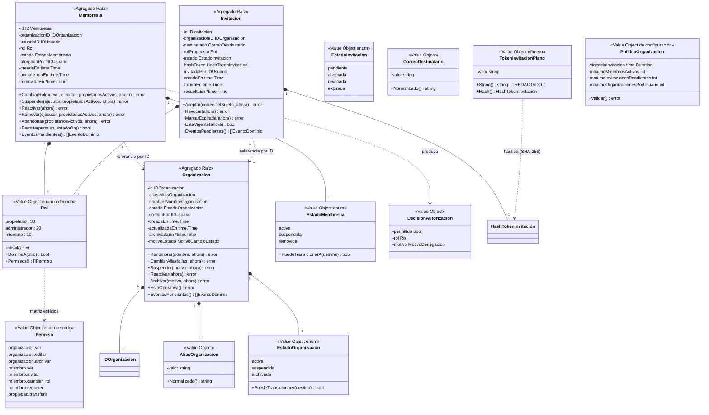
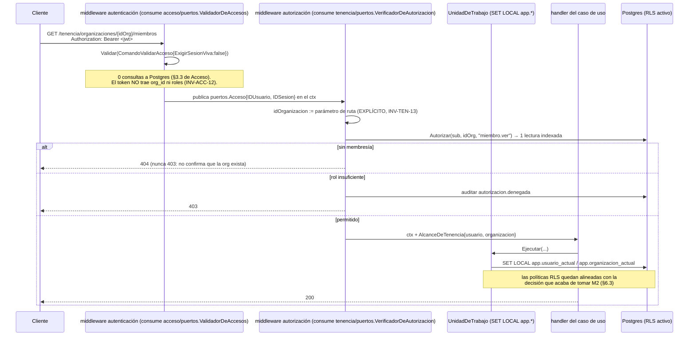

# Diseño — Bounded Context **Tenencia**

> Estado: **implementada**. Autor original: agente `arquitecto-ddd-hexagonal`.
> Fecha del diseño original: 2026-09-03. Fecha de cierre de implementación y
> documentación: 2026-09-04.
> Alcance: entidades, value objects, agregados, puertos, casos de uso, invariantes, eventos, migraciones y endpoints del contexto **Tenencia**.
> Depende de: **ADR 0002 (un solo producto — no se reabre: organizaciones = tenants, sin capa de producto)**, ADR 0004 (nombres de tablas), ADR 0005 (auditoría forense hash-chained), ADR 0006 (Huma v2), ADR 0007 (español en dominio/aplicación/puertos), **ADR 0009 (frontera Identidad/Acceso — no se reabre)**, ADR 0017 (rol de login acotado: toda tabla nueva necesita `GRANT` explícito), ADR 0018 (Confianza + Redis), ADR 0019/0020 (sesión y firma de Acceso), ADR 0029/0030/0031 (modelo de roles, autorización por consulta, RLS — ver más abajo).
> Consumidores: **Identidad** (cierra la autorización de `GET /identidad/usuarios/{id}` — ya implementado), **Confianza** (obtiene por fin una clave real de tenant), **Auditoría** (recibe los eventos y, por primera vez, un `organizacion_id` no nulo).
>
> **Estado del código hoy: implementado end-to-end** (dominio, puertos,
> aplicación, migraciones `000009`/`000012`/`000013`/`000014`,
> adaptadores Postgres/HTTP con Huma v2, RLS activo) y verificado en vivo
> contra un servidor real (Postgres+Redis reales): creación de
> organización, aislamiento 404 entre organizaciones ajenas, alta de
> miembro, cierre de la autorización de `GET /identidad/usuarios/{id}`,
> flujo completo de invitación (invitar → registrar → loguear → aceptar,
> sin que el token en claro salga nunca por HTTP) e integridad de la
> cadena de auditoría con `organizacion_id` poblado. La referencia
> **operativa** para integradores es `internal/tenencia/README.md` — este
> documento sigue siendo la referencia normativa de diseño, pero donde
> discrepe con el código, **el código es la fuente de verdad**; las
> discrepancias puntuales detectadas quedan anotadas en línea más abajo en
> vez de reescribir el documento entero.

---

## 0. Responsabilidad del contexto (y lo que explícitamente NO hace)

**Tenencia responde una sola pregunta**: *¿qué puede hacer este sujeto, y dentro de qué organización?*

Es la pregunta que hoy **nadie** contesta en el sistema. Identidad sabe *quién es* (ADR 0009), Acceso sabe *que sigue siendo él* (ADR 0019), y ahí se acaba: `internal/identidad/README.md` lo dice sin rodeos — *"cualquier sujeto con un token de acceso válido puede consultar cualquier `id`"*.

| Sí es de Tenencia | No es de Tenencia |
|---|---|
| Organizaciones (los *tenants* de ADR 0002): alta, datos, ciclo de vida | Quién es el sujeto y si puede probarlo → **Identidad** |
| Membresías: qué usuario pertenece a qué organización y con qué rol | Emitir/validar el token, sesiones, refresco → **Acceso** |
| Catálogo cerrado de roles y la matriz rol → permisos | Rate limiting, captcha, score de riesgo → **Confianza** |
| Decidir "¿este sujeto puede ejecutar esta acción en esta organización?" | Persistir la bitácora forense y encadenar hashes → **Auditoría** |
| Invitaciones por correo y su redención | Enviar el correo de la invitación (`NotificadorInvitacionesResend`, directo contra Resend — ADR 0054) |
| El aislamiento multi-tenant en la base de datos (RLS) | Verificar contraseñas, MFA, estado de la cuenta (Tenencia *pregunta* por puerto; **Identidad** *decide*) |

**Consecuencia de diseño no obvia #1 (la más importante de todo el documento)**: el token de acceso **no trae** `roles`, `permisos`, `org_id` ni `tenant_id` — es INV-ACC-12, ya implementado y ya documentado en `internal/acceso/README.md` (*"Si tu integración necesita saber el rol o la organización del usuario, ese dato no está en el JWT [...] no lo infieras del token"*). Tenencia **no pide que eso cambie**. La autorización se resuelve preguntándole a Tenencia por puerto, en cada petición, con el `sub` que el token ya validado aportó y con un `IDOrganizacion` **explícito** que viene de la ruta. Ver §3.7, INV-TEN-13/15 y *ADR candidato 0030* — que es exactamente la "decisión adyacente" que ADR candidato 0025 de Acceso dejó abierta y delegó en Tenencia.

**Consecuencia de diseño no obvia #2**: Tenencia **no puede resolver un correo a un `usuario_id`**. Identidad expone `ConsultorDeUsuarios.ObtenerPorID`, no una búsqueda por correo, y pedirle una sería construir un oráculo de enumeración de usuarios operable desde cualquier endpoint de invitación — justo lo que INV-ID-11 y *ADR candidato 0013* protegen. De ahí que invitar **no** sea "crear una membresía en estado pendiente" sino un agregado propio (`Invitacion`) con un token de un solo uso, redimido por el invitado ya autenticado. Ver §3.5 y *ADR candidato 0033*.

**Consecuencia de diseño no obvia #3**: Tenencia es el primer contexto que puebla `auditoria.organizacion_id`, una columna que existe desde `000002_crear_auditoria.up.sql` con el comentario *"NULL hasta que exista Tenencia"* y que ya está dentro del payload canónico del hash-chaining. No hace falta ninguna migración de auditoría para eso: solo que el ACL la mande.

---

## 1. Modelo de dominio

### 1.1 Diagrama



### 1.2 Agregados

| Agregado | Raíz | Contenido | Frontera transaccional |
|---|---|---|---|
| **Organizacion** | `Organizacion` | `IDOrganizacion`, `AliasOrganizacion`, `NombreOrganizacion`, `EstadoOrganizacion`, autoría y marcas de tiempo | Una transacción por organización. **Excepción normativa y única**: `CrearOrganizacion` escribe la organización *y* la membresía `propietario` de su creador en la misma transacción (INV-TEN-03) — no hay ningún instante, ni siquiera transitorio, en que exista una organización sin dueño. |
| **Membresia** | `Membresia` | `IDMembresia`, `IDOrganizacion`, `IDUsuario`, `Rol`, `EstadoMembresia`, autoría y marcas de tiempo | Una transacción por membresía. Las operaciones que pueden alterar el conteo de propietarios se serializan tomando el candado de la fila de `organizaciones` (§3.2). |
| **Invitacion** | `Invitacion` | `IDInvitacion`, `IDOrganizacion`, `CorreoDestinatario`, `Rol` propuesto, `EstadoInvitacion`, `HashTokenInvitacion`, ventana de vigencia | Agregado propio, ciclo de vida corto. Aceptarla crea una `Membresia` **en la misma unidad de trabajo** (dos agregados, una transacción, coordinada por el caso de uso — no por un agregado que contenga al otro). |

**Por qué `Membresia` NO vive dentro del agregado `Organizacion`** (la decisión de modelado más disputable del contexto): el criterio ya establecido en el repositorio tiene dos precedentes opuestos y hay que decir cuál aplica.

- Identidad sacó `FactorMFA`/`CodigoOTP` de `Usuario` porque *"tienen un ciclo de vida y una frecuencia de escritura totalmente distintos [...] meterlos dentro obligaría a cargar y bloquear el `Usuario` completo para verificar un código de 6 dígitos"*.
- Acceso metió `TokenRefrescoEmitido` dentro de `Sesion` porque *"un token de refresco no existe fuera de una sesión, nunca se muta sin mutar la sesión, y la operación de negocio 'rotar' es indivisible entre ambos"*.

`Membresia` cumple la primera mitad del criterio de Acceso (no existe fuera de una organización) pero **falla la segunda**: cambiarle el rol a un miembro no muta la organización, y una organización puede tener miles de miembros. Modelarla dentro obligaría a cargar la colección completa para tocar una fila — exactamente el olor que Identidad rechazó. Gana el precedente de Identidad: **agregado propio, referenciado por identidad**.

**El costo de esa decisión, explícito**: INV-TEN-06 ("al menos un propietario activo") es un invariante **entre agregados**, que por definición no se puede sostener dentro de uno solo. Se sostiene con dos mecanismos complementarios, ninguno de los cuales es "una comprobación en la aplicación y confiamos":

1. **Serialización**: todo caso de uso que pueda reducir el conteo de propietarios (cambiar rol, suspender, remover, abandonar, suspender la organización) toma primero el candado de la fila raíz — `RepositorioOrganizaciones.CargarParaActualizar` (`SELECT ... FOR UPDATE`) — y solo entonces cuenta propietarios activos. La fila de `organizaciones` actúa como *token de consistencia* del conjunto de membresías. Es el patrón canónico de DDD para un invariante de conjunto con raíz identificable.
2. **Garantía estructural**: un `CONSTRAINT TRIGGER ... DEFERRABLE INITIALLY DEFERRED` en `membresias` que, al hacer commit, rechaza cualquier organización `activa` que se quede sin propietario activo (§6). Es diferido a propósito: `CrearOrganizacion` y `TransferirPropiedad` pasan por estados intermedios legítimos dentro de la transacción.

Mismo espíritu que INV-ID-02 (unicidad de correo garantizada por índice, no por consulta previa) e INV-ACC-04 (un refresco vigente garantizado por índice único parcial). Ver *ADR candidato 0032*.

**Por qué `Rol` es un value object y no una entidad**: en el MVP no hay roles definidos por organización. Ver §1.3 y *ADR candidato 0029*.

**Qué NO es parte de ningún agregado**: el `usuario_id` de una membresía es un identificador opaco para Tenencia. Tenencia no conoce el correo, el estado de la cuenta ni el nombre de ese usuario salvo por lo que le devuelva un puerto (§2.2), y **nunca** por una lectura de la tabla `usuarios` (INV-TEN-29).

### 1.3 Value objects (todos inmutables, validados en el constructor)

| VO | Constructor | Invariantes que garantiza |
|---|---|---|
| `IDOrganizacion` | `NuevoIDOrganizacion()` (vía puerto) / `IDOrganizacionDesde(string)` | UUID válido y no nulo. **UUIDv7** (ordenable, mejora la localidad de índice; no es secreto: viaja en la ruta HTTP). |
| `IDMembresia` | `NuevoIDMembresia()` / `IDMembresiaDesde(string)` | UUIDv7. Idem. |
| `IDInvitacion` | `NuevoIDInvitacion()` / `IDInvitacionDesde(string)` | UUIDv7. **No es el token**: es el identificador administrativo con el que un admin revoca la invitación desde su panel. El secreto es otro campo. |
| `IDUsuario` | `IDUsuarioDesde(string)` | UUID válido y no nulo. **Tipo propio de `tenencia/dominio`**, no el de Identidad ni el de Acceso (§1.7). |
| `AliasOrganizacion` | `NuevoAlias(crudo string)` | `TrimSpace`; normalización Unicode NFC; **minúsculas completas**; solo `[a-z0-9-]`; longitud entre 3 y 48; no empieza ni termina en `-`; sin `--` consecutivos; no pertenece a una lista corta de reservados (`admin`, `api`, `acceso`, `identidad`, `tenencia`, `well-known`, `nuevo`). La normalización es la misma familia de decisión que ADR candidato 0015 para `Correo`: se normaliza para que `Acme` y `acme` no puedan coexistir. |
| `NombreOrganizacion` | `NuevoNombre(string)` | No vacío tras `TrimSpace`; NFC; longitud ≤ 120; rechaza caracteres de control y CRLF. A diferencia del alias **no se pasa a minúsculas** (es texto de presentación) y **no es único**. |
| `Rol` | `RolDesde(string)` | Catálogo **cerrado y totalmente ordenado**: `propietario` (30) > `administrador` (20) > `miembro` (10). El orden total es lo que hace que "¿tiene al menos el rol X?" y "¿puede tocar a este otro miembro?" sean comparaciones y no una tabla de casos. Expone `Permisos()` a partir de una matriz estática. |
| `Permiso` | `PermisoDesde(string)` | Catálogo cerrado de 8 valores (§1.4). Es el vocabulario con el que **otros contextos** piden autorización, así que es parte del contrato público del contexto y no se construye concatenando strings (mismo criterio que INV-ID-17 para las acciones de auditoría — pero ojo, son dos catálogos distintos que casualmente comparten la forma `recurso.accion`: uno vive en el dominio de Tenencia, el otro en la tabla `auditoria_acciones`). |
| `EstadoOrganizacion` | `EstadoOrganizacionDesde(string)` | Catálogo cerrado (`activa`, `suspendida`, `archivada`); conoce sus transiciones legales. |
| `EstadoMembresia` | `EstadoMembresiaDesde(string)` | Catálogo cerrado (`activa`, `suspendida`, `removida`); `removida` es terminal. |
| `EstadoInvitacion` | `EstadoInvitacionDesde(string)` | Catálogo cerrado (`pendiente`, `aceptada`, `revocada`, `expirada`); las tres últimas son terminales. |
| `CorreoDestinatario` | `NuevoCorreoDestinatario(crudo string)` | Mismas reglas estructurales y de normalización que `identidad/dominio.Correo` (minúsculas completas, NFC, una sola `@`, ≤254, sin CRLF). **Tipo propio y duplicado a conciencia** (§1.7): Tenencia necesita normalizar un correo para comparar destinatarios, pero no puede importar el VO de Identidad. |
| `TokenInvitacionPlano` | `NuevoTokenInvitacionPlano(string)` | Prefijo `mot_inv_` + ≥43 chars base64url (32 bytes de entropía), exactamente el mismo criterio que `mot_rt_` en Acceso. Implementa `String()`/`GoString()`/`MarshalJSON` devolviendo `[REDACTADO]`. |
| `HashTokenInvitacion` | `HashearTokenInvitacion(plano)` / `NuevoHashTokenInvitacion(hex)` | 64 caracteres hex en minúscula (SHA-256). **SHA-256 y no Argon2id**, por el razonamiento ya establecido dos veces en el repositorio (`identidad/aplicacion/tokens_verificacion.go` y §1.3 de Acceso): secreto aleatorio de alta entropía generado por el sistema, sin ataque de diccionario posible. Comparación en tiempo constante (`crypto/subtle`). |
| `MotivoCambioEstado` | `NuevoMotivo(string)` | Texto acotado (≤ 280) y no vacío al suspender o archivar. Mismo VO conceptual que en Identidad: suspender un tenant completo exige decir por qué. |
| `MotivoDenegacion` | `MotivoDenegacionDesde(string)` | Catálogo **cerrado**: `sin_membresia`, `membresia_suspendida`, `organizacion_no_operativa`, `rol_insuficiente`. Es lo que determina si el adaptador HTTP responde 404 o 403 (INV-TEN-17) y lo que alimenta las métricas de intentos de escalada; un string libre haría imposible responder "¿cuántos intentos de escalada de privilegios hubo este mes?" sin parsear texto (mismo argumento que `MotivoRevocacion` en Acceso). |
| `OrigenSolicitud` + `DireccionIP` | `NuevoOrigenSolicitud(ip, agente, huella, idSolicitud)` | Misma forma y mismas reglas que los VOs homónimos de Identidad y Acceso. **Tipo propio** (§1.7). |
| `PoliticaOrganizacion` | `NuevaPoliticaOrganizacion(...)` | `vigenciaInvitacion ∈ [1h, 30d]`; `maximoMiembrosActivos ≥ 1`; `maximoInvitacionesPendientes ≥ 1`; `maximoOrganizacionesPorUsuario ≥ 1`. VO de configuración validado (mismo patrón que `PoliticaSesion`), no constantes sueltas en un `.env`. |

**Valores por defecto de `PoliticaOrganizacion`** (ajustables sin migración; viven en código/config, no en el esquema — mismo criterio que `PoliticaSesion` y que los umbrales de ADR 0018):

| Parámetro | Valor | Justificación |
|---|---|---|
| `vigenciaInvitacion` | **7 días** | Más larga que el token de verificación de correo de Identidad (24 h) porque el destinatario puede ni siquiera tener cuenta todavía y necesita tiempo para crearla; más corta que el mes, porque una invitación es una credencial de acceso a datos de terceros y su ventana de validez es superficie de ataque. |
| `maximoMiembrosActivos` | **200** | Techo anti-abuso, no una restricción de producto. Sin techo, un atacante con una organización puede inflar `membresias` indefinidamente y degradar las consultas de autorización de todos. Se sube con un cambio de config, no con una migración. |
| `maximoInvitacionesPendientes` | **50** | El endpoint de invitación **envía correo a terceros**: sin techo es un relay de spam con la reputación del dominio del servicio como munición. Este límite y el de Confianza (§11.3) son complementarios: uno acota el estado acumulado, el otro la tasa. |
| `maximoOrganizacionesPorUsuario` | **20** | Evita que una cuenta cree organizaciones en bucle. Cuenta solo membresías `activa` con rol `propietario`. |

### 1.4 Servicios de dominio (puros, sin estado, sin E/S)

- **`MatrizDePermisos`** — función pura `Rol → []Permiso`, implementada como método de `Rol` (mismo patrón que `EstadoUsuario.PuedeTransicionarA`, no un servicio suelto). Es una tabla literal en el código, no datos:

| Permiso | `propietario` | `administrador` | `miembro` |
|---|:---:|:---:|:---:|
| `organizacion.ver` | ✔ | ✔ | ✔ |
| `organizacion.editar` | ✔ | ✔ | — |
| `organizacion.archivar` | ✔ | — | — |
| `miembro.ver` | ✔ | ✔ | ✔ |
| `miembro.invitar` | ✔ | ✔ | — |
| `miembro.cambiar_rol` | ✔ | ✔* | — |
| `miembro.remover` | ✔ | ✔* | — |
| `propiedad.transferir` | ✔ | — | — |

  (*) sujeto a la **regla de dominancia** de abajo, que es lo que impide que un administrador se promueva a sí mismo a propietario.

- **`ReglaDeDominancia`** — función pura, formalizada como INV-TEN-20:
  1. Nadie puede **otorgar** un rol estrictamente superior al propio (`nuevo.Nivel() > ejecutor.Nivel()` → `ErrRolSuperiorAlPropio`).
  2. Nadie puede **modificar ni remover** una membresía cuyo rol sea estrictamente superior al propio (`objetivo.Nivel() > ejecutor.Nivel()` → `ErrMembresiaDominante`).
  3. Un sujeto siempre puede actuar sobre su propia membresía para **abandonar** la organización o **bajarse** de rol, sujeto a INV-TEN-06.

  Con esto, un `administrador` puede degradar a otro `administrador` (nivel igual) pero nunca tocar a un `propietario` ni crear uno; un `propietario` puede remover a otro `propietario` (nivel igual) mientras quede al menos uno.

- **`EvaluadorDeAutorizacion`** — función pura `Autorizar(estadoOrg, membresia, permiso) DecisionAutorizacion`. El permiso efectivo es una **conjunción**, y el orden de evaluación es normativo porque determina el `MotivoDenegacion` que llega a la auditoría y el código HTTP:

```
1. membresía inexistente        → denegado(sin_membresia)             → 404
2. membresía.estado != activa   → denegado(membresia_suspendida)      → 403
3. organizacion.estado != activa→ denegado(organizacion_no_operativa) → 403
4. permiso ∉ rol.Permisos()     → denegado(rol_insuficiente)          → 403
5. permitido(rol)
```

  El paso 3 va **después** del 2 a propósito: si el sujeto ni siquiera es miembro, no debe poder inferir el estado interno de la organización. Y el paso 1 produce 404, nunca 403, por INV-TEN-17.

- **`MaquinaEstadosOrganizacion`** (método de `EstadoOrganizacion`):

```
activa      --suspender--> suspendida
activa      --archivar---> archivada     (terminal)
suspendida  --reactivar--> activa
suspendida  --archivar---> archivada     (terminal)
archivada   --*----------> ✗ (ninguna)
```

- **`MaquinaEstadosMembresia`** (método de `EstadoMembresia`):

```
activa     --suspender--> suspendida
activa     --remover----> removida       (terminal)
suspendida --reactivar--> activa
suspendida --remover----> removida       (terminal)
removida   --*----------> ✗              → readmitir crea una membresía NUEVA (INV-TEN-08)
```

- **`MaquinaEstadosInvitacion`**: `pendiente → {aceptada | revocada | expirada}`, las tres terminales.

### 1.5 Errores de dominio (tipos propios, no `errors.New` ad hoc)

| Error | Cuándo | Nota |
|---|---|---|
| `ErrAliasInvalido` | constructor de `AliasOrganizacion` | lleva el motivo estructural |
| `ErrAliasYaRegistrado` | alta/renombrado con alias existente | lo produce el **adaptador Postgres** al traducir la violación del índice único (mismo patrón que `ErrCorreoYaRegistrado`) |
| `ErrNombreOrganizacionInvalido` | constructor de `NombreOrganizacion` | |
| `ErrOrganizacionNoEncontrada` | consultas por ID | el adaptador HTTP lo colapsa con `ErrNoEsMiembro` en un mismo 404 (INV-TEN-17) |
| `ErrOrganizacionNoOperativa` | operar sobre una organización `suspendida` o `archivada` | lleva `Estado` |
| `ErrMembresiaNoEncontrada` | consultas por (org, usuario) | |
| `ErrMembresiaDuplicada` | agregar a alguien que ya es miembro no removido | lo produce el adaptador al traducir el índice único parcial |
| `ErrNoEsMiembro` | el sujeto no tiene membresía en la organización | **404**, no 403: un 403 confirmaría que esa organización existe (mismo criterio que `ErrSesionAjena` en Acceso) |
| `ErrNoAutorizado` | membresía existe pero no alcanza | lleva `MotivoDenegacion` y `RolActual`; **403** |
| `ErrRolSuperiorAlPropio` | regla de dominancia (1) | 403 |
| `ErrMembresiaDominante` | regla de dominancia (2) | 403 |
| `ErrUltimoPropietario` | la operación dejaría la organización sin propietario activo | **409**; lo produce el caso de uso bajo candado, y el `CONSTRAINT TRIGGER` diferido lo produce también si dos transacciones ganan la carrera |
| `ErrSujetoNoElegible` | el `usuario_id` no existe o no está `activo` en Identidad | traducción **en el ACL**: `tenencia/aplicacion` nunca ve un tipo de Identidad (INV-TEN-28 de frontera) |
| `ErrInvitacionInvalida` | token desconocido, malformado, revocado, ya aceptada o expirada | **deliberadamente único para los cinco casos** (INV-TEN-24), igual que `ErrRefrescoInvalido` en Acceso |
| `ErrInvitacionAjena` | el correo del sujeto autenticado no coincide con el destinatario | mismo tratamiento observable que `ErrInvitacionInvalida`; existe como tipo propio porque dispara una acción de auditoría distinta |
| `ErrInvitacionDuplicada` | ya hay una invitación `pendiente` para ese (org, correo) | reinvitar revoca la anterior en vez de fallar (§3.5); el error queda para el caso de carrera |
| `ErrLimiteMiembrosExcedido` / `ErrLimiteInvitacionesExcedido` / `ErrLimiteOrganizacionesExcedido` | `PoliticaOrganizacion` | 409 con el techo en el cuerpo |
| `ErrTransicionEstadoOrganizacionInvalida` / `ErrTransicionEstadoMembresiaInvalida` | máquinas de estados | incluyen origen y destino |
| `ErrAccesoDenegadoPorConfianza` | Confianza bloqueó la operación | mismo nombre y forma que en Identidad y Acceso, **tipo propio de `tenencia/dominio`**; 429 con `Retry-After` |
| `ErrConcurrenciaMembresia` | conflicto de versión optimista / violación del trigger diferido | reintentable; 409 |
| `ErrPoliticaOrganizacionInvalida` | constructor de `PoliticaOrganizacion` | falla al arrancar el proceso, no en caliente |

### 1.6 Eventos de dominio

Mismo contrato `EventoDominio` (`NombreEvento()`, `OcurridoEn()`, `IDAgregado()`), **redeclarado en `tenencia/dominio`** (§1.7). El agregado los acumula y el caso de uso los drena tras persistir.

| Evento | `accion` de auditoría (catálogo cerrado, ADR 0005) | Resultado | Notas |
|---|---|---|---|
| `OrganizacionCreada` | `organizacion.creada` | `exito` | `IDAgregado` = `IDOrganizacion`; `detalles`: `{alias, creada_por}` |
| `OrganizacionActualizada` | `organizacion.actualizada` | `exito` | `detalles`: `{campos: ["nombre"\|"alias"]}` — **nunca** valores viejos y nuevos completos si son PII |
| `EstadoOrganizacionCambiado` | `organizacion.estado_cambiado` | `exito` | suspender / reactivar / archivar; `detalles`: `{origen, destino, motivo}` |
| `MiembroAgregado` | `membresia.creada` | `exito` | cubre tanto el alta directa como la que resulta de aceptar una invitación; `detalles`: `{usuario_id, rol, via: "fundacion"\|"invitacion"\|"alta_directa"}` |
| `RolDeMiembroCambiado` | `membresia.rol_cambiado` | `exito` | `detalles`: `{usuario_id, rol_anterior, rol_nuevo}` — el dato más pedido en cualquier auditoría de accesos |
| `EstadoMembresiaCambiado` | `membresia.estado_cambiado` | `exito` | suspender / reactivar |
| `MiembroRemovido` | `membresia.removida` | `exito` | `detalles`: `{usuario_id, rol_al_remover, por_iniciativa_propia: bool}` |
| `MiembroInvitado` | `membresia.invitada` | `exito` | `IDAgregado` = `IDInvitacion`; `detalles`: `{correo_destinatario, rol_propuesto}` — **nunca** el token ni su hash |
| `InvitacionResuelta` | `membresia.invitacion_resuelta` | `exito` \| `fallo` | una sola acción para aceptación, revocación y expiración, distinguidas por `detalles.desenlace` y `resultado`; mismo criterio de agregación que `usuario.login` y `sesion.renovada` |
| `AutorizacionDenegada` | `autorizacion.denegada` | `denegado` | `detalles`: `{permiso, motivo, rol_actual}`. **No existe evento de autorización concedida** — ver INV-TEN-25 |

Ningún evento transporta el token de invitación en claro ni su hash. Se verifica con el mismo test de dominio que ya usan Identidad y Acceso: serializar cada evento y buscar esos campos.

### 1.7 Por qué `tenencia/dominio` **duplica** `IDUsuario`, `OrigenSolicitud`, `EventoDominio` y la normalización de correo

Es la tercera vez que aparece la misma decisión, así que la respuesta es la misma y por las mismas razones (§1.7 del diseño de Acceso, *ADR candidato 0027*):

- `tenencia/dominio` **no puede importar** `identidad/dominio` ni `acceso/dominio` (INV-TEN-27). Si lo hiciera, la frontera dejaría de existir en la práctica aunque siguiera dibujada.
- Tampoco se promueven a `internal/plataforma`: es kernel **técnico**, sin tipos de negocio (§5 del diseño de Identidad, punto 2).
- Se acepta duplicación deliberada de tipos triviales. La novedad respecto de Acceso es `CorreoDestinatario`, que duplica la lógica de normalización de `Correo` (~40 líneas): **es el caso más incómodo de la regla y se paga igual**, porque la alternativa —importar `identidad/dominio.Correo`— acoplaría el modelo de invitaciones a la evolución del modelo de credenciales. Mitigación: un test de arquitectura/consistencia que verifique que ambos VOs normalizan idénticamente sobre el mismo corpus de casos, para que no se desincronicen en silencio.
- La traducción vive en el ACL: `tenencia/adaptadores/identidad/` es el **único** paquete de Tenencia que importa `identidad/puertos`.

---

## 2. Puertos

Convención idéntica a Identidad y Acceso: `puertos/entrada.go` (driving, los implementan los casos de uso; también alberga los `ComandoX`/`ConsultaX`/`ResultadoX`/`VistaX` para no crear un import circular con `aplicacion`) y `puertos/salida.go` (driven, los implementan los adaptadores). Todas las firmas reciben `ctx context.Context` primero.

### 2.1 Puertos de entrada (driving) — implementados por `aplicacion`

```go
// puertos/entrada.go

// --- Organizaciones ----------------------------------------------------------

type GestorDeOrganizaciones interface {
    Crear(ctx context.Context, cmd ComandoCrearOrganizacion) (VistaOrganizacion, error)
    Actualizar(ctx context.Context, cmd ComandoActualizarOrganizacion) (VistaOrganizacion, error)
    CambiarEstado(ctx context.Context, cmd ComandoCambiarEstadoOrganizacion) (VistaOrganizacion, error)
}

type ConsultorDeOrganizaciones interface {
    ObtenerPorID(ctx context.Context, q ConsultaOrganizacionPorID) (VistaOrganizacion, error)
}

// --- Membresías ---------------------------------------------------------------

type GestorDeMembresias interface {
    Agregar(ctx context.Context, cmd ComandoAgregarMiembro) (VistaMiembro, error)
    CambiarRol(ctx context.Context, cmd ComandoCambiarRol) (VistaMiembro, error)
    Remover(ctx context.Context, cmd ComandoRemoverMiembro) error
    Abandonar(ctx context.Context, cmd ComandoAbandonarOrganizacion) error
    TransferirPropiedad(ctx context.Context, cmd ComandoTransferirPropiedad) error
}

// --- Invitaciones --------------------------------------------------------------

type GestorDeInvitaciones interface {
    Invitar(ctx context.Context, cmd ComandoInvitarMiembro) (VistaInvitacion, error)
    Revocar(ctx context.Context, cmd ComandoRevocarInvitacion) error
    Aceptar(ctx context.Context, cmd ComandoAceptarInvitacion) (VistaMiembro, error)
}

// --- Puertos que Tenencia EXPONE a otros contextos ------------------------------
// Estos dos son el contrato público del bounded context y la razón de ser de
// todo lo demás. Cualquier contexto que necesite autorizar consume estos, y
// jamás las tablas organizaciones/membresias.

// VerificadorDeAutorizacion responde la pregunta del contexto:
// "¿este sujeto puede ejecutar esta acción en esta organización?".
// Es una DECISIÓN, no datos (INV-TEN-16): no devuelve la organización ni la
// lista de miembros, solo si se permite, con qué rol y —si no— por qué.
type VerificadorDeAutorizacion interface {
    Autorizar(ctx context.Context, q ConsultaAutorizacion) (Autorizacion, error)
}

// ConsultorDeMembresias expone los hechos crudos, sin aplicar la matriz de
// permisos. Existe separado de VerificadorDeAutorizacion para que un consumidor
// que necesite "el rol" (p. ej. pintarlo en una UI o poblar Confianza) no tenga
// que fabricar una consulta de autorización falsa para obtenerlo.
type ConsultorDeMembresias interface {
    ListarOrganizacionesDeUsuario(ctx context.Context, q ConsultaOrganizacionesDeUsuario) ([]VistaMembresiaDeUsuario, error)
    ListarMiembros(ctx context.Context, q ConsultaMiembrosDeOrganizacion) ([]VistaMiembro, error)
    RolEnOrganizacion(ctx context.Context, q ConsultaRolEnOrganizacion) (VistaRolEfectivo, error)
}
```

Comandos, consultas y vistas (primitivos, nunca DTOs HTTP — ADR candidato 0016 de Identidad aplica igual aquí):

```go
type ComandoCrearOrganizacion struct {
    Nombre    string
    Alias     string
    IDSujeto  string // SIEMPRE del token validado, nunca del cuerpo (INV-TEN-12)
    Origen    dominio.OrigenSolicitud
}

type ComandoActualizarOrganizacion struct {
    IDOrganizacion string
    IDSujeto       string
    Nombre         *string // nil = no cambiar
    Alias          *string
    Origen         dominio.OrigenSolicitud
}

type ComandoCambiarEstadoOrganizacion struct {
    IDOrganizacion string
    IDSujeto       string
    Destino        string // "activa" | "suspendida" | "archivada"
    Motivo         string
    Origen         dominio.OrigenSolicitud
}

type ComandoAgregarMiembro struct {
    IDOrganizacion string
    IDSujeto       string // quién ejecuta
    IDUsuario      string // a quién se agrega; debe existir y estar activo en Identidad
    Rol            string
    Origen         dominio.OrigenSolicitud
}

type ComandoCambiarRol struct {
    IDOrganizacion string
    IDSujeto       string
    IDUsuario      string
    NuevoRol       string
    Origen         dominio.OrigenSolicitud
}

type ComandoRemoverMiembro struct {
    IDOrganizacion string
    IDSujeto       string
    IDUsuario      string
    Origen         dominio.OrigenSolicitud
}

type ComandoAbandonarOrganizacion struct {
    IDOrganizacion string
    IDSujeto       string
    Origen         dominio.OrigenSolicitud
}

type ComandoTransferirPropiedad struct {
    IDOrganizacion   string
    IDSujeto         string // debe ser propietario
    IDNuevoPropietario string
    // RolResultanteDelCedente: "administrador" (por defecto) | "miembro" | "" para
    // conservar propietario (co-propiedad explícita en vez de transferencia).
    RolResultanteDelCedente string
    Origen                  dominio.OrigenSolicitud
}

type ComandoInvitarMiembro struct {
    IDOrganizacion string
    IDSujeto       string
    Correo         string
    Rol            string
    Origen         dominio.OrigenSolicitud
}

type ComandoRevocarInvitacion struct {
    IDOrganizacion string
    IDSujeto       string
    IDInvitacion   string
    Origen         dominio.OrigenSolicitud
}

type ComandoAceptarInvitacion struct {
    TokenPlano string
    IDSujeto   string // del token de acceso ya validado: aceptar exige estar autenticado
    Origen     dominio.OrigenSolicitud
}

// --- Autorización ---------------------------------------------------------------

type ConsultaAutorizacion struct {
    IDUsuario      string // SIEMPRE el `sub` de un token ya validado por Acceso
    IDOrganizacion string // SIEMPRE explícito: nunca sale del token ni de la sesión
    Permiso        string // catálogo cerrado de dominio.Permiso
}

// Autorizacion es la respuesta del contrato público. Permitido y Motivo van
// separados a propósito: el consumidor necesita distinguir "no sos miembro"
// (404) de "sos miembro pero no alcanza" (403), y esa distinción no puede
// deducirse de un simple bool.
type Autorizacion struct {
    Permitido      bool
    IDOrganizacion string
    Rol            string // vacío si no hay membresía
    Motivo         string // "" | "sin_membresia" | "membresia_suspendida" |
                          // "organizacion_no_operativa" | "rol_insuficiente"
}

type ConsultaRolEnOrganizacion struct {
    IDUsuario      string
    IDOrganizacion string
}

type VistaRolEfectivo struct {
    EsMiembro          bool
    Rol                string
    EstadoMembresia    string
    EstadoOrganizacion string
}

// --- Modelos de lectura -----------------------------------------------------------

type ConsultaOrganizacionPorID struct {
    IDOrganizacion string
    IDSujeto       string
    Origen         dominio.OrigenSolicitud
}

type ConsultaOrganizacionesDeUsuario struct {
    IDUsuario         string
    IncluirNoActivas  bool
}

type ConsultaMiembrosDeOrganizacion struct {
    IDOrganizacion string
    IDSujeto       string
    Origen         dominio.OrigenSolicitud
}

type VistaOrganizacion struct {
    ID             string
    Alias          string
    Nombre         string
    Estado         string
    CreadaEn       time.Time
    ActualizadaEn  time.Time
    MiembrosActivos int
}

// VistaMiembro es un modelo de LECTURA. Deliberadamente NO trae el correo ni
// el nombre del usuario: Tenencia no los conoce (INV-TEN-29) y componerlos
// exigiría una llamada por miembro a ConsultorDeUsuarios de Identidad. La
// composición, si el producto la necesita, es trabajo del BFF/adaptador HTTP,
// no del caso de uso.
type VistaMiembro struct {
    IDMembresia string
    IDUsuario   string
    Rol         string
    Estado      string
    CreadaEn    time.Time
}

type VistaMembresiaDeUsuario struct {
    IDOrganizacion     string
    Alias              string
    Nombre             string
    Rol                string
    EstadoMembresia    string
    EstadoOrganizacion string
}

type VistaInvitacion struct {
    ID             string
    IDOrganizacion string
    Destinatario   string
    Rol            string
    Estado         string
    CreadaEn       time.Time
    ExpiraEn       time.Time
    // Sin token: el valor en claro NUNCA sale por HTTP (INV-TEN-23).
}
```

### 2.2 Puertos de salida (driven) — implementados por `adaptadores`

```go
// puertos/salida.go

// --- Persistencia -------------------------------------------------------------

type RepositorioOrganizaciones interface {
    Guardar(ctx context.Context, o *dominio.Organizacion) error
    BuscarPorID(ctx context.Context, id dominio.IDOrganizacion) (*dominio.Organizacion, error)
    BuscarPorAlias(ctx context.Context, a dominio.AliasOrganizacion) (*dominio.Organizacion, error)

    // CargarParaActualizar toma el candado de la fila raíz (SELECT ... FOR
    // UPDATE) y es OBLIGATORIO antes de cualquier operación que pueda alterar
    // el conteo de propietarios activos (§1.2, INV-TEN-06). La fila de
    // organizaciones es el token de consistencia del conjunto de membresías.
    // Solo tiene sentido dentro de una UnidadDeTrabajo.
    CargarParaActualizar(ctx context.Context, id dominio.IDOrganizacion) (*dominio.Organizacion, error)
}

type RepositorioMembresias interface {
    Guardar(ctx context.Context, m *dominio.Membresia) error
    BuscarPorID(ctx context.Context, id dominio.IDMembresia) (*dominio.Membresia, error)

    // BuscarVigente resuelve la membresía NO removida del par (usuario,
    // organización). Es la consulta del camino caliente de autorización: se
    // sirve del índice único parcial de §6, una sola lectura por PK lógica.
    BuscarVigente(ctx context.Context, u dominio.IDUsuario, o dominio.IDOrganizacion) (*dominio.Membresia, error)

    ListarDeOrganizacion(ctx context.Context, o dominio.IDOrganizacion) ([]*dominio.Membresia, error)
    ListarDeUsuario(ctx context.Context, u dominio.IDUsuario) ([]*dominio.Membresia, error)

    ContarPropietariosActivos(ctx context.Context, o dominio.IDOrganizacion) (int, error)
    ContarActivasDeOrganizacion(ctx context.Context, o dominio.IDOrganizacion) (int, error)
    ContarOrganizacionesPropiasDeUsuario(ctx context.Context, u dominio.IDUsuario) (int, error)
}

type RepositorioInvitaciones interface {
    Guardar(ctx context.Context, i *dominio.Invitacion) error
    BuscarPorID(ctx context.Context, id dominio.IDInvitacion) (*dominio.Invitacion, error)

    // BuscarPorHash es la única consulta que atraviesa el aislamiento por
    // organización, porque quien acepta todavía no es miembro de ninguna: el
    // token ES la capacidad. Se implementa sobre la función SECURITY DEFINER
    // documentada en §6.3, que es la ÚNICA vía de escape de RLS del contexto.
    BuscarPorHash(ctx context.Context, h dominio.HashTokenInvitacion) (*dominio.Invitacion, error)

    BuscarPendiente(ctx context.Context, o dominio.IDOrganizacion, c dominio.CorreoDestinatario) (*dominio.Invitacion, error)
    ListarPendientesDeOrganizacion(ctx context.Context, o dominio.IDOrganizacion) ([]*dominio.Invitacion, error)
    ContarPendientesDeOrganizacion(ctx context.Context, o dominio.IDOrganizacion) (int, error)
}

// --- Infraestructura neutra ------------------------------------------------------

type Reloj interface{ Ahora() time.Time }

type GeneradorIDs interface {
    NuevoIDOrganizacion() (dominio.IDOrganizacion, error) // UUIDv7
    NuevoIDMembresia() (dominio.IDMembresia, error)       // UUIDv7
    NuevoIDInvitacion() (dominio.IDInvitacion, error)     // UUIDv7
}

// GeneradorTokens genera el secreto opaco de la invitación. Mismo contrato
// conceptual que el homónimo de Identidad; tipo propio para no importarlo.
type GeneradorTokens interface {
    GenerarTokenInvitacion() (dominio.TokenInvitacionPlano, error)
}

type UnidadDeTrabajo interface {
    Ejecutar(ctx context.Context, fn func(ctx context.Context) error) error
}

// AlcanceDeTenencia publica en el ctx el par (usuario_actual, organizacion_actual)
// que la UnidadDeTrabajo traduce a `SET LOCAL app.usuario_actual` /
// `SET LOCAL app.organizacion_actual` al abrir la transacción. Es el punto —el
// único— donde la decisión de autorización de la aplicación y las políticas RLS
// de Postgres se mantienen sincronizadas (§6.3, ADR candidato 0031).
type AlcanceDeTenencia interface {
    ConAlcance(ctx context.Context, idUsuario, idOrganizacion string) context.Context
}

// --- Cruce de bounded contexts (anticorrupción) -----------------------------------

// VerificadorDeSujetos es el ACL sobre identidad/puertos.ConsultorDeUsuarios,
// deliberadamente ESTRECHO: Tenencia necesita dos hechos (¿existe? ¿está
// activo?) y un tercero solo en el flujo de invitación (su correo verificado,
// para INV-TEN-21). No necesita —ni debe poder— leer el resto de VistaUsuario.
type VerificadorDeSujetos interface {
    // EsElegible se invoca antes de crear cualquier membresía (INV-TEN-07).
    EsElegible(ctx context.Context, idUsuario string) (SujetoElegible, error)
}

type SujetoElegible struct {
    Existe            bool
    Activo            bool   // Estado == "activo": ni pendiente, ni suspendido, ni bloqueado
    CorreoNormalizado string // solo se usa en AceptarInvitacion; nunca se persiste en Tenencia
}

type EvaluadorConfianza interface {
    Evaluar(ctx context.Context, s SolicitudEvaluacion) (DecisionConfianza, error)
    RegistrarResultado(ctx context.Context, r ResultadoIntento) error
}

type RegistroAuditoria interface {
    // A diferencia de Identidad y Acceso, la firma lleva IDOrganizacion: es la
    // pieza que puebla auditoria.organizacion_id, NULL desde la migración 000002.
    Registrar(ctx context.Context, e dominio.EventoDominio, org dominio.IDOrganizacion,
        origen dominio.OrigenSolicitud) error
}

type PublicadorEventos interface {
    Publicar(ctx context.Context, eventos ...dominio.EventoDominio) error
}

// NotificadorInvitaciones entrega el token EN CLARO al destinatario. Es el único
// lugar del sistema por el que ese valor puede salir del proceso (INV-TEN-23).
// Implementación de producción: NotificadorInvitacionesResend (ADR 0054,
// directo contra Resend); el stub log-only sigue como fallback de desarrollo,
// con WARN explícito al arrancar.
type NotificadorInvitaciones interface {
    EnviarInvitacion(ctx context.Context, destinatario dominio.CorreoDestinatario,
        nombreOrganizacion string, rol dominio.Rol, tokenPlano string, expiraEn time.Time) error
}
```

Tipos de apoyo de los puertos de cruce (viven en `puertos/`, no en `dominio/`):

```go
type SolicitudEvaluacion struct {
    Accion       string // "crear_organizacion" | "invitar_miembro" | "aceptar_invitacion"
    ClaveCuenta  string // "usuario:<id>" u "organizacion:<id>"; Tenencia no conoce el correo del sujeto
    TenantID     string // por fin no vacío: cierra el hueco de confianza/puertos.Solicitud.TenantID
    Origen       dominio.OrigenSolicitud
    TokenCaptcha string
}

type DecisionConfianza struct {
    Permitido    bool
    Puntaje      float64
    Motivo       string
    ReintentarEn time.Duration
}

type ResultadoIntento struct {
    Accion      string
    ClaveCuenta string
    TenantID    string
    Origen      dominio.OrigenSolicitud
    Exitoso     bool
    IDUsuario   string
}
```

**Lo que NO es un puerto de salida de Tenencia, y es importante**: `acceso/puertos.ValidadorDeAccesos`. Tenencia lo consume **solo desde el adaptador HTTP** (el middleware), nunca desde `aplicacion`. La capa de aplicación de Tenencia recibe un `IDSujeto` que **ya** es un identificador confiable; nunca ve un token, nunca sabe que existe un JWT. Esto es lo que permite que los mismos casos de uso sean invocables mañana desde un CLI administrativo o desde un job sin inventar un token falso.

### 2.3 Puertos aplazados (fase 2, ya nombrados para que nadie invente otro nombre)

`RepositorioRolesPersonalizados` y `RepositorioPermisosDeRol` (RBAC configurable por organización, si alguna vez se cierra *ADR candidato 0029* del otro lado), `RepositorioDominiosVerificados` (auto-unirse por dominio de correo corporativo), `RepositorioEquipos` (subdivisión dentro de una organización: un nivel más de jerarquía que hoy no existe), `ProveedorSCIM` (aprovisionamiento automático de membresías desde un IdP corporativo), `RepositorioCuotas` (límites por organización con estado propio, cuando `PoliticaOrganizacion` deje de alcanzar).

### 2.4 Puertos que Tenencia **expone** a otros contextos, y los que consume

**Expone:**

| Contexto consumidor | Puerto consumido | Para qué |
|---|---|---|
| **Identidad** | `VerificadorDeAutorizacion` | Cerrar la autorización de `GET /identidad/usuarios/{id}` — el hueco explícito de §3.3 del diseño de Identidad y de `internal/identidad/README.md` (§11.2) |
| **Identidad** | `ConsultorDeMembresias.RolEnOrganizacion` | Comprobar que el usuario consultado también pertenece a la organización desde la que se pregunta (§11.2) |
| **Confianza** | `ConsultorDeMembresias.RolEnOrganizacion` | Poblar `confianza/puertos.Solicitud.TenantID`, hoy declarado con el comentario *"Vacío hoy siempre"*, y habilitar el límite por tenant que `confianza/dominio/umbral.go` dejó fuera por falta de clave |
| **Acceso** | *ninguno* | Deliberado. Acceso **no** consulta roles: si lo hiciera, la tentación siguiente sería meterlos en el token y romper INV-ACC-12 |
| **Auditoría** | *ninguno* | Recibe `organizacion_id` como dato del evento, no lo consulta |

**Consume:**

| Contexto | Puerto | Vía | Para qué |
|---|---|---|---|
| Identidad | `ConsultorDeUsuarios` | ACL `tenencia/adaptadores/identidad/` → `VerificadorDeSujetos` | Validar que un `usuario_id` existe y está `activo` antes de crear una membresía (INV-TEN-07), y obtener el correo verificado del sujeto que acepta una invitación (INV-TEN-21) |
| Acceso | `ValidadorDeAccesos` | middleware HTTP `tenencia/adaptadores/http/` | Autenticar la petición y obtener el `sub` |
| Confianza | evaluador | ACL `tenencia/adaptadores/confianza/` | Acotar creación de organizaciones, invitaciones y redenciones |
| Auditoría | registro | ACL `tenencia/adaptadores/auditoria/` | Bitácora forense |

**Compromiso ya escrito en §2.4 del diseño de Identidad, resuelto aquí**: *"El adaptador Postgres de Tenencia puede tener FK a `usuarios(id)` por integridad referencial, pero **no lee columnas** de esa tabla"*. Se cumple: `organizaciones.creada_por`, `membresias.usuario_id`, `membresias.otorgada_por` e `invitaciones.invitada_por` son FK a `usuarios(id)`, y ninguna consulta de `tenencia/adaptadores/postgres/` incluye la tabla `usuarios` en su `FROM` o su `JOIN`. Es verificable con un test de arquitectura que inspeccione el SQL fuente de `db/consultas/tenencia.sql` (INV-TEN-29).

`ConsultorDeUsuarios.ObtenerPorID` se invoca **siempre con `IDSolicitante` vacío** (llamada interna del sistema), exactamente por el mismo motivo por el que lo hace Acceso en §3.2 paso 5 de su diseño: con `IDSolicitante` no vacío, Identidad emite `usuario.consultado` y cada validación de elegibilidad inundaría la cadena de auditoría, que está serializada por un advisory lock (ADR 0005). Esto convierte en dependencia dura el comportamiento que Acceso ya pidió fijar con un test en §11.1 de su diseño.

---

## 3. Casos de uso (MVP)

Los comandos transportan primitivos y el caso de uso construye los VOs en sus primeras líneas, igual que en Identidad y Acceso. **Ningún caso de uso recibe ni conoce un token**: el `IDSujeto` llega ya resuelto por el middleware (INV-TEN-12).

### 3.1 `CrearOrganizacion`

`CrearOrganizacionCasoDeUso` implementa `GestorDeOrganizaciones.Crear`. Es el único caso de uso del contexto que **no** requiere autorización previa de Tenencia: cualquier sujeto autenticado puede fundar una organización, porque todavía no existe ninguna respecto de la cual autorizarlo.

1. `EvaluadorConfianza.Evaluar(Accion="crear_organizacion", ClaveCuenta="usuario:<id>")` → si `!Permitido`, `ErrAccesoDenegadoPorConfianza`. Es lo que impide que una cuenta cree organizaciones en bucle antes de tocar Postgres.
2. `VerificadorDeSujetos.EsElegible(IDSujeto)` → si no existe o no está activo, `ErrSujetoNoElegible`. Nota no obvia: esto significa que **un usuario en `pendiente_verificacion` no puede fundar una organización**. Es deliberado — fundar un tenant y poder invitar a terceros desde un correo sin verificar es un vector de suplantación evidente.
3. `ContarOrganizacionesPropiasDeUsuario(IDSujeto)` contra `PoliticaOrganizacion.maximoOrganizacionesPorUsuario` → `ErrLimiteOrganizacionesExcedido`.
4. Construir `AliasOrganizacion` y `NombreOrganizacion` (errores de dominio si fallan).
5. `dominio.CrearOrganizacion(id, alias, nombre, idSujeto, ahora)` → nace `activa`, acumula `OrganizacionCreada`.
6. `dominio.FundarMembresia(idMembresia, idOrg, idSujeto, dominio.RolPropietario, ahora)` → acumula `MiembroAgregado{via: "fundacion"}`.
7. Dentro de `UnidadDeTrabajo.Ejecutar`: `RepositorioOrganizaciones.Guardar` + `RepositorioMembresias.Guardar` + los dos `RegistroAuditoria.Registrar`. **La misma transacción, sin excepciones** (INV-TEN-03). El `CONSTRAINT TRIGGER` diferido de §6 valida en el commit que la organización nació con propietario; si alguien "optimiza" este caso de uso partiéndolo en dos transacciones, la base de datos lo rechaza.
8. Traducción de errores del adaptador: violación del índice único de alias → `ErrAliasYaRegistrado` (409).
9. Fuera de la transacción: `PublicadorEventos.Publicar`, `EvaluadorConfianza.RegistrarResultado`.

### 3.2 `CambiarRol`, `RemoverMiembro`, `AbandonarOrganizacion`, `TransferirPropiedad`

Los cuatro comparten el mismo esqueleto, que es donde vive la parte difícil del contexto. Se describe una vez:

1. **Autorizar** (excepto `Abandonar`, que solo exige ser miembro): `VerificadorDeAutorizacion.Autorizar(IDSujeto, IDOrganizacion, permiso)` con `miembro.cambiar_rol`, `miembro.remover` o `propiedad.transferir` según corresponda. Si `!Permitido` → auditar `autorizacion.denegada` y devolver `ErrNoEsMiembro` (404) o `ErrNoAutorizado` (403) según el motivo.
2. Abrir `UnidadDeTrabajo`. **Primera operación dentro**: `RepositorioOrganizaciones.CargarParaActualizar(IDOrganizacion)`. El candado de fila serializa todas las operaciones que puedan tocar el conteo de propietarios de *esta* organización, y solo de esta.
3. `organizacion.EstaOperativa()` → `ErrOrganizacionNoOperativa` si está suspendida o archivada.
4. `RepositorioMembresias.BuscarVigente(objetivo, org)` → `ErrMembresiaNoEncontrada` (404).
5. Aplicar la **regla de dominancia** (§1.4) con el rol del ejecutor y el del objetivo.
6. `RepositorioMembresias.ContarPropietariosActivos(org)` y pasar el conteo al método del agregado: `membresia.CambiarRol(nuevo, rolEjecutor, propietariosActivos, ahora)`. **El conteo entra como parámetro, no se consulta desde el dominio** — es lo que mantiene `tenencia/dominio` sin E/S (INV-TEN-27) y lo que hace que el invariante sea testeable sin mocks, igual que `PoliticaRotacion` en Acceso recibe `ahora` en vez de llamar a `time.Now()`.
7. El agregado rechaza con `ErrUltimoPropietario` si la operación dejaría `propietariosActivos == 0`.
8. Guardar + auditar en la misma transacción. Commit → el trigger diferido revalida el invariante como red de seguridad.

Particularidades de cada uno:

- **`CambiarRol`**: si el nuevo rol es igual al actual, es un no-op idempotente que **no audita** (no hubo hecho nuevo que registrar — mismo criterio que el logout idempotente de Acceso §3.4).
- **`RemoverMiembro`**: transición a `removida` (nunca `DELETE`, INV-TEN-08). No revoca las sesiones del removido: las sesiones son de Acceso y no llevan organización (INV-ACC-12), así que **no hay nada que revocar** — la próxima petición del ex-miembro a un recurso de esa organización simplemente será denegada por `VerificadorDeAutorizacion`, sin ventana de caché (INV-TEN-15). Esta es la ventaja concreta de no haber metido los roles en el JWT, y conviene dejarla escrita porque es contraintuitiva.
- **`AbandonarOrganizacion`**: no exige permiso, pero sí el invariante. El único propietario **no puede** abandonar: primero transfiere. El error `ErrUltimoPropietario` debe llevar un mensaje accionable ("transferí la propiedad antes de salir"), porque es el callejón sin salida más probable del producto.
- **`TransferirPropiedad`**: promueve al destinatario a `propietario` y baja al cedente a `RolResultanteDelCedente` (por defecto `administrador`), **las dos mutaciones en la misma transacción y en ese orden**. El orden importa: promover primero y degradar después nunca pasa por un estado de cero propietarios ni siquiera intra-transacción, así que el invariante se cumple incluso sin el diferimiento del trigger. El destinatario debe ser miembro activo previo (transferir a alguien que no es miembro sería agregarlo e ir a por su cargo en un solo paso: dos hechos de negocio distintos, dos casos de uso).

### 3.3 `AgregarMiembro` (alta directa, sin invitación)

Existe para el caso en que el `usuario_id` ya se conoce (herramienta administrativa, migración de datos, futuro aprovisionamiento SCIM). **No es el camino del producto** — el camino del producto es la invitación, porque una interfaz de usuario no conoce `usuario_id` ajenos y pedírselos sería una función de enumeración.

Esqueleto de §3.2 más: `VerificadorDeSujetos.EsElegible(IDUsuario)` → `ErrSujetoNoElegible`; `ContarActivasDeOrganizacion` contra `maximoMiembrosActivos`; regla de dominancia sobre el rol otorgado. Violación del índice único parcial → `ErrMembresiaDuplicada` (409).

### 3.4 `SuspenderOrganizacion` / `ReactivarOrganizacion` / `ArchivarOrganizacion`

`CambiarEstado` con la máquina de estados de §1.4. Dos detalles no obvios:

- Suspender o archivar una organización **no** toca sus membresías. El permiso efectivo es una conjunción (§1.4, paso 3), así que la suspensión de la raíz apaga el acceso de todos sin escribir N filas. Reactivar restituye exactamente el estado previo, que es lo que hace que la operación sea reversible sin guardar un snapshot.
- `archivada` es terminal y **no borra nada**: mismo criterio que `anonimizado` en Identidad y que las sesiones revocadas en Acceso. El borrado real, si el producto alguna vez lo necesita, es un caso de uso de retención con su propio ADR, no un `DELETE` escondido en este.

### 3.5 `InvitarMiembro` / `RevocarInvitacion` / `AceptarInvitacion`

El mecanismo copia deliberadamente el de verificación de correo de Identidad (§3.4 de su diseño), que ya está implementado y probado: token opaco de alta entropía, solo el hash SHA-256 en base de datos, un único vigente por clave, entrega exclusivamente por el notificador.

**`InvitarMiembro`:**

1. Autorizar `miembro.invitar`; aplicar la regla de dominancia sobre `Rol` propuesto (un `administrador` no puede invitar a un `propietario`, INV-TEN-20).
2. `EvaluadorConfianza.Evaluar(Accion="invitar_miembro", TenantID=<org>)`. **Este endpoint envía correo a terceros**: sin límite es un relay de spam.
3. Construir `CorreoDestinatario` (normaliza). `ContarPendientesDeOrganizacion` contra el techo de la política.
4. Si ya existe una invitación `pendiente` para ese par, **se revoca y se emite una nueva** (INV-TEN-22 de unicidad). Reinvitar es una acción legítima y frecuente; fallar con 409 sería una mala respuesta a una necesidad real.
5. `GeneradorTokens.GenerarTokenInvitacion()` → `TokenInvitacionPlano`; `dominio.CrearInvitacion(id, org, destinatario, rol, plano.Hash(), invitadaPor, ahora, politica)`.
6. `UnidadDeTrabajo`: guardar + auditar `membresia.invitada`.
7. **Después del commit**: `NotificadorInvitaciones.EnviarInvitacion(..., tokenPlano, ...)`. El token en claro **jamás** aparece en la respuesta HTTP (INV-TEN-23) — devolverlo permitiría al invitador redimirlo y agregarse miembros arbitrarios saltándose el buzón, exactamente el mismo agujero que INV-ID-21 cierra en Identidad.

**`AceptarInvitacion`** — el caso de uso con más aristas del contexto:

1. Requiere **autenticación** (Bearer válido) pero **no** autorización de Tenencia: quien acepta no es miembro todavía, así que el middleware de autorización no puede correr. Por eso el endpoint no cuelga de `/organizaciones/{id}` (§7).
2. `EvaluadorConfianza.Evaluar(Accion="aceptar_invitacion")` — el endpoint es un oráculo de fuerza bruta sobre tokens de invitación si no se acota, exactamente igual que la renovación de refresco en Acceso §3.2.
3. Construir `TokenInvitacionPlano` (rechazo estructural sin tocar la base si el prefijo o la longitud no cuadran) y hashear.
4. `RepositorioInvitaciones.BuscarPorHash`. No encontrada, revocada, ya aceptada o expirada → auditar `membresia.invitacion_resuelta / fallo` y devolver `ErrInvitacionInvalida`, **el mismo error observable para los cinco casos** (INV-TEN-24).
5. `VerificadorDeSujetos.EsElegible(IDSujeto)` → debe existir y estar `activo`. Comparar `SujetoElegible.CorreoNormalizado` con `invitacion.destinatario` **en tiempo constante**; si difieren → `ErrInvitacionAjena`, auditado con su propio desenlace pero **indistinguible desde afuera** de `ErrInvitacionInvalida`. Esta comparación es INV-TEN-21 y es lo que hace que un enlace reenviado o filtrado no valga nada en manos de un tercero: el token es *una* prueba, el control del buzón es la otra.
   - Nota de frontera: el correo del sujeto llega por el puerto `VerificadorDeSujetos`, es decir por `identidad/puertos.ConsultorDeUsuarios.ObtenerPorID` — **por ID, nunca por correo**. Tenencia jamás pregunta "¿qué usuario tiene este correo?", que es la consulta que convertiría el endpoint de invitación en un enumerador de cuentas (§0, consecuencia #2).
6. `ContarActivasDeOrganizacion` contra el techo; `organizacion.EstaOperativa()` — aceptar una invitación a una organización suspendida falla con `ErrOrganizacionNoOperativa`.
7. Si el sujeto ya tiene una membresía vigente en esa organización (aceptó dos veces, o lo agregaron mientras tanto), la invitación se marca `aceptada` y se devuelve la membresía existente: **idempotente**, sin duplicar ni auditar un alta que no ocurrió.
8. `UnidadDeTrabajo`: `invitacion.Aceptar(correo, ahora)` + crear la `Membresia` con el rol propuesto + auditar `membresia.invitacion_resuelta / exito` y `membresia.creada`. Dos agregados, una transacción, coordinados por el caso de uso.

**`RevocarInvitacion`**: autorizar `miembro.invitar`, transición a `revocada`, auditar. Sin `DELETE` (§6).

### 3.6 Consultas: `ObtenerOrganizacion`, `ListarMisOrganizaciones`, `ListarMiembros`

- **`ObtenerOrganizacion`** y **`ListarMiembros`** exigen `organizacion.ver` / `miembro.ver` respectivamente. Devuelven modelos de lectura (`VistaOrganizacion`, `VistaMiembro`), nunca los agregados — mismo criterio estructural que `VistaUsuario` y `VistaSesion`: si el handler pudiera serializar el agregado, un `json.Marshal` descuidado filtraría campos internos.
- **`ListarMisOrganizaciones`** no requiere autorización de Tenencia (es la consulta del propio sujeto, análoga a `ListarSesiones` en Acceso) y **no se audita**: sería ruido que degrada la señal de la bitácora.
- Ninguna de las tres compone datos de Identidad. `VistaMiembro` trae `IDUsuario`, no el correo (§2.1).

### 3.7 `Autorizar` — el camino caliente y el contrato con el resto del sistema

`AutorizarCasoDeUso` implementa `VerificadorDeAutorizacion`. Es el caso de uso que se ejecuta en **cada petición autorizada de cualquier contexto**, así que su presupuesto es *una* consulta indexada a Postgres, cero llamadas a otros contextos, cero escrituras en el camino feliz.

1. Construir `IDUsuario`, `IDOrganizacion` y `Permiso` (un permiso fuera del catálogo es un bug del llamador, no una denegación: `ErrPermisoDesconocido`, que el adaptador mapea a 500 y no a 403 — enmascararlo como denegación escondería un error de programación detrás de un comportamiento plausible).
2. `RepositorioMembresias.BuscarVigente(usuario, organizacion)` — una lectura por el índice único parcial `(organizacion_id, usuario_id) WHERE estado <> 'removida'`. La consulta trae también el estado de la organización con un `JOIN` a `organizaciones` (**dentro** del contexto: es su propia tabla, no la de otro).
3. `dominio.EvaluadorDeAutorizacion.Autorizar(estadoOrg, membresia, permiso)` — función pura, §1.4.
4. Si `Permitido`: devolver. **No se audita** (INV-TEN-25).
5. Si `!Permitido`: `RegistroAuditoria.Registrar(AutorizacionDenegada, org, origen)` y devolver la decisión con su motivo.

**Por qué una consulta por petición y no un caché** (la decisión que ADR candidato 0025 de Acceso delegó explícitamente en este contexto, ver *ADR candidato 0030*):

- **Meter los roles en el JWT es un caché de 10 minutos con la peor invalidación posible**: quitar un rol tardaría hasta `vidaTokenAcceso` en surtir efecto, y el claim quedaría desincronizado con Tenencia sin que nadie lo note. Es literalmente el argumento que ya escribió ADR candidato 0025.
- **Un caché en Redis tiene el mismo problema con menos honestidad**: introduce staleness en la autorización —el dato que menos tolera staleness en todo el sistema— a cambio de ahorrar una lectura por clave primaria lógica.
- **El costo real es despreciable en este sistema concreto**: una lectura indexada sobre una tabla de baja cardinalidad, en el mismo pool que ya sirve la ruta `ExigirSesionViva=true` de Acceso, y órdenes de magnitud más barata que el Argon2id de 64 MiB que ADR 0008 acepta pagar en cada login.
- **La consecuencia positiva es concreta y verificable**: `RemoverMiembro` surte efecto en la petición siguiente, sin ventana (INV-TEN-15). Un servicio cuya razón de ser es la seguridad no debería tener que explicar por qué revocar un permiso tarda diez minutos.

**Cómo se conecta con el middleware de autenticación ya existente** (el punto de integración que este diseño no puede dejar ambiguo):



Los tres puntos que no se pueden negociar en esa secuencia:

1. **El `sub` sale del token validado, nunca del cuerpo ni de la query** (INV-TEN-12, análogo a INV-ACC-23).
2. **El `IDOrganizacion` sale de la ruta, nunca del token ni de estado de sesión** (INV-TEN-13, *ADR candidato 0034*). Guardar "la organización activa" en la sesión de Acceso metería estado de autorización dentro de Acceso, que es justo lo que INV-ACC-12 evita.
3. **El alcance que se le pasa a la base de datos es el mismo que se acaba de autorizar** — no se recalcula ni se recibe de otro lado. Si M2 denegó, la transacción nunca se abre; si M2 permitió, RLS ve exactamente esa organización.

Otros contextos siguen el mismo patrón con su propio ACL: `identidad/adaptadores/tenencia/` implementará un puerto estrecho de Identidad (p. ej. `identidad/puertos.AutorizadorDeConsultas`) sobre `tenencia/puertos.VerificadorDeAutorizacion`. **La capa anticorrupción la posee quien depende, no quien es dependido** — regla ya establecida en §5 punto 3 del diseño de Identidad y ya aplicada por `identidad/adaptadores/http/middleware_autenticacion.go`, que importa `acceso/puertos` y jamás `acceso/adaptadores`.

### 3.8 Backlog (fuera del MVP, mismo contexto)

`RenombrarAlias` con redirección de la ruta vieja, `ListarInvitacionesDeUnCorreo` ("¿a qué me invitaron?", requiere resolver correo→sujeto y por eso hoy no se puede, §0), `RolesPersonalizadosPorOrganizacion` (*ADR candidato 0029*), `Equipos`/subgrupos, `AutoUnirsePorDominioVerificado`, `ExportarMembresias` (portabilidad), `PurgarInvitacionesVencidas` (job de retención con rol propio, §6), `TransferirOrganizacionEntreCuentas`, y el aislamiento por organización de la lectura de `auditoria` para `rol_auditor_lectura`, que la migración `000002` dejó anotado como pendiente *"cuando llegue [Tenencia]"*.

---

## 4. Invariantes de negocio

Numeradas para poder referenciarlas desde los tests (`TestINV_TEN_06_...`), igual que `TestINV_ID_*` y `TestINV_ACC_*`.

**Del agregado `Organizacion`:**

- **INV-TEN-01** — Una `Organizacion` existe siempre con un `AliasOrganizacion` normalizado, un `NombreOrganizacion` no vacío y un `creadaPor` no nulo. Nace en `activa`, nunca en otro estado.
- **INV-TEN-02** — El `Alias` es único en todo el sistema por su forma **normalizada** (minúsculas, NFC, `[a-z0-9-]`). La unicidad la garantiza un índice único en la base de datos, no una consulta previa en la aplicación (mismo criterio que INV-ID-02).
- **INV-TEN-03** — **Ninguna organización existe sin al menos una membresía `propietario` activa, ni siquiera transitoriamente.** `CrearOrganizacion` escribe ambas filas en la misma transacción; el `CONSTRAINT TRIGGER` diferido de §6 lo verifica en el commit. Partir ese caso de uso en dos transacciones es un error que la base de datos rechaza, no una convención.
- **INV-TEN-04** — Toda transición de `EstadoOrganizacion` pasa por la máquina de estados. `archivada` es terminal e irreversible.
- **INV-TEN-05** — Suspender o archivar una organización **no** muta ninguna membresía. El acceso se apaga por conjunción en tiempo de autorización (§1.4), lo que hace la operación O(1) y perfectamente reversible.

**Del agregado `Membresia`:**

- **INV-TEN-06** — Toda organización en estado `activa` tiene **al menos una** membresía `activa` con rol `propietario`. Ninguna operación —cambio de rol, suspensión, remoción, abandono— puede dejarla sin propietario: se rechaza con `ErrUltimoPropietario`. Se sostiene con candado de la fila raíz **y** con un `CONSTRAINT TRIGGER` diferido; ninguno de los dos por separado es suficiente (§1.2).
- **INV-TEN-07** — Una membresía solo se crea para un `usuario_id` que Identidad confirma **existente y en estado `activo`**, resuelto por el puerto `VerificadorDeSujetos` y nunca por una lectura de la tabla `usuarios`.
- **INV-TEN-08** — Una membresía **nunca se borra físicamente**: transiciona a `removida`, que es terminal. Readmitir a alguien crea una membresía **nueva** con `IDMembresia` nuevo, preservando el historial de pertenencia (mismo criterio que las sesiones revocadas de Acceso y los usuarios anonimizados de Identidad).
- **INV-TEN-09** — A lo sumo **una** membresía no removida por par (`usuario`, `organización`). Garantía estructural: índice único **parcial** (§6), mismo patrón que INV-ACC-04.
- **INV-TEN-10** — El `Rol` proviene del catálogo cerrado y totalmente ordenado `propietario > administrador > miembro`. No hay roles en texto libre ni roles definidos por organización en el MVP.
- **INV-TEN-11** — Toda mutación de un agregado ocurre por un método de negocio. Sin campos exportados, sin setters; los getters devuelven copias de valores, no punteros internos.
- **INV-TEN-12** — Ninguna operación confía en un `usuario_id` enviado por el cliente como identidad del **ejecutor**: el `IDSujeto` proviene siempre del token ya validado por `acceso/puertos.ValidadorDeAccesos`. (El `usuario_id` del **objetivo** de la operación sí viene del cliente, y por eso pasa por `VerificadorDeSujetos` y por la regla de dominancia.)
- **INV-TEN-13** — La organización de una petición es **explícita** (parámetro de ruta o campo del comando). Nunca sale de un claim del token (no existe, INV-ACC-12), ni de estado implícito de la sesión, ni de un subdominio. Ver *ADR candidato 0034*.
- **INV-TEN-14** — `actualizadaEn` se fija en cada mutación con la hora provista por el puerto `Reloj`; el dominio nunca llama a `time.Now()`.

**De autorización:**

- **INV-TEN-15** — La autorización se resuelve **en cada petición** contra el estado autoritativo en Postgres. No se cachea en el token (INV-ACC-12/ADR candidato 0025) ni en Redis. Quitar un rol o remover a un miembro surte efecto en la petición inmediatamente siguiente, sin ventana. Ver *ADR candidato 0030*.
- **INV-TEN-16** — `Autorizar` devuelve una **decisión**, no datos: nunca la organización, nunca la lista de miembros, nunca información que el sujeto no tendría derecho a ver si la decisión fuera negativa.
- **INV-TEN-17** — "No sos miembro" y "la organización no existe" producen la **misma** respuesta observable (**404**, mismo cuerpo, tiempo comparable). Solo "sos miembro pero tu rol no alcanza" produce **403**. Un 403 en el primer caso confirmaría la existencia de una organización ajena (mismo criterio que `ErrSesionAjena` → 404 en Acceso).
- **INV-TEN-18** — El permiso efectivo es la **conjunción** `organizacion.activa ∧ membresia.activa ∧ permiso ∈ matriz(rol)`. Una membresía `activa` en una organización no operativa **no autoriza nada**. Un rol sin organización activa es una fila de base de datos, no una capacidad.
- **INV-TEN-19** — Ningún permiso es implícito ni heredado por "ser el creador": `organizaciones.creada_por` es un dato forense, **no** una fuente de autorización. Si el fundador cede la propiedad y sale, pierde todo acceso. Sin esta invariante, `creada_por` se convertiría en una puerta trasera permanente e invisible en la matriz de permisos.
- **INV-TEN-20** — **Regla de dominancia**: nadie puede otorgar un rol estrictamente superior al propio, ni modificar o remover una membresía de rol estrictamente superior al propio. Un sujeto siempre puede degradarse o abandonar, sujeto a INV-TEN-06. Es lo que impide la escalada de privilegios lateral (un `administrador` promoviéndose a `propietario`).

**De invitaciones:**

- **INV-TEN-21** — Una invitación solo la redime un usuario **autenticado**, **activo**, cuyo correo verificado coincide con el destinatario (comparación en tiempo constante). Poseer el enlace no basta: un enlace reenviado o filtrado no vale nada en manos de un tercero.
- **INV-TEN-22** — A lo sumo **una** invitación `pendiente` por par (`organización`, `correo`). Reinvitar revoca la anterior. Garantía estructural: índice único parcial.
- **INV-TEN-23** — El token de invitación en claro nunca se persiste (solo su hash SHA-256), nunca se registra en logs, nunca viaja en un evento de dominio y **nunca aparece en la respuesta HTTP** de `InvitarMiembro`: solo sale del proceso por `NotificadorInvitaciones`. Devolverlo al invitador le permitiría redimirlo él mismo y agregarse miembros arbitrarios sin control del buzón (mismo agujero que cierra INV-ID-21).
- **INV-TEN-24** — Token desconocido, malformado, revocado, ya aceptado, expirado o de destinatario distinto producen la **misma** respuesta observable (401/404, mismo cuerpo, tiempo comparable). Solo la auditoría interna los distingue (mismo criterio que INV-ACC-21).

**De auditoría (derivadas del ADR 0005) y de frontera de contexto:**

- **INV-TEN-25** — Toda **mutación** de organización, membresía o invitación se audita **siempre**, en la misma `UnidadDeTrabajo` que la escritura de negocio. Las **concesiones** de autorización **no** se auditan; las **denegaciones** sí. Motivo idéntico al de INV-ACC-17 y *ADR candidato 0026*: la cadena de hashes está serializada por un advisory lock, y auditar cada autorización concedida pondría el camino caliente de todo el sistema detrás de un lock global, ahogando además la señal real en ruido. Una denegación, en cambio, es señal: o alguien está probando, o hay un permiso mal configurado.
- **INV-TEN-26** — Todo evento de auditoría de Tenencia lleva `organizacion_id` poblado. Tenencia es el primer contexto que llena esa columna, existente desde `000002` y ya incluida en el payload canónico del hash-chaining: no hace falta ninguna migración de auditoría, solo que el ACL la mande.
- **INV-TEN-27** — `tenencia/dominio` no importa nada fuera de la stdlib de Go (`time`, `strings`, `errors`, `crypto/sha256`, `crypto/subtle`, `encoding/hex`, `unicode`), con la misma excepción documentada que Identidad (`golang.org/x/text/unicode/norm` para la normalización NFC de alias y correos). **En particular no importa `identidad/dominio` ni `acceso/dominio`.** Se verifica en `test/arquitectura/`.
- **INV-TEN-28** — `tenencia/aplicacion` no importa ningún paquete de otro bounded context. El único paquete autorizado a importar `identidad/puertos` es `tenencia/adaptadores/identidad/`; el único autorizado a importar `acceso/puertos` es `tenencia/adaptadores/http/` (el middleware).
- **INV-TEN-29** — Tenencia nunca lee columnas de tablas de otros contextos. Las FK a `usuarios(id)` son integridad referencial, **no** permiso de `JOIN`. Verificable inspeccionando `db/consultas/tenencia.sql`.
- **INV-TEN-30** — RLS es **red de seguridad, no el mecanismo de autorización**. La decisión la toma `VerificadorDeAutorizacion`; RLS garantiza que un `WHERE organizacion_id = $1` olvidado devuelva **cero filas** en vez de filtrar datos de otro tenant. Las políticas son *fail-closed* por construcción: sin `app.organizacion_actual` ni `app.usuario_actual` fijados, no se ve nada. Ver *ADR candidato 0031*.

---

## 5. Estructura de carpetas del contexto

Misma forma que Identidad (§5 de su diseño) y Acceso (§5 del suyo). Los cinco `doc.go` que ya existen se reemplazan por el contenido real; el resto son paquetes nuevos.

```
internal/tenencia/
├── dominio/
│   ├── organizacion.go            # agregado raíz
│   ├── membresia.go               # agregado raíz
│   ├── invitacion.go              # agregado raíz
│   ├── rol.go                     # VO enum ordenado + matriz de permisos + regla de dominancia
│   ├── permiso.go                 # VO enum cerrado (contrato público del contexto)
│   ├── estados.go                 # EstadoOrganizacion / EstadoMembresia / EstadoInvitacion + máquinas
│   ├── autorizacion.go            # DecisionAutorizacion + EvaluadorDeAutorizacion (función pura)
│   ├── alias.go                   # AliasOrganizacion + NombreOrganizacion
│   ├── correo_destinatario.go     # VO propio (§1.7)
│   ├── tokens.go                  # TokenInvitacionPlano + HashTokenInvitacion
│   ├── politica_organizacion.go   # VO de configuración
│   ├── identificadores.go         # IDOrganizacion, IDMembresia, IDInvitacion, IDUsuario
│   ├── origen_solicitud.go        # VO propio (§1.7)
│   ├── eventos.go                 # EventoDominio + los 10 eventos
│   ├── errores.go                 # errores tipados
│   └── *_test.go                  # invariantes INV-TEN-*, sin mocks
├── aplicacion/
│   ├── crear_organizacion.go
│   ├── actualizar_organizacion.go
│   ├── cambiar_estado_organizacion.go
│   ├── agregar_miembro.go
│   ├── cambiar_rol.go
│   ├── remover_miembro.go
│   ├── abandonar_organizacion.go
│   ├── transferir_propiedad.go
│   ├── invitar_miembro.go
│   ├── revocar_invitacion.go
│   ├── aceptar_invitacion.go
│   ├── autorizar.go               # el camino caliente (§3.7)
│   ├── consultas.go               # ObtenerOrganizacion / ListarMisOrganizaciones / ListarMiembros
│   └── *_test.go                  # con mocks de puertos
├── puertos/
│   ├── entrada.go
│   ├── salida.go
│   └── mocks/
└── adaptadores/
    ├── http/
    │   ├── handlers.go
    │   ├── dtos.go
    │   ├── rutas.go
    │   ├── middleware_autenticacion.go   # consume acceso/puertos.ValidadorDeAccesos y PUBLICA el Acceso en el ctx
    │   ├── middleware_autorizacion.go    # resuelve {idOrganizacion} + Autorizar(permiso) + fija AlcanceDeTenencia
    │   └── errores_http.go
    ├── postgres/
    │   ├── repositorio_organizaciones.go
    │   ├── repositorio_membresias.go
    │   ├── repositorio_invitaciones.go
    │   ├── alcance_tenencia.go           # SET LOCAL app.usuario_actual / app.organizacion_actual
    │   ├── mapeo.go
    │   └── sqlc/
    ├── cripto/
    │   └── generador_tokens.go           # crypto/rand + prefijo mot_inv_ + SHA-256
    ├── identidad/                        # ACL: único paquete que importa identidad/puertos
    │   └── verificador_sujetos.go
    ├── confianza/                        # ACL sobre confianza/puertos
    │   └── evaluador_confianza.go
    ├── auditoria/                        # ACL: implementa puertos.RegistroAuditoria (con organizacion_id)
    │   ├── registro_auditoria.go
    │   └── mapeo_eventos.go
    ├── notificaciones/
    │   └── notificador_invitaciones.go   # stub log-only + WARN al arrancar
    └── eventos/
        └── publicador.go
```

---

## 6. Migraciones necesarias

Cuatro migraciones nuevas, numeración correlativa (la última existente es `000008_tokens_refresco_hash_sucesor_deferrable`). Se parten así, y no en una sola, porque son cuatro decisiones con distinto riesgo de reversión: el esquema base, las invitaciones (que podrían diferirse sin bloquear la autorización), RLS (que depende de un ADR propio y es la que más probablemente haya que ajustar) y el catálogo de auditoría.

### 6.1 `000009_crear_organizaciones_membresias.{up,down}.sql`

```sql
CREATE TABLE organizaciones (
    id              UUID PRIMARY KEY,            -- UUIDv7 generado por la app
    alias           TEXT        NOT NULL,
    nombre          TEXT        NOT NULL,
    estado          TEXT        NOT NULL,
    creada_por      UUID        NOT NULL REFERENCES usuarios(id),
    creada_en       TIMESTAMPTZ NOT NULL,
    actualizada_en  TIMESTAMPTZ NOT NULL,
    archivada_en    TIMESTAMPTZ,
    motivo_estado   TEXT,

    CONSTRAINT organizaciones_estado_valido CHECK (estado IN ('activa','suspendida','archivada')),
    CONSTRAINT organizaciones_alias_formato  CHECK (alias ~ '^[a-z0-9]([a-z0-9-]{1,46}[a-z0-9])$'),
    CONSTRAINT organizaciones_nombre_no_vacio CHECK (length(btrim(nombre)) > 0),
    CONSTRAINT organizaciones_archivado_coherente CHECK ((estado = 'archivada') = (archivada_en IS NOT NULL)),
    CONSTRAINT organizaciones_motivo_presente CHECK (estado = 'activa' OR motivo_estado IS NOT NULL)
);

-- INV-TEN-02 como garantía ESTRUCTURAL.
CREATE UNIQUE INDEX organizaciones_alias_idx ON organizaciones (alias);

CREATE TABLE membresias (
    id              UUID PRIMARY KEY,            -- UUIDv7
    organizacion_id UUID        NOT NULL REFERENCES organizaciones(id),
    usuario_id      UUID        NOT NULL REFERENCES usuarios(id),
    rol             TEXT        NOT NULL,
    estado          TEXT        NOT NULL,
    otorgada_por    UUID        REFERENCES usuarios(id),  -- NULL en la membresía fundacional
    creada_en       TIMESTAMPTZ NOT NULL,
    actualizada_en  TIMESTAMPTZ NOT NULL,
    removida_en     TIMESTAMPTZ,

    CONSTRAINT membresias_rol_valido    CHECK (rol IN ('propietario','administrador','miembro')),
    CONSTRAINT membresias_estado_valido CHECK (estado IN ('activa','suspendida','removida')),
    CONSTRAINT membresias_remocion_coherente CHECK ((estado = 'removida') = (removida_en IS NOT NULL))
);

-- INV-TEN-09: a lo sumo una membresía NO removida por (organizacion, usuario).
-- Parcial y no total, a propósito: readmitir a alguien crea una fila nueva
-- (INV-TEN-08) y un índice total lo impediría. Mismo patrón que
-- tokens_refresco_vigente_por_sesion_idx (INV-ACC-04).
CREATE UNIQUE INDEX membresias_vigente_idx
    ON membresias (organizacion_id, usuario_id) WHERE estado <> 'removida';

-- Camino caliente de autorización (§3.7): lectura por (usuario, organizacion).
CREATE INDEX membresias_usuario_idx      ON membresias (usuario_id, organizacion_id) WHERE estado = 'activa';
-- Conteo de propietarios (INV-TEN-06) y listado de miembros.
CREATE INDEX membresias_organizacion_idx ON membresias (organizacion_id, rol)        WHERE estado = 'activa';
```

**El `CONSTRAINT TRIGGER` de INV-TEN-06** (la pieza que hace que el invariante entre agregados sea una garantía y no una convención):

```sql
CREATE FUNCTION tenencia_verificar_propietario() RETURNS TRIGGER
LANGUAGE plpgsql AS $$
DECLARE
    v_organizacion UUID := COALESCE(NEW.organizacion_id, OLD.organizacion_id);
    v_estado_org   TEXT;
    v_propietarios INTEGER;
BEGIN
    SELECT estado INTO v_estado_org FROM organizaciones WHERE id = v_organizacion;
    IF v_estado_org IS DISTINCT FROM 'activa' THEN
        RETURN NULL;  -- una organización suspendida o archivada puede quedarse sin propietario
    END IF;

    SELECT count(*) INTO v_propietarios
    FROM membresias
    WHERE organizacion_id = v_organizacion AND rol = 'propietario' AND estado = 'activa';

    IF v_propietarios = 0 THEN
        RAISE EXCEPTION 'la organizacion % quedaria sin propietario activo', v_organizacion
            USING ERRCODE = '23514',
                  CONSTRAINT = 'membresias_al_menos_un_propietario';
    END IF;
    RETURN NULL;
END $$;

-- DIFERIDO a propósito: CrearOrganizacion inserta la organización antes que la
-- membresía, y TransferirPropiedad pasa por estados intermedios legítimos
-- dentro de la transacción. Verificar por sentencia rompería ambos.
CREATE CONSTRAINT TRIGGER membresias_al_menos_un_propietario
    AFTER INSERT OR UPDATE OR DELETE ON membresias
    DEFERRABLE INITIALLY DEFERRED
    FOR EACH ROW EXECUTE FUNCTION tenencia_verificar_propietario();

-- El mismo invariante por el otro lado: reactivar una organización cuyos
-- propietarios fueron suspendidos mientras estaba suspendida.
CREATE CONSTRAINT TRIGGER organizaciones_al_menos_un_propietario
    AFTER UPDATE OF estado ON organizaciones
    DEFERRABLE INITIALLY DEFERRED
    FOR EACH ROW WHEN (NEW.estado = 'activa')
    EXECUTE FUNCTION tenencia_verificar_propietario_de_organizacion();
```

El adaptador Postgres traduce `ERRCODE 23514` con `CONSTRAINT = 'membresias_al_menos_un_propietario'` a `ErrUltimoPropietario`, igual que hoy traduce la violación de unicidad a `ErrCorreoYaRegistrado`.

**Privilegios (ADR 0017 — una tabla nueva no alcanza con crearla):**

```sql
REVOKE ALL ON organizaciones, membresias FROM PUBLIC;
GRANT SELECT, INSERT, UPDATE ON organizaciones TO rol_aplicacion;
GRANT SELECT, INSERT, UPDATE ON membresias     TO rol_aplicacion;
-- Sin DELETE, por el mismo criterio que `usuarios` y `sesiones`: una membresía
-- no se borra, transiciona a 'removida' (INV-TEN-08), y una organización no se
-- borra, se archiva. La purga por retención, si alguna vez existe, es un job de
-- mantenimiento con su propio rol, no una operación de la API.
REVOKE DELETE, TRUNCATE ON organizaciones, membresias FROM rol_aplicacion;
```

### 6.2 `000013_crear_invitaciones.{up,down}.sql`

```sql
CREATE TABLE invitaciones (
    id                  UUID PRIMARY KEY,        -- UUIDv7; identificador administrativo, NO el secreto
    organizacion_id     UUID        NOT NULL REFERENCES organizaciones(id),
    correo_destinatario TEXT        NOT NULL,    -- normalizado por el VO CorreoDestinatario
    rol_propuesto       TEXT        NOT NULL,
    estado              TEXT        NOT NULL,
    hash_token          TEXT        NOT NULL,    -- SHA-256 hex; el valor en claro NUNCA se persiste
    invitada_por        UUID        NOT NULL REFERENCES usuarios(id),
    creada_en           TIMESTAMPTZ NOT NULL,
    expira_en           TIMESTAMPTZ NOT NULL,
    resuelta_en         TIMESTAMPTZ,

    CONSTRAINT invitaciones_rol_valido    CHECK (rol_propuesto IN ('propietario','administrador','miembro')),
    CONSTRAINT invitaciones_estado_valido CHECK (estado IN ('pendiente','aceptada','revocada','expirada')),
    CONSTRAINT invitaciones_hash_formato  CHECK (hash_token ~ '^[0-9a-f]{64}$'),
    CONSTRAINT invitaciones_ventana_coherente CHECK (expira_en > creada_en),
    CONSTRAINT invitaciones_resolucion_coherente CHECK ((estado = 'pendiente') = (resuelta_en IS NULL))
);

CREATE UNIQUE INDEX invitaciones_hash_idx ON invitaciones (hash_token);

-- INV-TEN-22: a lo sumo una invitación pendiente por (organizacion, correo).
CREATE UNIQUE INDEX invitaciones_pendiente_idx
    ON invitaciones (organizacion_id, correo_destinatario) WHERE estado = 'pendiente';

CREATE INDEX invitaciones_organizacion_idx ON invitaciones (organizacion_id, creada_en DESC);

REVOKE ALL ON invitaciones FROM PUBLIC;
GRANT SELECT, INSERT, UPDATE ON invitaciones TO rol_aplicacion;
REVOKE DELETE, TRUNCATE ON invitaciones FROM rol_aplicacion;
```

Nota sobre `DELETE`: a diferencia de `tokens_verificacion_correo` (que sí lo necesita, porque el token se consume y se borra), aquí la invitación resuelta **es evidencia** — "¿quién invitó a esta persona, cuándo, con qué rol?" es una pregunta de auditoría de accesos de primer orden. Se conserva con `estado` terminal, igual que la cadena de tokens de refresco de Acceso.

### 6.3 `000014_rls_tenencia.{up,down}.sql` — aislamiento multi-tenant

Es la migración que materializa lo que `internal/tenencia/adaptadores/postgres/doc.go` ya prometía (*"con RLS por tenant"*) y lo que ADR 0017 dejó anotado como *"multi-tenant, ADR pendiente de Tenencia"*.

**Precedentes del repositorio que condicionan el mecanismo (investigados antes de proponer nada):**

- `rol_login_identidad` se creó con **`NOBYPASSRLS`** explícito en `000003_rol_login_aplicacion.up.sql`. Es decir: RLS ya estaba anticipado y el rol de runtime no puede saltárselo. **No hay que cambiar nada del rol para que RLS funcione** — solo hay que verificarlo con un test.
- ADR 0017 rechazó `SET ROLE` porque *"es reversible por cualquier código con acceso a la conexión [...] y depende de que todo el código lo ejecute sin excepción antes de la primera query"*. Ese argumento **parece** aplicar igual a `SET LOCAL app.organizacion_actual`, y hay que responderlo explícitamente porque es la objeción obvia:
  - **La diferencia es la dirección del fallo.** Olvidar `SET ROLE` deja al proceso con privilegios *de más* (falla abierto). Olvidar `SET LOCAL app.organizacion_actual` deja la política sin valor con el que comparar: `current_setting('app.organizacion_actual', true)` devuelve NULL, la comparación es NULL, y **no se ve ninguna fila** (falla cerrado). Un olvido produce un bug ruidoso e inmediato en desarrollo, no una fuga silenciosa en producción.
  - Además `SET LOCAL` muere con la transacción, así que no puede filtrarse a la siguiente petición que tome esa conexión del pool — que es el otro riesgo real de `SET ROLE` sobre un pool compartido.
- `000002_crear_auditoria.up.sql` ya dejó escrito que el aislamiento por organización de `auditoria` aplicará *"al `rol_auditor_lectura` [...], nunca al verificador de integridad: la cadena se verifica completa o no se verifica"*. Ese trabajo queda en backlog (§3.8), pero el mecanismo que se elija aquí es el que se reusará allí.

**Mecanismo:**

```sql
-- Lectores de los GUC de alcance. STABLE, sin SECURITY DEFINER: solo leen la
-- configuración de la transacción actual.
CREATE FUNCTION tenencia_usuario_actual() RETURNS UUID
LANGUAGE sql STABLE AS $$
    SELECT nullif(current_setting('app.usuario_actual', true), '')::uuid
$$;

CREATE FUNCTION tenencia_organizacion_actual() RETURNS UUID
LANGUAGE sql STABLE AS $$
    SELECT nullif(current_setting('app.organizacion_actual', true), '')::uuid
$$;

-- SECURITY DEFINER: la política de `organizaciones` necesita consultar
-- `membresias`, que a su vez tiene RLS. Sin esto Postgres aplicaría RLS también
-- dentro de la subconsulta y la política se volvería recursiva/vacía. Es el
-- patrón estándar para políticas que cruzan tablas.
CREATE FUNCTION tenencia_es_miembro_activo(p_organizacion UUID) RETURNS BOOLEAN
LANGUAGE sql STABLE SECURITY DEFINER SET search_path = pg_catalog, public AS $$
    SELECT EXISTS (
        SELECT 1 FROM membresias m
        WHERE m.organizacion_id = p_organizacion
          AND m.usuario_id      = tenencia_usuario_actual()
          AND m.estado          = 'activa'
    )
$$;

ALTER TABLE membresias    ENABLE ROW LEVEL SECURITY;
ALTER TABLE membresias    FORCE  ROW LEVEL SECURITY;
ALTER TABLE organizaciones ENABLE ROW LEVEL SECURITY;
ALTER TABLE organizaciones FORCE  ROW LEVEL SECURITY;
ALTER TABLE invitaciones   ENABLE ROW LEVEL SECURITY;
ALTER TABLE invitaciones   FORCE  ROW LEVEL SECURITY;

-- membresias: dos cláusulas, una por patrón de acceso real.
--   (a) "estoy operando dentro de una organización"  → organizacion_id = org actual
--   (b) "estoy mirando mis propias membresías"       → usuario_id      = usuario actual
-- Sin (b), ListarMisOrganizaciones sería imposible sin desactivar RLS.
CREATE POLICY membresias_aislamiento ON membresias
    FOR ALL TO rol_aplicacion
    USING      (organizacion_id = tenencia_organizacion_actual()
                OR usuario_id   = tenencia_usuario_actual())
    WITH CHECK (organizacion_id = tenencia_organizacion_actual()
                OR usuario_id   = tenencia_usuario_actual());

CREATE POLICY organizaciones_aislamiento ON organizaciones
    FOR ALL TO rol_aplicacion
    USING      (id = tenencia_organizacion_actual() OR tenencia_es_miembro_activo(id))
    -- creada_por cubre el INSERT de CrearOrganizacion, cuando todavía no hay
    -- membresía ni organización "actual".
    WITH CHECK (id = tenencia_organizacion_actual()
                OR tenencia_es_miembro_activo(id)
                OR creada_por = tenencia_usuario_actual());

CREATE POLICY invitaciones_aislamiento ON invitaciones
    FOR ALL TO rol_aplicacion
    USING      (organizacion_id = tenencia_organizacion_actual())
    WITH CHECK (organizacion_id = tenencia_organizacion_actual());
```

**La única vía de escape, nombrada y acotada** — `AceptarInvitacion` tiene que resolver un token de alguien que todavía no es miembro de nada, así que no hay `app.organizacion_actual` posible en ese punto:

```sql
-- El token ES la capacidad: quien lo presenta prueba haber recibido el correo.
-- Esta función es la ÚNICA vía por la que se puede leer una fila de
-- `invitaciones` fuera del alcance de una organización, recibe el hash (no el
-- token) y devuelve exclusivamente los campos que AceptarInvitacion necesita.
CREATE FUNCTION tenencia_resolver_invitacion(p_hash TEXT)
RETURNS TABLE (id UUID, organizacion_id UUID, correo_destinatario TEXT,
               rol_propuesto TEXT, estado TEXT, expira_en TIMESTAMPTZ)
LANGUAGE sql STABLE SECURITY DEFINER SET search_path = pg_catalog, public AS $$
    SELECT i.id, i.organizacion_id, i.correo_destinatario,
           i.rol_propuesto, i.estado, i.expira_en
    FROM invitaciones i
    WHERE i.hash_token = p_hash
$$;

REVOKE ALL ON FUNCTION tenencia_resolver_invitacion(TEXT) FROM PUBLIC;
GRANT EXECUTE ON FUNCTION tenencia_resolver_invitacion(TEXT) TO rol_aplicacion;
```

**Consecuencias operativas que hay que aceptar con los ojos abiertos:**

- `FORCE ROW LEVEL SECURITY` aplica también al **dueño** de la tabla, así que las migraciones y las semillas no pueden hacer DML sobre estas tres tablas sin una política propia. Es deliberado (sin `FORCE`, el rol dueño se salta todo y la garantía vuelve a depender de con qué rol te conectaste, que es justo el problema que ADR 0017 arregló). Las migraciones de este contexto hacen solo DDL.
- Los jobs de mantenimiento (purga de invitaciones vencidas, reportes) necesitan un rol propio con `BYPASSRLS`, **nunca** el rol de la API. Se crea cuando exista el primer job, no antes.
- El `SET LOCAL` lo emite `plataforma/bd` al abrir la transacción, a partir del alcance que el middleware publicó en el `context.Context` (§11.4). Es el único punto de sincronización entre la decisión de la aplicación y la política de la base.

### 6.4 `000012_acciones_auditoria_tenencia.{up,down}.sql`

Agrega al catálogo cerrado (`auditoria_acciones`) las 10 acciones nuevas. Formato exigido por `auditoria_acciones_formato` (`^[a-z_]+\.[a-z_]+$`) — las diez cumplen.

```sql
INSERT INTO auditoria_acciones (accion, contexto, recurso, descripcion) VALUES
    ('organizacion.creada',              'tenencia', 'organizacion', 'Alta de una organizacion nueva, junto con la membresia propietario de su fundador.'),
    ('organizacion.actualizada',         'tenencia', 'organizacion', 'Cambio de nombre o alias de una organizacion.'),
    ('organizacion.estado_cambiado',     'tenencia', 'organizacion', 'Transicion de EstadoOrganizacion: suspender, reactivar o archivar.'),
    ('membresia.creada',                 'tenencia', 'membresia',    'Alta de una membresia: fundacion de la organizacion, alta directa o aceptacion de invitacion.'),
    ('membresia.rol_cambiado',           'tenencia', 'membresia',    'Cambio de rol de un miembro, incluida la transferencia de propiedad.'),
    ('membresia.estado_cambiado',        'tenencia', 'membresia',    'Suspension o reactivacion de una membresia sin removerla.'),
    ('membresia.removida',               'tenencia', 'membresia',    'Remocion de un miembro, por decision de un administrador o por iniciativa propia.'),
    ('membresia.invitada',               'tenencia', 'invitacion',   'Emision de una invitacion por correo con un rol propuesto.'),
    ('membresia.invitacion_resuelta',    'tenencia', 'invitacion',   'Desenlace de una invitacion: aceptada, revocada, expirada o intento fallido de redencion.'),
    ('autorizacion.denegada',            'tenencia', 'autorizacion', 'Denegacion de una autorizacion: sin membresia, membresia suspendida, organizacion no operativa o rol insuficiente. Las concesiones NO se auditan (INV-TEN-25).');
```

Y la actualización correspondiente en `docs/catalogos/acciones-auditoria.md`: nueva sección "Contexto Tenencia" con las 10 filas, y edición de la sección final *"Otros contextos — Sin acciones propias todavía; se agregan aquí a medida que Tenencia y Confianza empiecen a emitir auditoría"*, que deja de ser cierta para Tenencia. Procedimiento ya documentado allí en "Agregar una acción nueva".

**No hace falta ninguna migración de auditoría adicional**: `auditoria.organizacion_id` existe desde `000002`, es nullable, y ya forma parte del payload canónico del hash-chaining (`auditoria_payload_canonico`, campo 8). Tenencia simplemente empieza a mandarla (INV-TEN-26).

---

## 7. Endpoints HTTP

Registrados con Huma v2 (ADR 0006), prefijo `/tenencia`, nombres de recurso en español y plural (coherente con `/identidad/usuarios`, `/acceso/sesiones`).

| Método | Ruta | Auth | Permiso exigido | Éxito | Errores |
|---|---|---|---|---|---|
| `POST` | `/tenencia/organizaciones` | Bearer | — (cualquier sujeto activo) | **201** + `VistaOrganizacion` | 401, 403 sujeto no elegible, 409 alias/limite, 429 |
| `GET` | `/tenencia/organizaciones` | Bearer | — (las propias) | **200** + `[]VistaMembresiaDeUsuario` | 401 |
| `GET` | `/tenencia/organizaciones/{idOrganizacion}` | Bearer | `organizacion.ver` | **200** + `VistaOrganizacion` | 401, 404 |
| `PATCH` | `/tenencia/organizaciones/{idOrganizacion}` | Bearer | `organizacion.editar` | **200** + `VistaOrganizacion` | 401, 403, 404, 409 alias |
| `POST` | `/tenencia/organizaciones/{idOrganizacion}/cambios-estado` | Bearer | `organizacion.archivar` | **200** + `VistaOrganizacion` | 401, 403, 404, 409 transición inválida |
| `GET` | `/tenencia/organizaciones/{idOrganizacion}/miembros` | Bearer | `miembro.ver` | **200** + `[]VistaMiembro` | 401, 403, 404 |
| `POST` | `/tenencia/organizaciones/{idOrganizacion}/miembros` | Bearer | `miembro.cambiar_rol` | **201** + `VistaMiembro` | 401, 403, 404, 409 duplicada/límite |
| `PATCH` | `/tenencia/organizaciones/{idOrganizacion}/miembros/{idUsuario}` | Bearer | `miembro.cambiar_rol` | **200** + `VistaMiembro` | 401, 403 dominancia, 404, 409 último propietario |
| `DELETE` | `/tenencia/organizaciones/{idOrganizacion}/miembros/{idUsuario}` | Bearer | `miembro.remover` | **204** | 401, 403, 404, 409 último propietario |
| `DELETE` | `/tenencia/organizaciones/{idOrganizacion}/miembros/actual` | Bearer | — (ser miembro) | **204** | 401, 404, 409 último propietario |
| `POST` | `/tenencia/organizaciones/{idOrganizacion}/transferencias-propiedad` | Bearer | `propiedad.transferir` | **204** | 401, 403, 404, 409 |
| `GET` | `/tenencia/organizaciones/{idOrganizacion}/invitaciones` | Bearer | `miembro.invitar` | **200** + `[]VistaInvitacion` | 401, 403, 404 |
| `POST` | `/tenencia/organizaciones/{idOrganizacion}/invitaciones` | Bearer | `miembro.invitar` | **201** + `VistaInvitacion` (**sin token**) | 401, 403, 404, 409 límite, 429 |
| `DELETE` | `/tenencia/organizaciones/{idOrganizacion}/invitaciones/{idInvitacion}` | Bearer | `miembro.invitar` | **204** | 401, 403, 404 |
| `POST` | `/tenencia/invitaciones/aceptaciones` | Bearer | — (ver nota) | **201** + `VistaMiembro` | 401, 404 token inválido, 409 org no operativa, 429 |

> **Nota de discrepancia diseño vs. implementación (código es la fuente de
> verdad, no se reescribe la tabla de arriba):**
>
> - `POST /tenencia/organizaciones/{idOrganizacion}/miembros` (alta
>   directa) quedó implementado exigiendo **`miembro.invitar`**, no
>   `miembro.cambiar_rol` como narra la tabla de arriba. El comentario de
>   `rutas.go` explica el porqué: el catálogo cerrado de 8 permisos no
>   distingue "invitar por correo" de "dar de alta directamente" — ambas
>   comparten permiso y regla de dominancia, y separarlas habría exigido un
>   noveno permiso para una distinción que el producto no pide todavía.
> - `GET /tenencia/organizaciones/{idOrganizacion}/invitaciones` (listar
>   invitaciones pendientes de una organización) **no se implementó**:
>   `rutas.go` no lo registra. Quedó fuera del MVP real sin que se haya
>   escrito un ADR o una nota de backlog explícita para ello; anotado aquí
>   para que quien lo necesite sepa que hoy no existe, no para reabrir la
>   decisión.
>
> Ver el detalle completo, con ejemplos de request/response, en
> `internal/tenencia/README.md`.

**`POST /tenencia/invitaciones/aceptaciones` no cuelga de `/organizaciones/{id}` y eso es deliberado, no una inconsistencia de nomenclatura**: quien acepta todavía no es miembro de ninguna organización, así que el middleware de autorización no tiene nada contra qué autorizarlo. Colgarlo de la ruta con `{idOrganizacion}` obligaría a introducir una excepción en el middleware —"esta ruta lleva `{idOrganizacion}` pero no la autorices"— que es exactamente la clase de excepción que después alguien copia en otra ruta por error. Además, el cliente que llega desde el enlace del correo tiene el token, no el ID de la organización. Es el mismo criterio por el que `/.well-known/jwks.json` de Acceso quedó fuera del prefijo `/acceso`.

**Mapeo de errores** (`errores_http.go`, RFC 9457 igual que Identidad y Acceso):

| Error de dominio | HTTP | Nota |
|---|---|---|
| `ErrNoEsMiembro`, `ErrOrganizacionNoEncontrada`, `ErrMembresiaNoEncontrada` | **404** | Colapsados a propósito: mismo cuerpo, mismo tiempo (INV-TEN-17) |
| `ErrNoAutorizado`, `ErrRolSuperiorAlPropio`, `ErrMembresiaDominante`, `ErrOrganizacionNoOperativa`, `ErrSujetoNoElegible` | **403** | Con el `MotivoDenegacion` en el cuerpo, que es accionable para el cliente |
| `ErrAliasYaRegistrado`, `ErrMembresiaDuplicada`, `ErrUltimoPropietario`, `ErrLimite*`, `ErrConcurrenciaMembresia`, `ErrTransicion*` | **409** | `ErrUltimoPropietario` con mensaje accionable ("transferí la propiedad antes de salir") |
| `ErrInvitacionInvalida`, `ErrInvitacionAjena` | **404** | Indistinguibles (INV-TEN-24) |
| `ErrAliasInvalido`, `ErrNombreOrganizacionInvalido`, rol/permiso fuera de catálogo (entrada del cliente) | **422** | |
| `ErrPermisoDesconocido` (permiso fuera de catálogo pedido por **otro contexto**) | **500** | Es un bug del llamador; enmascararlo como 403 escondería un error de programación tras un comportamiento plausible |
| `ErrAccesoDenegadoPorConfianza` | **429** | Con `Retry-After` vía `huma.ErrorWithHeaders`, igual que hicieron ADR 0018 y Acceso |

**Metadata OpenAPI obligatoria** en cada operación (`x-auth-nivel`, `x-permiso-requerido`, `x-rate-limit`), extendiendo la regla ya aplicada en `identidad/adaptadores/http/rutas.go` ("no hay endpoints desnudos"). `x-permiso-requerido` es nuevo y vale la pena: hace que la matriz de permisos de §1.4 sea inspeccionable desde el OpenAPI generado, sin leer código.

---

## 8. Gancho de auditoría

Contrato que Tenencia reutiliza del mecanismo ya construido por `auditoria-forense` (**no se inventa ninguno nuevo**):

- Misma tabla `auditoria`, mismo trigger `auditoria_asignar_cadena`, mismo catálogo cerrado `auditoria_acciones` con FK.
- Mismo patrón de ACL en el consumidor: `tenencia/adaptadores/auditoria/` implementa `tenencia/puertos.RegistroAuditoria` con el mismo `INSERT` directo y el mismo `bd.TxDesdeContexto(ctx)` que usan hoy `identidad/adaptadores/auditoria/` y `acceso/adaptadores/auditoria/`. `version_hash`, `secuencia`, `hash_anterior` y `hash_actual` no se envían: los asigna la base de datos.
- **Diferencia de este contexto respecto de los dos anteriores**: `organizacion_id` deja de ser NULL. Es el campo 8 del payload canónico y lleva existiendo desde `000002` esperando a este contexto. `recurso_id` = `IDOrganizacion`, `IDMembresia` o `IDInvitacion` según el evento; `usuario_id` = el **ejecutor** (no el objetivo, que va en `detalles.usuario_id` — la distinción entre quién hizo y a quién le hicieron es exactamente lo que un auditor va a pedir).
- `detalles` nunca lleva el token de invitación ni su hash. El `CHECK auditoria_detalles_sin_secretos` ya rechaza las claves de primer nivel `token`, `access_token`, `refresh_token` y `jwt`; conviene que el ACL no dependa de eso.
- Eventos no críticos (métricas de crecimiento de organizaciones, "nuevo miembro" para notificar por correo) van por `PublicadorEventos`, fuera de la transacción. La separación entre *auditar* (síncrono, transaccional, aborta el negocio si falla) y *notificar* (asíncrono, best-effort) no se colapsa en un solo puerto.
- **La excepción de INV-TEN-25 es la decisión de auditoría propia de este contexto**: no se auditan las autorizaciones concedidas. Mismo razonamiento que ADR candidato 0026 de Acceso (advisory lock + relación señal/ruido), aplicado a un camino aún más caliente: `Autorizar` corre una vez por petición autorizada de *cualquier* contexto.

---

## 9. Decisiones no obvias → ADRs

**Números ya usados en el repo**: 0001–0009, 0017–0020. **Reservados como candidatos de Identidad**: 0010–0016 (no reutilizar). **Reservados como candidatos de Acceso**: 0021–0028 (no reutilizar; 0019 y 0020 ya se escribieron). **Este documento toma 0029–0036.**

| # | Decisión | Estado | Resumen de la justificación |
|---|---|---|---|
| **0029** | Modelo de roles: catálogo cerrado y **totalmente ordenado** (`propietario > administrador > miembro`) con matriz estática rol→permiso en código, en vez de RBAC configurable por organización | Candidato | Un editor de roles por organización son dos tablas más, decisiones de autorización dirigidas por datos (no verificables en compilación ni en un test de dominio) y una superficie de configuración incorrecta explotable por el propio tenant. No hay ningún consumidor que lo pida: construirlo ahora es "diseñar a medias" en el sentido de ADR 0002. El orden total, además, es lo que convierte la regla de dominancia (INV-TEN-20) en una comparación de enteros en vez de una tabla de casos. Migrar a RBAC configurable después es aditivo (el catálogo cerrado se vuelve la semilla por defecto). |
| **0030** | **La autorización se resuelve por consulta en cada petición** contra Postgres: ni claims en el JWT, ni caché en Redis | Candidato — **cierra explícitamente la pregunta que ADR candidato 0025 de Acceso delegó en Tenencia** | ADR 0025 ya escribió el argumento contra los roles en el token ("autorización cacheada durante 10 minutos [...] el claim quedaría desincronizado con Tenencia sin que nadie lo note") y dejó la decisión adyacente abierta para este contexto. Un caché en Redis tiene el mismo defecto con menos honestidad: introduce staleness en el dato que menos la tolera. El costo real es una lectura por índice único parcial, órdenes de magnitud más barata que el Argon2id de ADR 0008 que ya se paga en cada login. Beneficio concreto y verificable: revocar un rol surte efecto en la petición siguiente, sin ventana (INV-TEN-15). |
| **0031** | Aislamiento multi-tenant: **RLS en Postgres con GUC por transacción** (`app.organizacion_actual` / `app.usuario_actual`), como red de seguridad *fail-closed* **además** del filtrado en aplicación — no en su lugar | Candidato | Materializa la promesa ya escrita en `internal/tenencia/adaptadores/postgres/doc.go` y el "ADR pendiente de Tenencia" que dejó ADR 0017. Tiene que responder por escrito la objeción obvia (¿no es esto el mismo `SET ROLE` que ADR 0017 rechazó?): no, porque la dirección del fallo es opuesta — olvidar el `SET LOCAL` produce cero filas, no privilegios de más — y porque `SET LOCAL` muere con la transacción y no se filtra a la siguiente petición del pool. Debe fijar también: `FORCE ROW LEVEL SECURITY` (el dueño también queda sujeto), la única vía de escape `SECURITY DEFINER` para redimir invitaciones, y que los jobs de mantenimiento van con rol propio `BYPASSRLS`, nunca el de la API. |
| **0032** | `Membresia` es **agregado propio**, no una colección dentro de `Organizacion`; el invariante "al menos un propietario" se sostiene con candado de la fila raíz **más** `CONSTRAINT TRIGGER` diferido | **Escrito y aceptado** (`docs/adr/0032-membresia-agregado-propio-invariante-propietario-doble-mecanismo.md`) | Confirmado en código: `CargarParaActualizar` (`SELECT ... FOR UPDATE`) en `agregar_miembro.go`/`cambiar_rol.go`/`abandonar_organizacion.go`/`transferir_propiedad.go`/`remover_miembro.go`, más los dos `CONSTRAINT TRIGGER ... DEFERRABLE INITIALLY DEFERRED` de `000009_crear_organizaciones_membresias.up.sql` (uno sobre `membresias`, uno sobre `UPDATE OF estado` en `organizaciones`). La unicidad de membresía usa el mismo índice único parcial que INV-ID-02/INV-ACC-04. |
| **0033** | La invitación es un **agregado propio con token opaco de un solo uso**, redimible solo por un usuario autenticado, activo y con el correo verificado coincidente | **Escrito y aceptado** (`docs/adr/0033-invitacion-agregado-propio-no-membresia-pendiente.md`) | Confirmado en código: `AceptarInvitacionCasoDeUso` exige sujeto activo y `invitacion.Aceptar(correoSujeto, ahora)` verifica la coincidencia de correo (INV-TEN-21) antes de crear la `Membresia`. |
| **0034** | La organización de una petición se declara **explícitamente en la ruta**; ni en el token, ni en estado de sesión, ni en un subdominio | Candidato | Alternativas evaluadas: (a) claim `org_id` en el JWT — descartada por INV-ACC-12 y por el propio ADR 0025; (b) "organización activa" persistida en la sesión de Acceso — metería estado de autorización dentro del contexto que deliberadamente no la tiene, y crearía un modo oculto donde la misma petición hace cosas distintas según un estado que el cliente no ve; (c) subdominio por tenant — obliga a wildcard TLS, complica CORS y las cookies de refresco con `Path` acotado de ADR candidato 0021, y no aporta nada que la ruta no dé. Consecuencia aceptada: las rutas son más largas y el cliente debe recordar en qué organización está. |
| **0035** | Alcance de la auditoría de Tenencia: se auditan las **denegaciones** de autorización, nunca las concesiones; y Tenencia es el primer contexto que puebla `auditoria.organizacion_id` | Candidato | Extiende a un camino aún más caliente la excepción que ADR candidato 0026 abrió para Acceso: `Autorizar` corre una vez por petición autorizada de *cualquier* contexto, y la cadena de hashes está serializada por un advisory lock (ADR 0005). Auditar concesiones pondría todo el sistema detrás de ese lock. Hay que dejar escrito el criterio de qué sí entra, y también el riesgo residual: un cliente con un bug puede generar denegaciones en bucle e inflar la bitácora — mitigado por Confianza, no por el catálogo. |
| **0036** | Rol de conexión y RLS: `rol_login_identidad` sirve hoy a **todos** los contextos, su `NOBYPASSRLS` pasa a ser una garantía de seguridad verificada por test, y los jobs de mantenimiento necesitan un rol separado | Candidato | El nombre `rol_login_identidad` quedó obsoleto en cuanto Acceso empezó a usarlo y con Tenencia es directamente engañoso. Más importante que el nombre: con RLS activo, el atributo `NOBYPASSRLS` de ese rol deja de ser una precaución teórica (lo puso `000003` sin que nada dependiera de él) y pasa a ser el supuesto sobre el que descansa todo el aislamiento multi-tenant — tiene que estar verificado empíricamente en `test/integracion/privilegios_test.go`, que ya existe para ADR 0017. Decidir además si se renombra a `rol_login_aplicacion` (migración con ventana de coordinación con el despliegue) o se documenta la deuda. |

---

## 10. Secuencia sugerida de implementación

1. **ADRs 0029, 0030 y 0031** (modelo de roles, dónde se resuelve la autorización, mecanismo de RLS) — bloquean firmas de puertos, esquema y migraciones. Los otros cinco candidatos pueden resolverse durante la implementación.
2. `tenencia/dominio` completo con tests (agente `go-dominio`): los tres agregados, VOs, matriz de permisos, regla de dominancia, máquinas de estado, `PoliticaOrganizacion`, eventos, errores. Sin dependencias externas (INV-TEN-27). **El invariante INV-TEN-06 se prueba en el dominio pasando el conteo de propietarios como parámetro**, sin mocks y sin base de datos.
3. `tenencia/puertos` (entrada + salida) y mocks.
4. Migraciones `000009` y `000012` (agentes `base-datos` + `auditoria-forense`), más la actualización de `docs/catalogos/acciones-auditoria.md`. Verificar los `GRANT` en `test/integracion/privilegios_test.go`.
5. `tenencia/aplicacion`: **`Autorizar` primero** (es el que desbloquea a Identidad y a Confianza y el que valida el modelo entero), después `CrearOrganizacion`, luego el grupo de membresías de §3.2, y las consultas.
6. Migración `000014` (RLS) **después** de que existan casos de uso reales que la ejerciten, no antes: una política RLS sin consultas que la atraviesen es una política no probada. Con test de integración dedicado que verifique el comportamiento *fail-closed* (sin `SET LOCAL`, cero filas) y el aislamiento cruzado (dos organizaciones, ninguna ve a la otra).
7. Migración `000013` + casos de uso de invitación (agente `base-datos` + `go-aplicacion`), con el notificador stub log-only.
8. Adaptadores (agente `go-infraestructura`): Postgres con los tres repositorios y `alcance_tenencia.go`, ACL de Identidad, ACL de Confianza, ACL de auditoría, HTTP con Huma y los **dos** middlewares.
9. Cambios en otros contextos (§11): publicar el `Acceso` en el contexto desde el middleware de autenticación; cerrar la autorización de `GET /identidad/usuarios/{id}`; umbrales nuevos en Confianza; `SET LOCAL` en `plataforma/bd`.
10. Tests de integración (agente `tests-qa`) contra Postgres real: el invariante del último propietario bajo concurrencia (dos transacciones intentando degradar al mismo tiempo — exactamente una debe ganar, igual que el test de rotación concurrente de Acceso), aislamiento RLS entre dos organizaciones, `FORCE RLS` sobre el rol dueño, redención de invitación por destinatario correcto e incorrecto, y verificación de que la cadena de auditoría sigue íntegra con `organizacion_id` poblado (`assertCadenaAuditoriaIntegra`).

---

## 11. Cambios requeridos en otros contextos

Se listan aparte porque **este diseño no puede implementarse sin ellos** y afectan código ya cerrado.

### 11.1 Acceso / Identidad — el middleware de autenticación no publica el sujeto en el contexto

`internal/identidad/adaptadores/http/middleware_autenticacion.go` valida el Bearer pero descarta el resultado, con un comentario que lo dice sin ambigüedad:

```go
// No publica el puertos.Acceso resultante en el contexto: ObtenerPorID no lo
// necesita hoy (sigue leyendo solicitante_id de la query, comportamiento sin
// cambios) — esta es deliberadamente la extensión MÍNIMA que cierra el hueco
// de autenticación sin tocar la lógica de negocio ya cerrada de Identidad.
if _, err := validador.Validar(ctx.Context(), accesopuertos.ComandoValidarAcceso{...}); err != nil {
```

Tenencia **necesita** ese `Acceso`: el `IDSujeto` de todos sus comandos sale de ahí (INV-TEN-12). Dos cambios:

- **En Tenencia (nuevo)**: `tenencia/adaptadores/http/middleware_autenticacion.go` sí publica el `puertos.Acceso` en el `context.Context` con una clave tipada no exportada. Sigue el mismo criterio de duplicación acotada que el propio archivo de Identidad documenta ("la duplicación de ~20 líneas frente al middleware equivalente de `acceso/adaptadores/http/middleware.go` es deliberada"), y depende **únicamente** de `acceso/puertos`, nunca de `acceso/adaptadores`.
- **En Identidad (cambio real sobre código cerrado)**: `GET /identidad/usuarios/{id}` sigue leyendo `solicitante_id` de la **query string**. Eso es exactamente lo que INV-TEN-12 e INV-ACC-23 prohíben — un cliente puede afirmar ser cualquiera. Al cerrar la autorización (§11.2) hay que migrar el `IDSolicitante` a que salga del token, y **eso es un cambio de contrato del endpoint** (el parámetro de query deja de tener efecto). Conviene hacerlo en el mismo cambio que la autorización, no antes ni después.

### 11.2 Identidad — cerrar la autorización de `GET /identidad/usuarios/{id}`

El compromiso está escrito en tres lugares: §3.3 del diseño de Identidad (*"La autorización [...] no se resuelve aquí: depende de roles, que son de Tenencia"*), `internal/identidad/README.md` (*"cualquier sujeto con un token de acceso válido puede consultar cualquier `id`"*) y §2.4 del mismo diseño.

Propuesta concreta, respetando que **la ACL la posee quien depende**:

1. Nuevo paquete `identidad/adaptadores/tenencia/` — único paquete de Identidad autorizado a importar `tenencia/puertos`.
2. `ConsultaUsuarioPorID` gana un campo `IDOrganizacion string` (aditivo, no rompe a los llamadores actuales) y el endpoint un parámetro de query `organizacion_id`.
3. Regla de autorización, evaluada en el adaptador HTTP de Identidad:
   - `IDSolicitante == IDUsuario` (tomado del token, §11.1) → permitido, sin consultar a Tenencia. Consultar el perfil propio sigue sin auditarse.
   - Si difieren y **no** viene `organizacion_id` → **404**. No hay contexto en el que autorizar; devolver 403 confirmaría que el usuario existe.
   - Si difieren y viene `organizacion_id` → dos llamadas por puerto, ambas por ID y ninguna enumerable:
     `VerificadorDeAutorizacion.Autorizar(solicitante, org, "miembro.ver")` **y** `ConsultorDeMembresias.RolEnOrganizacion(objetivo, org).EsMiembro`. Si cualquiera falla → 404.
4. `VistaUsuario` no cambia. En particular ya trae `Correo`, que es lo que `AceptarInvitacion` necesita para INV-TEN-21: **Identidad no requiere ningún cambio de puerto para satisfacer a Tenencia**, solo el aditivo del punto 2.
5. **Dependencia dura que hay que fijar con un test**: `ObtenerUsuario` debe seguir **sin auditar** cuando `IDSolicitante` viene vacío. Acceso ya lo pidió en §11.1 de su diseño (lo usa en cada renovación) y ahora Tenencia lo usa en cada validación de elegibilidad. Con dos consumidores dependiendo de un comportamiento implícito, dejarlo sin test es una regresión esperando a ocurrir.

### 11.3 Confianza — el `TenantID` deja de estar vacío, y faltan tres acciones

`internal/confianza/puertos/entrada.go` declara el campo con un comentario que este diseño convierte en obsoleto:

```go
// TenantID queda declarado para cuando exista resolución de tenant en
// el borde HTTP (Tenencia todavía no la provee — ver ADR 0018, límite
// por tenant no cubierto en este hito). Vacío hoy siempre.
TenantID string
```

Y `internal/confianza/dominio/umbral.go` deja el límite por tenant fuera *"porque hoy ninguna petición HTTP de Identidad resuelve un tenant_id [...] así que no hay una clave real que limitar"*. Ahora la hay: el `{idOrganizacion}` de la ruta, ya autorizado. Cambios:

- Poblar `TenantID` desde el middleware de autorización de Tenencia; actualizar ambos comentarios.
- Tres acciones nuevas en `umbral.go`, que hoy caerían en el default *fail-safe* de 3/min por IP de ADR 0018 — demasiado estricto para unas y demasiado laxo para otras:
  - `crear_organizacion` → **5/hora por usuario**, 20/hora por IP. Es una operación rara y cara; el techo real lo pone `maximoOrganizacionesPorUsuario`, esto solo acota la tasa.
  - `invitar_miembro` → **20/hora por organización**, 5/min por IP. Es el endpoint que **envía correo a terceros**: es el vector de abuso más caro del contexto, porque el costo lo paga la reputación del dominio del servicio.
  - `aceptar_invitacion` → **10/min por IP**. Es un oráculo de fuerza bruta sobre tokens de invitación, igual que `renovacion_sesion` lo es sobre tokens de refresco.
- Si se acepta la propuesta de Acceso §11.2 de renombrar `Solicitud.CorreoNormalizado` a `ClaveCuenta`, Tenencia es el tercer consumidor que lo necesita (no conoce el correo del sujeto, solo su ID). Con tres contextos pidiendo lo mismo, el rename deja de ser opinión.

### 11.4 Plataforma — `SET LOCAL` en la unidad de trabajo

`internal/plataforma/bd` debe emitir, al abrir cada transacción, `SET LOCAL app.usuario_actual` y `SET LOCAL app.organizacion_actual` a partir del alcance publicado en el `context.Context` por el middleware de autorización (puerto `AlcanceDeTenencia`, §2.2). Es el único cambio en `plataforma` y es el punto —el único— donde la decisión de autorización de la aplicación y las políticas RLS de Postgres se mantienen sincronizadas.

Detalles que no se pueden omitir:

- Si no hay alcance en el contexto, **no se emite nada** y las políticas fallan cerradas (INV-TEN-30). No se debe "poner un valor por defecto" ni saltarse el `SET LOCAL` con un valor comodín: eso convertiría el mecanismo fail-closed en fail-open y anularía el argumento entero de *ADR candidato 0031*.
- Las transacciones de los otros contextos (Identidad, Acceso) no fijan alcance y no tocan tablas de Tenencia: no cambian de comportamiento.
- Emitir el `SET LOCAL` con parámetros vinculados, no por concatenación de strings (`set_config('app.organizacion_actual', $1, true)`), por razones obvias en un servicio de autenticación.

### 11.5 Auditoría — sin cambios de esquema, un cambio de expectativa

`auditoria.organizacion_id` deja de ser siempre NULL. No hace falta migración: la columna existe desde `000002` y ya está en el payload canónico del hash-chaining. Lo que sí queda **habilitado** (y en backlog, §3.8) es la nota que dejó esa misma migración: el aislamiento por organización de la lectura de `auditoria` para `rol_auditor_lectura`, *"nunca al verificador de integridad: la cadena se verifica completa o no se verifica"*. El mecanismo de RLS que fije *ADR candidato 0031* es el que se reusará allí.
